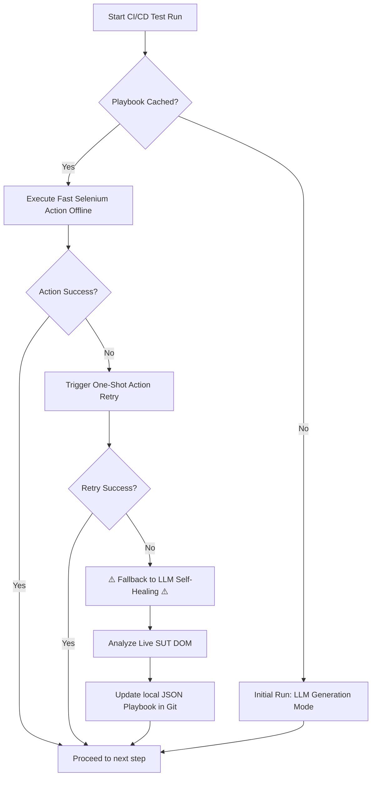
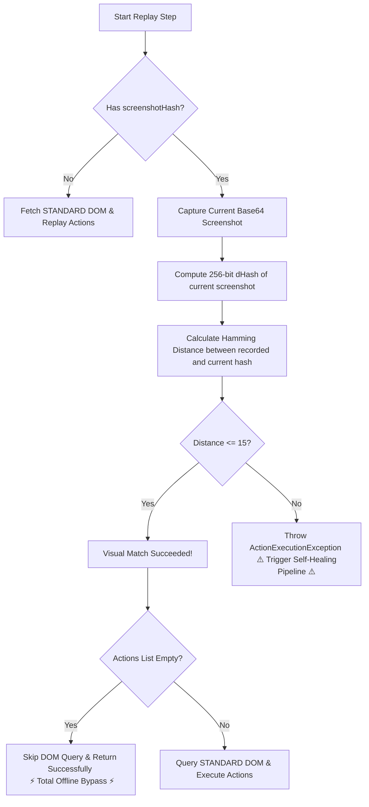

# Neodymium AI: Native Language Automation

Welcome to the **AI integration** for Neodymium! 

Neodymium AI introduces a paradigm shift in test automation: **Native Language Automation**. Instead of writing brittle Selenium/Selenide selectors and page objects, you can now write your test instructions in plain, natural English. Neodymium AI parses your intent, analyzes the application's UI, and executes the necessary browser actions—complete with automatic self-healing and playbook recording.

---

## 🏆 Industry-Leading AI Automation: How Neodymium Compares

Neodymium AI is an exceptionally robust, enterprise-ready, JVM-native solution. Here is how it compares to similar leading open-source and commercial AI-driven web automation tools on the web (such as *ZeroStep*, *Stagehand*, *Midscene*, and *Healenium*):

### 📊 Comprehensive Comparison Matrix

| Feature Dimension | **Neodymium AI** (Our State) | **ZeroStep** (Playwright) | **Stagehand** (Browserbase) | **Midscene.js** (AI Operator) | **Healenium** (Selenium Proxy) |
| :--- | :--- | :--- | :--- | :--- | :--- |
| **Core Paradigm** | **Native Language Automation** with offline compiling | AI-as-a-Service selector helper | AI-assisted primitives (`act`/`extract`/`observe`) | Autonomous Agent / Operator | Element self-healing proxy wrapper |
| **Execution Infrastructure** | **Zero-Infrastructure**. Direct Selenium/Selenide runtime. | Closed SaaS cloud API dependency | Node.js + Playwright + LLM API | Node.js + AI Vision Model | **Heavy**: Postgres DB + Backend Server Docker containers |
| **CI/CD Replay Efficiency** | ⚡ **Playbook Caching (100% Offline)**. No LLM calls or API latency on replay. | Cloud-based caching; requires cloud connection. | Dynamic caching; has LLM latency overhead | Agentic planning overhead; slow and expensive | DB lookup latency; offline-capable for healed locators |
| **Self-Healing Model** | **Local Auto-Update**. LLM heals DOM, then updates the Git-tracked Playbook JSON. | SaaS-controlled cloud updates | Dynamic visual recovery | Vision-based replanning | Postgres DB stores alternatives; plugin writes back to code |
| **Business Logic Assertions** | 🛠️ **`JAVA_METHOD` Programmatic Fallback** (JShell, BigDecimal, AiAssertions) | Vision/LLM reasoning (prone to hallucinations/floats) | LLM prompt verification or TypeScript code checks | LLM prompt visual evaluation | Traditional Selenium Java Assertions |
| **Token Optimization** | 🧠 **Escalating Context**: `HINT` ➔ `AXTREE` ➔ `LEAN` ➔ `STANDARD` ➔ `VISUAL` (with smart jumps & historical learning) | Sent entirely to cloud API | Extracts interactive map | Sends visual coordinates/DOM | N/A (ML selector imitator, no LLM tokens) |
| **Visual Assertion Cost** | 👁️ **Perceptual dHash & Hamming Distance** (Local, offline, microsecond checks) | Cloud Vision API call | Cloud browser screenshot | Cloud Vision API / VLM | Traditional pixel-by-pixel comparisons |
| **Known Bug Management** | 🐞 **Unified Expected Failures** (`(bug)` tag in NLP, `expectFailure` in Java) | None (Requires disabling steps) | None | None | None |
| **Language & Ecosystem** | **JVM-Native (Java 21, JUnit 5, Selenide)** | TypeScript / Playwright | TypeScript / Playwright | TypeScript / Puppeteer / Playwright | Java / C# / Python (Selenium wrapper) |

---

### 🛠️ Deep-Dive Analysis of Neodymium AI's Core Advantages

#### 1. Zero-Cost Offline Replay (Playbooks)
Most modern LLM test frameworks (like ZeroStep or Midscene) require calling the LLM at runtime during every single test execution in CI/CD. This makes running large test suites slow, highly fragile to LLM API latency/downtime, and extremely expensive (potentially thousands of dollars in monthly token costs).
* **Neodymium's Edge:** Neodymium compiles natural language steps into a local **JSON Playbook** during creation mode. In CI/CD, Neodymium replays these exact actions *directly* via standard WebDriver/Selenide commands. It is **100% offline, costs zero API tokens, and runs at native browser automation speeds**. 
* **Auto-Healing Integration:** If the UI changes and a replayed locator fails, Neodymium's self-healing pipeline activates, calls the LLM to inspect the new DOM, heals the locator, updates the Playbook JSON, and saves it. The next run immediately utilizes the healed locator offline, making the system self-optimizing without manual intervention.



#### 2. Eliminating Hallucinations with Programmatic Fallbacks (`JAVA_METHOD`)
A significant pitfall of visual/NLP-based AI automation tools is that they rely on LLMs to perform complex mathematical verification, date comparisons, or string formatting assertions. This results in frequent hallucinations and floating-point bugs.
* **Neodymium's Edge:** Neodymium uniquely introduces the `JAVA_METHOD` action. If a step involves numerical checks or custom business rules, the AI delegates execution to a registered Java utility class to calculate and assert values programmatically.
*(See [Programmatic Assertions](#-programmatic-assertions-java_method) for more details.)*

#### 3. Extremely Efficient Escalating Context System
Sending an entire HTML page to an LLM on every step consumes vast amounts of prompt tokens, limits execution speed, and often exceeds LLM token windows.
* **Neodymium's Edge:** Instead of blind DOM dumps, Neodymium uses an **Escalating Context** approach with **Smart Escalation Jumps** and **Playbook-Based Memory Persistence (Historical Learning)**. The runner starts with a highly optimized context level (such as `AXTREE` or `LEAN`) and escalates directly to the level requested by the LLM (e.g. jumping straight to `VISUAL` or `STANDARD`). The successfully resolved context level is stored in the playbook JSON cache, so subsequent runs skip predictable intermediate failure/escalation loops entirely.
*(See [Escalating Context](#-escalating-context-token-optimization) for more details.)*

#### 4. Perceptual Visual Caching (dHash & Hamming Distance)
Traditional visual validation frameworks either perform pixel-by-pixel comparisons or require expensive cloud visual testing platform integrations.
* **Neodymium's Edge:** Visual steps are cached locally using **perceptual hashing (dHash)**. On replay, the live screen's dHash is compared locally using **Hamming distance**. This bypasses all DOM parsing and LLM visual queries entirely, executing visual assertions locally in microseconds.
*(See [Perceptual Visual Replay Caching](#-perceptual-visual-replay-caching-dhash--hamming-distance) for more details and code examples.)*

#### 5. Known Defect Management via Expected Failures
In real-world QA, test suites are constantly plagued by known, unresolved bugs. Most frameworks force teams to either disable the test completely or suffer constant CI failures.
* **Neodymium's Edge:** Features a **Unified Expected Failure** system. Steps can be tagged with `(bug: APP-1234)`. Neodymium captures and "freezes" the exact defect signature in the Playbook. If the bug is suddenly fixed or changes behavior, the test fails, preventing regression slips.
*(See [Unified Expected Failures](#-unified-expected-failures--bug-tags) for more details.)*

---

## 🌟 Key Features

1. **Natural Language Execution**: Write tests like `Open the login page.`, `Type 'user' into the username field.`, and `Click Submit.`.
2. **Playbooks (Caching for Speed & Cost)**: When the AI successfully executes a test, it records the exact DOM elements and actions into a JSON "Playbook". Subsequent runs replay the fast, deterministic Selenium actions without calling the LLM, saving time and API costs.
3. **Self-Healing Tests**: If a replay fails (e.g., a button ID changes or the UI is overhauled), the AI agent catches the failure, re-analyzes the live page using the LLM, fixes the test execution dynamically, and updates the Playbook.
4. **Data-Driven Steps**: Full integration with Neodymium's `@DataFolder` and `TestData`. You can inject datasets directly into your natural language steps using `${variable}` syntax.
5. **AI Discussion Logging**: Detailed Allure report attachments that show exactly what the LLM "saw", what it "thought" (reasoning), and what actions it decided to take.

---

## 🚀 Getting Started

### 1. Configuration
To use Neodymium AI, you must configure your LLM credentials. Currently, the Google Gemini model via LangChain4j is utilized.

Add the following to your `neodymium.properties`, `ai.properties`, or system environment variables:
```properties
neodymium.ai.apiKey=YOUR_GEMINI_API_KEY
neodymium.ai.model=gemini-2.5-pro # or your preferred model
```

### 2. Writing Your First AI Test

Instead of traditional driver commands, you interact with the `AiBrowser`. 

**Example: Direct Execution**
```java
import com.xceptance.neodymium.ai.core.AiBrowser;
import com.xceptance.neodymium.junit5.NeodymiumTest;

public final class MyAiTest
{
    @NeodymiumTest
    public void testLoginWithAi()
    {
        try (final AiBrowser ai = new AiBrowser(this))
        {
            ai.execute("""
                Open https://example.com.
                Click on the Login link.
                Type 'user@example.com' into the email address field.
                Type 'supersecret' into the password field.
                Click the Log in button.
                Verify that you are logged in successfully.
            """);
        }
    }
}
```

### 3. Data-Driven AI Tests

You can move your instructions into Neodymium TestData (e.g., a YAML file) and run them against multiple datasets.

**`data.yml`**
```yaml
steps: 'Open ${neodymium.url}.
  Navigate to the login page.
  Enter email "${email}" and password "${password}".
  Click login.
  Verify login was ${expectedResult}.'
  
data:
  - email: "good@user.com"
    password: "correct"
    expectedResult: "successful"
  - email: "bad@user.com"
    password: "wrong"
    expectedResult: "unsuccessful"
```

**`MyDataDrivenAiTest.java`**
```java
@DataFolder("my/test/data")
public final class MyDataDrivenAiTest
{
    @NeodymiumTest
    public void executeAiSteps() throws Throwable
    {
        // Automatically picks up the 'steps' key from the dataset
        // and resolves the ${variables} before sending to the AI.
        Neodymium.ai().execute();
    }
}
```

> **Tip:** You can include comments within your multi-line prompts to annotate test steps without affecting the AI's execution or the generated playbooks. Any line starting with `#` or `//` will be automatically ignored by the agent.

---

## 📥 Native State Capture (Variables)

Neodymium AI supports dynamic runtime variable extraction using the `STORE` action. This allows you to capture text from the application during a test and reuse it in subsequent steps—perfect for verifying totals, tracking generated order IDs, or validating dynamic workflows.

**Example Playbook:**
```yaml
steps: |
  Capture the line item price shown in the line item row. Save it as variable 'unitPrice'.
  Capture the subtotal amount. Save it as variable 'subtotal'.
  Verify that 'subtotal' is greater than 'unitPrice'.
```

### How It Works
1. **Extraction**: When the LLM encounters a command like `Capture`, `Store`, or `Record`, it automatically receives the full text-context of the page. It locates the target element and extracts its inner text natively.
2. **Storage**: The string value is saved into the execution context for the duration of the current test run.
3. **Interpolation**: You can seamlessly reuse stored variables in later steps using the `${variableName}` syntax or by referring to them by name. The `ActionExecutor` automatically resolves these placeholders in real-time before executing the action.

> **Note:** Variables extracted during runtime using the `STORE` action are scoped to the current test execution. If a runtime variable shares the same name as a static variable injected via `TestData` or `@DataFolder`, the runtime variable takes precedence.

### 🔢 Numeric & Price Normalization (`adjust: true`)

By default, the `STORE` action captures and saves the raw text exactly as it appears in the DOM (e.g. `14,96 €` or `$15.00`). While this is perfect for asserting exact text layouts, it is problematic when comparing or calculating values across different localized formats.

To handle this, the `STORE` action accepts an optional parameter: `"adjust": true`. 

* **How to Trigger**: In your natural language prompts, instruct the AI that the stored value will be used in calculations (e.g., *"Capture the subtotal amount. Save it as variable 'subtotal' and store with adjustment."*). Alternatively, the `StoreAction` prompt guides the agent to automatically output `"adjust": true` in the compiled JSON playbook whenever it detects that a variable is destined for subsequent mathematical comparisons or calculations.
* **Heuristics & Normalization**: Under the hood, the system uses a **zero-knowledge, locale-agnostic normalizer** (`AiAssertions.normalizeNumericOrPrice`):
  * **Classification**: It identifies if the text is a number or a price (it must contain digits, may contain standard separators, signs, or currency symbols, and at most one short letter sequence ≤ 3 characters like `USD` or `kr`). 
  * **Exclusions**: Standard text or alphanumeric IDs (such as order numbers like `ORD-12345678`, test labels like `TC-001`, or descriptors like `Page 1 of 5`) are left completely untouched.
  * **US Decimal Conversion**: Valid numbers and prices are normalized into clean, standardized US decimals (e.g., `14,96 €` and `$15.00` are both normalized and stored as `"14.96"` and `"15.00"`).
* **Downstream Integration**: Once adjusted/normalized, these variables can be cleanly used in standard mathematical calculations (e.g., via `verifyCalculation`) or in the new numeric comparison assertions without formatting mismatches.

---

## 🔀 Advanced Conditional Logic (AST Branching)

Neodymium AI natively understands conditional logic without requiring rigid syntax or keywords. You can use natural language to express `If... then... else` logic directly in your test instructions.

**Example Instruction:**
> *"If the cookie banner appears, close it. Otherwise, click login."*

### How It Works
The LLM understands your intent and compiles it into an **Abstract Syntax Tree (AST)** using the native `BRANCH` action. 

The Playbook records the entire logical structure (the condition actions, the then actions, and the else actions) seamlessly into the JSON cache. 

### Offline CI/CD Replay
Because the LLM pre-compiles this logic during the initial generation phase, the conditionals run dynamically and deterministically during offline CI/CD replays. The `AiAgent` will test the condition natively against the live DOM and route the execution path **without** needing to contact the LLM again!

> **Best Practice:** While branching is fully supported, simple, deterministic data-driven tests are generally preferred over massive "choose your own adventure" scripts. Keep conditionals focused on dismissing dynamic UI elements (like banners or modals).

---

## 🔧 Programmatic Assertions (`JAVA_METHOD`)

While the AI handles most validations natively through the `ASSERT` action (checking text, visibility, URLs), some validations require **programmatic logic** that an LLM should not be trusted to perform—such as numeric comparisons, mathematical calculations, or complex data transformations. For these cases, Neodymium provides the `JAVA_METHOD` action.

### How It Works

When the AI encounters an instruction like *"Verify the price is greater than 0"*, it emits a `JAVA_METHOD` action targeting a method name (e.g., `assertPriceGreaterThanZero`) with the extracted value as a parameter. The framework then resolves and invokes the method via reflection.

### Method Resolution Strategy

The framework uses a **two-stage fallback** to locate the target method:

1. **Stage 1 — Test Instance**: The framework first searches the active test class for a matching `public` method (instance or static).
2. **Stage 2 — Registered Utility Classes**: If the method is not found on the test class, the framework scans all classes listed in the `neodymium.ai.agent.javaMethod.utilityClasses` configuration property for a matching `public static` method.

This means common assertions work out-of-the-box across all your tests without any boilerplate.

### Built-in Assertions

Neodymium ships with a default utility class, `com.xceptance.neodymium.ai.util.AiAssertions`, which provides common validation methods:

| Method | Description |
|--------|-------------|
| `assertPriceGreaterThanZero(String)` | Validates that a price string (any locale/currency) represents a value > 0 |
| `assertNumberGreaterThan(String)` | Asserts that the first number/price is strictly greater than the second (e.g., `14,96 €, 0.00` or JSON `["15.00", "10.00"]`) |
| `assertNumberGreaterThanOrEqual(String)` | Asserts that the first number/price is greater than or equal to the second |
| `assertNumberLessThan(String)` | Asserts that the first number/price is strictly less than the second |
| `assertNumberLessThanOrEqual(String)` | Asserts that the first number/price is less than or equal to the second |
| `assertNumberEqual(String)` | Asserts that the first number/price is equal to the second |
| `verifyCalculation(String)` | Securely validates mathematical equations (e.g. `0,90 € = (14,96 € + 0,00 €) * 6,00%`) programmatically via JDK JShell (locale-agnostic) |

These methods are automatically available to the AI in every test class.

> [!NOTE]
> **Exact Precision via `BigDecimal`**:
> Under the hood, all numeric assertions use `BigDecimal` for exact mathematical comparisons, avoiding floating-point binary representation errors (e.g. `0.90 - 0.88` yielding `0.020000000000000018`).
> For mathematical equations, `verifyCalculation` evaluates the right-hand side using JDK JShell, parses the result to `BigDecimal`, scales/rounds it to the left-hand side's detected display precision using `RoundingMode.HALF_UP`, and asserts that the absolute difference does not exceed the allowed tolerance of `0.02`.

### Extending with Custom Utility Classes

To add your own project-specific assertion methods:

1. **Create a utility class** with `public static` methods:
   ```java
   package com.myproject.test.util;

   public final class MyProjectAssertions
   {
       private MyProjectAssertions() {}

       public static void assertDiscountApplied(final String price)
       {
           // your custom validation logic
       }
   }
   ```

2. **Register it** in your `ai.properties` (or `neodymium.properties`):
   ```properties
   # Append your class after the built-in one (comma-separated)
   neodymium.ai.agent.javaMethod.utilityClasses=com.xceptance.neodymium.ai.util.AiAssertions,com.myproject.test.util.MyProjectAssertions
   ```

3. **Use it naturally** in your YAML steps:
   ```yaml
   steps: |
     Verify the discount was applied to the displayed price.
   ```
   The AI will emit `JAVA_METHOD: assertDiscountApplied`, and the framework will automatically find it in your registered utility class.

> **Note:** Methods on the test instance always take priority over utility classes. If your test class defines a method with the same name, it will be invoked instead of the utility version. Utility class methods **must** be `public static`.

---

## 🧠 How It Works Under the Hood

1. **The `AiBrowser`**: Wraps the test context and maintains the token/usage stats.
2. **The `AiAgent`**: 
   - Splits your prompt line-by-line.
   - For fast, deterministic commands (like `Navigate to...` or `Go back`), it bypasses the LLM using regex.
   - For UI interactions, it uses the `PageAnalyzer` to extract the DOM context (and optionally a screenshot) and sends it to the LLM.
3. **The LLM Client**: Asks the LLM to locate elements and determine the exact physical actions to perform.
4. **The `ActionExecutor`**: Takes the structured JSON response from the LLM and translates it into physical Selenide/WebDriver interactions (e.g., `ActionType.CLICK`, `ActionType.TYPE`).
5. **Playbooks**: Recorded interactions are saved in `src/test/resources/ai-playbooks`. *You should commit these playbooks to version control.*

---

## 📈 Escalating Context (Token Optimization)

Neodymium AI uses a multi-tier **Escalating Context** strategy to minimize LLM token costs while maximizing reliability. Instead of blindly sending massive HTML dumps to the LLM, the framework progressively reveals more data only when necessary.

### 📐 The Six Context Levels

The framework defines six distinct context levels:

1. **`HINT` (Zero DOM)**: Minimal context with ZERO DOM elements, triggered automatically when you specify an explicit inline locator `(hint: ...)`. No DOM is sent. The LLM translates the hint directly into JSON.
2. **`AXTREE` (Accessibility Tree)**: Compact browser-native accessibility tree providing structural and semantic outline of interactive elements for ultra-low token consumption.
3. **`LEAN` (Interactive Only)**: Sends only interactive elements (buttons, links, inputs, selects, textareas, headings). Text paragraphs are excluded. Covers ~80% of typical actions.
4. **`STANDARD` (Full Text)**: Sends interactive elements plus all visible text content (paragraphs, list items, table cells). Required for assertions or disambiguating similar elements (e.g. 5 identical "View Details" links).
5. **`VISUAL_LEAN` (Lean DOM + Screenshot)**: Initial level used for instructions explicitly tagged with `(visual)`. Useful when you need visual validation but do not need text content.
6. **`VISUAL` (Full DOM + Screenshot)**: Maximum context. Sends the full `STANDARD` DOM alongside a Base64-encoded screenshot of the page. Used as a last resort for complex canvas, SVG, or shadow-DOM interactions.

---

### 🔄 How Escalation Works

The LLM is a conscious participant in the execution loop. If it receives a lean context (e.g., `LEAN` or `AXTREE`) but cannot reliably determine what to do (e.g., it needs full paragraph text to perform an assertion, or visual cues to check color), it does not guess. Instead, it returns `{"status": "ESCALATE"}`. The framework catches this request, raises the context level, and queries the LLM again.

Escalations do **not** consume the test retry budget—they are a normal, highly optimized progression to fetch more data.

---

### 📈 Smart Escalation Jumps

In previous versions, context escalations were strictly sequential (e.g., `AXTREE` ➔ `LEAN` ➔ `STANDARD` ➔ `VISUAL`), which could lead to redundant LLM calls and latency overhead if the model immediately knew it required a screenshot or full text.

To eliminate this overhead, Neodymium AI introduces **Smart Escalation Jumps**. When returning an `ESCALATE` status, the LLM can specify a `"targetContext"` parameter in its response JSON. The runner intercepts this parameter and jumps **directly** to the requested context level on the next attempt, saving valuable time and API cost.

> [!NOTE]
> **Example Smart Escalation Request from LLM:**
> ```json
> {
>   "success": false,
>   "status": "ESCALATE",
>   "targetContext": "VISUAL",
>   "reasoning": "This step asks to verify the logo has a red border, which requires visual context.",
>   "actions": []
> }
> ```
> Under the hood, if the parser extracts a target context level that is higher than the current context level, `AiAgent` skips sequential progression and escalates straight to that target level.

---

### 🔮 Pre-Execution Static Analysis Phase (PESAP)

To minimize the number of sequential escalation loops on the very first execution of a test (where no playbook cache exists yet), Neodymium AI implements a highly efficient **Pre-Execution Static Analysis Phase (PESAP)**.

#### 💡 High-Level Overview
When executing a brand new playbook or instruction set, the framework does not know in advance which steps require a standard text outline, which steps can run on a minimal accessibility tree, or which steps require explicit screenshots (visual checks). If all steps started at the lowest level (`AXTREE`), steps that perform complex text assertions or visual validations would repeatedly trigger sequential or jump escalations, increasing latency.

To solve this, when PESAP is enabled, Neodymium runs a single, lightweight remote query to the LLM *before* the browser even opens or the first page loads. This query sends absolutely no DOM or screenshot data (meaning it consumes negligible tokens and completes in milliseconds).

The LLM statically analyzes the entire list of natural language steps and predicts:
1. **Starting Context Level**: The minimal required starting context level (`AXTREE`, `STANDARD`, or `VISUAL_LEAN`) for each step based on the step's semantic intent.
   * *Interactive steps* (e.g. click a button, type a field) default to `AXTREE`.
   * *Assertive/Structural steps* (e.g. verify specific paragraph text) are predicted as `STANDARD`.
   * *Visual steps* (e.g. checking layouts, colors, or steps containing visual words) are predicted as `VISUAL_LEAN`.
2. **Unified Semantic Warnings**: The remote LLM also performs smart, context-aware multilingual linting, detecting instruction ambiguity and anti-patterns directly in this start call.

The agent caches these predictions locally. When executing each step, instead of starting from the absolute lowest context level, Neodymium starts **exactly** at the predicted PESAP context level. This eliminates startup latency and avoids redundant escalation loops on the first execution.

> [!TIP]
> **Why is `LEAN` never predicted?** The `LEAN` context level (interactive DOM elements with full attributes) is deliberately excluded from PESAP's prediction vocabulary. The distinction between `AXTREE` (browser accessibility tree) and `LEAN` (framework DOM extraction) is an internal implementation detail that the LLM cannot reliably reason about from step text alone. Since the runtime escalation from `AXTREE → LEAN` is automatic and costs zero retry budget, it is always more robust to predict `AXTREE` for interaction steps and let the framework escalate to `LEAN` on demand if needed.

---

#### 📊 Example Console Output (Analysis & Quality)
When PESAP executes, it outputs clear diagnostic information to the terminal, aiding both early execution analysis and test-case quality reviews:

```text
[INFO]  🤖 Starting Pre-Execution Static Analysis Phase (PESAP) for guest-checkout.yaml...
[DEBUG]    🔮 Step 1 (line 3) -> PESAP Predicted ContextLevel: AXTREE
[DEBUG]    🔮 Step 2 (line 7) -> PESAP Predicted ContextLevel: STANDARD
[DEBUG]    🔮 Step 3 (line 12) -> PESAP Predicted ContextLevel: VISUAL_LEAN

[WARN]  ⚠️ AI Instructions Semantic Linter Warnings in guest-checkout.yaml:
[WARN]      - Step 2 (line 7): "Click the button" - Lacks element targeting. Suggest specifying a label/text (e.g., 'click the "Login" button') or adding an inline locator hint `(hint: selector)`.
[WARN]      - Step 4 (line 15): "Type email" - Missing explicit value to input. Suggest specifying the value in quotes (e.g., 'type "user@example.com" into the email field').
[WARN]      - Step 5 (line 20): "Verify page" - Vague action description. Suggest using precise assertion text or structural validation descriptions (e.g., 'verify that the page header contains "Dashboard"').
```

During step execution, the logs will verify the starting context being optimized dynamically:
```text
[INFO]      🔮 Using PESAP predicted starting ContextLevel: STANDARD
```

---

#### ⚙️ Configuration Properties
You can fully configure or granularly disable the Pre-Execution Static Analysis Phase (PESAP) and its sub-phases via your `neodymium.properties`, `ai.properties`, or system properties.

| Property | Default Value | Description |
| :--- | :--- | :--- |
| `neodymium.ai.pesap.enabled` | `true` | **Master Switch**. Enables or disables the entire PESAP phase. If set to `false`, Neodymium skips the remote static query entirely and falls back directly to the local offline linter. |
| `neodymium.ai.pesap.classify.enabled` | `true` | **Context Classification Sub-Switch**. Controls whether the static starting context level prediction query is run. If set to `false`, steps will start at the default minimum context level (`AXTREE`). |
| `neodymium.ai.pesap.linter.enabled` | `true` | **Semantic Linter Sub-Switch**. Controls whether the LLM-powered static semantic step linting query is run. If set to `false`, remote semantic warnings are skipped. |

##### Example Configuration (Disable PESAP completely):
```properties
neodymium.ai.pesap.enabled=false
```

##### Example Configuration (Run Classification but Disable LLM Linter):
```properties
neodymium.ai.pesap.classify.enabled=true
neodymium.ai.pesap.linter.enabled=false
```

> [!NOTE]
> If PESAP is disabled or a remote query fails, Neodymium seamlessly falls back to the **Local Offline Step Linter** and starts execution at the default minimum context level (`AXTREE`), ensuring high reliability under all circumstances.

##### 🔄 Dynamic YAML and Thread-Local Overrides

For maximum convenience, you can override any PESAP configuration properties (`neodymium.ai.pesap.enabled`, `neodymium.ai.pesap.classify.enabled`, `neodymium.ai.pesap.linter.enabled`) directly inside your YAML playbook files or dynamically in code. Neodymium resolves these overrides with the following precedence order:

1. **Local (Dataset/Iteration Level) YAML Overrides**: Defined inside a specific dataset under `data:`. This has the highest precedence.
2. **Global (Root Level) YAML Overrides**: Defined at the root of the playbook YAML file. Automatically propagates to all datasets/iterations unless overridden locally.
3. **Thread-Local Programmatic Overrides**: Programmatically set via the thread-local context `Neodymium.getData().put("neodymium.ai.pesap.enabled", "false")`.
4. **Static Configuration**: Defined statically in `neodymium.properties`, `ai.properties`, or system properties.

###### Example: Overriding at Playbook Root Level
To turn off PESAP completely for all iterations defined in a specific playbook:

```yaml
neodymium.ai.pesap.enabled: false

steps: |
  Open the homepage.
  Click "Sign In".

data:
  - username: "user1"
  - username: "user2"
```

###### Example: Overriding at Playbook Dataset Level
To granularly disable semantic linting only for a specific test iteration:

```yaml
steps: |
  Open the homepage.
  Click "Sign In".

data:
  - username: "user1"
    neodymium.ai.pesap.linter.enabled: false # Linting disabled only for user1
  - username: "user2"
    # standard PESAP rules apply to user2
```

---

### 🧠 Playbook-Based Memory Persistence (Historical Learning)

While escalating on the fly is powerful, repeating the same escalation loop on subsequent test runs is wasteful. Neodymium AI solves this via **Playbook-Based Memory Persistence**.

Whenever an escalation is successfully resolved (either during a normal generation run or a self-healing session), the successfully resolved context level is stored directly in the playbook JSON cache file under the `healedContextLevel` field of the step:

```json
{
  "prompt": "Verify the logo is red (visual)",
  "actions": [],
  "healedContextLevel": "VISUAL"
}
```

On subsequent test execution runs or self-healing attempts, the framework loads this value from the JSON cache and starts execution **directly at the resolved context level** (`playbookStep.getHealedContextLevel()`).

#### ⚡ Key Benefits:
- **Zero Sequential Overhead:** Predictable context failures are completely avoided on future replays.
- **Dynamic Adaptability:** If the page structure changes and a healed locator fails, the agent will dynamically self-heal, re-determine the needed context, and persist the new level back to the playbook.

---

## 📜 Selective Step History (Recovery Context)

During normal execution, each instruction is processed in isolation — the LLM receives only the current instruction, the current DOM, and the SUT context. This keeps prompts lean and token-efficient for the ~80% of steps that succeed on the first attempt.

However, when the agent enters a **recovery scenario** (retry after error, context escalation, or no-actions retry), the framework automatically injects a compact **step history** into the prompt. This gives the LLM awareness of the broader test flow, enabling it to reason about expected page state and disambiguate elements more effectively.

### When History Is Included

| Scenario | History Included? | Rationale |
|---|---|---|
| Direct parse (no LLM call) | ❌ | LLM never called |
| Playbook replay (no LLM call) | ❌ | LLM never called |
| First LLM attempt (happy path) | ❌ | Usually succeeds; low ROI for extra tokens |
| Retry after error | ✅ | LLM needs flow context to reason about expected state |
| Retry after no-actions returned | ✅ | Flow context helps LLM understand what it should do |
| After context escalation | ✅ | LLM is already struggling; more context helps |

### What the History Contains

The history block is a compact numbered list of all **completed** instruction lines (from the Playbook), followed by a `[CURRENT]` marker:

```
## Completed Steps (for context)
1. Open homepage
2. Type "running shoes" into the search field
3. Click the first product result
[CURRENT] → see Instruction above
```

Only the instruction text is included — no DOM snapshots, no action details, no reasoning. This keeps the token overhead minimal (~50-100 tokens per step) while providing the LLM with enough context to understand the test flow.

### How It Works

The history is built by `AiAgentPrompts.buildStepHistory(Playbook)`, which iterates the playbook's completed steps (indices `0` to `cursor - 1`). Steps with null or blank prompt lines are gracefully skipped. The resulting block is injected into the `{historyBlock}` placeholder in the prompt templates (`user-prompt-template.txt`, `retry-prompt-template.txt`, `no-actions-retry-prompt-template.txt`).

An `isRecoveryAttempt` flag in `AiAgent.getActionsFromLLM()` tracks whether the current iteration is a recovery scenario. On the first attempt, the flag is `false` and the history block is empty. It flips to `true` whenever an escalation, error retry, or no-actions retry occurs.
---

## 🔄 Playbook Resilience & Transient Retries

During test replay, transient browser conditions can occasionally cause a recorded playbook action to fail. Examples include:
- A dynamic overlay (like a Bootstrap offcanvas menu or loading spinner) disappearing slightly slower than usual.
- A momentary DOM rendering or animation delay.
- An element being temporarily blocked by a scrolling effect.

Historically, any failure during a replayed action would immediately mark the playbook step as failed and fall back to the LLM to self-heal. While self-healing is a powerful feature, invoking an LLM call for a simple timing glitch is slow, costly, and unnecessary.

### 🛡️ One-Shot Action Retry Protocol

To prevent unnecessary LLM calls and improve execution stability, Neodymium AI employs an automatic **One-Shot Action Retry** mechanism:

1. **Transient Catch**: If a replayed action throws a selenium-based `ActionExecutionException` (e.g., due to timing, blocking, or stale elements), the `AiAgent` intercepts the failure *before* marking the step as failed.
2. **Recorded Retry**: The agent increments a step-scoped retry counter and immediately retries the recorded actions exactly once. In many cases, the transient condition (such as a loading spinner disappearing or a transition completing) resolves, allowing the retry to succeed instantly.
3. **LLM Fallback**: If the second replay attempt also fails, the failure is treated as a genuine structural change (e.g., a relocated button or modified page layout). The step is then marked as failed, and the agent falls back to the LLM self-healing pipeline to analyze the page and update the playbook.

This automatic recovery protocol ensures that your tests remain highly resilient to flaky browser execution while preserving 100% token efficiency and maximum execution speed.

---

## 📊 AI Execution Statistics

After every test run, Neodymium logs a summary of all AI operations. This data is also attached to the Allure report (when `neodymium.ai.attachTokenUsageToReport=true`). Here's how to read it:

```
======== 📊 AI Execution Statistics ========
   LLM calls:        18
   Input tokens:     80463
   Output tokens:    3828
   Total tokens:     84291
   ---
   Context Levels:
     HINT:      0
     LEAN:      12
     STANDARD:  4
     VISUAL:    2
   ---
   Escalations:      6  (LLM: 3, Error: 3)
   Retries:          0  (Error: 0, No-Actions: 0)
   ---
   Replays:          0
   Direct Parses:    0
=============================================
```

### Token Usage

| Metric | Meaning |
|---|---|
| **LLM calls** | Total number of HTTP requests to the LLM API. Each call sends a prompt and receives a response. This is the primary cost driver. |
| **Input tokens** | Tokens sent *to* the LLM (system prompt + user prompt + DOM context). This is typically 95%+ of total tokens since the DOM can be large. |
| **Output tokens** | Tokens received *from* the LLM (the JSON response with actions and reasoning). Usually small (~200-400 tokens per response). |
| **Total tokens** | `Input + Output`. This is what your API billing is based on. |

### Context Level Distribution

Shows how many LLM calls were made at each context level. This directly reflects token efficiency:

| Level | What's sent to the LLM | Typical use |
|---|---|---|
| **HINT** | Zero DOM — only the inline hint locator | Fastest, cheapest. Used when instructions contain `(hint: ...)` |
| **AXTREE** | Compact accessibility tree structure | Ultra-lean semantic-only outline of interactive elements |
| **LEAN** | Interactive DOM elements and headings only | Default standard starting level. Handles ~80% of standard user interactions |
| **STANDARD** | LEAN DOM + all visible text content (paragraphs, list items, table cells) | Needed for text-based assertions, verifications, and link disambiguation |
| **VISUAL_LEAN** | LEAN DOM + Base64 screenshot | Initial visual check. Efficient visual context when text content is not needed |
| **VISUAL** | STANDARD DOM + Base64 screenshot | Maximum multimodal context. Handles complex canvas/SVG, layout, and visual validations |

**Reading the example:** 12 LEAN + 4 STANDARD + 2 VISUAL = 18 total LLM calls. The majority resolved at LEAN (cheapest), with some needing more context.

### Escalations

Escalations happen when the agent moves to a higher context level. They do **not** consume the retry budget — they're a normal part of the token-optimization protocol.

| Type | Trigger |
|---|---|
| **LLM** | The LLM explicitly returned `{"status": "ESCALATE"}` because it couldn't find the target element or needed more text content to disambiguate |
| **Error** | An action execution failed (e.g., `ElementNotInteractableException`) and the agent automatically escalated before burning a retry |

**Reading the example:** 6 total escalations (3 LLM-requested + 3 error-triggered). This means 6 of the 18 calls were "second attempts" at a higher context level. The remaining 12 succeeded on the first try.

### Retries

Retries happen when the agent has already reached the maximum context level and still fails. Unlike escalations, retries **do** consume the retry budget and represent genuine failures that needed re-prompting.

| Type | Trigger |
|---|---|
| **Error** | An action failed at the highest available context level. The agent re-sends the prompt with error context. |
| **No-Actions** | The LLM returned valid JSON but with an empty actions array. The agent re-sends with a "pressure" prompt demanding at least one action. |

**Reading the example:** 0 retries means every step eventually succeeded via escalation alone — no brute-force re-prompting was needed. This is the ideal outcome.

### Non-LLM Execution Paths

These metrics show how many steps bypassed the LLM entirely:

| Metric | Meaning |
|---|---|
| **Replays** | Steps replayed from a cached playbook JSON without calling the LLM. In CI/CD with committed playbooks, this should be the dominant path. |
| **Direct Parses** | Steps resolved by action plugins via regex/pattern matching (e.g., `Navigate to https://...`, `Go back`). Zero tokens, zero latency. |

**Reading the example:** Both are 0, meaning this was a fresh run with no existing playbook — every step required the LLM. On subsequent runs with the playbook committed, you'd see high replay counts and 0 LLM calls.

### Interpreting the Big Picture

The example shows a **healthy first run**: 18 LLM calls with 6 escalations and 0 retries. The agent started lean, escalated when needed, and never had to retry at the same level. The total token cost (84K) is dominated by input tokens (DOM context). On the next run with the playbook cached, this would drop to 0 LLM calls / 0 tokens if the UI hasn't changed.

---

## 💡 Advanced: Intent-Based Prompt Generation

Neodymium AI includes an experimental `AiPromptGenerator`. Instead of writing the step-by-step natural language yourself, you provide an end-goal (an "intent"), and the AI will explore the application to figure out how to achieve it, generating a reusable playbook in the process.

Requires the `@NeodymiumTestGenerator` annotation.

```java
@NeodymiumTestGenerator
public void generateCheckoutFlow()
{
    Neodymium.ai().generatePrompt("Purchase a pair of red shoes as a guest user.");
}
```

---

## ⚠️ Limitations & Best Practices

- **Token Limits**: Be mindful of your application's DOM size. The `PageAnalyzer` attempts to clean up irrelevant tags, but massive pages might hit token limits or slow down LLM execution.
- **Commit Playbooks**: Always commit your generated `ai-playbooks`. This ensures CI/CD pipelines run fast and do not depend on external LLM calls unless the UI breaks and requires self-healing.
- **Clear Instructions**: While the AI is smart, vague instructions can lead to unpredictable behavior. Be descriptive: instead of "Click the button", use "Click the blue 'Submit Order' button".

---

## 🎯 Locator Hints & Zero-DOM Execution

Sometimes you may want to explicitly guide the AI on which element to interact with, bypassing its own DOM analysis to speed up execution or resolve ambiguity. You can do this using **Inline Hints** or **Inline Selectors**.

When you provide a locator directly within the instruction using either the standard `(hint: ...)` syntax or the developer-centric `(selector: ...)` alternative, Neodymium AI enters **Zero-DOM Execution mode (`ContextLevel.HINT`)**. The LLM is asked to translate your instruction into JSON using *only* the locator you provided. ZERO DOM elements are extracted or sent to the LLM. This makes locator-based steps unbelievably fast and costs practically zero input tokens!

### Inline Hints & Selectors
You can provide locators directly within the instruction using either the standard `(hint: ...)` syntax or the developer-centric `(selector: ...)` alternative:

```yaml
steps: |
  Click the search button (hint: .btn-search).
  Type '${searchTerm}' into the search field (selector: #header-search-text).
```

### Using the Hints Dictionary for Placeholders
If you prefer to separate locators from the natural language, or have hints you want to apply across the whole playbook, you can define a `hints` block at the root of your YAML playbook. 

This is a simple dictionary mapping semantic element names to explicit CSS or XPath locators. Behind the scenes, the framework seamlessly merges these into the dataset so they can be interpolated into your steps!

```yaml
steps: |
  Click the login button (hint: ${loginButton}).
  Type '${user}' into the username field (hint: ${usernameField}).
hints:
  loginButton: ".nav-login-btn"
  usernameField: "#user-id"
data:
  - testId: 1
    user: "test@example.com"
```

**How it works:**
1. The framework resolves `${loginButton}` using the `hints` map, generating the final instruction: `Click the login button (hint: .nav-login-btn).`
2. The AI detects the inline hint `(hint: .nav-login-btn)` and starts execution at `ContextLevel.HINT` (Zero DOM elements sent to the LLM).
3. The LLM translates the instruction into JSON for practically 0 tokens.
4. **Fallback / Self-Healing:** If the provided hint is broken or stale (e.g., the element doesn't exist on the live page), Selenium throws an exception. The AI catches this error, **escalates the context to `LEAN`**, grabs the actual live DOM, and uses it to automatically self-heal and find the *new* correct selector!

This "Zero-Code" approach allows you to inject deterministic element targeting while retaining the self-healing benefits of the AI agent, all while preserving strict token efficiency by sending absolutely no DOM data unless the hint fails.

---

## 👁️ Explicit Visual Validation & (visual) Tag

In addition to locator hints, you can guide the AI to immediately perform visual validation by appending the `(visual)` tag to your instruction.

When this tag is present (fully case-insensitively, e.g., `(visual)`, `(VISUAL)`, `(ViSuAl)`), the AI framework skips the default incremental escalation steps and starts the instruction immediately at **`ContextLevel.VISUAL`**. This captures and sends a page screenshot to the LLM on the very first attempt.

This is extremely useful for explicit visual assertions where a screenshot is mandatory (e.g., verifying colors, visual elements, layout, alignment, or logos).

### Example
```yaml
steps: |
  Verify that the company logo has a red X (visual).
  Check that the page background is mainly white and blue (VISUAL).
```

### Auto-Escalation for Visual Validation
Even if you do not explicitly include the `(visual)` tag, the LLM is instructed to detect visual instructions (e.g. asking about colors, layouts, or visual details) in `LEAN` or `STANDARD` modes. When the LLM encounters such instructions, it will immediately trigger the escalation protocol (returning `ESCALATE`) to request a screenshot on the next attempt rather than guessing.

---

## 🔍 Semantic Step Linter & Ambiguity Warnings

To ensure maximum test robustness and eliminate AI execution ambiguity before reaching the browser runtime, Neodymium features a state-of-the-art **Semantic Step Linter**. 

#### Execution Modes
The linter has two operational modes based on configuration:
1. **Remote LLM-Powered Linter (PESAP Enabled)**: When `neodymium.ai.pesap.enabled=true` (the default), the semantic linter runs directly as part of the Pre-Execution Static Analysis Phase (PESAP) remote LLM query. In this mode, the LLM analyzes all steps statically for semantic and instruction anti-patterns in whatever language the playbook is written (English, German, etc.), leveraging deep language understanding instead of simple heuristics.
2. **Local Offline Linter (PESAP Disabled / Fallback)**: If PESAP is disabled or fails, Neodymium falls back to the high-performance local offline `StepLinter` which uses regex and keyword heuristics to inspect steps statically.

In both modes, any detected warnings are clearly logged in the developer console with line numbers and filename tags:
```text
⚠️ AI Instructions Semantic Linter Warnings
    - Step 2 (TC_ACC_005_PasswordVisibility.yaml:12): "Click the button" - Lacks element targeting. Suggest specifying a label/text (e.g., 'click the "Login" button') or adding an inline locator hint `(hint: selector)`.
```

### 🛡️ Common Checked Anti-Patterns

1. **Lacking Element Targeting**
   * **The Problem:** Instructions like `"Click the button"`, `"Click the link"`, or `"Click it"` are extremely vague. Without identifying labels or descriptive markers, the LLM has to make guesses, which can lead to high error rates and fragile tests.
   * **Linter Interception:** Detects click/hover actions that target generic elements without label text or hint selectors.
   * **Suggestion:** Specify a label/text (e.g., `"click the 'Login' button"`) or add an inline locator hint `(hint: .selector-class)`.

2. **Missing Input Values**
   * **The Problem:** Steps like `"type email"`, `"enter password"`, or `"input something"` are missing the actual text value to type.
   * **Linter Interception:** Catches input/typing actions containing keywords like `email`, `password`, `username` but without any explicit string quotes or numbers.
   * **Suggestion:** Specify the value in quotes (e.g., `"type 'user@example.com' into the email field"`).

3. **Vague Actions**
   * **The Problem:** Vague steps like `"verify page"`, `"check it"`, `"do something"`, or `"test this"` lack criteria for success, forcing the LLM to invent assertions.
   * **Linter Interception:** Catches steps that perform generic verification where the sole target is `"page"`, `"it"`, `"this"`, `"something"`, or `"everything"`.
   * **Suggestion:** Use precise assertion text or structural descriptions (e.g., `"verify that the page header contains 'Dashboard'"`).
   * **Note:** Steps with a concrete subject like `"Verify the billing address form is displayed"` or `"Verify the payment form is displayed"` are **not** flagged — the subject is specific enough.

4. **Ambiguous Pronouns**
   * **The Problem:** Steps like `"Click on it"` or `"Verify that"` use a pronoun as the sole target without any clear referent, forcing the LLM to guess based on execution history.
   * **Linter Interception:** Detects steps where `"it"`, `"that"`, or `"this"` is the only target element.
   * **Suggestion:** Name the target element explicitly (e.g., `"click on the Submit button"`).

5. **Overly Compound Steps**
   * **The Problem:** Steps like `"Click login, then verify dashboard, then navigate to settings"` combine multiple unrelated actions in a single instruction. This reduces playbook granularity and makes self-healing harder since a failure in any sub-action invalidates the entire step.
   * **Linter Interception:** Detects steps that chain fundamentally different operations (navigate + verify + click).
   * **Suggestion:** Split into separate steps for better playbook granularity and self-healing reliability.
   * **Note:** Closely related actions as a natural unit (e.g., `"Select size '16x12' and finish 'Matte'"` or `"Fill out the form using: First Name 'John', Last Name 'Doe'"`) are **not** flagged.

6. **Hardcoded Waits/Sleeps**
   * **The Problem:** Steps like `"Wait 5 seconds"` or `"Pause for 3s"` introduce explicit time-based waits, which are a test automation anti-pattern that causes slow, flaky tests.
   * **Linter Interception:** Detects explicit sleep/wait/pause instructions with time values.
   * **Suggestion:** Remove explicit waits and rely on the framework's built-in element readiness checks, which handle timing automatically.

---

## 🐞 Unified Expected Failures & (bug) Tags

Neodymium features a language-agnostic expected failure mechanism designed to let tests pass even when they hit known, unresolved bugs. It "freezes" that defective behavior, meaning:
1. If the bug is still present, the test **passes** (preventing false alarms on CI).
2. If the bug is suddenly fixed (the step succeeds) or fails in a different way, the test **fails** (forcing you to remove or update the tag).

This is supported in both **AI Playbooks** (natural language steps) and **Programmatic Selenide/Java tests**.

### 1. Expected Failures in AI Playbooks (`(bug)` tag)
You can mark any natural language step in any language as a known bug by appending `(bug)` or `(bug: TICKET_ID)` to the instruction:

```yaml
steps: |
  Click the 'Add to Cart' button.
  Verify that the error message 'Out of Stock' is displayed (bug: APP-9171).
  Verify that the product price is $29.99 (visual) (bug: APP-9172).
```

#### How It Works
* **Tag Stripping**: The framework automatically parses and strips `(bug...)` tags case-insensitively from instructions *before* parsing or compile-time prompting. The LLM is completely unaware of the expected failure, ensuring it tries its best to perform and evaluate the step.
* **Recording/Creation Mode**: When a tagged step fails, Neodymium catches the exception and serializes the exact defective state metadata (error type, message, and a visual dHash if it's a visual step) directly into the `PlaybookStep` file under the playbook directory. The execution then proceeds successfully to the next step. If the step succeeds, the framework throws an `AssertionError` (expected failure succeeded).
* **Replay/CI Mode**: During replay, the recorded actions are executed. If they succeed, or if they fail with a different error type/message, or if a visual step has a visual mismatch (Hamming distance of the defect screenshot > 15), the framework raises an `AssertionError`. If they fail in the exact recorded defective way, it proceeds successfully.

#### Verifying a Bug-Gone Scenario in Tests
The main goal of using expected failures is to **freeze the current defective behavior** (the bug) so that any accidental changes to it (either an unexpected fix or a different failure type/message) are immediately detected. 

If you want to explicitly test this escalation behavior (i.e. verifying that when a bug is resolved or its behavior changes, an `AssertionError` is raised so you are forced to review the change and update/remove the tag), you can wrap the execution in a JUnit 5 `assertThrows`:

```java
import static org.junit.jupiter.api.Assertions.assertThrows;

@NeodymiumTest
final void verifyBugIsGone() throws Throwable
{
    assertThrows(AssertionError.class, () ->
    {
        Neodymium.ai()
                .steps("""
                        # Homepage
                        Open ${neodymium.url}
                        # The bug is gone (the minicart actually has 0 items), so this step succeeds!
                        Verify that the minicart shows 0 items (bug).
                        """)
                .execute();
    });
}
```

---

### 2. Programmatic Expected Failures (`Neodymium.expectFailure`)
For traditional programmatic JUnit 5 / Selenide tests, Neodymium provides a fluent API to wrap code blocks that are expected to fail:

```java
// Simple expected failure
Neodymium.expectFailure("APP-1234", () -> {
    $("#errorMessage").shouldHave(text("Success"));
});

// Fluent expected failure filtering by Exception Type
Neodymium.expectFailure("APP-1234")
         .ofType(IllegalArgumentException.class)
         .run(() -> {
             // code expected to throw IllegalArgumentException
         });

// Fluent expected failure filtering by Message Substring
Neodymium.expectFailure("APP-1234")
         .withMessage("connection timed out")
         .run(() -> {
             // code expected to throw an exception containing the message
         });

// Full fluent expected failure matching type and message
Neodymium.expectFailure("APP-1234")
         .ofType(IllegalStateException.class)
         .withMessage("invalid state")
         .run(() -> {
             // code expected to fail
         });
```

---

## 🏷️ Explicit Step Control Tags (optional, soft, timeout)

Neodymium supports a set of special, language-agnostic tags that allow developers to explicitly control step execution flow, assertion behaviors, and browser timeouts directly from natural language instructions.

These tags are stripped case-insensitively from the instruction before it is processed or sent to the LLM, ensuring zero overhead or interference with the AI's natural language comprehension.

### 1. Optional Execution Bypassing: `(optional)` and `(soft)`

When a step is tagged with `(optional)` or `(soft)`, it indicates that the action is not critical for the overall success of the test case. If the step fails (e.g., due to an element not being found, a runtime exception, or a failed assertion), Neodymium catches the failure, logs a detailed warning to the developer console, and safely advances to the next step without failing the test or triggering a self-healing pipeline.

#### Example
```yaml
steps: |
  Open the homepage.
  Click the newsletter close button (optional).
  Verify that the special discount banner is visible (soft).
  Click the 'Add to Cart' button.
```

#### How It Works
* **Failure Handling**: If a step with `(optional)` or `(soft)` throws an `ActionExecutionException`, an `AssertionError`, or any generic runtime error, Neodymium intercepts the exception.
* **Playbook Documentation**: A warning message containing the error details is written to the step's `reasoning` field inside the playbook JSON file, ensuring the execution flow remains fully transparent.
* **Clean Bypassing**: The test run prints a warning in the console and continues seamlessly with the next step.

---

### 2. Custom Execution Timeouts: `(timeout: Xs / Xms / X)`

By default, Neodymium actions respect Selenide's global element search timeout (configured via `com.codeborne.selenide.Configuration.timeout`). However, some steps might require a much longer or shorter waiting time (e.g., waiting for an external payment gateway redirect or checking a quick transition).

You can temporarily override the Selenide timeout for a single step by appending `(timeout: ...)` to the instruction. The timeout can be specified in seconds (e.g., `(timeout: 5s)`), milliseconds (e.g., `(timeout: 500ms)`), or as raw milliseconds (e.g., `(timeout: 2000)`).

#### Example
```yaml
steps: |
  Click the 'Submit Order' button.
  Wait for the confirmation page to load (timeout: 10s).
  Check the fast notification toast (timeout: 400ms).
```

#### How It Works
* **Timeout Isolation**: When a custom timeout is detected, Neodymium dynamically overrides `com.codeborne.selenide.Configuration.timeout` right before executing the actions for that step.
* **Strict Try-Finally Rollback**: Neodymium wraps the execution in a strict `try-finally` block. Under all possible outcomes (successful action, failed action, or unexpected exception), the original global timeout is guaranteed to be restored to its exact original value, ensuring zero side-effects on subsequent steps.

---

## ⚡ Perceptual Visual Replay Caching (dHash & Hamming Distance)

Capturing base64 screenshots and executing full visual validations via the LLM (`ContextLevel.VISUAL`) is highly powerful, but it is also the most latency-heavy and token-expensive operation in AI-driven automation. To solve this, Neodymium AI employs an automatic **Perceptual Visual Replay Caching** mechanism that runs locally, offline, and in microseconds.

### The Problem
During test execution, visual assertion steps (such as checking if a brown bear photo is visible, verifying logo presence, or inspecting page layouts) require a screenshot to be sent to the LLM. If the SUT is visually identical on subsequent runs, repeatedly querying the LLM for the same validation is a waste of time and API costs.

### The Solution: Perceptual Hashing & Hamming Distance
When Neodymium AI executes a visual step, it computes a compact, robust **perceptual difference hash (dHash)** of the screenshot and records it directly in the playbook's JSON cache under the `screenshotHash` field of the step. 

On replay, Neodymium AI compares the live screenshot against the recorded hash using a local CPU-bound **Hamming distance** bit-count check. If the difference is below a safe tolerance threshold, the step succeeds instantly offline without contacting the LLM!



### 🧠 The dHash Algorithm
The difference hash (dHash) focuses on structural gradients rather than exact pixel values, making it highly resilient to minor rendering changes:

1. **Downscaling**: The screenshot is downsampled to `17x16` pixels. This acts as a low-pass filter, flattening high-frequency noise, ignoring layout shifts of a few pixels, and smoothing out browser/device differences.
2. **Grayscale Conversion**: The image is converted to grayscale (`BufferedImage.TYPE_BYTE_GRAY`) to ignore color saturation shifts or brightness variations.
3. **Horizontal Gradients**: For each of the 16 rows, the algorithm compares the relative brightness of adjacent pixel columns horizontally. If the left pixel is brighter than the right pixel ($p_1 > p_2$), it outputs a `1` bit; otherwise, it outputs a `0` bit.
4. **Hex Compression**: The resulting `16 * 16 = 256` bit stream is compressed into a 64-character hexadecimal representation (e.g. `0f123c...`).

```java
// Under the hood: ScreenshotHasher.computeDHash(BufferedImage img)
final int width = 17;
final int height = 16;
final BufferedImage resized = new BufferedImage(width, height, BufferedImage.TYPE_BYTE_GRAY);
// ... scaling and painting ...
final StringBuilder sb = new StringBuilder();
for (int y = 0; y < height; y++)
{
    for (int x = 0; x < width - 1; x++)
    {
        final int p1 = resized.getRaster().getSample(x, y, 0);
        final int p2 = resized.getRaster().getSample(x + 1, y, 0);
        sb.append(p1 > p2 ? "1" : "0");
    }
}
```

### 📊 Hamming Distance & Tolerance Threshold
The Hamming distance measures the exact number of bits that differ between the recorded hash and the live hash (out of 256 bits total).

* **Perfect Match (Distance = 0)**: The layout and visual details are mathematically identical.
* **Micro-Variances Tolerance (Distance <= 15)**: A threshold of **`<= 15` bits** allows the test to pass seamlessly in the presence of minor rendering artifacts (like font anti-aliasing differences, OS scrollbar styles, minor subpixel shifts, or different operating system window renders) while maintaining strong visual integrity.
* **Mismatches (Distance > 15)**: If the distance is greater than 15, the page is visually distinct. Neodymium immediately throws an `ActionExecutionException`, which catches the mismatch and triggers the standard **Self-Healing Pipeline** (context escalation, LLM re-evaluation, and playbook auto-update).

### ⚡ Double DOM Query Avoidance (Resource Optimization)
To make visual assertions unbelievably fast, the framework includes a smart conditional context bypass:
If a visual step has a successful visual hash match and contains an empty list of recorded browser actions (which is typical for simple visual checks or assertions), **it completely skips querying and parsing the DOM**. This completely avoids serialization overhead and returns success in a fraction of a millisecond.

> [Tip]
> **Playbook Version Control**:
> Because the `screenshotHash` is recorded inside the playbook JSON file, make sure to commit your updated playbooks to Git. This guarantees that your CI/CD pipelines run completely offline and with extreme speed.

---

## ⏭️ Bypassing Replays & Forcing Recording Mode (skipReplay)

By default, Neodymium AI will always attempt to load and replay a cached JSON Playbook from `src/test/resources/ai-playbooks` if one exists for the current test. This is the optimal execution path for CI/CD environments as it operates completely offline and saves LLM API costs.

However, during local development or when you need to deliberately update or regenerate the playbook from scratch (e.g. after a major SUT layout redesign or when developing new flows), you can urge or force the library to bypass the cached JSON playbook and execute the steps completely from scratch (i.e. in learning/recording mode) by configuring the `skipReplay: true` key.

### Configuration Methods

You can configure `skipReplay` either **globally** (for all test iterations) or **locally** (specifically for one test case or dataset iteration) within your playbook YAML files.

#### 1. Global (Root Level) Configuration
To bypass playbook replays for all datasets/iterations defined in a specific YAML file, declare `skipReplay: true` at the root level of your playbook:

```yaml
# Force all test iterations to run in recording mode and bypass local JSON caches
skipReplay: true

steps: |
  Open the login page.
  Enter credentials and click login.

data:
  - email: "user1@example.com"
  - email: "user2@example.com"
```

#### 2. Local (Dataset Level) Configuration
To skip replays only for a specific dataset iteration while allowing other iterations to execute from the cached playbooks, add `skipReplay: true` inside a specific data entry:

```yaml
steps: |
  Open the login page.
  Enter credentials and click login.

data:
  - email: "user1@example.com"
    # Runs in standard replay mode (uses cache if available)
  - email: "user2@example.com"
    # Bypasses the cache and executes this iteration completely from scratch (recording mode)
    skipReplay: true
```

#### 3. Programmatic Configuration
You can also set the flag dynamically within your Java test code before initializing the playbook:

```java
@NeodymiumTest
public final void testDynamicFlow()
{
    // Programmatically bypass the cached playbook for this run
    Neodymium.getData().put("skipReplay", "true");
    
    Neodymium.ai().execute("Click on the guest checkout button.");
}
```

---

## 🛠️ Prompt Overriding

To provide maximum flexibility and allow testing strategies to be customized per project, the core LLM instructions and prompt templates have been externalized. By default, the framework loads its prompt templates from the `neodymium.jar` classpath at `ai-prompts/`. 

External projects that include Neodymium (via Maven/Gradle) can easily override any of these system prompts. To do so, simply create a file with the exact same name in your own project's `src/main/resources/ai-prompts/` directory.

Because the Java classloader prioritizes your project's `target/classes` over dependencies, the framework will automatically discover and use your customized prompt file instead of the default one.

### Example Override

If you want to alter the strict data binding instructions in V2 generation, you would create this file in your consuming project:

```text
src/main/resources/ai-prompts/v2-system-exploration-prompt.txt
```

*(You can copy the default file contents directly from the Neodymium source repository to serve as a starting template).*

### Available AI Prompts

Here is a breakdown of the available templates that can be overridden:

#### 1. Test Generation (V2 Mode)
These prompts control the V2 test generation pipeline, which emphasizes robust forward-exploration and a subsequent extraction phase to filter out mistakes.

- **`v2-system-exploration-prompt.txt`**: The overarching system manual for the AI. Defines its persona, JSON formatting requirements, data parameterization rules, and instructions for recovering from UI errors.
- **`v2-exploration-prompt-template.txt`**: The user-facing prompt injected at each step. It interpolates the current DOM state, high-level intent, previously attempted actions, and any known data bindings.
- **`v2-extraction-prompt.txt`**: Instructions for the secondary LLM pass. It tells the AI how to analyze the messy chronological playbook and extract only the successful, linear steps.
- **`v2-extraction-retry-prompt.txt`**: A small retry template used if the AI fails to output the extraction array in the correct JSON format.

#### 2. Test Generation (Legacy / V1 Mode)
These prompts govern the original test generation pipeline, which allows the AI to conceptually backtrack and delete steps mid-exploration using `dropLastNActions`.

- **`system-exploration-prompt.txt`**: The system instructions for the V1 exploratory agent, including backtracking rules.
- **`exploration-prompt-template.txt`**: The user-facing prompt template for the V1 generation loop.

#### 3. Playbook Healing & Validation
These prompts are utilized during the execution of a pre-recorded Playbook when a step fails (e.g., due to a changed locator or moved button).

- **`system-healing-prompt.txt`**: Instructs the AI on how to act as a self-healing agent, asking it to determine if a failure is a genuine application bug or just a UI change that can be fixed.
- **`healing-prompt-template.txt`**: The user-facing template that provides the broken instruction, original element context, the thrown exception, and the current DOM state to diagnose the issue.

#### 4. Basic Agent Execution (Single-Shot)
These prompts are used for direct, single-action commands when utilizing the `AiAgent` for simple instructions outside of a continuous exploration loop.

- **`system-prompt.txt`**: The core system persona for basic test automation, describing available browser capabilities (`CLICK`, `TYPE`, `ASSERT`, etc.).
- **`user-prompt-template.txt`**: The user-facing template combining the human instruction and current DOM state.

#### 5. Retries & Error Handling
Templates used to feed error context back into the LLM if an action fails or the model hallucinates an invalid response format.

- **`retry-prompt-template.txt`**: Used when a chosen action fails (e.g., ElementNotInteractableException). It provides the exception and tells the AI to pick a new approach.
- **`no-actions-retry-prompt-template.txt`**: Used when the AI successfully returns JSON but hallucinates an empty actions array. Instructs the AI that it must output at least one action.

#### 6. Pre-Execution Static Analysis Phase (PESAP)
Templates used during the Pre-Execution Static Analysis Phase (PESAP) before browser runtime execution, to predict starting context levels and detect semantic linter warnings.

- **`pesap-classify-prompt.txt`**: The system instructions for statically predicting the starting context level based on the semantic intent of steps.
- **`pesap-linter-prompt.txt`**: The system instructions for multilingual static semantic linting and instruction ambiguity checking.
