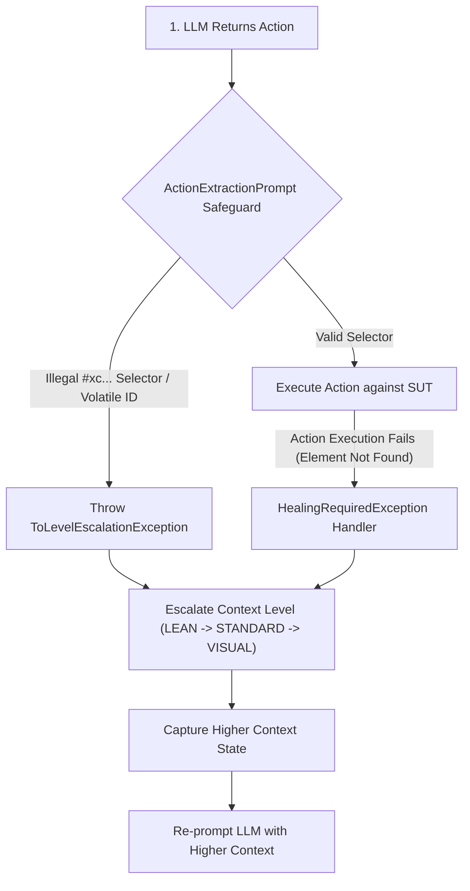

# Neodymium AI v2 Redesign - Features & Documentation

The redesigned v2 Neodymium AI framework (contained in `org.neodymium.ai.*`) delivers advanced agentic test execution, featuring structured playbook companion recordings, pre-step analysis, soft failure tolerance, and deterministic replay capabilities.

---

## 1. Execution Playbooks & Replay Cache
Instead of executing LLM calls dynamically on every run, the v2 framework uses **Structured Playbooks**:
* **YAML Playbook**: Contains natural language steps written either as a plain-text multiline block (`steps: |`) or a YAML list of step strings. Test scenarios support variables (`${username}`) and modular inclusions (`include: ...`):
  - **Multiline Block**:
    ```yaml
    steps: |
      include: common/setup.yaml
      Open ${verla.url}/verla-${quality}/index.html
      Click login button
    ```
  - **YAML List**:
    ```yaml
    steps:
      - "Open store homepage"
      - "Click login button"
    ```
* **JSON Companion**: A recording compiled automatically during the initial `FORCE_RECORDING` run. It maps each natural language step to a list of concrete structured SUT actions (e.g., `NAVIGATE`, `CLICK`, `TYPE`, `ASSERT`) along with visual `screenshotHash` baselines.
* **Offline Replay**: Subsequent test runs (`REPLAY_STRICT` or `REPLAY_WITH_HEALING`) load the companion JSON file directly, executing recorded browser interactions in milliseconds without making any LLM calls.

---

## 2. Explicit Control Tags

Control tags can be appended to natural language steps inside the YAML playbook to customize execution behavior at runtime. All tags are case-insensitive and whitespace-tolerant.

### `(no-replay)`
Forces live execution and completely bypasses the replay cache for a specific step.
* **Behavior**: Bypasses the recorded actions in the companion JSON file and forces a live LLM extraction call (plus live outcome verification) for that step, even during a replay run.
* **Recording**: The fresh actions executed live are updated in the in-memory playbook and stats.
* **LLM Payload Cleanliness**: Stripped upfront at parsing/model instantiation time, ensuring the prompt payload compiled for the LLM remains clean.
* **Syntax Examples**: `(no-replay)`, `(NO-REPLAY)`, `( no-replay )`

### `(optional)` / `(soft)`
Allows failures on steps to be tolerated and logged as warnings instead of failing the test case.
* **Assertion Failures**: If an assertion action (like `ASSERT`) fails, the failure is caught, logged, and reported at the end under warnings. The test continues.
* **Interaction Failures**: If element interaction (like locating or clicking a button) fails, the runner tries all live escalations first. If it still fails, the step is bypassed, the failure is logged as a warning, and execution continues to the next playbook step.
* **No Replay Healing**: During replay of an optional step, the runner does not attempt semantic healing; it immediately logs the failure as a warning and continues.
* **Syntax Examples**: `(optional)`, `(soft)`, `( OPTIONAL )`, `( Soft )`

### `(bug)` / `(bug: id)` / `(bug: comment)`
Negates the outcome of a step when an expected bug exists in the SUT.
* **Expected Failure**: If the step fails for any reason (interaction or verification), the failure is caught, logged, and treated as **passed**. By default, execution halts immediately and skips subsequent steps (to prevent cascaded failures), but the overall test completes successfully.
* **Unexpected Success**: If the step succeeds (meaning the expected bug did not happen), the runner raises a failure and aborts the test immediately to flag that the bug has been resolved or was not encountered.
* **`(continue-on-error)` Support**: If a step is also tagged with `(continue-on-error)` (e.g. `Click button (bug) (continue-on-error)`), the runner continues executing subsequent steps regardless of whether the bug step failed or succeeded (if it succeeded, it just reports it as a warning).
* **Syntax Examples**: `(bug)`, `(bug: APP-123)`, `(bug: button missing)`

### `(no-healing)`
A standalone tag that disables all self-healing mechanisms for a specific step.
* **Behavior**: If the step fails during live or replay execution, the framework does not attempt LLM escalations or semantic self-healing. The failure is immediately propagated (which will either fail the test, trigger bug negation, or trigger optional soft-failure warnings, depending on the other tags present).
* **Syntax Examples**: `(no-healing)`, `(NO-HEALING)`, `( no-healing )`

---

## 3. Runtime Instruction Preparation
Before compiling prompts or sending request payloads to the LLM, the framework runs a dedicated instruction preparation helper. It dynamically strips all explicit control tags case-insensitively, including:
* `(no-replay)`
* `(bug)` / `(bug: ...)`
* `(continue-on-error)`
* `(no-healing)`
* `(optional)` / `(soft)`
* `(timeout: ...)`

This prevents internal execution instructions from polluting the natural language prompts sent to the LLM.

---

## 4. Pre-Step Split Analysis (PESAP) & Context Escalation
To handle complex, compound, or ambiguous instructions, the pipeline executes a **Pre-Step Split Analysis (PESAP)** using the `LlmCapability.PESAP` capability:
* **Contextual Inputs**: The analysis receives the current step, the previously executed step's instruction (for flow context), and up to two subsequent steps' instructions.
* **JIT Upfront Step Splitting**: If a compound step (e.g. `"Search for shirt, select size L, and click Checkout"`) is identified, the LLM splits the instruction into distinct leaf sub-steps. These are instantiated dynamically as child `PlaybookStep` instances and pushed onto the execution stack.
* **Conservative Non-Splitting Invariants**: Single-target instructions with multiple descriptive clauses (e.g. `"Select standard shipping option (5-7 business days) for $5.00"`) or referential verification instructions (e.g. `"Verify order total matches previous summary"`) are strictly preserved as single steps.
* **JIT Context-Level Detection**: Rather than relying on static defaults, PESAP dynamically determines the optimal initial interaction mode (Context Level) required for the step across the 7-tier context escalation ladder.
* **Prompt Optimization**: `pesap-pre-step-prompt.md` features a 56% token footprint reduction (~500 tokens $\rightarrow$ ~220 tokens), significantly lowering prompt overhead across test execution.
* **Bypassing on Replay**: PESAP runs during live recording mode; replay runs skip this analysis and execute the already-split steps directly from the JSON companion.

---

## 4.1 Tiered Context Escalation Ladder & Payload Modes

Neodymium AI uses a **7-tier context level escalation ladder** that progresses deterministically when higher DOM fidelity or visual context is needed:

$$\text{HINT} \longrightarrow \mathbf{LEAN} \longrightarrow \mathbf{STANDARD} \longrightarrow \mathbf{RICH} \longrightarrow \mathbf{VISUAL} \longrightarrow \mathbf{VISUAL\_LEAN} \longrightarrow \mathbf{VISUAL\_RICH}$$

### Context Level Spectrum & Meaning

| Context Level | Mode Type | Payload Content Description | Trigger Conditions / Use Cases |
| :--- | :--- | :--- | :--- |
| **`HINT`** | Text | **0 DOM Nodes.** Explicit selector hint provided (e.g. `(hint: #id)`). Saves 100% of DOM tokens. | When explicit CSS selector hint is provided in playbook step. |
| **`LEAN`** | Text | **Interactive Elements + Headings + Container Skeleton + Concise Text Labels.** Filters out massive paragraph copy (`<p>`/`blockquote` > 120 chars). | Default mode for standard clicks, types, selects, and form interactions. |
| **`STANDARD`** | Text | **`LEAN` + Standard Static Text.** Includes full static body `<p>` paragraph copy of any length, text spans, badges, and order totals. | Selected for text assertions, paragraph matching, or when `LEAN` escalates. |
| **`RICH`** | Text | **`STANDARD` + Full HTML Metadata.** Includes all `data-*`, `title`, `aria-describedby` attributes, un-truncated URLs, and 5-level parent context. | Selected for SKU/data-attribute targeting, table sorting, or deep card disambiguation. |
| **`VISUAL`** | Visual | **Page Screenshot + 0 DOM Element Nodes.** Pure visual assertion/check. | Triggered by `(visual)` check/assertion without element interaction. |
| **`VISUAL_LEAN`** | Visual | **Page Screenshot + `LEAN` DOM.** Visual element interaction. | Triggered when screenshot is required alongside compact element locators. |
| **`VISUAL_RICH`** | Visual | **Page Screenshot + `RICH` DOM.** Maximum multimodal context. | Triggered by `(layout)` checks or complex visual layout debugging. |

### DOM Serialization Differences: `LEAN` vs `STANDARD` vs `RICH`

To understand how `LEAN`, `STANDARD`, and `RICH` differ at runtime:

```html
<!-- LEAN DOM Capture (Interactive Elements + Headings + Concise Labels; Excludes Long Paragraph Copy) -->
<div class="product-card" data-ai="xce869u2">
  <div class="product-info" data-ai="xc9g93c4">
    <span class="product-category" selector="span.product-category" data-ai="xc2nupq6">TOPS</span>
    <h3 class="product-title" selector="h3.product-title" data-ai="xceg4w4t">Minimalist Oversized Hoodie</h3>
    <p class="product-price" selector="p.product-price" data-ai="xc1j5c6g">$120.00 USD</p>
    <div class="product-actions" data-ai="xc5f2v4m">
      <button class="btn-quick-add" type="button" selector="button.btn-quick-add:nth-of-type(1)" data-ai="xce624f1">ADD TO BAG</button>
    </div>
  </div>
</div>
```

```html
<!-- STANDARD DOM Capture (LEAN + Full Static Paragraph Copy & Body Text) -->
<div class="product-card" data-ai="xce869u2">
  <div class="product-info" data-ai="xc9g93c4">
    <span class="product-category" selector="span.product-category" data-ai="xc2nupq6">TOPS</span>
    <h3 class="product-title" selector="h3.product-title" data-ai="xceg4w4t">Minimalist Oversized Hoodie</h3>
    <p class="product-desc" selector="p.product-desc" data-ai="xch294lm">Minimalist silhouettes engineered with sustainable organic textiles and precision craftsmanship in Berlin.</p>
    <p class="product-price" selector="p.product-price" data-ai="xc1j5c6g">$120.00 USD</p>
    <div class="product-actions" data-ai="xc5f2v4m">
      <button class="btn-quick-add" type="button" selector="button.btn-quick-add:nth-of-type(1)" data-ai="xce624f1">ADD TO BAG</button>
    </div>
  </div>
</div>
```

```html
<!-- RICH DOM Capture (STANDARD + data-*, title, aria-describedby + 5-Level Parent Context) -->
<div class="product-card" data-product-id="prod-101" data-category="tops" data-ai="xce869u2">
  <div class="product-info" data-ai="xc9g93c4">
    <span class="product-category" selector="span.product-category" data-ai="xc2nupq6">TOPS</span>
    <h3 class="product-title" selector="h3.product-title" title="Minimalist Oversized Hoodie - Organic Cotton" data-ai="xceg4w4t">Minimalist Oversized Hoodie</h3>
    <p class="product-desc" selector="p.product-desc" data-ai="xch294lm">Minimalist silhouettes engineered with sustainable organic textiles and precision craftsmanship in Berlin.</p>
    <p class="product-price" selector="p.product-price" aria-describedby="price-disclaimer-101" data-ai="xc1j5c6g">$120.00 USD</p>
    <div class="product-actions" data-ai="xc5f2v4m">
      <button class="btn-quick-add" type="button" data-analytics="add-cart-top-101" selector="button.btn-quick-add:nth-of-type(1)" data-parent-text="TOPS > Minimalist Oversized Hoodie > $120.00 USD > Size M" data-ai="xce624f1">ADD TO BAG</button>
    </div>
  </div>
</div>
```

### Automatic Escalation Flow Example

When an action step cannot be fulfilled at the initial context level, the framework automatically escalates to the next level:
1. **Initial Step**: `"Click 'Add to Cart'"` $\rightarrow$ Starts at **`LEAN`**.
2. **Escalation 1 (`LEAN` $\rightarrow$ `STANDARD`)**: If text content or paragraph copy is missing from `LEAN`, LLM requests escalation to **`STANDARD`**.
3. **Escalation 2 (`STANDARD` $\rightarrow$ `RICH`)**: If custom `data-*` attributes or deeper 5-level parent context are required to build a unique locator, escalates to **`RICH`**.
4. **Escalation 3 (`RICH` $\rightarrow$ `VISUAL`)**: If DOM elements are unrendered or hidden, escalates to **`VISUAL`** (screenshot).

---

## 5. Post-Action AI Outcome Verification
After executing the SUT actions for a step, the framework performs a **Post-Action Outcome Verification**:
* **Always Visual**: Regardless of the initial execution context level, the outcome verification always captures the SUT state at the `VISUAL` level to record baseline images and compute screenshot dHash baselines.
* **Semantic Verification Prompt**: Evaluates the natural language instruction against the final page DOM and screenshot using the `VerificationPrompt` template via the `LlmCapability.VERIFICATION` capability.
* **Advisory & Diagnostic by Design (Soft Failures)**: Verification failures perform post-step semantic auditing and diagnostic scoring. They are collected and reported as warnings at the end of the test case, allowing developers to inspect semantic discrepancies without crashing the automation flow. Verification failures do **not** fail the test case directly; explicit test assertions are enforced via concrete SUT `ASSERT` actions.

---

## 6. Dynamic Variable Parameterization & Outbound Secret Masking
Ensures recorded playbooks remain reusable and enterprise credentials remain confidential:
* **Resolution**: Resolves variables (e.g. `${username}`) at runtime before executing actions.
* **Outbound Secret Masking (`ContextSanitizer`)**: Before prompts, instructions, or captured SUT DOM state payloads are transmitted over the network to external LLM providers (Gemini, Mistral, Vertex), `DefaultContextSanitizer` scans the payload against sensitive session dataset entries (`DataEntry.sensitive() == true`) and replaces raw secret credentials with format-preserving `[MASKED_VAR_key]` placeholders (e.g. `[MASKED_VAR_password]`). Returned LLM responses are automatically reverse-mapped back to variable reference syntax (`${password}`) prior to action parsing, ensuring raw secrets never leave the client.
* **Recording Parameterization**: Automatically matches executed values and dynamic response strings (such as order numbers or generated URLs) back to variable definitions, writing parameterized entries like `"${order.number}"` into the companion JSON instead of hardcoded session values.

---

## 7. Decoupled Core Components & Resource Management
To ensure a modular architecture, all key interfaces are cleanly decoupled:
* **`PlaybookResourceManager`**: Decouples playbook loading/writing from specific file systems, serving as the interface for reading/saving playbooks (YAML & JSON) across local, classpath, or virtualized directories.
* **`TargetExecutor`**: Abstract driver interface separating the pipeline execution logic from browser drivers (e.g., Selenide/WebDriver) and REST clients.
* **`PlaybookParser`**: Standard interface for parsing structured or nested playbooks and inclusions.

---

## 8. Session-Centric Architecture & Thread Isolation
To support robust parallel execution (e.g., executing multiple tests concurrently in separate threads):
* **`AiSession`**: Serving as the thread-isolated lifecycle holder containing context state, target drivers, prompts, and config parameters.
* **Hierarchy Isolation**: Prompts and sessions can inherit configs from parent scopes but remain completely isolated at runtime, preventing thread cross-talk.
* **Dynamic Lifecycle Hooks**: Supports registering pre/post-execution hooks on sessions (e.g., clearing caches, starting servers, compiling reports).

---

## 9. Unified Event-Driven HUD & Logging
* **`EventBus`**: Centrally coordinates all framework execution events (e.g., `ActionExecutedEvent`, `SessionFinishedEvent`).
* **Heads-Up Display (HUD)**: Decoupled HUD listeners listen to event streams to render interactive overlays and debug windows without polluting the core execution pipeline.
* **Metrics Summary**: Automatically tracks duration, token count, LLM provider invocation logs, and semantic outcome errors on a per-step basis.

---

## 10. Registry & Pluggable LLM Routing
* **`LlmProviderRegistry`**: Hosts registered providers for LLM capabilities (e.g., `TEXT_ONLY`, `EXECUTION`, `VISION`, `PESAP`, `VERIFICATION`).
* **Capability-Based Routing**: Dynamically inspects SUT level requirements and routes prompts to the appropriate registered provider (e.g., utilizing vision models only when screenshots are attached).

---

## 11. Session-Level Authentication Setup
* **`BasicAuth` Configuration**: Registers credentials (username/password) dynamically on `AiSession` setup.
* **CDP Interception**: Intercepts basic auth browser challenges via low-level Chrome DevTools Protocol mechanisms, ensuring seamless authentication setup for headless SUT environments.

---

## 12. AI Prompt Taxonomy & Custom System Add-ons

The framework utilizes a dedicated taxonomy of prompts, each mapped to specific pipeline phases and LLM capabilities. To customize LLM behaviors without changing the core codebase, the framework supports injecting **Custom System Add-on Prompts**.

### A. Prompt Taxonomy

| Prompt Class | Pipeline Step / Context | LLM Capability | Inputs | Purpose & Output |
| :--- | :--- | :--- | :--- | :--- |
| **`PesapPrompt`** | `BeforeStep` / pre-step analysis | `PESAP` | Current instruction, previous instruction, next instructions. | Analyzes instruction flow to predict interaction `ContextLevel`, split compound instructions into sub-steps, and check if custom Java reflection methods are required. Outputs a structured JSON. |
| **`ActionExtractionPrompt`** | `CallLlmStep` / live action generation | `EXECUTION` | Current SUT DOM state, natural language instruction, step history. | Identifies the correct sequence of web automation actions (`CLICK`, `TYPE`, etc.), multi-candidate locators, and `selfCritique` evaluation to implement the instruction. Outputs structured JSON actions. |
| **`QualityJudgePrompt`** | `QualityJudgeStep` / optional second-opinion evaluator | `JUDGE` / `EXECUTION` | Instruction, proposed primary action, candidate locators list, full DOM context. | Evaluates proposed locator and alternative candidates against full DOM tree for stability and uniqueness. Outputs structured judgment (`APPROVED`, `REFINED`, `REJECTED`), `chosenLocator`, and `chosenValue`. |
| **`VerificationPrompt`** | `VerifyOutcomeStep` / post-action validation | `VERIFICATION` | Natural language instruction, executed actions, pre/post screenshots. | Acts as an objective AI judge, scoring the outcome on rubrics (`intentMatch`, `visualDelta`, `absenceOfErrors`). Outputs a structured `VerificationResult` JSON. |
| **`SemanticDivergencePrompt`** | `SemanticDivergenceAnalysisStep` / replay healing | `TEXT_ONLY` | Baseline page source, current page source. | Compares expected vs actual SUT page states during a replay cache divergence to generate a plain-English diff summary (e.g. `ID changed from checkout to pay-now`). |
| **`VisualRcaPrompt`** | `StateMachineRunner.runVisualRca` / final error debug | `VISION` | Failed instruction, error details, current page screenshot. | Diagnoses visual root causes on conclusive execution failures (e.g., overlapping elements, cookie popups). Publishes a `DiagnosticErrorEvent`. |

### B. Custom System Add-on Prompts

To tune the LLM's system instructions for specific environments, applications, or testing scenarios, custom system prompt add-ons can be declared dynamically:

1. **Resolution Precedence**:
   System prompt add-ons are resolved with the following priority (first match wins):
   1. **Test Dataset Layer**: Defined inside a dataset entry (e.g. `systemPromptAddon.general: "Prefer CSS selectors"`).
   2. **YAML Playbook Layer**: Defined at the top level of the YAML playbook file.
   3. **System/Environment Properties**: Defined in system properties or configuration files (e.g., `neodymium.properties`).

2. **Per-Capability Customization Keys**:
   Add-on keys can target a specific type of LLM prompt or apply generally to all prompts:
   - `systemPromptAddon` (or `systemPromptAddon.default`): Appends to all system prompts.
   - `systemPromptAddon.pesap`: Appends specifically to the `PesapPrompt`.
   - `systemPromptAddon.general`: Appends specifically to the `ActionExtractionPrompt`.
   - `systemPromptAddon.verification`: Appends specifically to the `VerificationPrompt`.
   - `systemPromptAddon.rca`: Appends specifically to the `VisualRcaPrompt`.
   - `systemPromptAddon.divergence`: Appends specifically to the `SemanticDivergencePrompt`.

3. **YAML Playbook Declaration Examples**:
   Add-ons can be specified at the top level of a YAML playbook in flat key format, nested map format, or plural map format:
   ```yaml
   # Flat key format
   systemPromptAddon.general: "Always look for button text first"

   # Nested map format
   systemPromptAddon:
     pesap: "Predict shorter execution timeouts"
     verification: "Be extremely strict about price format changes"
   ```

4. **Safety Limits & Adherence Enforcement**:
   To prevent custom prompt add-ons from diluting or overriding essential prompt instructions (such as JSON output schemas and capability rules), the following safety controls are enforced:
   * **Length Limit**: Any custom prompt add-on value must not exceed **2000 characters**. If it does, a validation check throws an `IllegalArgumentException` early.
   * **Adherence Enforcement Suffix**: When appending the custom add-on prompt, the compiler automatically appends a strict reminder suffix:
     `"CRITICAL REMINDER: The above rules are custom extensions for this test step. You MUST still strictly follow all JSON schema formatting rules, action capabilities, and output guidelines specified in the main system prompt above."`
     This prevents the LLM from generating invalid text/HTML outputs when guided by custom user rules.

### C. Disk-Based Model-Specific System Prompt Add-ons

To handle model-specific quirks (such as `gemini-3-5-flash-lite` requiring explicit warnings against synthetic HTML element tag names in DOM dumps) without hardcoding any text strings or model names in Java code, Neodymium AI automatically resolves model prompt add-ons dynamically from disk and classpath:

1. **Resolution Directory Layout**:
   Model-specific system prompt add-ons are placed in the `ai-prompts/models/<cleanModel>/` directory on the classpath (or filesystem `config/ai-prompts/models/<cleanModel>/`):
   - `config/ai-prompts/models/<cleanModel>/addon-<type>.md` (filesystem override for capability type, e.g. `addon-general.md`)
   - `config/ai-prompts/models/<cleanModel>/addon.md` (filesystem override default)
   - `ai-prompts/models/<cleanModel>/addon-<type>.md` (classpath resource for capability type)
   - `ai-prompts/models/<cleanModel>/addon.md` (classpath resource default)

   Where `<cleanModel>` is the active model name sanitized to lowercase alphanumeric kebab-case (e.g., `gemini-3.5-flash-lite` $\rightarrow$ `gemini-3-5-flash-lite`).

2. **Resolution Precedence**:
   1. **Test Dataset Layer**: Defined inside dataset entry (e.g. `systemPromptAddon.general`)
   2. **YAML Playbook Layer**: Defined at playbook top level (`systemPromptAddon: { ... }`)
   3. **Disk/Classpath Model Add-on**: Loaded dynamically from `ai-prompts/models/<cleanModel>/addon-<type>.md` or `config/ai-prompts/models/...`

3. **Example (`gemini-3-5-flash-lite`)**:
   File: `src/main/resources/ai-prompts/models/gemini-3-5-flash-lite/addon-general.md`
   ```markdown
   CRITICAL FOR LITE MODEL LOCATORS: DOM dump element tags represent real HTML tags 
   (<p>, <div>, <span>, <h1>, <button>, <input>, <link>). Never invent synthetic 
   tag names or pseudotags (such as 'text' or 'text:nth-of-type(N)') in locators. 
   If a target element lacks a direct class or id attribute, select its parent 
   element (e.g., 'div:has(...)') or set 'status' to 'ESCALATE' to request visual context.
   ```

---

## 13. `@AiPlaybook` Path Resolution & Scoping Rules

The `@AiPlaybook` annotation configures the target playbook file for AI test execution and companion replay cache storage. Path resolution follows standard, deterministic Java resource rules:

### Path Resolution Rules

| Annotation Syntax | Resolution Strategy | Resolved Resource Path Example (Class: `org.neodymium.ai.live.AssertTest`, Method: `testOne`) |
| :--- | :--- | :--- |
| **No `@AiPlaybook`** / `@AiPlaybook` (empty) | **Package-Relative Default** | `org/neodymium/ai/live/AssertTest_testOne.yaml` |
| **`@AiPlaybook("custom.yaml")`** | **Package-Relative Custom Name** | `org/neodymium/ai/live/custom.yaml` |
| **`@AiPlaybook("sub/custom.yaml")`** | **Package-Relative Subdirectory** | `org/neodymium/ai/live/sub/custom.yaml` |
| **`@AiPlaybook("/playbooks/foo.yaml")`** | **Absolute Classpath Root** (leading `/`) | `playbooks/foo.yaml` |

### Scoping Rules

* **Class Level**: Declaring `@AiPlaybook` at the class level sets the default playbook for all test methods in that test class.
* **Method Level**: Declaring `@AiPlaybook` on a test method overrides any class-level annotation.
* **Programmatic Java Tests**: Test classes marked with `@NeodymiumAiTest` that execute steps programmatically via `runPlaybook(session, "...")` do not require `@AiPlaybook`. Replay recordings automatically use standard package-relative path resolution or absolute paths if specified.

### Multi-Dimensional Companion Recording Filenames

To prevent recording collisions across different test methods, datasets, or browser profiles referencing the same playbook YAML template, companion JSON recording files are constructed automatically using all active execution dimensions:

$$\text{RecordingPath} = \text{\{DirectoryPath\}} / \text{\{ClassName\}} \_\, \text{\{MethodName\}} [\_ \, \text{\{DataSet\}} ] [\_ \, \text{\{Browser\}}] \, . \text{json}$$

* **Class Name**: Identifies the test suite class (e.g. `VerlaGuestCheckoutIntegrationTest`).
* **Method Name**: Guarantees uniqueness for each test method (e.g. `testCheckoutLive`).
* **Dataset ID**: Appended when parameterized dataset execution is active (e.g. `_perfect`).
* **Browser Profile**: Appended when `@Browser("...")` annotation is present (e.g. `_Chrome_1500x1000`).

**Example Recording Path:**
`playbooks/integration/VerlaGuestCheckoutIntegrationTest_testCheckoutLive_perfect_Chrome_1500x1000.json`

---

## 14. Centralized Selenide Locator Resolver (`LocatorResolver`)

To support vendor-neutral prompt outputs and handle custom browser pseudo-selectors without failing W3C CSS parsing engines, Neodymium AI provides a centralized **`LocatorResolver`**:

### Concept & Scope
* **Selenium/Selenide Exclusive**: `LocatorResolver` is strictly used by the Selenide/Selenium execution layer (`ActionExecutor` and `SelenideElementFinder`) to translate target strings into W3C-compliant `org.openqa.selenium.By` locators.
* **Native Playwright Bypass**: Native Playwright execution drivers execute raw Playwright selector strings directly in Playwright's native JavaScript engine without routing through `LocatorResolver`.

### Supported Selector Translations

| Target Format | Translation Strategy | Resulting Selenium / Selenide Locator |
| :--- | :--- | :--- |
| **`text=Total Paid: $27.58`** | Playwright `text=` prefix | `Selectors.withText("Total Paid: $27.58")` |
| **`button:has-text('Total Paid')`** | Playwright `:has-text(...)` pseudo-selector | `By.xpath("//button[contains(normalize-space(.), 'Total Paid')]")` |
| **`span:contains('Shopping Cart')`** | jQuery/Playwright `:contains(...)` | `By.xpath("//span[contains(normalize-space(.), 'Shopping Cart')]")` |
| **`:text('Checkout')`** | Standalone `:text(...)` | `Selectors.withText("Checkout")` |
| **`neo-ref=c42`** | Neodymium automation reference ID | `By.cssSelector("[data-neo-ref='c42']")` |
| **`custom-card ::shadow .btn`** | Explicit Shadow DOM target | `Selectors.shadowCss(".btn", "custom-card")` |
| **`//button[@id='pay']`** | Standard XPath | `By.xpath("//button[@id='pay']")` |
| **`button#pay.primary`** | Standard W3C CSS | `By.cssSelector("button#pay.primary")` |

---

## 15. Multi-Dimensional Prompt Resolution Architecture

To optimize prompt engineering across different LLM providers (e.g. Gemini, GPT-4o, Claude 3.5) and target execution engines (e.g. Selenide/Selenium vs. Playwright), Neodymium AI implements **Multi-Dimensional Prompt Resolution** in `AiAgentPrompts`.

### Resolution Hierarchy

When a prompt template (e.g., `system-prompt-rules.md`) is requested for a given `ExecutionEngine` and `Model`, the framework evaluates classpath candidates in the following order (first match wins):

```
                       Prompt Request: "system-prompt-rules.md"
                                       │
                                       ▼
  1. Engine + Model Specific : ai-prompts/engines/{engine}/models/{model}/system-prompt-rules.md
                                       │
                                       ▼
  2. Engine Specific         : ai-prompts/engines/{engine}/system-prompt-rules.md
                                       │
                                       ▼
  3. Model Specific          : ai-prompts/models/{model}/system-prompt-rules.md
                                       │
                                       ▼
  4. Default Fallback        : ai-prompts/default/system-prompt-rules.md
                                       │
                                       ▼
  5. Direct Root Fallback    : ai-prompts/system-prompt-rules.md
```

### Plug-and-Play Snippet Substitution vs Full Copies

The framework supports two prompt tuning workflows:

1. **Plug-and-Play Snippet Injection (DRY Default)**:
   Base prompt templates remain shared across engines and include dynamic placeholders such as `{{ENGINE_LOCATOR_RULES}}`.
   * **Selenide Target** (`ai-prompts/engines/selenide/locator-rules.md`):
     > *"Target browser engine is W3C Selenium / Selenide. Generated CSS selectors MUST be valid W3C CSS level 3/4 selectors."*
   * **Playwright Target** (`ai-prompts/engines/playwright/locator-rules.md`):
     > *"Target browser engine is native Playwright. You MAY generate native Playwright pseudo-selectors such as `:has-text(...)`, `text=...`, or `:visible`."*

2. **Full Prompt Copy Overrides**:
   If a specific model or engine requires a fundamentally different prompt structure, a full prompt copy can be placed in `ai-prompts/engines/{engine}/system-prompt-rules.md`, overriding the default prompt entirely.

---

## 16. SSIM 64×64 Visual Verification & Candidate Playbook Persistence

To ensure fast visual verification, immunity against subpixel rendering noise, and persistent self-healing cache convergence, Neodymium AI implements **SSIM 64×64 Visual Matrix Verification** and **Universal Candidate Playbook Capture**.

### A. SSIM 64×64 Visual Matrix Verification
Rather than using lossy 17×16 perceptual bit-hashes, visual steps capture structural luminance matrices:
1. **Bilinear Downscaling**: Screenshots are downscaled to a $64 \times 64$ grid using `RenderingHints.VALUE_INTERPOLATION_BILINEAR`.
2. **8-bit Luminance Matrix**: Calculates a 4,096-byte luminance matrix (0..255 brightness per grid cell), serialized as a Base64 string in `step.setScreenshotHash()`.
3. **In-Memory SSIM Comparison**: During replay, Neodymium computes Mean SSIM ($0.0 \rightarrow 1.0$) across $8 \times 8$ local blocks in $< 0.05\text{ ms}$.
4. **Visual Match Gate**: Checks `ssimScore >= neodymium.ai.ssim.minScore` (default: `0.99`). If visual score passes, execution bypasses unnecessary LLM verification calls while staying immune to font anti-aliasing and subpixel noise.

```properties
# Minimum SSIM score (0.0 to 1.0) required for visual match gate approval
neodymium.ai.ssim.minScore=0.99
```


### B. Universal Candidate Playbook Capture & Staleness Detection
1. **All Execution Modes**: `PlaybookRecorder` collects candidate execution steps in memory across all modes (`LLM_RECORDING`, `FORCE_RECORDING`, `REPLAY_WITH_HEALING`, `REPLAY_STRICT`).
2. **Failure Protection**: If a test fails, the candidate playbook is discarded. The disk file remains 100% untouched.
3. **Success Write-Back**: If a test succeeds and steps were healed or updated, the candidate playbook replaces the disk file atomically. If 0 changes occurred on replay, disk writes are skipped.
4. **YAML Hash Invalidation**: Companion `.json` files store `sourceYamlHash` (SHA-256 of original `.yaml` playbook). On replay, if the source `.yaml` file has been modified, a staleness warning is logged.

---

## 17. Visual Root Cause Analysis (RCA) & Failure Diagnostics

When a test step fails during execution (in `LIVE`, `REPLAY_WITH_HEALING`, or `REPLAY_STRICT` mode), Neodymium AI automatically captures the final SUT page state and invokes the Vision LLM (`LlmCapability.VISION`) to generate a plain-English **Visual Root Cause Analysis (RCA)**.

### Concept & Logging
* **Post-Mortem Failure Diagnostic**: Visual RCA is strictly a diagnostic feature and does not perform self-healing or alter test execution flow. It attaches root cause explanations to Allure reports, telemetry sinks, and log files.
* **Detailed Logging**: System/User prompts and raw responses are output at `TRACE` log level (`Compiling prompt: VisualRcaPrompt`), while the final root cause diagnosis is emitted at `INFO` level:
  ```text
  INFO - 🚨 [Visual RCA Diagnosis]: The 'Submit Order' button is missing because the checkout page failed to populate payment methods due to an upstream API timeout.
  ```

### Configuration
Visual RCA can be optionally disabled (e.g., for token conservation or offline CI test runs):

```properties
# Enables or disables automatic Visual Root Cause Analysis (RCA) on step execution failures.
# Default is true. Set to false to bypass Visual RCA calls on step failure.
neodymium.ai.visualRca.enabled=true
```

---

## 18. Automatic Validated Locator Improver & Locator Quality Scoring

Neodymium AI automatically inspects target DOM elements during LLM step execution, generates candidate standard CSS locators (`#id`, `[data-testid='...']`, `[name='...']`, `[aria-label='...']`, `[placeholder='...']`), and validates them against live browser DOM invariants before upgrading saved playbook action locators.

### Quality Scoring Scale (0 to 10)

| Score | Locator Type | Examples |
| :---: | :--- | :--- |
| **10/10** | Unique ID or Test ID | `#purchase-btn`, `[data-testid='submit-order']`, `[data-test='checkout']` |
| **8/10** | Standard Attribute | `input[name='email']`, `[aria-label='Search']`, `[placeholder='Enter address']` |
| **6/10** | Single Clean Class | `.product-quick-add`, `.btn-primary` |
| **4/10** | Neodymium Fingerprint Tag | `[data-ai='xccaql7f']` |
| **2/10** | Complex Combinator / Deep Path | `header > div > form > input:nth-child(2)`, `//html/body/div[1]/input` |
| **0/10** | Volatile Dynamic ID / Invalid | `#v-btn-129481`, `#react-node-9941` |

### Validation & Safety Invariants
1. **Quality Score Upgrade Gate**: Candidate locators are upgraded ONLY if candidate quality score strictly exceeds the original locator score ($\text{CandidateScore} > \text{OriginalScore}$).
2. **Uniqueness Check**: The candidate locator must match **exactly 1 element** in the live DOM (`findElements().size() == 1`).
3. **Identity Check**: The element returned by the candidate locator must be the **exact same `WebElement` instance** (`matchedElement.equals(targetElement)`).
4. **Volatile ID Protection**: Ignores dynamic/framework auto-generated IDs using `VolatileIdDetector`.

### Configuration
The Locator Improver is enabled by default and can be configured via `neodymium.properties` or system properties:

```properties
# Enables or disables automatic live DOM locator upgrading and quality scoring for recorded playbooks.
# Default is true. Set to false for testing or disabling locator upgrades.
neodymium.ai.locatorImprover.enabled=true
```

---

## 19. Target Safeguarding & Full Escalation Flow

Neodymium AI enforces a multi-tier **Target Safeguarding & Escalation Pipeline** to prevent invalid, volatile, or hallucinated selectors (such as fake `#xc...` ID selectors or framework dynamic hashes) from executing or polluting recorded playbook files.

### Escalation & Safeguard Architecture


```mermaid
flowchart TD
    A["1. LLM Returns Action"] --> B{"ActionExtractionPrompt Safeguard"}
    B -->|"Illegal #xc... Selector / Volatile ID"| C["Throw ToLevelEscalationException"]
    B -->|"Valid Selector"| D["Execute Action against SUT"]
    
    C --> E["Escalate Context Level (LEAN -> STANDARD -> VISUAL)"]
    E --> F["Capture Higher Context State"]
    F --> G["Re-prompt LLM with Higher Context"]
    
    D -->|"Action Execution Fails (Element Not Found)"| H["HealingRequiredException Handler"]
    H --> E
```

### Safeguard Rules & Pipeline Invariants

1. **Early Volatile ID Rejection (`ActionExtractionPrompt`):**
   - When the LLM parses an action, target locators are evaluated against `VolatileIdDetector` rules (including configured `neodymium.ai.dom.volatileIdPatterns` and framework invariant `^xc[a-z0-9_]+$`).
   - If an action returns an illegal `#xc...` ID selector or a volatile ID, `ActionExtractionPrompt` throws `ToLevelEscalationException` directly during response parsing.
   - **Result:** Context immediately escalates from `LEAN` to `STANDARD` (or `VISUAL`), capturing higher context and re-prompting the LLM with richer state before an execution attempt is made.

2. **No Magic Selection Fallbacks (`SelenideElementFinder`):**
   - `SelenideElementFinder` restricts `data-ai` attribute matching strictly to explicit `[data-ai=...]` or `data-ai=` selectors.
   - If the LLM returns an invalid ID selector like `#xck520w4`, `SelenideElementFinder` queries `id="xck520w4"` directly on the HTML DOM, failing cleanly instead of silently rewriting the selector under the hood.

3. **Action Retry Context Escalation (`ExecuteActionsStep`):**
   - When an action execution fails on SUT (e.g. `Element not found`), `ExecuteActionsStep` catches `HealingRequiredException` and automatically escalates `KEY_CURRENT_CONTEXT_LEVEL` to the next level (`LEAN` -> `STANDARD` -> `VISUAL`), capturing state before re-querying the LLM.
   - **Result:** Eliminates retry loops at `LEAN` and ensures the LLM receives visual screenshot context to fix broken locators.

4. **Extensible TargetExecutor Capability Abstraction:**
   - Decoupled from specific driver implementations via `TargetExecutor.supportsLocatorImprovement()`.
   - Ensures DOM-specific locator improvement only runs for web browser executors (`SelenideTargetExecutor`, `PlaywrightTargetExecutor`), preserving clean architectural boundaries for non-DOM executors (`RestTargetExecutor`).

---

## 20. Multi-Candidate Locators, Single-Call Self-Critique & LLM Quality Judge

Neodymium AI features a **Dual-Layer Selector Quality & Verification Architecture** to guarantee maximum locator stability, eliminate dynamic framework hashes, and provide detailed call-type token telemetry.

### A. Ranked Candidate Locators

For every extracted action, the primary LLM generates 2–3 candidate locators ranked by stability in `action.getCandidateLocators()`:
* **Candidate 1 (Primary)**: Unique standard `#id`, `name`, `data-test`, `data-testid`, or `aria-label`. `data-ai` attributes are **strictly forbidden** in Candidate 1.
* **Candidate 2 (Semantic Fallback)**: Clean semantic CSS class or standard attribute combination (e.g. `.btn-secondary[type='submit']`). `data-ai` attributes and dynamic CSS module hashes are **strictly forbidden**.
* **Candidate 3 (Stability Fallback)**: `[data-ai='...']` selector attribute provided in the DOM dump (strategy `DATA_AI`).

### B. Embedded Judging & Self-Critique (`neodymium.ai.action.embeddedJudging.enabled`)

To evaluate selector quality **without making an extra API call or duplicating DOM payload tokens**, the primary LLM can perform internal self-judging:
* **Configuration**: Controlled by `neodymium.ai.action.embeddedJudging.enabled=true|false` (default: `true`).
  - **`true` (Enabled - Default):** Loads `action-extraction-prompt-judging.md`. For every extracted action, the primary LLM generates `candidateLocators`, evaluates them against stability rules, penalizes dynamic/mangled framework class hashes ($< 0.50$), and outputs `selfCritique` to select the winning `locator`.
  - **`false` (Disabled):** Loads `action-extraction-prompt-non-judging.md`. Sends the lightweight non-judging system prompt template, omitting `candidateLocators` and `selfCritique` from the output JSON for ~40–60% lower token consumption and faster response times.
* **Evaluation**: Evaluates `candidateLocators` against stability rules inside the primary HTTP request.
* **Dynamic / Mangled Class Penalty**: Auto-generated dynamic framework IDs (e.g. `#v-btn-123`) and mangled CSS module hashes (e.g. `._app_child_level3_8392`, `.css-1x839a`) are assigned low scores ($< 0.50$).
* **Self-Critique Rejection & Promotion**: If Candidate 1 contains dynamic framework hashes or `data-ai` attributes while Candidate 2 is a clean class/attribute selector, `selfCritique` explicitly rejects Candidate 1 and sets `locator` to Candidate 2.
* **Performance**: Executed inside the **single primary LLM call** (0 extra API calls, 0 duplicated DOM tokens, 2x faster).

```json
{
  "action": "CLICK",
  "candidateLocators": [
    { "locator": "#v-btn-42", "strategy": "ID", "score": 0.40, "reasoning": "Dynamic framework hash ID" },
    { "locator": ".btn-primary[type='submit']", "strategy": "CLASS", "score": 0.95, "reasoning": "Clean semantic class and type" }
  ],
  "selfCritique": "Rejected Candidate 1 #v-btn-42 due to dynamic framework hash ID. Promoted Candidate 2 .btn-primary[type='submit'] for maximum stability.",
  "locator": ".btn-primary[type='submit']"
}
```

### C. External Quality Judge (`QualityJudgeStep` - Optional / Second Opinion)

When an independent "second opinion" model is desired (e.g. using Llama to critique Gemini):
* **Execution**: Executes `QualityJudgePrompt` passing the proposed primary action, candidate locators, and full DOM tree context.
* **Output**: Returns structured `QualityJudgeResult` JSON containing `judgment` (`APPROVED`, `REFINED`, `REJECTED`), `chosenLocator`, `chosenValue`, `isRegex`, `confidence`, and `reasoning`.
* **Configuration**:
  ```properties
  # Enables or disables embedded judging (candidateLocators & self-critique) inside action extraction prompt.
  neodymium.ai.action.embeddedJudging.enabled=true

  # Enables or disables the external LLM Quality Judge ("second opinion") step.
  # Default is false (using Single-Call Self-Critique instead for token conservation).
  neodymium.ai.judge.enabled=false

  # Execution mode for Quality Judge. Valid options: ON_AMBIGUITY (default), ALWAYS, ON_FAIL.
  neodymium.ai.judge.mode=ON_AMBIGUITY

  # Optional separate LLM provider and model for Quality Judge (e.g. Ollama / Llama 3)
  neodymium.ai.judge.provider=ollama
  neodymium.ai.judge.model=llama3
  ```

### D. Detailed Per-Call-Type Telemetry Breakdown

Test completion stats and log summaries report an exact breakdown of LLM calls and token usage across all four pipeline call types:

```text
🤖 LLM Calls & Tokens: 45 calls | 100,784 tokens (In: 95,584, Out: 5,200, Cached: 0)
  ├─ PESAP:             16 calls | 6,457 tokens (In: 6,269, Out: 188, Cached: 0)
  ├─ Action:            15 calls | 56,911 tokens (In: 53,194, Out: 3,717, Cached: 0)
  ├─ Judge:             14 calls | 37,416 tokens (In: 36,121, Out: 1,295, Cached: 0)
  └─ Verification:      0 calls | 0 tokens (In: 0, Out: 0, Cached: 0)
```


