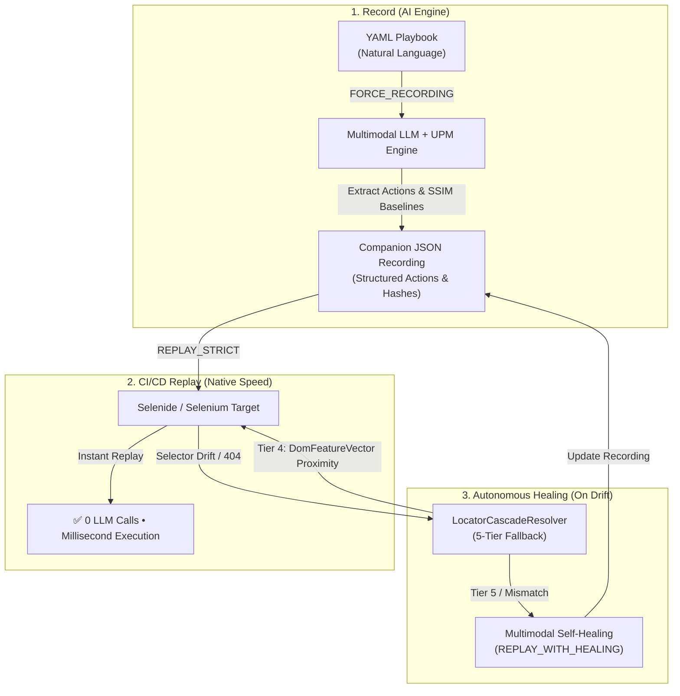

[](https://search.maven.org/search?q=g:%22com.xceptance%22%20AND%20a:%22neodymium%22) [](https://gitter.im/neodymium/community?utm_source=badge&utm_medium=badge&utm_campaign=pr-badge&utm_content=badge)

# Neodymium

Neodymium solves modern web test automation challenges by combining JUnit, WebDriver, Selenide, BDD/Cucumber, and comprehensive reporting with **Neodymium Aura AI** — an intelligent automation engine that turns natural language playbooks into robust, millisecond-fast offline test runs.

---

## 🌟 Two Automation Paradigms in One Framework

Neodymium offers two complementary ways to build test suites:

1. **Neodymium Aura (AI-Powered Automation)**: Author tests in natural language playbooks. The AI records resilient actions and visual baselines once; subsequent runs replay in milliseconds with zero LLM API costs and auto-heal on UI drift.
2. **Neodymium Classic (Code-First Automation)**: Build structured, programmatic tests in Java using JUnit 5, Selenide, Page Objects, Cucumber BDD, and multi-browser execution matrices.

---

## ⚡ Neodymium Aura: AI-Powered Automation

> **Record Once with AI. Replay at Native Browser Speed. Self-Heal on UI Drift.**



### Why Neodymium Aura?

| Feature | Traditional Automation (Selenium/Playwright) | Pure AI Agents (Autonomous LLM Per Step) | **Neodymium Aura (Hybrid Execution)** |
| :--- | :--- | :--- | :--- |
| **Authoring Speed** | ⚠️ Slow (handcrafting complex selectors) | ⚡ Instant (plain natural language) | ⚡ **Instant (plain natural language playbooks)** |
| **Replay Speed** | ⚡ Milliseconds (native browser events) | ❌ 3–15 seconds per step (slow LLM latency) | ⚡ **Milliseconds (native Selenide execution)** |
| **Cost & Token Usage** | 🟢 Zero recurring token costs | 🔴 High recurring cost on every CI run | 🟢 **Zero tokens during replay (`REPLAY_STRICT`)** |
| **Determinism & Flakiness** | ❌ High flakiness on dynamic DOM changes | ❌ Non-deterministic LLM hallucinations | 🟢 **Deterministic replay with visual SSIM gating** |
| **Maintenance** | 🔴 Expensive manual selector fixes | ⚠️ Re-executes prompts blindly | 🟢 **Autonomous self-healing on UI drift** |

### 3-Minute Quickstart (Aura AI)

#### 1. Set Your AI Provider & API Key
Inject your API key via environment variable or JVM argument (never commit keys to source code):

```bash
export GEMINI_API_KEY="your-gemini-api-key"
```

#### 2. Write Your First Playbook Test
Use the `@AiInlinePlaybook` annotation or an external `.yaml` playbook:

```java
package com.xceptance.neodymium.test;

import org.junit.jupiter.api.Test;
import org.neodymium.ai.annotation.AiInlinePlaybook;
import org.neodymium.ai.annotation.AiMode;
import org.neodymium.ai.annotation.NeodymiumAiTest;
import org.neodymium.ai.context.ExecutionMode;
import org.neodymium.ai.session.AiSession;

@NeodymiumAiTest
public class StorefrontQuickstartTest
{
    @Test
    @AiMode(ExecutionMode.FORCE_RECORDING)
    @AiInlinePlaybook("""
        steps: |
          Open ${baseUrl}/store/index.html in the browser
          Type "${query}" into the search bar and press enter
          Click on the first product card in the results
          Click the "Add to Cart" button
          Verify that the cart badge displays "1"
        data:
          - baseUrl: "https://demo.neodymium.org"
            query: "Minimalist Watch"
        """)
    public void testAddToCart(final AiSession session)
    {
        // NeodymiumAiRunner executes the playbook automatically!
    }
}
```

#### 3. Record Baseline & Replay in CI
```bash
# 1. Record initial baseline (creates companion JSON file)
mvn test -Dtest=StorefrontQuickstartTest

# 2. Replay in CI at native speed (0 LLM calls)
mvn test -Dtest=StorefrontQuickstartTest -Dneodymium.ai.executionMode=REPLAY_STRICT
```

### Full Technical Documentation Portal

For the complete architectural manual, 5-tier locator formulas, prompt schemas, and configuration reference:

👉 **[Read the Full Technical Documentation: `doc/DOCUMENTATION.md`](file:///home/rschwietzke/projects/GIT/neodymium-library/doc/DOCUMENTATION.md)**

---

## 🛠️ Neodymium Classic: Code-First Automation

### Requirements
* **Java**: JDK 21 or higher
* **Build Tool**: Apache Maven 3.8+

### Included Projects
* [**JUnit 5**](https://junit.org/junit5/): Core test lifecycle framework.
* [**WebDriver**](https://github.com/SeleniumHQ/selenium): W3C browser automation protocol.
* [**Selenide**](https://github.com/codeborne/selenide): Fluent, compact UI automation on top of WebDriver.
* [**Allure**](https://github.com/allure-framework/allure2): Lightweight, multi-language reporting tool with rich diagnostics.
* [**BDD/Cucumber**](https://github.com/cucumber/cucumber-jvm): Behavior-Driven Development support.
* [**Owner**](https://github.com/lviggiano/owner): Multi-stage configuration management.

### Key Features
* **Multi-Browser Support**: Run tests across browser matrices using `@Browser` annotations.
* **Page & Component Objects**: Structured OOP patterns for reusable UI components.
* **Data-Driven Testing**: External datasets (JSON/CSV/YAML) with automatic per-dataset test execution.
* **Localization**: Multi-locale testing with externalized localization dictionaries.
* **Concurrent Execution**: Thread-safe parallel test execution via Maven.

### Classic Getting Started

Add Neodymium to your `pom.xml`:

```xml
<dependency>
    <groupId>com.xceptance</groupId>
    <artifactId>neodymium-library</artifactId>
    <version>INSERT_LATEST_VERSION_HERE</version>
</dependency>
```

Write a standard JUnit test:

```java
import com.xceptance.neodymium.util.Neodymium;
import org.junit.jupiter.api.Test;

public class ClassicTest
{
    @Test
    public void testMethod()
    {
        // Selenide / WebDriver test code
    }
}
```

---

## 🏗️ Building Neodymium

Neodymium is organized as a standard Maven multi-module monorepo:
* **`neodymium-core`**: The core automation framework (Classic + Aura AI).
* **`aura-manager`**: The unified Spring Boot Neodymium Aura Manager (Execution Hub, Visual Playbook Editor, and Reporting Dashboard).

### Prerequisites
* **Java**: JDK 21 or higher
* **Build Tool**: Apache Maven 3.8+

### Common Build Commands

#### 1. Build the Entire Monorepo
Compile all modules in one pass using Maven's reactor:
```bash
mvn clean compile
```

#### 2. Run All Tests
```bash
mvn clean test
```

#### 3. Fast Local Install (Skip Tests & Javadocs)
To quickly compile and update all local JARs in `~/.m2/repository`:
```bash
mvn clean install -DskipTests -Dmaven.javadoc.skip=true
```

#### 4. Working with Specific Modules
Thanks to Maven's reactor, you can target individual modules using `-pl` (project list) and `-am` (also-make) without having to install dependencies first:

* **Run core library tests:**
  ```bash
  mvn test -pl neodymium-core
  ```
* **Run a single test in core library:**
  ```bash
  mvn test -pl neodymium-core -Dtest=TestDataTest
  ```
* **Compile Aura Manager (resolves core in-memory):**
  ```bash
  mvn compile -pl aura-manager -am
  ```
* **Launch Aura Manager locally (`http://localhost:8080`):**
  ```bash
  mvn spring-boot:run -pl aura-manager -am
  ```
* **Launch standalone interactive test execution (without manager):**
  ```bash
  mvn test -Dneodymium.ai.interactive=true
  ```

#### 5. Convenience Scripts
* Run Aura Manager: `./run-aura.sh` (or `run-aura.bat` on Windows).
  * Automatically detects whether running inside the Neodymium aggregator repo (`mvn spring-boot:run -pl aura-manager`) or in an external project with `aura-manager` imported as a dependency (`exec:java -Dexec.mainClass="com.xceptance.aura.AuraManagerApplication"`).
* Run a single test with a data file: `./run-neo-test.sh <path_to_yaml>`

---

## 🔗 Quicklinks & Demos

* [Neodymium Template](https://github.com/Xceptance/neodymium-template): Quickstart project template for Java or Cucumber.
* [Neodymium Pure Java Example](https://github.com/Xceptance/neodymium-example): Demo test suite against the [Posters demo store](https://github.com/Xceptance/neodymium/wiki/Posters-demo-store).
* [Neodymium Cucumber Example](https://github.com/Xceptance/neodymium-cucumber-example): BDD Cucumber showcase.
* [Neodymium Showcase](https://github.com/Xceptance/neodymium-showcase): Dedicated feature demonstrations.
* [Neodymium Wiki](https://github.com/Xceptance/neodymium/wiki/): Complete user guide and migration notes.

---

## 📄 License

Neodymium is licensed under a dual-structure depending on which module is utilized:

### 1. Neodymium Classic (Core Framework)
Licensed under the permissive **[MIT License](LICENSE#section-a-mit-license-neodymium-classic)**. Free for use, modification, distribution, and commercial hosting without restriction.

### 2. Neodymium Aura AI (AI Integration Module)
- **Community Edition:** Free for development, testing, and internal applications under the **[GNU Affero General Public License (AGPLv3)](LICENSE#section-b-gnu-affero-general-public-license-neodymium-aura-ai)**.
- **Commercial Edition:** For hosted SaaS offerings, commercial bundling, or proprietary integration without AGPLv3 copyleft terms, a Commercial License is required.
- **Commercial Support & Inquiries:** Contact **[support@xceptance.com](mailto:support@xceptance.com)**.

---

## 🏢 About Xceptance

We are [Xceptance](https://www.xceptance.com/en/) — software testing experts specializing in digital commerce and test automation. We also develop [Xceptance Load Test (XLT)](https://github.com/Xceptance/XLT), an open-source performance testing tool.
