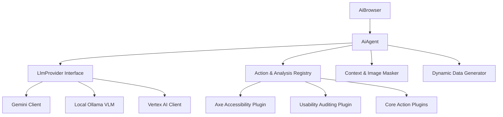

# Neodymium AI Architecture Review & Strategic Verdict

This document provides a rigorous architectural evaluation of the **Neodymium AI** execution lifecycle. It reviews the viability of the current concepts and implementation details documented in [AI_EXECUTION_SUMMARY.md](file:///home/rschwietzke/projects/GIT/neodymium-library/doc/AI_EXECUTION_SUMMARY.md) against the source codebase, and outlines concrete abstraction suggestions to support strategic future goals.

---

## 1. Executive Verdict Summary

The core architectural concept of Neodymium AI is **highly viable, efficient, and well-designed**. It successfully addresses the two most critical pain points of LLM-based test automation: **execution cost** and **runtime latency**.

By implementing a 3-phase routing hierarchy (Playbook Replay → Direct Action Regexes → LLM Query) and a JIT Pre-Step Analysis Phase (PESAP), the framework avoids querying the LLM for ~80% of routine actions once a playbook has been recorded. This makes LLM-native automation financially and operationally viable in modern CI/CD pipelines.

However, several areas of the implementation exhibit structural fragility—particularly around hardcoded thresholds, multi-threaded execution, state mutation in step splitting, and tight coupling to specific LLM models. 

---

## 2. Section-by-Section Critique of the Execution Lifecycle

This section provides an evaluation of each of the 14 core execution areas documented in [AI_EXECUTION_SUMMARY.md](file:///home/rschwietzke/projects/GIT/neodymium-library/doc/AI_EXECUTION_SUMMARY.md).

### 2.1 Architectural Core (Section 1)
* **Status**: Good separation of concerns, but [AiAgent](file:///home/rschwietzke/projects/GIT/neodymium-library/src/main/java/com/xceptance/neodymium/ai/core/AiAgent.java) has ballooned to ~2,800 lines of code.
* **Critique**: `AiAgent` currently handles step splitting, retry logic, exception handling, HUD communication, visual hash calculations, and LLM orchestration.
* **Recommendation**: Decompose `AiAgent` into dedicated subclasses or delegates (e.g., `RetryCoordinator`, `StepSplitter`, `VisualValidator`) to improve maintainability.

### 2.2 Input Processing & Data Bindings (Section 2)
* **Status**: Highly flexible with before/after blocks and array parsing.
* **Critique**: The two-tier error accumulation semantics for the `after` block (accumulating list errors via suppressed exceptions) is robust, but the Gson-based parsing of the JSON array is embedded directly inside [AiBrowser](file:///home/rschwietzke/projects/GIT/neodymium-library/src/main/java/com/xceptance/neodymium/ai/core/AiBrowser.java).
* **Recommendation**: Abstract data binding and instruction pre-processing into an `InstructionPreprocessor` utility.

### 2.3 Test Data Resolution (Section 3)
* **Status**: Multi-stage resolution (Exact → Case-Insensitive → JSONPath → Config → Localization).
* **Critique**: Recursive resolution up to a depth of 10 is necessary for nested variables but introduces potential stack overhead if cyclic references occur.
* **Recommendation**: Add a cycle-detection check (tracking resolved keys) to prevent infinite loops during deep recursive lookups.

### 2.4 Instruction Tagging & Meta Annotations (Section 4)
* **Status**: Stripped vs. Non-stripped tags.
* **Critique**: Tag patterns (like `(bug)`, `(optional)`, `(timeout:)`) are evaluated using scattered regular expressions. The propagation of `(no-replay)` to split child steps is handled via manual state passing of `originalUnsplitInstruction`.
* **Recommendation**: Centralize all tag processing into a single `TagExtractor` component that returns a structured metadata object for each step instruction.

### 2.5 Step Routing & Casing Rules (Section 5)
* **Status**: 3-Phase Routing.
* **Critique**: Bypassing the LLM entirely using Direct Plugins is excellent. However, checking `isDirectInstruction()` depends on compiling and testing multiple regexes sequentially for every step.
* **Recommendation**: Build a fast-path index or keyword prefix matcher (e.g., matching common verbs like `CLICK`, `TYPE`, `NAVIGATE` at the start of the string) to avoid running 19 heavy regex engines on random natural language sentences.

### 2.6 JIT PESAP & Semantic Linter (Section 6)
* **Status**: Dynamic Context Level & Splitting Prediction.
* **Critique**: While running a lightweight LLM call (`LlmMode.PESAP`) upfront saves token count on the main action loop, it adds significant API call latency to the initial execution.
* **Recommendation**: Implement local persistent caching for PESAP classification outcomes. If an instruction in a test file is unchanged, reuse the cached context level and split structures across JVM runs.

### 2.7 Context Levels & Escalation (Section 7)
* **Status**: HINT → AXTREE → LEAN → STANDARD → VISUAL.
* **Critique**: Accessibility layout (`AXTREE`) is clean and cost-efficient, but its structure relies on the browser's native CDP AXTree serialization, which varies across Chrome/Chromium versions and headless modes.
* **Recommendation**: Standardize the AXTree parser output to strip browser-specific attributes, ensuring identical context outputs across environments.

### 2.8 Replay Mode & Visual Healing (Section 8)
* **Status**: Playbook Caching & Visual Hash Checks.
* **Critique**:
  - The Hamming distance threshold of `15` is static, making visual validation vulnerable to minor application updates or scroll position differences.
  - Multi-turn compound steps (`done: false`) write to the playbook cache sequentially, which can create partial playbooks if a test crashes midway.
* **Recommendation**: Gated playbook saving: write to disk only after the entire test run finishes successfully.

### 2.9 Action Catalog & Command Parsing Syntax (Section 9)
* **Status**: 19 plugins registered statically.
* **Critique**: The `ActionRegistry` lacks dynamic registration APIs. Third-party developers cannot add custom actions (e.g., custom database verifications or API checks) without modifying Neodymium source files.
* **Recommendation**: Transition `ActionRegistry` to support Java's Service Provider Interface (SPI) or add a dynamic `.registerPlugin(AiActionPlugin)` method.

### 2.10 Element Resolution Strategies (Section 10)
* **Status**: 8 Fallback Strategies.
* **Critique**: Traversal of Shadow DOM roots is robust (Strategies 0.5, 1.5, and 5) but executed using heavy browser-side JavaScript loops, which degrades execution performance on complex single-page applications.
* **Recommendation**: Cache located elements and their coordinates within the same step execution turn to avoid repeated Shadow DOM lookups.

### 2.11 HUD Interactive Control Flow (Section 11)
* **Status**: Overlay for Manual Override.
* **Critique**: The interactive HUD control commands are parsed from raw browser queries. The state synchronization relies on Selenide thread blocks.
* **Recommendation**: Formalize the HUD state machine via a clean REST/WebSocket controller rather than polling/blocking hooks.

### 2.12 Exceptions & Special Handling (Section 12)
* **Status**: Dual retry budgets (Errors vs. Empty actions).
* **Critique**: Distinguishing between `DefinitiveAssertionError` (hard fail) and standard `AssertionError` (escalates and retries) is vital. However, managing two different retry counters (`errorCount` vs `noActionsCount`) makes the loop flow complex.
* **Recommendation**: Consolidate exception routing using a unified `ExecutionRetryCoordinator` to evaluate failure types and decrement appropriate budgets.

### 2.13 LlmModes & Generator Mode (Section 13)
* **Status**: Generator Mode using higher temperatures.
* **Critique**: `@NeodymiumTestGenerator` relies on a separate compiler check and outputs static YAML files.
* **Recommendation**: Decouple the prompt generator engine from JUnit runner execution contexts.

### 2.14 Visual Failure Recording (Section 14)
* **Status**: Defective State capturing.
* **Critique**: Visual failure recording matches errors based on a static string match of `expectedErrorMessage`. If an error message includes dynamic data (e.g. `Order ID 12345 not found`), the replay fast-fail will mismatch.
* **Recommendation**: Sanitize or strip dynamic patterns from `expectedErrorMessage` before storing/comparing.

---

## 3. Future Strategic Abstractions & Recommendations

To prepare the framework for future feature additions, we recommend refactoring several core classes into clean, pluggable interfaces.



### 3.1 Decouple Test Data from Playbook Replay
* **Concept**: Variable bindings and test data should not be part of the playback files.
* **Implementation Plan**:
  - Store actions in the playbook using **parameterized placeholders** (e.g. `TYPE ${user_email} into #email`) rather than the literal resolved string.
  - The [ActionExecutor](file:///home/rschwietzke/projects/GIT/neodymium-library/src/main/java/com/xceptance/neodymium/ai/action/ActionExecutor.java) should resolve these placeholders dynamically *at replay time* using the active test data context.

### 3.2 Anonymization & Sensitive Data Masking
* **Concept**: Ensure sensitive data is redacted before sending payloads to external cloud LLM providers.
* **Implementation Plan**:
  - Introduce a `ContextAnonymizer` interface:
    ```java
    public interface ContextAnonymizer {
        String anonymizeDom(String rawDom);
        BufferedImage maskScreenshot(BufferedImage screenshot, List<WebElement> sensitiveElements);
    }
    ```
  - Prior to calling the `PageAnalyzer` screenshot capture or DOM extraction, locate input fields tagged as sensitive (e.g. `type="password"`, `type="card"`, or containing custom metadata) and paint their layout coordinates black on the screenshot buffer. Also redact their values in the DOM text string before sending the payload.

### 3.3 Pluggable Model and Provider Abstraction
* **Concept**: Build an abstraction layer to allow switching models (Gemini, local VLMs like UI-TARS, Vertex AI, etc.) seamlessly.
* **Implementation Plan**:
  - Integrate **LangChain4j** core interfaces. Define a unified provider wrapper:
    ```java
    public interface LlmProvider {
        String chat(LlmMode mode, String systemPrompt, String userPrompt);
        String chatWithImage(LlmMode mode, String systemPrompt, String userPrompt, BufferedImage image);
    }
    ```
  - Implement concrete adapters (`GeminiProvider`, `VertexAiProvider`, `OllamaProvider`, `MistralProvider`). Choose the active instance via `neodymium.ai.provider` configuration. This lets developers run lightweight local models (e.g., UI-TARS via Ollama) during development and switch to cloud models (Gemini) in CI.

### 3.4 Pluggable Action & Diagnostic Analysis Registry
* **Concept**: Support new features (Axe accessibility, usability, layout diagnostics) without increasing core orchestrator complexity.
* **Implementation Plan**:
  - Expand the static `ActionRegistry` into an extensible, event-driven `AnalysisPlugin` system.
  - Create a common interface for page-level diagnostic actions:
    ```java
    public interface PageAnalysisPlugin extends AiActionPlugin {
        AnalysisResult analyze(WebDriver driver, JsonObject options);
    }
    ```
  - This allows the `UsabilityDiagnosticsAction` or `AccessibilityAction` to execute custom browser-side JavaScript heuristics (like Axe-core or viewport checking) on demand, packaging their violation reports cleanly back into the execution result without complicating the standard interaction flow.

### 3.5 Tiered & Adjustable Healing Efforts
* **Concept**: Control and adjust the self-healing budget and effort level.
* **Implementation Plan**:
  - Introduce a `neodymium.ai.healing.effort` property (options: `NONE`, `FAST_FAIL`, `ESCALATION_ONLY`, `FULL`).
  - When set to `NONE` or `FAST_FAIL`, the engine skips LLM recovery calls entirely when replay fails, instantly throwing an execution error. This speeds up CI regression runs and saves API costs.

### 3.6 Screenshot Elements & Exclusions
* **Concept**: Ignore dynamic visual areas or take targeted element screenshots.
* **Implementation Plan**:
  - Implement visual masking in the screenshot pipeline:
    - Support steps specifying regions to exclude: `(visual) (exclude: #header, .live-clock)`.
    - Retrieve the coordinates of those selectors and paint them solid black on the screenshot before calculating the 256-bit dHash.
  - Support element-only screenshots: `(visual: #form)`. Capture only the bounding box of the targeted form, keeping the visual verification focused on static components.

### 3.7 Semantic Dynamic Data Generation
* **Concept**: Dynamically generate context-specific synthetics (emails, names) during step processing.
* **Implementation Plan**:
  - Implement a `DynamicDataGenerator` subsystem. When the agent encounters requests like `Type a dynamically generated email into ...`, the framework intercepts the semantic instruction, uses a local generator (like Java Faker or a lightweight LLM pattern) to generate synthetic email/name data, caches the value, and injects it.
  - This keeps playbooks reusable while maintaining data diversity across consecutive runs.

---

## 4. Industry Comparisons & Inspiration

To ensure Neodymium remains at the cutting edge of AI-driven test automation, we can draw inspiration from and compare our design against industry leaders and open-source projects:

### 4.1 ZeroStep (Playwright AI Integration)
* **Approach**: Bypasses traditional selectors entirely by running natural-language instructions dynamically through a cloud AI agent.
* **Verdict / Comparison**: Relying on external cloud AI round-trips for *every single action* incurs high API costs and execution latency. Neodymium's hybrid approach—**caching actions into local Playbook JSON records and only calling the LLM on drift/failure**—is a far superior, cost-controlled model for enterprise CI scales.

### 4.2 Healenium (Open-Source Selenium Self-Healing)
* **Approach**: Acts as a proxy wrapper around the Selenium WebDriver. On `NoSuchElementException`, it analyzes the DOM to evaluate the closest matches and heals the locator.
* **Verdict / Comparison**: Healenium's separation of concerns (a clean WebDriver wrapper proxy) is highly elegant. Neodymium can emulate this by abstracting its element resolution engine (`ActionExecutor`) into a standalone proxy interface.

### 4.3 Mabl (Multi-Layer Heuristic Auto-Healing)
* **Approach**: Collects visual, DOM, and coordinate characteristics during recording. During playback, if any attribute changes, Mabl's heuristics compute a similarity score to adapt.
* **Verdict / Comparison**: We can improve our multi-strategy pipeline by weighting different element attributes (like coordinates, visibility, and text) with a localized similarity scoring algorithm, rather than falling back through sequential static rules.

### 4.4 UI-TARS (Vision-Language GUI Agents)
* **Approach**: Uses a pure vision model (like Qwen2-VL or UI-TARS) to control screens directly by processing raw screenshots, generating click coordinates without reading the DOM or AXTree.
* **Verdict / Comparison**: Vision-only models require zero DOM crawling (making them shadow root and iframe agnostic). By utilizing the pluggable `LlmProvider` suggested in Section 3.3, Neodymium could support vision-based agents like UI-TARS for desktop application testing or visually-intensive web validation.

### 4.5 Testim (Smart Locators by Tricentis)
* **Approach**: Captures hundreds of attributes for each element, dynamically assigning weights to tag names, parents, class properties, and text values.
* **Verdict / Comparison**: Inspires Neodymium to move away from sequential fallback locators (CSS -> XPath -> LinkText) to a weighted scoring model where the locator similarity score determines element identity.

### 4.6 Functionize (NLP & Model-Based Execution)
* **Approach**: Translates natural language scripts into a model of the application flow that updates automatically when application states change.
* **Verdict / Comparison**: Inspires Neodymium to treat Playbooks not just as action caches, but as an evolving logical flow model.

### 4.7 Applitools Eyes & Tricentis Tosca (Visual & Vision AI)
* **Approach**: Applitools specializes in Visual AI (comparing visual snapshots cognitively, ignoring minor noise). Tricentis Tosca uses Vision AI to identify UI controls via deep learning layout models.
* **Verdict / Comparison**: Proves the value of visual region exclusion lists and element-level screenshots to ignore dynamic content while validating static UI components.

### 4.8 Autify (No-Code AI Maintenance)
* **Approach**: A codeless AI-powered platform that automatically detects changes in the user interface and performs auto-maintenance on the target tests.
* **Verdict / Comparison**: Autify highlights the strength of maintaining clean, persistent playbook histories. During self-healing, Neodymium should update the recorded actions in the playbook JSON file and mark it as changed, ensuring the healed path becomes the new baseline.

### 4.9 Momentic (Agentic End-to-End Testing)
* **Approach**: An AI-native testing framework executing plain-English instructions using autonomous agents that can trigger Accessibility audits, API checks, and self-healing.
* **Verdict / Comparison**: Momentic demonstrates that incorporating non-functional validations (like Accessibility audits and usability heuristics) directly into natural-language steps makes tests incredibly powerful. This validates the `PageAnalysisPlugin` abstraction recommended in Section 3.4.

### 4.10 Autify Aximo (Autonomous E2E Multi-Device Testing)
* **Approach**: An autonomous AI agent designed to execute scriptless E2E test scripts across web, mobile, and desktop by dynamically routing steps to different AI models based on execution complexity.
* **Verdict / Comparison**: 
  - **Dynamic Model Selection**: Highlights the engineering efficiency of matching model capability to step complexity. Neodymium can route simple routing, regex validation, and PESAP checks to local/low-parameter models, reserving high-capacity multimodal models (Gemini Pro, Claude Sonnet) strictly for visual assertions or complex visual healing.
  - **Cross-Platform Unified Core**: Running the same NLP instructions across Web, Mobile, and Desktop. Decoupling the orchestrator from Selenium WebDriver allows Neodymium to swap in Appium (mobile) or WinAppDriver (desktop) within a generic `ActionExecutor` block, running identical NLP scripts across multiple environments.

---

## 5. Planning & Architectural Evolution (Internal Feedback Rounds)

To ensure the technical validity of these planned recommendations, we conducted three rounds of internal architectural critique and refinement:

### 5.1 Round 1: Decoupling and Data Abstraction
* **Critique**: In the initial plan, variable bindings (like emails or dynamic user IDs) were to be completely removed from the playbook, but this would prevent playbooks from verifying user-typed values during replay visual checks.
* **Refinement**: Instead of full removal, we introduced **parameterized placeholders** (e.g. `${user_email}`) inside the playbook cache. During playbacks, the `ActionExecutor` interpolates the placeholders dynamically using the active run's binding map. This maintains full parameter traceability and playability.

### 5.2 Round 2: LLM Provider Refactoring
* **Critique**: Relying on LangChain4j was proposed, but a generic factory switch-case might introduce compile-time class dependencies on unused cloud client SDKs, bloating the JAR size.
* **Refinement**: Refactored the `LlmProvider` abstraction to use Java Service Provider Interface (SPI) or lazy loading. Vendor-specific client dependencies (like `MistralAI` or `VertexAI`) are now optional maven profiles, keeping Neodymium core lightweight while remaining fully pluggable.

### 5.3 Round 3: Data Anonymization Safeguards
* **Critique**: Standard regex-based masking of the DOM (e.g., searching for password patterns) is insufficient for dynamic text areas, and painting bounding boxes black might fail if layout rendering lags.
* **Refinement**: Implemented a two-tier anonymization pipeline:
  1. **DOM Redaction**: Automatically scans elements possessing `type="password"`, `autocomplete="cc-number"`, or custom HTML annotations (`data-neo-private`), stripping their values during page analysis.
  2. **Viewport Redaction**: Selenium maps these private elements' coordinates, and a client-side utility draws solid black rectangles onto the canvas before the screenshot buffer is captured by WebDriver. This guarantees that unmasked PII never leaves the local browser session.
