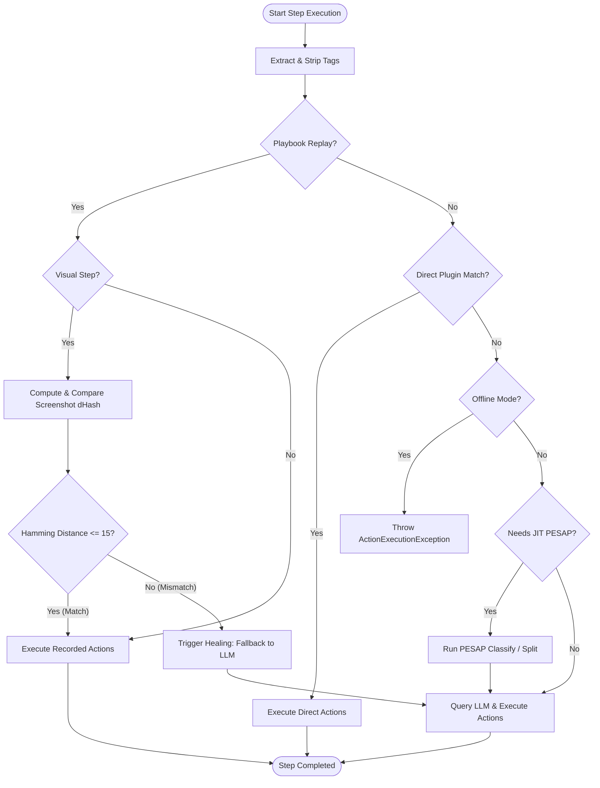
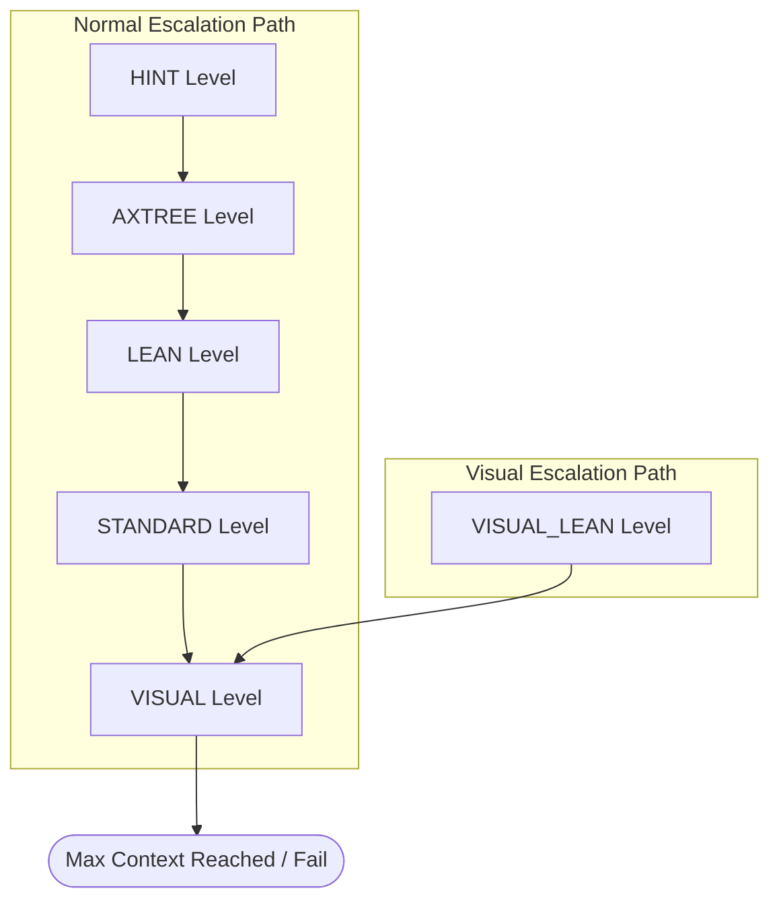
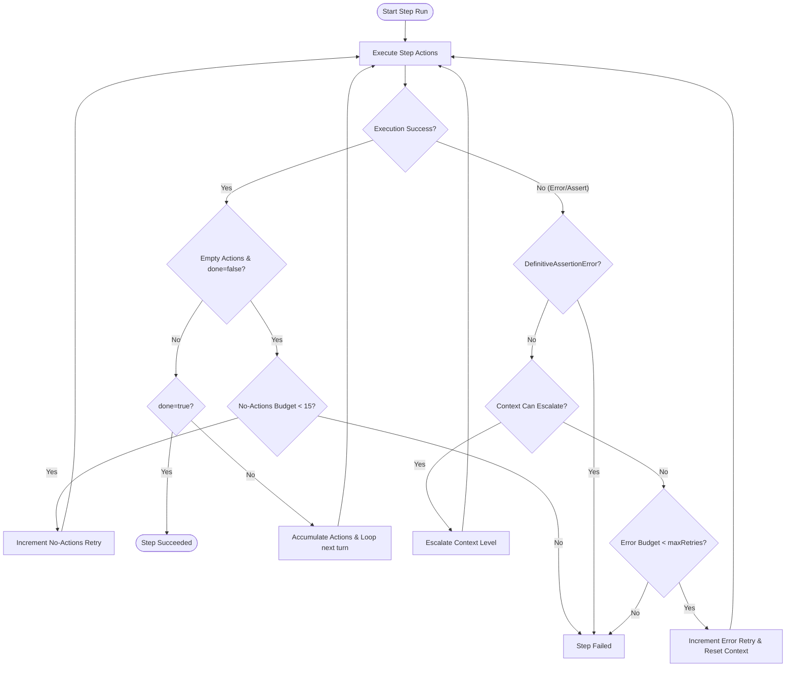

# Neodymium AI Execution Summary

This document provides a comprehensive overview of the lifecycle of an AI test execution in Neodymium. It details everything from parsing the initial test data and instructions, to resolving elements on the page, interacting with the LLM, maintaining playbooks, and managing interactive control flows.

---

## 1. Architectural Core

The AI engine in Neodymium relies on several key components coordinating closely:

- **`AiBrowser`**: The user-facing entry point, managing the execution lifecycle (`AutoCloseable`). It binds configuration data (`steps`, `before`, `after`, `systemContext`), handles test data resolution, and instantiates the orchestrator.
- **`AiAgent`**: The core orchestration engine. It splits instructions, manages the main execution loop, extracts step tags, initiates pre-step analysis (PESAP), coordinates replay vs. recording mode, handles context escalation, enforces retry budgets, orchestrates HUD interaction, and manages playbook persistence.
- **`PageAnalyzer`**: Responsible for capturing the DOM state at the specified `ContextLevel` (ranging from zero-element hints to visual screenshots). It uses JS extraction and CDP Accessibility Trees (AXTree), including recursive iframe crawling and Shadow DOM traversal.
- **`ActionExecutor`**: Translates structured AI actions into physical browser interactions. It resolves target elements using a robust multi-strategy pipeline (Strategies 0–5), handles frame and window context switching, interpolates dynamic variables, and delegates physical interactions to plugins.
- **`ActionParser`**: Parses JSON outputs from the LLM, extracting structured action definitions, reading reasoning logs, and inspecting flags like `success`, `done`, and `escalate`.
- **`PlaybookManager` / `Playbook`**: Manages JSON-based persistent playbooks (`.json` files via Gson serialization). Playbooks track `isRecording()` state vs. replay mode, step cursors, and dirty flags (`isChanged()`) to save state gracefully on exit. Saving is gated behind `neodymium.ai.playbookRecordEnabled`; when disabled, `savePlaybook()` silently skips persistence.
- **`LlmClient`**: Handles HTTP API communication with the underlying model.
- **`ActionRegistry`**: A static registry that maintains the active `AiActionPlugin` implementations (e.g., Click, Type, Assert).

---

## 2. Input Processing & Data Bindings

Instructions provided to the `AiBrowser` undergo significant preprocessing before any interaction occurs.

### 2.1 Instruction Splitting
Multi-line instruction blocks are split by line using `splitInstructions()`. Each line is stripped of leading/trailing whitespace. Empty lines and comment lines (starting with `#` or `//`) are completely ignored.

### 2.2 `before` and `after` Blocks
The `execute()` method accepts optional `before` and `after` blocks.
- These can be defined as a plain string or a **JSON array of strings**.
- Each string entry is executed as a standalone `execute()` pass.
- The `after` block uses **two-tier error accumulation semantics**:
  - **Outer tier**: If the main test fails, errors from the `after` block are attached as suppressed exceptions to the main error. Only if the main test passes will an error in the `after` block bubble up directly.
  - **Inner tier**: When `after` is a JSON array, individual items within the array are also accumulated. If multiple `after` items fail, only the first error is thrown and subsequent failures are attached via `addSuppressed()`. This ensures all after-steps execute even if earlier ones fail.

### 2.3 `random` Key Auto-Injection
When `execute()` is called without specific data context, it auto-injects a `random` key into the test data map. This key holds an 8-character UUID substring, useful for generating unique emails or order IDs without manual setup.

### 2.4 Source File Metadata
During execution, `TestDataUtils` injects `neodymium.sourceFile` and `neodymium.stepLineNumbers`. These metadata properties trace instructions back to their origin files (e.g., YAML data sheets) for improved error messaging and linter output.

---

## 3. Test Data Resolution

Data placeholders in the format `${key}` are resolved into concrete strings via `AiBrowser.resolveTestDataToPrompt`. This resolution is multi-staged and recursive:

1. **Exact Match**: Checks `Neodymium.getData()` using a case-sensitive lookup.
2. **Case-Insensitive Match**: Stream searches `TestData.entrySet()` for a case-insensitive key match.
3. **JSONPath Query**: If the key contains `.` or `[`, it is treated as a JSONPath expression (automatically prefixed with `$.` if omitted) and queried against the test data structure.
4. **Owner Configuration**: Falls back to global Neodymium configurations (e.g., `neodymium.properties`).
5. **Recursive Resolution**: If the resolved value itself contains `${...}`, the placeholders are resolved recursively (up to a depth limit of 10). If the recursion depth exceeds 10, the resolution loops stop and return `null` (leaving the placeholder unresolved).
6. **Localization**: Evaluates the resolved string using `Neodymium.tryLocalizedText(value)`. If a localization key matches, it is replaced by the locale-specific text.
7. **Fallback**: If no source can resolve the key, the original literal `${key}` remains untouched.

Lookup trails are optionally logged for debug reporting, tracking the key, resolved value, localization status, and source.

---

## 4. Instruction Tagging & Meta Annotations

Instructions can contain special tags that alter the engine's behavior. Tags are extracted from the raw string *before* the prompt is processed.

### 4.1 Stripped Tags
These tags dictate engine logic and are removed (stripped) from the text via `stripAllTags()` before it reaches the LLM or direct parsers. The stripping is performed by 4 registered `STRIP_PATTERNS` applied sequentially:

- `(bug)` or `(bug: <id>)`: Marks an **Expected Failure**. The engine verifies that the step fails.
- `(optional)` or `(soft)`: Bypasses execution errors gracefully. The step failure is logged as a warning, and execution continues.
- `(timeout: <value><unit>)`: Dynamically overrides the `Configuration.timeout` for element searches within this step (e.g., `(timeout: 5s)`).
- `(no-replay)`: Instructs the engine to completely bypass the playbook cache for this specific step. The step is always evaluated live via Direct Plugins or the LLM. **Inheritance**: If a step is split (by PESAP or LLM), the `(no-replay)` tag is also checked against the `originalUnsplitInstruction`, meaning all child sub-steps inherit the no-replay behavior from their parent compound step.

### 4.2 Non-Stripped Tags
These tags are passed through directly to the LLM because they either require LLM interpretation or only affect pre-flight settings:

- `(visual)`: Instructs the agent to start the evaluation at the `VISUAL_LEAN` context level, injecting a screenshot into the LLM prompt.
- `(layout)`: Does **NOT** affect the initial context level. It acts as an alias for `(visual)` only when a step fails. If a step fails, this tag instructs the engine to capture the defective state screenshot dHash.
- `(hint: <locator>)`: Instructs the agent to start at the `HINT` context level (0 elements sent). The locator string is first attempted via the **Direct Plugin** pipeline; many hint steps (e.g., `(hint: #loginBtn) CLICK`) are resolved entirely without calling the LLM. Only if direct parsing fails does the engine escalate to an LLM query with the hint context.

---

## 5. Step Routing & Casing Rules

After tag extraction and placeholder interpolation, an instruction is routed through a 3-phase pipeline:

### Phase 1: Playbook Replay Check
If a playbook exists and is not actively recording, the engine checks if the current step aligns with the cached playbook. A step aligns if:
- It hasn't failed previously.
- Its `promptLine` exactly matches the playbook's recorded prompt.
- It lacks the `(no-replay)` tag.

If it aligns, the recorded actions are replayed immediately. If the step is visual, a visual hash check (dHash Hamming distance ≤ 15) is also performed.

### Phase 2: Direct Plugin Parsing
If replay is skipped, the engine attempts to bypass the LLM entirely using Direct Plugins. 
`isDirectInstruction()` passes the text to each `AiActionPlugin` and runs their respective regular expression matchers sequentially. If any plugin's regex successfully extracts structured actions from the text (e.g., `CLICK the "Login" button`), the LLM call is bypassed.

### Phase 3: LLM Query
If neither replay nor direct parsing succeeds, the engine triggers an LLM query, packaging the instruction alongside the current DOM Context and optionally a screenshot.

### Offline Mode (`neodymium.ai.offline`)
When the JVM property `neodymium.ai.offline=true` is set, any attempt to query the LLM (Phase 3) or run PESAP pre-analysis throws an `ActionExecutionException`. This forces all steps to resolve through Playbook Replay (Phase 1) or Direct Plugins (Phase 2) only. Useful for CI environments where deterministic, API-free execution is required.

---

## 6. JIT PESAP & Semantic Linter

To optimize LLM usage and prevent ambiguous prompts, two analysis phases occur prior to execution.

### 6.1 JIT Pre-Step PESAP (Pre-Execution Static Analysis Phase)
When the playbook is recording a non-direct step, it is sent to a secondary, lightweight LLM prompt (`LlmMode.PESAP`).
- **Context Window**: Evaluates a rolling window of 4 steps (1 previous, current, 2 future).
- **Classification**: Determines the minimum required `ContextLevel` (`AXTREE`, `LEAN`, `STANDARD`, etc.).
- **Java Detection**: Identifies if the step likely requires a custom Java validation method.
- **Step Splitting**: If a single instruction represents a complex multi-stage interaction (e.g., "fill the form and submit it"), PESAP suggests splitting it. The engine breaks the step into a sequence of smaller steps, storing the `originalUnsplitInstruction` for traceability.

**PESAP Bypass Rules**: PESAP is only triggered for steps whose initial `baseLevel` is `AXTREE` (the default). Steps tagged with `(hint:)` (base level `HINT`) or `(visual)` (base level `VISUAL_LEAN`) skip PESAP entirely because their context is already explicitly determined by the tag. Additionally, recovery attempts (retries after failure) do not re-trigger PESAP.

**Deduplication**: The engine tracks an `alreadySplitSteps` set and a `needsPesap` flag to prevent re-running PESAP on steps that were themselves produced by a prior PESAP split. This avoids infinite split loops.

PESAP custom rules are injected via `CustomRulesLoader`, which respects thread-local overrides, config properties, and filesystem/classpath fallbacks (`pesap-custom-rules.md`).

### 6.2 Offline Semantic Linter (`StepLinter`)
An offline, regex-based linter that warns users of ambiguous instructions without calling an API. It checks for:
1. **Lacking Element Targeting**: Generic commands like "click the button" without specifying a label. Steps with `(hint:)` or `(selector:)` tags are exempt from this check.
2. **Missing Input Values**: "Type into the email field" without providing the quoted string to type.
3. **Vague Actions**: "Check everything" or "verify the page".

---

## 7. Context Levels & Escalation

The engine dynamically adjusts the amount of DOM context sent to the LLM to save tokens and improve focus.

### 7.1 Context Levels
| Level | DOM Content Included | Screenshot | Use Case |
|-------|----------------------|------------|----------|
| `HINT` | Zero elements | No | Explicit locator provided via `(hint: ...)` |
| `AXTREE` | Accessibility tree layout (CDP) | No | **Default level**. Ultra-low token structure overview |
| `LEAN` | Interactive elements only (links, inputs, buttons) | No | Standard interactions (~80% of steps) |
| `STANDARD` | LEAN + all visible text content | No | Complex assertions and verifications |
| `VISUAL_LEAN`| LEAN + screenshot | Yes | `(visual)` tag default starting point |
| `VISUAL` | STANDARD + screenshot | Yes | Maximum context (Multimodal fallback) |

### 7.2 Escalation Chain
If a step fails or the LLM requests more information, the context is escalated. There are two independent escalation paths:

**Normal path**: `HINT → AXTREE → LEAN → STANDARD → VISUAL → null (max)`
**Visual path**: `VISUAL_LEAN → VISUAL → null (max)`

The `VISUAL_LEAN` level is only reachable via the `(visual)` tag (never through normal escalation). `STANDARD` escalates directly to `VISUAL`, skipping `VISUAL_LEAN` entirely.

Escalation is triggered by two independent sources:
1. **Error-Triggered**: A physical interaction fails (`ActionExecutionException`).
2. **LLM-Requested**: The LLM parses the DOM and determines it cannot confidently execute the action. It sets the `escalate` flag in its JSON response.

*Note: Escalation attempts do NOT consume the standard retry budget.*

---

## 8. Replay Mode & Visual Healing

The `PlaybookManager` caches LLM responses to `.json` files (Gson-serialized), allowing subsequent executions to bypass the AI completely. Playbook persistence is controlled by the `neodymium.ai.playbookRecordEnabled` configuration flag; when disabled, `savePlaybook()` silently skips writing.

### 8.1 Playbook Replay & Hash Verification
When executing from a Playbook, the engine checks the `screenshotHash` stored for that step.
- Current viewport screenshot is captured and a dHash is computed.
- The Hamming distance between the recorded dHash and the live dHash is calculated.
- If **Distance ≤ 15**, the visual layout is considered identical, and actions are replayed.
- If **Distance > 15**, a layout shift occurred, triggering a visual mismatch failure.

### 8.2 Defective State Fast-Fail
Playbooks can memorize states that are known to be defective (e.g., an application bug). If a step possesses a `screenshotHash` and an `expectedErrorMessage`, the engine checks the live dHash. If it matches the defective state (Distance ≤ 15), it throws the recorded error immediately, saving execution time.

### 8.3 Healing & Compound Steps
If replay fails (due to element not found or visual mismatch), the engine "heals" the step. It falls back to calling the LLM with the error context. Once the LLM provides valid actions, the playbook is updated with the new `healedContextLevel` and actions.

If an action requires multiple LLM round-trips to complete (LLM returns `done: false`), the engine accumulates these "compound actions" and updates the playbook sequentially.

---

## 9. Action Catalog & Command Parsing Syntax

The `ActionRegistry` holds 19 built-in `AiActionPlugin` implementations. These plugins expose direct-parse regexes and handle the physical execution of LLM JSON output.

| Plugin | Direct Regex Target | Key Behavior |
|--------|---------------------|--------------|
| `NAVIGATE` / `OPEN`| `^(?:OPEN\|NAVIGATE)\s+(?<url>\S+?) ...$` | URL navigation. Supports Basic Auth injection. |
| `CLICK` | `^CLICK\s+(.+)$` | Clicks target. Fallback JS click for hidden inputs. |
| `TYPE` | `^TYPE\s+(?:"([^"]*)"\|([^"]+?))\s+(?i)into\s+(.+)$` | Clears and sends keys. Supports quoted/unquoted values. |
| `SELECT` | `^SELECT\s+(?:"([^\\"]*)"\|([^\\"]+?))\s+(?i)in\s+(.+)$` | Selects dropdowns by visible text. |
| `CLEAR` | `^CLEAR\s+(.+)$` | Clears input field content. |
| `HOVER` | `^HOVER\s+(.+)$` | Performs a mouse hover via Actions API. |
| `WAIT` | `^WAIT\s+(?<value>\d+(?:\.\d+)?)(?<unit>s\|ms)?$` | Sleeps (if empty target) or waits for target visibility. |
| `SCROLL` | `^SCROLL\s+(.+)$` | Scrolls to element, or up/down direction. |
| `KEY_PRESS` | `^KEYPRESS\s+(.+)$` | Maps named keys (`Ctrl+A`, `Enter`) to WebDriver Keys. |
| `BACK` | `^BACK$` | Browser history backward navigation. |
| `FORWARD` | `^FORWARD$` | Browser history forward navigation. |
| `REFRESH` | `^REFRESH$` | Refreshes current page. |
| `CLEAR_COOKIES`| `^CLEAR_COOKIES$` | Deletes all WebDriver cookies. |
| `JAVA_METHOD` | `(?i)java:\s*([a-zA-Z_0-9]*)(?:\(\s*([^)]*)\s*\))?`| Invokes custom validation methods via Reflection. |
| `STORE` | *LLM-Only* | Stores runtime variables back to `Neodymium.getData()`. |
| `BRANCH` | *LLM-Only* | Evaluates JS conditions, branching execution logic. |
| `ASSERT` | *LLM-Only* | Complex URL, DOM, visibility, text, and Regex checks. |
| `SPLIT` | *LLM-Only* | Dynamically splits the prompt step at runtime. |
| `CHECK` | *LLM-Only* | Checks or unchecks checkboxes and radio buttons. |

**Runtime SPLIT Behavior**: When the LLM issues a `SPLIT` action, preceding actions execute immediately. The remainder of the instruction string is formatted (cleaning up conjunctions like "and then") and inserted dynamically as the *next* logical test step.

**Variable Interpolation**: `ActionExecutor.interpolate()` resolves `${key}` placeholders within LLM-generated actions against variables created by `STORE`, allowing data flow across steps.

---

## 10. Element Resolution Strategies

`ActionExecutor` attempts to locate targeted elements utilizing 8 distinct strategies, falling back progressively.

| Strategy | Trigger | Mechanism |
|----------|---------|-----------|
| **0** | `^xc_.*` | Neodymium ID injection via `[data-neo-ref]`. Fallback deep Shadow DOM query. |
| **0.2** | `parentText=` | Locates interactive elements by matching text within their parent hierarchy. |
| **0.5** | `::shadow` | Follows explicit Shadow DOM host chains. |
| **Title**| `document.title`| Queries `head > title`. |
| **1** | Always | Standard `By.cssSelector()`. |
| **1.5** | Always | Recursive `querySelectorAll` injected via JS into all Shadow Roots. |
| **2** | `^/` or `^(` | Validated XPath extraction (`By.xpath()`). |
| **3** | Always | Exact and partial match via `By.linkText()`. |
| **4** | Always | Robust XPath searching `text()`, `@value`, and `@aria-label`. |
| **5** | Always | Deep Shadow DOM text traversal, scoring partial matches by length. |

**Hallucination Cleanup**: The AI often hallucinates locator formats. `cleanTarget()` sanitizes targets by stripping `#xc_`, `xpath=`, `css=`, and unwrapping raw `data-neo-ref=` attribute syntax.

**Frame/Window Switching**: Handled inline via `<window_handle>:<frame_path>` IDs. Maps stale window handles dynamically (`windowHandleMapping`), and parses nested iframes via CSS paths (`iframe >>> .child`) or indices (`0.1`).

---

## 11. HUD Interactive Control Flow

When `neodymium.ai.interactive=true`, an interactive UI overlay (HUD) is injected into the browser, permitting manual override of step execution.

- `APPROVE`: Proceed with actions.
- `SKIP`: Exclude step from playbook and continue. Marks playbook as recording.
- `REWIND`: Reverts playbook cursor backwards to re-execute previous steps.
- `ADD`: Inject a brand new natural-language step inline. Marks playbook as recording.
- `EDIT`: Replaces the current instruction string. Supports injecting test variables via an updated bindings map.
- `SAVE_EXIT`: Truncates playbook from current point forward, persists JSON, and halts.
- `DUMP`: Outputs AXTree, DOM, and LLM context strings to a temporary debug file without advancing execution.

**Auto-Skip**: Set via toggle. When enabled, execution fast-forwards until an error occurs or an index listed in the `Breakpoints` collection is reached.

---

## 12. Exceptions & Special Handling

Various error states dictate the execution recovery loop.

- `ActionExecutionException`: An element was not found or an interaction failed. Triggers context escalation or standard retry loop (budget: `neodymium.ai.agent.maxRetries`).
- `AssertionError`: Standard assertion failure. Also triggers the retry/escalation loop.
- `DefinitiveAssertionError`: Triggered when the LLM reports `success=false` but `done=true`. This signifies a hard failure. **It prevents all retries and escalations.**
- `ExpectedFailureAbortException`: Thrown intentionally when a step marked with `(bug)` successfully fails as expected.
- `HudActionException`: Internal control-flow exception modifying the step loop based on HUD interaction.
- `AiAgentException`: Wraps unexpected fatal JVM exceptions.

### Retry Budgets
Two independent retry counters exist:
1. **Error Retries**: Capped by `neodymium.ai.agent.maxRetries` (configurable). Consumed when an action execution or assertion fails.
2. **No-Actions Retries**: Capped by `NO_ACTIONS_MAX_RETRIES = 15` (hardcoded). Consumed when the LLM returns an empty actions array but `done=false`. This prevents infinite loops when the model struggles to produce valid actions without technically "failing".

---

## 13. LlmModes & Generator Mode

The API interacts with models using distinct operational modes (`LlmMode`):
- `AGENT`: Standard deterministic test execution.
- `GENERATOR`: Used for `@NeodymiumTestGenerator`. Sets higher temperatures for exploratory prompt generation based on SUT context.
- `PESAP`: Low-latency classification mode for pre-step analysis.
- `ASSERT`: Isolated verification mode.

When using `@NeodymiumTestGenerator`, `AiBrowser.generatePrompt` automatically resolves the target application URL, computes the test package output path, and outputs a complete YAML prompt file.

---

## 14. Visual Failure Recording

If a playbook is actively recording and a non-recoverable failure happens, the engine investigates the step tags.
If the step possesses a `(visual)` or `(layout)` tag, or its context escalated to `VISUAL` during execution:
1. It records the precise Exception class as `expectedErrorType`.
2. It captures the Exception message as `expectedErrorMessage`.
3. It takes a screenshot of the defective state and computes the dHash.

This allows subsequent replay runs to visually fast-fail the moment this known defective state is encountered.
