# Neodymium AI: Unified Waiting & Stability Architecture

## 1. Executive Summary & Problem Formulation

In modern Single Page Applications (SPAs) and Progressive Web Apps (PWAs) like the Verla testbeds, UI interactions trigger non-blocking asynchronous state cascades:
```text
Interaction (Click) ──► Optimistic DOM Update ──► Async Fetch/XHR ──► Skeleton/Spinner ──► Final Hydration ──► CSS Animation Settling
```

### The Decoupled Step Challenge
In the Neodymium Playbook paradigm, **steps are completely decoupled**:
- When **Step $N$** executes an action (e.g. `CLICK #add-to-cart`), the engine has **zero advance knowledge** of what **Step $N+1$** will be.
- Step $N+1$ could be:
  1. An **Element Interaction** (e.g., typing into an input that may not yet exist).
  2. An **Element Assertion** (e.g., checking that a cart count badge equals `"1"`).
  3. A **Visual Verification** (e.g., `(visual)` full-page snapshot comparison).

### Why Naive Approaches Fail
1. **Fixed Sleeps (`Thread.sleep`)**: Add dead latency, brittle assumptions, and still fail under heavy CI or slow network load.
2. **`document.readyState === 'complete'`**: Useless for SPAs/PWAs; the document remains in the `complete` state across all client-side routing, DOM mutations, and API requests.
3. **Framework Hooks (`htmx.isSettled()`)**: Brittle, application-specific, and fail when generic Fetch/XHR, React state updates, or CSS micro-animations occur.
4. **Tight Screenshot Polling**: Repeatedly capturing full-viewport screenshots (every 50–100ms) starves the browser GPU, blocks the compositor, and drastically slows down test runs.

---

## 2. The Dual-Paradigm Architecture

Neodymium AI handles waiting and stability through two distinct execution pipelines:

```mermaid
flowchart TD
    subgraph LiveMode ["1. Live Recording & Authoring Mode (AI Discovery)"]
        LiveAction["Execute Action (Click / Type)"] --> DomQuiet["In-Memory DOM Quiescence Probe<br/>(MutationObserver 150-200ms + rAF flush)"]
        DomQuiet --> StateCapture["Capture Settled DOM & Clean Screenshot"]
        StateCapture --> LLMPrompt["LLM Next Step Inference"]
        LLMPrompt --> WaitHandle{"Transient Loading / Spinner Detected?"}
        WaitHandle -- Yes --> EmitWait["Agent Emits WAIT / SUT Settling Protocol"]
        WaitHandle -- No --> ExtractAction["Extract Next Action / Assertion"]
        ExtractAction --> JudgeCheck{"@AiJudge Active?"}
        JudgeCheck -- Yes --> QualityJudge["Quality Judge LLM Evaluation<br/>(Locator stability scoring & ambiguity check)"]
        JudgeCheck -- No --> ExecuteStep["Execute Step on Live Target"]
        QualityJudge --> ExecuteStep
    end

    subgraph ReplayMode ["2. Machine-Speed Replay Mode (Deterministic Execution)"]
        StepType{"Next Step Type in Playbook"}
        
        StepType -- "DOM Element (Click / Type / Assert)" --> SelenidePolling["Selenide Native Polling Engine<br/>• 4-second condition polling (shouldBe / shouldHave)<br/>• Fast querySelector (0 GPU overhead)<br/>• Auto-retries StaleElementReferenceException"]
        
        StepType -- "Visual Step (visual / visual: full)" --> VisualPipeline["3-Tier Zero-GPU Visual Matcher"]
        
        VisualPipeline --> V_Tier1["Tier 1: In-Memory Pre-Flight<br/>• waitForDomQuiet(200ms)<br/>• Double requestAnimationFrame"]
        V_Tier1 --> V_Tier2["Tier 2: Single-Shot Baseline Frame Capture<br/>• Capture Frame 1<br/>• In-memory SSIM >= 0.99 check against baseline"]
        V_Tier2 --> V_Pass{"SSIM >= 0.99?"}
        V_Pass -- "Yes (95% of runs)" --> PassInstant["✅ Instant Pass (Only 1 screenshot taken)"]
        V_Pass -- "No" --> V_Tier3["Tier 3: Sparse Fallback Retry (Max 1)<br/>• Pause 500ms settling window<br/>• Capture Frame 2 & final compare"]
        V_Tier3 --> FinalOutcome{"Pass or Conclusive Defect"}
    end
```



---

## 3. Core Principles & Key Decisions

### Principle A: "Wait for Element" is an Assertion with Polling
- Semantic intent analysis revealed that *"Wait for element X to appear"* is identical in execution mechanism to `ASSERT`.
- Polling for element visibility/presence is handled automatically by the assertion layer; standalone temporal delays should never be created for DOM element presence.

### Principle B: Element Steps Delegate 100% to Selenide's Polling Loop
- In Replay mode, element actions do not need artificial pre-sleeps.
- Methods like `SelenideElement.shouldBe(Condition.visible)` and `shouldHave(Condition.text(...))` continuously evaluate in-browser `querySelector` expressions every $\sim 100\text{ms}$ up to the configured timeout (default: 4000ms).
- This naturally absorbs network jitter, optimistic render delays, and DOM mutations at zero GPU cost.

### Principle C: Visual Steps Use In-Memory Pre-Flight & Sparse Screenshotting
- Visual steps have no target element locator to query.
- Instead of brute-force screenshot polling:
  1. **Pre-flight in JS**: Ensure mutations have ceased and the event loop has flushed via double `requestAnimationFrame` ($< 2\text{ms}$, 0 GPU load).
  2. **Single-shot baseline capture**: Take Frame 1. In $>95\%$ of runs, the pre-flight guarantees the page is settled, matching baseline on the first attempt.
  3. **Sparse retry**: At most 1 additional frame capture after a 500ms grace period for long CSS animations.

### Principle D: Persistent CSS Element Masking Lifecycle
- Dynamic non-deterministic elements (timestamps, random session IDs) masked via CSS blackening maintain active `<style>` tags for the entire measurement session rather than injecting and removing rules per frame, preventing visual screen flickering.

---

## 4. Upfront Playbook Quality & Timing Linting (`PlaybookLinter`)

To prevent timing anomalies before test execution begins, `PlaybookLinter` performs static analysis of all playbook instructions (via `@AiLinter` or `ExecutionMode.LINTER_ONLY`):

| Quality Category | Impact on Timing & Waiting | Recommended Resolution |
| :--- | :--- | :--- |
| **`STEP_SPLITTING_CANDIDATE`** | Compound steps (e.g. `Click 'Submit' and verify banner`) prevent Selenide from establishing clean polling bounds. | Split into discrete atomic steps (`1. Click 'Submit'`, `2. Verify banner is visible`). |
| **`MISSING_VISUAL_TAG`** | Visual assertions (layout, styling, badge positions) missing `(visual)` tags cause brittle DOM selector matching. | Append `(visual)` or `(visual: full)` to trigger the 3-Tier Visual Engine. |
| **`TEMPORAL_FLOW_ANOMALY`** | Inverted instruction sequences (e.g. interacting with a modal before opening it) cause premature timeout failures. | Reorder steps to follow natural user flow. |
| **`HARDCODED_VOLATILE_DATA`** | Dynamic timestamps or transient IDs in assertions fail due to non-deterministic values. | Replace with parameterized `${...}` variables. |

---

## 5. Second-Opinion Stability Evaluation (`@AiJudge`)

When enabled via `@AiJudge(true)` or `neodymium.ai.judge.enabled=true`:
- `QualityJudgeStep` evaluates proposed actions and candidate locators from the primary LLM against the full DOM context.
- Candidate locators are scored for stability, uniqueness, and absence of volatile hash classes (e.g., `#v-btn-123` or `.css-1a2b3c`).
- If the primary locator has stability risks, the Judge promotes a more resilient candidate (e.g., semantic attributes, stable data tags) before execution.

---

## 6. Architectural Component Mapping

| Subsystem / Layer | Component / File | Primary Responsibility |
| :--- | :--- | :--- |
| **DOM Quiescence Helper** | `DomQuiescenceWatcher.java` / JS Script | Injects zero-overhead in-memory mutation observer and `requestAnimationFrame` flushes before state captures. |
| **Live State Capture** | `VisualStabilityDetector.java` | Coordinates frame settling and visual baseline validation with bounded retries. |
| **Replay Element Execution** | `SelenideElementFinder.java` & Action Plugins | Executes DOM interactions and assertions with Selenide's native condition polling and stale-reference resilience. |
| **Visual Step Runner** | `VisualAssertionStep.java` | Implements the 3-tier Zero-GPU pre-flight and sparse 1-retry visual comparison pipeline. |
| **Agent Prompt Protocol** | `action-extraction-prompt.md` & `ExecuteActionsStep.java` | Recognizes transient loading states and manages safe recovery loops during live authoring. |
| **Pre-Flight Linter** | `PlaybookLinter.java` & `playbook-linter-prompt.md` | Audits instructions upfront for timing, splitting, and modality anti-patterns. |
| **Quality Judge** | `QualityJudgeStep.java` & `quality-judge-prompt.md` | Evaluates locator stability and ambiguity before live execution. |
