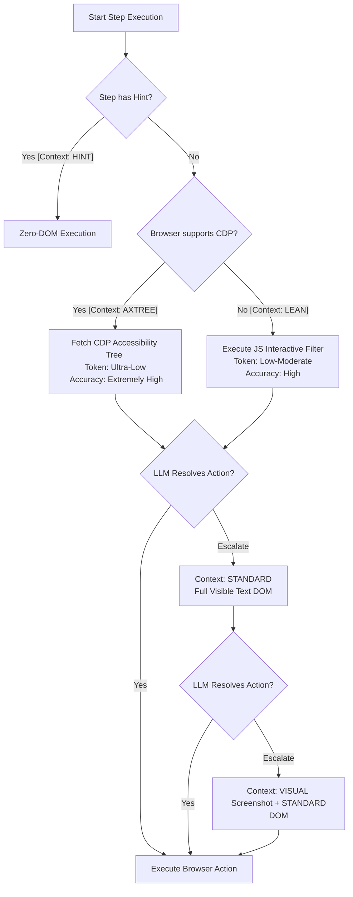

# Proposal: Integrating Chrome Accessibility Tree (AXTree) into Neodymium AI Fallback Levels

This proposal outlines the integration of the **Chrome Accessibility Tree (AXTree)** as a core, semantic middle-tier in Neodymium AI’s escalating context framework. 

By leveraging browser-native accessibility APIs, Neodymium can achieve greater token efficiency, superior semantic element resolution, and native Shadow DOM/iframe support.

---

## 🗺️ Refactored Context Escalation Flow



---

## ⚖️ Technical Evaluation: Does It Make Sense?

**Absolutely.** Integrating the AXTree provides a major architectural leap over pure DOM filtering. Rather than using complex, custom JavaScript heuristics to guess which elements are interactive, we delegate this task directly to the browser's native rendering engine.

### 🌟 Key Benefits

1.  **Implicit accessible Name Resolution (The Labeling Problem):**
    *   *Traditional DOM:* To link an `<input>` with its `<label>`, the framework must parse the `for` attribute, evaluate adjacent text siblings, or search parent nodes.
    *   *AXTree:* The browser automatically resolves the accessible name incorporating standard labels, `aria-label`, `aria-labelledby`, and placeholder attributes into a single, clean attribute: `name: "Search catalog"`.
2.  **Native Shadow DOM & Iframe Piercing:**
    *   Web components utilizing closed/open Shadow DOMs or nested iframes are notorious for breaking standard DOM traversal. 
    *   The browser's accessibility engine automatically flattens and normalizes these nested structures when exposing the AXTree, providing seamless, zero-config traversal.
3.  **Maximum Token Compression:**
    *   An AXNode contains zero layout wrappers (`<div>`s used only for flexbox/grid), zero styling class strings, and zero cosmetic scripts. It is purely semantic, reducing context payloads by **80–90%**.
4.  **Semantic Reliability:**
    *   Custom elements (e.g., a `<span>` styled to act as a button) must use `role="button"` to support keyboard navigation and screen readers. The AXTree captures these naturally, whereas traditional JS selectors frequently miss them.

---

## 🛠️ Implementation Blueprint for JVM / Selenium 4

Because Neodymium is a Java-native framework, we must address specific JVM and Selenium compatibility constraints.

### Step 1: Fetching the AXTree via Selenium 4 CDP
We can interact with Chrome DevTools Protocol natively in Selenium 4:

```java
import org.openqa.selenium.chrome.ChromeDriver;
import org.openqa.selenium.devtools.DevTools;
import org.openqa.selenium.devtools.v122.accessibility.Accessibility;
import org.openqa.selenium.devtools.v122.accessibility.model.AXNode;

public class AXTreeParser 
{
    public List<AXNode> fetchAXTree(final ChromeDriver driver) 
    {
        final DevTools devTools = driver.getDevTools();
        devTools.createSession();
        
        // Retrieve the full AXTree from Chromium
        return devTools.send(Accessibility.getFullAXTree(
            Optional.empty(), 
            Optional.empty(), 
            Optional.empty(), 
            Optional.empty()
        ));
    }
}
```

### Step 2: Mapping AXNodes to Standard WebElements
The AXTree represents elements using a `BackendNodeId`. We can map the LLM's selected AXNode back to a physical `WebElement` using CDP DOM resolution:

```java
import org.openqa.selenium.WebElement;
import org.openqa.selenium.devtools.v122.dom.DOM;
import org.openqa.selenium.devtools.v122.dom.model.BackendNodeId;

public class NodeResolver 
{
    public WebElement resolveBackendNode(final ChromeDriver driver, final int backendNodeId) 
    {
        final DevTools devTools = driver.getDevTools();
        
        // Resolve the BackendNodeId into an interactable remote object ID, then standard WebElement
        final String objectId = devTools.send(DOM.resolveNode(
            Optional.of(new BackendNodeId(backendNodeId)),
            Optional.empty(),
            Optional.empty(),
            Optional.empty()
        )).getObjectId();
        
        return (WebElement) driver.executeScript("return arguments[0];", objectId);
    }
}
```

### Step 3: Cross-Browser Fallback Strategy
Since CDP is specific to Chromium-based browsers (Chrome, Edge), we must support a graceful fallback for Firefox and Safari:

*   **Chromium (Chrome/Edge):** Neodymium intercepts the `LEAN` stage and seamlessly upgrades to **`ContextLevel.AXTREE`** using the CDP API above.
*   **Gecko/WebKit (Firefox/Safari):** Automatically fall back to our existing **`ContextLevel.LEAN`** JS traversal. This guarantees 100% test compatibility across all grid configurations.

---

## 🏁 Summary Conclusion

Integrating AXTree into Neodymium AI's escalating fallback concept is an **excellent, high-ROI architectural move**. 

It perfectly aligns with our philosophy of minimizing LLM token costs while maximizing reliability. By letting Chromium handle semantic parsing, we eliminate complex DOM heuristics, achieve native Shadow DOM compatibility, and reduce prompt sizes, all while preserving cross-browser compatibility via our standard JS fallback.
