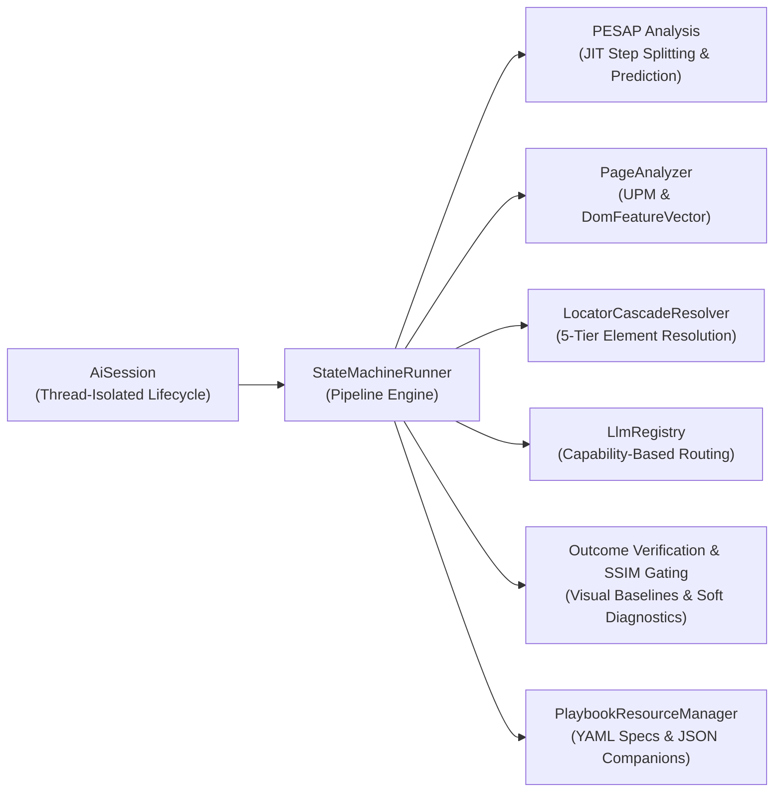

# Neodymium AI - Comprehensive Technical Reference Manual & Architecture Guide

Neodymium AI (contained in `org.neodymium.ai.*`) is an intelligent, domain-neutral test automation engine built on top of Java, Selenide, and Selenium WebDriver. It bridges the divide between human test specifications and executable browser automation by turning natural language playbooks into robust, millisecond-fast offline test runs.

---

## Table of Contents

1. [Architecture & Core Infrastructure](#1-architecture--core-infrastructure)
   - [1.1 Core Architectural Components & Resource Management](#11-core-architectural-components--resource-management)
   - [1.2 Session-Centric Architecture, Thread Isolation & Lifecycle Hooks](#12-session-centric-architecture-thread-isolation--lifecycle-hooks)
   - [1.3 Target Framework Inscription & Cross-Framework Fast-Fail Lock](#13-target-framework-inscription--cross-framework-fast-fail-lock)
   - [1.4 Session-Level Authentication Setup](#14-session-level-authentication-setup)
2. [Test Authoring & Execution Patterns](#2-test-authoring--execution-patterns)
   - [2.1 The Structured Playbook Model & Replay Cache](#21-the-structured-playbook-model--replay-cache)
   - [2.2 Execution Patterns & Developer APIs (The 8 Patterns)](#22-execution-patterns--developer-apis-the-8-patterns)
   - [2.3 `@AiPlaybook` Path Resolution & Scoping Rules](#23-aiplaybook-path-resolution--scoping-rules)
   - [2.4 Explicit Control Tags & Runtime Instruction Preparation](#24-explicit-control-tags--runtime-instruction-preparation)
   - [2.5 Dynamic Variable Parameterization & Outbound Secret Masking](#25-dynamic-variable-parameterization--outbound-secret-masking)
   - [2.6 Interactive Multi-Stage Instructions & Language-Agnostic `CONTINUE` Protocol](#26-interactive-multi-stage-instructions--language-agnostic-continue-protocol)
   - [2.7 Execution Timing Recording & Paced Replay Playback](#27-execution-timing-recording--paced-replay-playback)
3. [Unified Perception & 5-Tier Locator Engine](#3-unified-perception--5-tier-locator-engine)
   - [3.1 Unified Perception Model (UPM) & `DomFeatureVector`](#31-unified-perception-model-upm--domfeaturevector)
   - [3.2 The 5-Tier Cascading Locator Engine (`LocatorCascadeResolver`)](#32-the-5-tier-cascading-locator-engine-locatorcascaderesolver)
   - [3.3 Visual Form Input, Anchor Coordinates & Local SSIM Gating](#33-visual-form-input-anchor-coordinates--local-ssim-gating)
   - [3.4 Fast Offline Syntax Classification & 7-Step Dispatch Pipeline](#34-fast-offline-syntax-classification--7-step-dispatch-pipeline)
   - [3.5 Centralized Locator Translation (`LocatorResolver`)](#35-centralized-locator-translation-locatorresolver)
   - [3.6 Target Safeguarding & Early Volatile ID Rejection](#36-target-safeguarding--early-volatile-id-rejection)
   - [3.7 Ranked Candidate Locators, Automatic Locator Improver & LLM Quality Judge](#37-ranked-candidate-locators-automatic-locator-improver--llm-quality-judge)
4. [Context Escalation Ladder, Pre-Flight Linting & Pre-Step Analysis (PESAP)](#4-context-escalation-ladder-pre-flight-linting--pre-step-analysis-pesap)
   - [4.1 Upfront Playbook Pre-Flight Linter (`PlaybookLinter` & `@AiLinter`)](#41-upfront-playbook-pre-flight-linter-playbooklinter--ailinter)
   - [4.2 Pre-Step Split Analysis (PESAP) & Upfront Splitting](#42-pre-step-split-analysis-pesap--upfront-splitting)
   - [4.3 Tiered Context Escalation Ladder & Payload Modes](#43-tiered-context-escalation-ladder--payload-modes)
   - [4.4 Dynamic Step Escalation Budget Model](#44-dynamic-step-escalation-budget-model)
   - [4.5 The 360° LLM Taming & Safety Lifecycle](#45-the-360-llm-taming--safety-lifecycle)
5. [Prompt Taxonomy, Custom Add-ons & Multilingual Support](#5-prompt-taxonomy-custom-add-ons--multilingual-support)
   - [5.1 AI Prompt Taxonomy](#51-ai-prompt-taxonomy)
   - [5.2 Multi-Dimensional Prompt Resolution Architecture](#52-multi-dimensional-prompt-resolution-architecture)
   - [5.3 Custom System Prompt Add-ons (`promptAddon`)](#53-custom-system-prompt-add-ons-promptaddon)
   - [5.4 Disk-Based Model-Specific System Prompt Add-ons](#54-disk-based-model-specific-system-prompt-add-ons)
   - [5.5 Multilingual Testing & Language Universality (`neodymium.ai.multilingual`)](#55-multilingual-testing--language-universality-neodymiumaimultilingual)
   - [5.6 Language-Agnostic Input Data Fidelity & Anti-Hallucination Directives](#56-language-agnostic-input-data-fidelity--anti-hallucination-directives)
6. [Visual Testing, Stability & Failure Diagnostics](#6-visual-testing-stability--failure-diagnostics)
   - [6.1 SSIM Visual Matrix Verification & Progressive Downsampling](#61-ssim-visual-matrix-verification--progressive-downsampling)
   - [6.2 Temporal Inter-Frame Visual Stability Detection](#62-temporal-inter-frame-visual-stability-detection)
   - [6.3 Post-Action AI Outcome Verification](#63-post-action-ai-outcome-verification)
   - [6.4 Universal Candidate Playbook Capture & Invalidation Lifecycle](#64-universal-candidate-playbook-capture--invalidation-lifecycle)
   - [6.5 Visual Root Cause Analysis (RCA) & Failure Diagnostics](#65-visual-root-cause-analysis-rca--failure-diagnostics)
7. [Performance, Caching, Telemetry & Assertions](#7-performance-caching-telemetry--assertions)
   - [7.1 In-Memory LLM Request Caching (`@AiLlmCache`)](#71-in-memory-llm-request-caching-aillmcache)
   - [7.2 Event-Driven Architecture, EventBus & HUD Overlays](#72-event-driven-architecture-eventbus--hud-overlays)
   - [7.3 Real-Time Token Budget Guard & Limits](#73-real-time-token-budget-guard--limits)
   - [7.4 Per-Call-Type Telemetry Breakdown](#74-per-call-type-telemetry-breakdown)
   - [7.5 Execution Data Access, Telemetry Metrics & Mode-Conditional Asserters (`verifyMetrics()`)](#75-execution-data-access-telemetry-metrics--mode-conditional-asserters-verifymetrics)
8. [Configuration Reference](#8-configuration-reference)
   - [8.1 Core Execution Settings](#81-core-execution-settings)
   - [8.2 Provider and Model Configuration](#82-provider-and-model-configuration)
   - [8.3 Sub-System Toggles](#83-sub-system-toggles)
   - [8.4 Network and Budget Limits](#84-network-and-budget-limits)

---

## 1. Architecture & Core Infrastructure

### 1.1 Core Architectural Components & Resource Management

Neodymium AI orchestrates test execution through a decoupled, state-machine pipeline:



All key interfaces are cleanly decoupled:
* **`AiSession`**: Thread-isolated lifecycle holder containing context state, target drivers, prompts, dataset parameters, and execution metrics.
* **`TargetExecutor`**: Abstract driver interface separating pipeline execution logic from browser drivers (`SelenideTargetExecutor`) and REST clients (`RestTargetExecutor`).
* **`PlaybookResourceManager`**: Decouples playbook loading/writing from specific file systems, serving as the interface for reading/saving playbooks (YAML & JSON) across local, classpath, or virtualized directories.
* **`PlaybookParser`**: Standard interface for parsing structured or nested playbooks and modular inclusions (`_include:`).
* **`LlmRegistry`**: Hosts registered providers for LLM capabilities (e.g., `TEXT_ONLY`, `EXECUTION`, `VISION`, `PESAP`, `VERIFICATION`), routing prompts to the appropriate model based on payload context.

### 1.2 Session-Centric Architecture, Thread Isolation & Lifecycle Hooks
To support robust parallel execution (e.g., executing multiple tests concurrently in separate threads):
* **`AiSession` Isolation**: Encapsulates runtime context, variables, target drivers, and metrics per test execution thread.
* **Hierarchy Isolation**: Prompts and sessions can inherit configuration from parent scopes while remaining completely isolated at runtime, preventing thread cross-talk.
* **Dynamic Lifecycle Hooks**: Supports registering pre/post-execution hooks on sessions (e.g., clearing caches, starting servers, compiling reports).

### 1.3 Target Framework Inscription & Cross-Framework Fast-Fail Lock
To prevent cross-framework execution hazards (e.g. attempting to execute unsupported engine logic inside a Selenium/Selenide driver session):
* **Recording Inscription**: Companion JSON files record `"targetFramework": "SELENIUM_SELENIDE"`.
* **Pre-Execution Fast Fail**: `StateMachineRunner` validates all session steps before executing the playbook. If a recorded step targets an incompatible framework engine, it immediately throws `IncompatibleFrameworkException`.

### 1.4 Session-Level Authentication Setup
* **`TargetExecutor.registerBasicAuth(user, pass)`**: Registers credentials (username/password) dynamically on `AiSession` setup on the active execution target.
* **CDP Interception**: Intercepts basic auth browser challenges via low-level Chrome DevTools Protocol mechanisms, ensuring seamless authentication setup for headless SUT environments.

---

## 2. Test Authoring & Execution Patterns

### 2.1 The Structured Playbook Model & Replay Cache
Instead of executing LLM calls dynamically on every run, the framework uses **Structured Playbooks**:
* **YAML Playbook**: Contains natural language steps written either as a plain-text multiline block (`steps: |`), a YAML list of step strings, or structured action maps. Test scenarios support parameterized variables (`${username}`), modular file inclusions (`include:` / `_include:`), lifecycle blocks (`before:`, `after:`), and intra-file YAML references/anchors (`&anchor` / `*alias`):

  #### A. Natural Language Step Formats
  - **Multiline Block Format (`steps: |`)**:
    Natural language instructions written line-by-line as a clean multiline text block without bullet dashes:
    ```yaml
    steps: |
      Open ${verla.url}/verla-${quality}/index.html in the browser
      Click login button
      Type "${username}" into the email input field
    ```

  - **YAML List Format (`steps:`)**:
    Standard YAML sequence of step strings:
    ```yaml
    steps:
      - "Open ${verla.url}/verla-${quality}/index.html in the browser"
      - "Click login button"
      - "Type \"${username}\" into the email input field"
    ```

  #### B. Intra-File YAML References & Anchors (`&anchor` / `*alias`)
  To avoid repeating common sequences of steps across multiple sections of the same playbook, you can define standard YAML anchors and reference them as aliases. Neodymium automatically flattens nested lists and multiline blocks into sequential test steps:

  - **List Anchors (`&anchor` as a YAML sequence)**:
    ```yaml
    # Define reusable search routine
    search: &search
      - "Type \"${searchQuery}\" into search field"
      - "A dropdown with search suggestions appears"
      - "Click \"View All\" to see all search results"
      - "Verify that the results page shows '${resultCount}' items"

    steps:
      - "Open ${verla.url}/verla-perfect/index.html"
      - "Select country \"${country}\""
      - *search

      - "Open ${verla.url}/verla-normal/index.html"
      - *search
    ```

  - **Block Scalar Anchors (`&anchor |` as a text block)**:
    ```yaml
    # Define reusable routine as a text block
    search: &search |
      Type "${searchQuery}" into search field
      A dropdown with search suggestions appears
      Click "View All" to see all search results
      Verify that the results page shows '${resultCount}' items

    steps:
      - "Open ${verla.url}/verla-perfect/index.html"
      - *search
    ```

  #### C. Modular File Inclusions (`include:` / `_include:`)
  For cross-file reuse, split reusable step sequences into fragment files (e.g. `login_flow.yaml`, `setup.yaml`). Neodymium recursively resolves relative paths with cycle detection:

  - **In Multiline Blocks**:
    ```yaml
    steps: |
      include: includes/common_setup.yaml
      Open ${verla.url}/verla-${quality}/index.html
      include: includes/perform_search.yaml
    ```

  - **In YAML Lists**:
    ```yaml
    steps:
      - include: includes/common_setup.yaml
      - "Open ${verla.url}/verla-${quality}/index.html"
      - include: includes/perform_search.yaml
    ```

  #### D. Lifecycle Blocks (`before:`, `after:`, `beforeEach:`, `afterEach:`)
  Define automated setup and teardown blocks alongside your test steps:
  ```yaml
  before: |
    Open ${verla.url}/verla-perfect/index.html
    include: includes/accept_cookies.yaml

  steps: |
    Perform primary checkout workflow

  after: |
    Click logout button
  ```

  #### E. Test Data Blocks (`data:`)
  Playbooks support defining test datasets directly in YAML to drive parameterized test execution or provide scenario variables:

  - **Multi-Dataset Sequence (`data:` as a list)**:
    Executes the playbook once per dataset entry in a data-driven test matrix:
    ```yaml
    data:
      - testId: guestCheckout
        user:
          email: "guest@example.com"
          country: "US"
        query: "Smart Watch"
      - testId: memberCheckout
        user:
          email: "member@example.com"
          country: "DE"
        query: "Leather Strap"
    ```

  - **Single-Dataset Map (`data:` as key-value pairs)**:
    Provides a concise, direct dictionary structure when driving a single test iteration without list hyphens:
    ```yaml
    data:
      user: "tester@example.com"
      searchTerm: "Minimalist Watch"
      category: "Accessories"
    ```

  - **Dataset-Level Step Overrides & Scoped Blocks**:
    Individual datasets can define their own localized `steps:`, `before:`, or `after:` blocks to override root playbook behavior for specific iterations.

* **JSON Companion**: A recording compiled automatically during the initial `FORCE_RECORDING` run. It maps each natural language step to a list of concrete structured SUT actions (e.g., `NAVIGATE`, `CLICK`, `TYPE`, `ASSERT`) along with visual `screenshotHash` baselines.
* **Offline Replay**: Subsequent test runs (`REPLAY_STRICT` or `REPLAY_WITH_HEALING`) load the companion JSON file directly, executing recorded browser interactions in milliseconds without making any LLM calls.
* **Recording Directory Configuration**: Companion `.json` recording output locations can be configured at the test class/method level or globally:
  - **Annotation-driven (`@AiPlaybook`)**: `@AiPlaybook(recordingDirectory = "target/playbooks/integration")` directs generated companion recordings to build output target directories to keep `src/` clean.
  - **Property-driven (`neodymium.ai.playbook.recordingDirectory`)**: Configured in `ai.properties` or JVM arguments (`-Dneodymium.ai.playbook.recordingDirectory=...`).
  - **Default**: When omitted, companion recordings are saved in the same parent directory as the source `.yaml` playbook (e.g. `src/test/resources/playbooks/...`).
  - **Strict Replay Error Handling**: If a test runs in replay mode (`REPLAY_STRICT` or `REPLAY_WITH_HEALING`) and no recorded companion `.json` file is found, execution fails immediately by throwing `FileNotFoundException`. No silent fallback to YAML playbooks occurs.

---

### 2.2 Execution Patterns & Developer APIs (The 8 Patterns)

Neodymium AI provides 8 distinct execution patterns for prompt execution, annotation-driven test methods, and hybrid Selenide debugging:

#### A. Annotation-Driven Execution

##### Pattern 1: External File Playbook with Explicit Path (`@AiPlaybook`)
Specifies an explicit external playbook resource file located on the classpath (e.g. starting with `/` from the classpath root):
```java
@AiMode(ExecutionMode.FORCE_RECORDING)
@AiPlaybook("/playbooks/integration/verla-search-demo.yaml")
public void test1_ExplicitExternalPlaybook(final AiSession session)
{
    // Executed automatically by NeodymiumAiRunner using the explicit external YAML playbook
}
```

##### Pattern 2: External File Playbook by Naming Convention (`@AiPlaybook`)
Omitting the path automatically resolves to `<package>/<TestClass>_<methodName>.yaml` on the classpath:
```java
@AiMode(ExecutionMode.FORCE_RECORDING)
@AiPlaybook
public void test2_ConventionExternalPlaybook(final AiSession session)
{
    // Resolves to org/neodymium/ai/integration/verla/VerlaDemoTest_test2_ConventionExternalPlaybook.yaml
}
```

##### Pattern 3: Inline Playbook with YAML Text Blocks (`@AiInlinePlaybook`)
Defines multi-line YAML playbooks (with `steps:` and `data:` sections) directly on JUnit test methods in Java code:
```java
@AiMode(ExecutionMode.FORCE_RECORDING)
@AiInlinePlaybook("""
    steps: |
      Open ${verla.url}/verla-perfect/index.html in the browser
      Locate the search input field and type '${searchTerm}' into it
      Press enter to submit search
    data:
      - testId: "default"
        searchTerm: "Minimalist"
    """)
public void test3_InlinePlaybookTextBlocks(final AiSession session)
{
    // Executed automatically by NeodymiumAiRunner using the inline text block annotation
}
```

##### Pattern 4: Quality Judge Matrix Execution (`@AiJudge`)
Runs test cases across Quality Judge variations (e.g. `{false, true}`) to evaluate second-opinion judge behavior with zero code duplication:
```java
@AiMode({ExecutionMode.FORCE_RECORDING, ExecutionMode.REPLAY_STRICT})
@AiJudge({false, true})
@AiPlaybook
public void test4_JudgeMatrix(final AiSession session)
{
    // Executed 4 times: [FORCE_RECORDING, Judge: OFF], [FORCE_RECORDING, Judge: ON],
    //                   [REPLAY_STRICT, Judge: OFF],    [REPLAY_STRICT, Judge: ON]
}
```

---

#### B. Programmatic & Debugging APIs

##### Pattern 5: Fully Programmatic Java Builder (`Playbook.builder()`)
Construct steps programmatically using `PlaybookStep` and `Playbook.builder()`:
```java
final Playbook playbook = Playbook.builder()
    .step("Open ${verla.url}/verla-perfect/index.html in the browser")
    .step("Locate the search input field and type '${searchTerm}' into it")
    .step("Press enter to submit search")
    .build();

try (final AiSession session = AiSession.selenide(ExecutionMode.FORCE_RECORDING))
{
    session.execute(playbook);
}
```

##### Pattern 6: Multiline Text Block String with Embedded YAML Data
Execute raw multiline text blocks containing embedded YAML `steps:` and `data:` sections via `session.execute(...)`:
```java
try (final AiSession session = AiSession.selenide(ExecutionMode.FORCE_RECORDING))
{
    session.execute("""
        steps: |
          Open ${verla.url}/verla-perfect/index.html in the browser
          Locate the search input field and type '${searchTerm}' into it
          Press enter to submit search

        data:
          - testId: "default"
            searchTerm: "Minimalist"
        """);
}
```

##### Pattern 7: Multiline Text Block String with `SessionData` Container
Execute text block prompt strings seeded with a programmatic `SessionData` container:
```java
final SessionData sessionData = new SessionData();
sessionData.set("searchTerm", "Minimalist");

try (final AiSession session = AiSession.selenide(ExecutionMode.FORCE_RECORDING))
{
    session.execute("""
        Open ${verla.url}/verla-perfect/index.html in the browser
        Locate the search input field and type '${searchTerm}' into it
        Press enter to submit search
        """, sessionData);
}
```

##### Pattern 8: Step-by-Step Java Statement Debugging
Execute single-statement prompts allowing standard IDE breakpoints on individual Java lines:
```java
try (final AiSession session = AiSession.selenide(ExecutionMode.FORCE_RECORDING))
{
    session.execute("Open ${verla.url}/verla-perfect/index.html in the browser");
    session.execute("Locate the search input field and type '${searchTerm}' into it");
    session.execute("Press enter to submit search");
}
```

---

### 2.3 `@AiPlaybook` Path Resolution & Scoping Rules

The `@AiPlaybook` annotation configures the target playbook file for AI test execution and companion replay cache storage. Path resolution follows standard, deterministic Java resource rules:

#### Path Resolution Rules

| Annotation Syntax | Resolution Strategy | Resolved Resource Path Example (Class: `org.neodymium.ai.live.AssertTest`, Method: `testOne`) |
| :--- | :--- | :--- |
| **No `@AiPlaybook`** / `@AiPlaybook` (empty) | **Package-Relative Default** | `org/neodymium/ai/live/AssertTest_testOne.yaml` |
| **`@AiPlaybook("custom.yaml")`** | **Package-Relative Custom Name** | `org/neodymium/ai/live/custom.yaml` |
| **`@AiPlaybook("sub/custom.yaml")`** | **Package-Relative Subdirectory** | `org/neodymium/ai/live/sub/custom.yaml` |
| **`@AiPlaybook("/playbooks/foo.yaml")`** | **Absolute Classpath Root** (leading `/`) | `playbooks/foo.yaml` |

#### Scoping Rules

* **Class Level**: Declaring `@AiPlaybook` at the class level sets the default playbook for all test methods in that test class.
* **Method Level**: Declaring `@AiPlaybook` on a test method overrides any class-level annotation.
* **Programmatic Java Tests**: Test classes marked with `@NeodymiumAiTest` that execute steps programmatically via `runPlaybook(session, "...")` do not require `@AiPlaybook`. Replay recordings automatically use standard package-relative path resolution or absolute paths if specified.

#### Multi-Dimensional Companion Recording Filenames

To prevent recording collisions across different test methods, datasets, or browser profiles referencing the same playbook YAML template, companion JSON recording files are constructed automatically using all active execution dimensions:

$$\text{RecordingPath} = \text{\{DirectoryPath\}} / \text{\{ClassName\}} \_\, \text{\{MethodName\}} [\_ \, \text{\{DataSet\}} ] [\_ \, \text{\{Browser\}}] \, . \text{json}$$

* **Class Name**: Identifies the test suite class (e.g. `VerlaGuestCheckoutIntegrationTest`).
* **Method Name**: Guarantees uniqueness for each test method (e.g. `testCheckoutLive`).
* **Dataset ID**: Appended when parameterized dataset execution is active (e.g. `_perfect`).
* **Browser Profile**: Appended when `@Browser("...")` annotation is present (e.g. `_Chrome_1500x1000`).

---

### 2.4 Explicit Control Tags & Runtime Instruction Preparation

Control tags can be appended to natural language steps inside the YAML playbook to customize execution behavior at runtime. All tags are case-insensitive and whitespace-tolerant.

#### Control Tags Reference

##### `(hint: <selector>)`
Directs the engine to bypass DOM extraction and immediately target the specified selector at `ContextLevel.HINT`.
* **Behavior**: Extracts 0 DOM nodes, saving 100% of DOM prompt tokens. If interaction with the hinted selector fails, the engine automatically escalates to `MINIMAL` / `LEAN`.
* **Syntax Examples**: `(hint: #submit-order)`, `(hint: button.btn-primary)`, `( hint: [data-testid='search'] )`

##### `(no-replay)`
Forces live execution and completely bypasses the replay cache for a specific step.
* **Behavior**: Bypasses the recorded actions in the companion JSON file and forces a live LLM extraction call (plus live outcome verification) for that step, even during a replay run.
* **Recording**: Fresh actions executed live are updated in the in-memory candidate playbook and statistics.
* **LLM Payload Cleanliness**: Stripped upfront at parsing time, ensuring the prompt payload sent to the LLM remains clean.
* **Syntax Examples**: `(no-replay)`, `(NO-REPLAY)`, `( no-replay )`

##### `(optional)` / `(soft)`
Allows failures on steps to be tolerated and logged as warnings instead of failing the test case.
* **Assertion Failures**: If an assertion action (like `ASSERT`) fails, the failure is caught, logged, and reported at the end under warnings. The test continues.
* **Interaction Failures**: If element interaction (like locating or clicking a button) fails, the runner tries all live escalations first. If it still fails, the step is bypassed, the failure is logged as a warning, and execution continues to the next playbook step.
* **No Replay Healing**: During replay of an optional step, the runner does not attempt semantic healing; it immediately logs the failure as a warning and continues.
* **Syntax Examples**: `(optional)`, `(soft)`, `( OPTIONAL )`, `( Soft )`

##### `(bug)` / `(bug: id)` / `(bug: comment)`
Negates the outcome of a step when an expected bug exists in the SUT.
* **Expected Failure**: If the step fails for any reason (interaction or verification), the failure is caught, logged, and treated as **passed**. By default, execution halts immediately and skips subsequent steps (to prevent cascaded failures), but the overall test completes successfully.
* **Unexpected Success**: If the step succeeds (meaning the expected bug did not happen), the runner raises a failure and aborts the test immediately to flag that the bug has been resolved or was not encountered.
* **`(continue-on-error)` Support**: If a step is also tagged with `(continue-on-error)` (e.g. `Click button (bug) (continue-on-error)`), the runner continues executing subsequent steps regardless of whether the bug step failed or succeeded (if it succeeded, it just reports it as a warning).
* **Syntax Examples**: `(bug)`, `(bug: APP-123)`, `(bug: button missing)`

##### `(continue-on-error)`
Instructs the pipeline to continue executing subsequent steps even if the current step encounters an unrecoverable failure.
* **Behavior**: Records the failure as a warning and proceeds to the next playbook step rather than aborting the test suite immediately.
* **Syntax Examples**: `(continue-on-error)`, `(CONTINUE-ON-ERROR)`

##### `(no-healing)`
Disables all self-healing mechanisms for a specific step.
* **Behavior**: If the step fails during live or replay execution, the framework does not attempt LLM escalations or semantic self-healing. The failure is immediately propagated.
* **Syntax Examples**: `(no-healing)`, `(NO-HEALING)`, `( no-healing )`

##### `(timeout: <duration>)`
Specifies a custom execution timeout for a specific playbook step.
* **Behavior**: Overrides the default action timeout for slow-loading asynchronous widgets or dynamic modals.
* **Syntax Examples**: `(timeout: 10s)`, `(timeout: 5000ms)`, `(timeout: 30s)`

##### `(visual)` / `(visual: full)` / `(layout)`
Triggers visual execution mode with a page screenshot payload.
* **`(visual)`**: Triggers standard visual execution at `ContextLevel.VISUAL` (URL + Title header only, 0 DOM element nodes), capturing a standard viewport screenshot matching the active browser window size on the initial attempt (~2,800 tokens).
* **`(visual: full)`**: Triggers visual execution starting at ultra-lean `ContextLevel.VISUAL` (URL + Title header only, 0 DOM element nodes) while forcing full-page screenshot capture (full scrollable document height beyond the fold with a visual viewport border overlay) immediately on the initial attempt (~5,000–8,000 tokens).
* **`(layout)`**: Triggers maximum multimodal execution starting directly at `ContextLevel.VISUAL_RICH` (full DOM tree context) while forcing full-page screenshot capture on the initial attempt.
* **Persistent Full-Page Flag During Escalation**: Stored in step transient data as `KEY_IS_FULL_PAGE_SCREENSHOT = true`. If visual evaluation fails or requires element interaction, escalation (`VISUAL` $\rightarrow$ `VISUAL_LEAN` $\rightarrow$ `VISUAL_RICH`) **continuously preserves full-page screenshot capture**. It will **never** revert to a small viewport screenshot during escalations.
* **Author Tag Protection**: Explicit `(visual)`, `(visual: full)`, and `(layout)` tags set by the test author are protected from being overwritten or downgraded by PESAP pre-step predictions.

#### Runtime Instruction Preparation
Before compiling prompts or sending request payloads to the LLM, the framework executes a dedicated instruction preparation step (`ExecuteActionsStep.prepareInstruction`). It dynamically strips most explicit control tags case-insensitively (`(no-replay)`, `(bug)`, `(continue-on-error)`, `(no-healing)`, `(optional)`, `(timeout: ...)`, `(visual)`, `(visual: full)`), preventing internal test configurations from polluting the natural language prompts sent to the LLM.

*(Note: The `(hint: <selector>)` and `(layout)` tags are intentionally **not** stripped, as the LLM requires their embedded string content and context to generate the correct structural actions.)*

---

### 2.5 Dynamic Variable Parameterization & Outbound Secret Masking

Neodymium AI features an automated variable interpolation engine and outbound data sanitizer to ensure test playbooks remain fully parameterized, modular, and privacy-compliant:

#### A. Intra-Dataset Variable Interpolation & Nested Dot-Notation
Variables in YAML test datasets and playbook step definitions are dynamically evaluated using standard `${...}` placeholder syntax:

* **Intra-Dataset Referencing**: Dataset fields can reference other properties within the same dataset row:
  ```yaml
  data:
    foo: "bar"
    foobar: "${foo}"
  ```
* **Nested Object & Dot-Path Navigation**: Traverses nested maps and object structures seamlessly using dot notation:
  ```yaml
  data:
    phrase:
      Part1: "Neo"
      Part2: "dymium"
    searchPhrase: "${phrase.Part1}${phrase.Part2}"
  ```
* **Recursive Collection Resolution**: Placeholders within nested maps, strings, and lists are recursively resolved throughout the dataset hierarchy.
* **Metadata & System Property Injection (`_meta.*`)**: Special system metadata keys (such as `${_meta.sourceFile}` or `${_meta.classpathResourcePath}`) are automatically accessible within step instructions and variable expressions to trace origin files or construct relative dynamic paths.
* **Interleaved Multi-Pass Resolution**: Variables and step instructions are evaluated in an interleaved multi-pass resolution loop with recursion limits, ensuring forward and cross-referenced variables resolve cleanly while preventing cyclic reference deadlocks.

#### B. Outbound Secret Masking (`ContextSanitizer`)
Before prompts, instructions, or captured SUT DOM state payloads are transmitted over the network to external LLM providers (Gemini, Mistral, Vertex), `DefaultContextSanitizer` scans the payload against sensitive session dataset entries (`DataEntry.sensitive() == true`) and replaces raw secret credentials with format-preserving `[MASKED_VAR_key]` placeholders (e.g. `[MASKED_VAR_password]`). Returned LLM responses are automatically reverse-mapped back to variable reference syntax (`${password}`) prior to action parsing, ensuring raw secrets never leave the client.

#### C. Dynamic Recording Parameterization
During recording (`FORCE_RECORDING`), the engine automatically matches executed values and dynamic response strings (such as order numbers, session IDs, or generated URLs) back to dataset variable definitions, writing parameterized entries like `"${order.number}"` into the companion JSON recording instead of hardcoded session values.

---

### 2.6 Interactive Multi-Stage Instructions & Language-Agnostic `CONTINUE` Protocol

To support interactive instructions (such as clicking a search toggle button or expanding a dropdown menu to reveal hidden form inputs) **without relying on hardcoded human language string checks in Java code**, the framework supports the `CONTINUE` step status protocol:

#### AI Signal Protocol (`status: "CONTINUE"`)
* **Response Status Spectrum**: `SUCCESS` | `FAILED` | `ESCALATE` | `CONTINUE`
* **Prelude Action Execution**: When the LLM outputs `status: "CONTINUE"`, the pipeline executes the prelude actions (e.g. `CLICK .search-toggle`), captures the updated post-click SUT DOM state (where hidden inputs like `<input id="search-field">` are now visible), and triggers a continuation LLM call for the same active step.
* **100% Language Neutrality**: Because the LLM natively decodes instructions across all natural languages (English, German, French, Spanish, Japanese, etc.), Java code contains **zero** hardcoded human language string checks.
* **Unified Replay Cache Storage**: All sequential actions (`CLICK` $\rightarrow$ `TYPE` $\rightarrow$ `KEY_PRESS`) extracted across continuation calls are appended into the single `step.getActions()` list in the companion JSON file. During offline replay (`REPLAY_STRICT`), all recorded actions execute sequentially in a single pass without making LLM calls, with Selenide automatically handling element visibility transitions.

---

### 2.7 Execution Timing Recording & Paced Replay Playback

To ensure faithful replay execution for asynchronous Single Page Applications (SPAs), HTMX/AJAX partial page updates, CSS micro-animations, and visual SSIM assertions, Neodymium AI records execution durations and delays into companion JSON recordings.

#### Recorded Timing Fields in Companion JSON
* **`durationMs` (Action & Step Level)**: Wall-clock duration in milliseconds spent executing the specific action or playbook step in the browser.
* **`delayMs` (Action & Step Level)**: Inter-action or inter-step elapsed pause in milliseconds prior to execution during the recording phase.

#### Configuration Options

| Property | Default | Description |
| :--- | :--- | :--- |
| `neodymium.ai.replay.delayScale` | `0.0` | Multiplier applied to recorded delays (`0.0` = off / instant execution for fast CI/CD builds; `1.0` = real-time pacing; `0.5` = 2x speed). |
| `neodymium.ai.replay.useRecordedDelays` | `false` | (Legacy) When `true` without `delayScale`, enables replay pacing at scale `1.0`. |
| `neodymium.ai.visual.postActionSettleMs` | `1000` | Minimum settling pause in milliseconds before capturing visual screenshots for SSIM baseline checks. |

---

## 3. Unified Perception & 5-Tier Locator Engine

### 3.1 Unified Perception Model (UPM) & `DomFeatureVector`

To eliminate perceptual blindness across modern web architectures (such as Shadow DOM, dynamic utility classes like Tailwind, and headless canvas/SVG components), Neodymium AI implements the **Unified Perception Model (UPM)**.

#### Multi-Layer Feature Extraction
During DOM analysis (`PageAnalyzer`), the browser evaluates a single-pass extraction script that captures structural, semantic, and spatial properties into an immutable `DomFeatureVector`:
* **Structural**: Tag name, parent container tag (`parentTag`), sibling index position (`siblingIndex`).
* **Semantic & AOM**: Computed accessible name (`aria-label`, placeholder, label text, or innerText), computed ARIA role (`button`, `link`, `textbox`, etc.).
* **Styling & Attributes**: Full class list (decomposed for Tailwind/CSS-in-JS drift tolerance) and non-volatile attributes map (e.g. `type`, `name`, `data-testid`).
* **Spatial Geometry**: Absolute viewport bounding box $[x, y, w, h]$ rounded to integer pixels.
* **Shadow DOM & Frame Traversal**: Traverses closed/open shadow roots (`collectRoots`) and iframe boundaries seamlessly.

```json
{
  "tag": "button",
  "text": "Place Order",
  "classes": ["btn", "btn-primary", "w-full", "py-3"],
  "attributes": {"type": "submit", "id": "order-submit-btn"},
  "role": "button",
  "accessibleName": "Place Order",
  "parentTag": "form",
  "siblingIndex": 3,
  "x": 450,
  "y": 620,
  "width": 320,
  "height": 48
}
```

---

### 3.2 The 5-Tier Cascading Locator Engine (`LocatorCascadeResolver`)

When replaying recorded actions or executing live steps, Neodymium AI routes element resolution through a strict **5-Tier Cascading Locator Engine**:

```mermaid
flowchart TD
    A["Target Action Execution"] --> T1{"Tier 1: Engineering Test-IDs<br/>(data-testid, data-test, unique ID)"}
    T1 -->|Found| Match["Dispatch Browser Event"]
    T1 -->|Not Found| T2{"Tier 2: Semantic / AOM<br/>(role, aria-label, computed accessible name)"}
    T2 -->|Found| Match
    T2 -->|Not Found| T3{"Tier 3: Text & Clean CSS<br/>(exact text, clean semantic classes)"}
    T3 -->|Found| Match
    T3 -->|Not Found| T4{"Tier 4: DOM Feature Proximity Search<br/>(DomFeatureVector similarity >= 0.80)"}
    T4 -->|Found (Score >= 0.80)| Match
    T4 -->|Not Found| T5{"Tier 5: Visual Anchor & Coordinates<br/>(anchor@x,y with local 64x64 SSIM >= 0.95)"}
    T5 -->|SSIM Valid| Match
    T5 -->|SSIM Reflow / Failed| Heal["Escalate to Multimodal LLM Healing"]
```

#### Tier Breakdown & Strategies:
1. **Tier 1: Engineering Test-IDs**: Direct resolution of explicit QA attributes (`data-testid`, `data-test`, `data-qa`, unique non-volatile IDs).
2. **Tier 2: Semantic / AOM**: Accessible Name & Role matching (ARIA tree evaluation, `aria-label`, placeholder, role mapping).
3. **Tier 3: Text & Clean CSS**: Visible text matching, W3C standard CSS classes, anchor link texts, and standard form controls.
4. **Tier 4: DOM Feature Proximity Search (`DomFeatureVector` Similarity)**:
   If direct candidate selectors fail due to code refactorings, framework migrations, or dynamic Tailwind class changes, the runtime computes local similarity across live candidates in $< 1\text{ ms}$:

   $$\text{Score} = 0.35 \times \text{TagScore} + 0.30 \times \text{AttrJaccard} + 0.25 \times \text{TextLevenshtein} + 0.10 \times \text{ClassJaccard}$$

   - **TagScore (35%)**: Exact tag match: $1.0$. Interactive tag transition (`button` $\leftrightarrow$ `a` $\leftrightarrow$ `input[type='submit']`): $0.70$ (or $0.90$ if explicit ARIA roles match). Unrelated tag transitions: $0.0$.
   - **AttrJaccard (30%)**: Key-value attribute Jaccard index ($|A \cap B| / |A \cup B|$).
   - **TextLevenshtein (25%)**: Maximum of Levenshtein string similarity and tokenized word Jaccard overlap between recorded and live visible/accessible text.
   - **ClassJaccard (10%)**: Set-based Jaccard similarity of CSS class lists.
   - **Structural Tie-Breaker**: In ambiguous scenarios (e.g. identical buttons in header and footer), adds up to $+0.01$ bonus for matching `parentTag` and `siblingIndex` proximity.
   - **Acceptance Threshold**: A match is accepted only when $\text{Score} \ge 0.80$.

5. **Tier 5: Visual Anchor Coordinates & Local SSIM Gating**:
   Resolves visual anchors with $64 \times 64$ luminance tile gating before falling back to multimodal LLM self-healing.

---

### 3.3 Visual Form Input, Anchor Coordinates & Local SSIM Gating

For custom web components, interactive canvases, SVG charts, or headless drag-and-drop interfaces lacking native DOM form inputs:

#### A. Anchor-Relative Spatial Pinning
Coordinates are pinned relative to stable parent container elements using the syntax:
* `coord: #container@100,50` or `#container@100,50`
* Offsets $(x, y)$ are calculated from the top-left origin $(0, 0)$ of the anchor element.

#### B. $64 \times 64$ Luminance Tile SSIM Gating ($\ge 0.95$)
Before dispatching coordinate clicks during replay, `VisualBaselineGateStep` extracts a $64 \times 64$ luminance crop centered on the coordinate centroid $(x, y)$ and compares it against the recorded baseline:
* **Match ($\text{SSIM} \ge 0.95$)**: Safe to dispatch coordinate click.
* **Reflow Mismatch ($\text{SSIM} < 0.95$)**: Aborts blind execution immediately and throws `HealingRequiredException` to escalate to multimodal vision LLM healing rather than misclicking.

#### C. Decoupled Visual Form Typing
For `<canvas>`, `<svg>`, or coordinate targets, `TypeAction` acquires browser focus via coordinate/element click and dispatches raw keyboard events via WebDriver `Actions.sendKeys()`, avoiding native `element.val()` failures.

---

### 3.4 Fast Offline Syntax Classification & 7-Step Dispatch Pipeline

#### Fast Offline Syntax Classifier (`SelectorSyntaxChecker`)
* **XPath Validation**: Uses JDK native `javax.xml.xpath.XPathFactory` to validate expression syntax for XPath expressions (`//...`, `xpath=...`).
* **CSS Validation**: Uses jsoup `QueryParser.parse` with UI state pseudo-class normalization (`:hover`, `:focus`, `:focus-visible`, `:active`) and combinator validation to reliably identify valid W3C CSS selectors.
* **Element Finder Protection**: In `SelenideElementFinder`, Strategy 6 (Text Content Searching) is strictly guarded by `SelectorSyntaxChecker.isCssSelector(clean)` and `SelectorSyntaxChecker.isXpathExpression(clean)`. Structured CSS or XPath locators will **never** fall through to literal DOM text or code block searches.

#### Streamlined 7-Step Runtime Resolution Pipeline (`SelenideElementFinder`)
`SelenideElementFinder` executes a streamlined, deterministic 7-step dispatch without brittle Java-level regex pre-flight gates:
1. **Automation Reference ID**: Direct check for unique `[data-ai="..."]` or `#xc...` identifiers.
2. **Playwright Pseudo Translation**: Translates `:has-text(...)` and `text=...` via `LocatorResolver` into Selenide-compatible locators.
3. **XPath Expression**: Direct execution of XPath expressions (`//...`).
4. **W3C CSS Selector**: Resolution of standard CSS selectors via `LocatorResolver.resolve`.
5. **Link Text Matching**: Exact anchor tag link text matching (`By.linkText`).
6. **Semantic Text & ARIA Search**: Case-insensitive text and accessible name searching across interactive candidates.
7. **Bare Tag Name Fallback**: Direct fallback to HTML tag names (`button`, `input`).

#### Mode-Scoped Selenide W3C Locator Constraints
When `ExecutionContext.KEY_TARGET_EXECUTOR` is operating in Selenide/WebDriver mode (`SelenideTargetExecutor`), `ActionExtractionPrompt` and `QualityJudgePrompt` append `SELENIDE_LOCATOR_RULE`:
* **W3C Standard CSS Compliance**: Forces the LLM to output standard W3C CSS selectors compatible with Selenium and Selenide.
* **Playwright Pseudo-Selector Ban**: Strictly forbids Playwright-specific pseudo-selectors (e.g., `:has-text(...)`, `:text(...)`, `:text-is(...)`, `:has(...)`) that cause Selenium driver runtime syntax exceptions.

---

### 3.5 Centralized Locator Translation (`LocatorResolver`)

#### Concept & Scope
* **Selenium/Selenide Exclusive**: `LocatorResolver` is strictly used by the Selenide/Selenium execution layer (`ActionExecutor` and `SelenideElementFinder`) to translate target strings into W3C-compliant `org.openqa.selenium.By` locators.
* **XPath & CSS Prefix Normalization**: Normalizes `xpath=` and `css=` prefixes (common LLM artifacts) into valid Selenium `By.xpath` and `By.cssSelector` objects.
* **Text Normalization**: Safely handles single and double quotes inside `Selectors.withText(...)` by generating nested `concat()` structures.

| Raw Instruction/Recorded Value | Fallback Translation Logic | Runtime Selenide Object |
| :--- | :--- | :--- |
| **`button`** | CSS fallback | `By.cssSelector("button")` |
| **`//div[@id='foo']`** | XPath detection | `By.xpath("//div[@id='foo']")` |
| **`neo-ref=c42`** | Neodymium automation reference ID | `By.cssSelector("[data-neo-ref='c42']")` |
| **`custom-card ::shadow .btn`** | Explicit Shadow DOM target | `Selectors.shadowCss(".btn", "custom-card")` |
| **`//button[@id='pay']`** | Standard XPath | `By.xpath("//button[@id='pay']")` |
| **`button#pay.primary`** | Standard W3C CSS | `By.cssSelector("button#pay.primary")` |

---

### 3.6 Target Safeguarding & Early Volatile ID Rejection

Neodymium AI enforces a multi-tier **Target Safeguarding & Escalation Pipeline** to prevent invalid, volatile, or hallucinated selectors from executing or polluting recorded playbook files.

#### Safeguard Rules & Pipeline Invariants

1. **Early Volatile ID Rejection (`ActionExtractionPrompt`)**:
   - Target locators are evaluated against `VolatileIdDetector` rules (including configured `neodymium.ai.dom.volatileIdPatterns` and framework invariant `^xc[a-z0-9_]+$`).
   - If an action returns an illegal `#xc...` ID selector or a volatile ID, `ActionExtractionPrompt` throws `ToLevelEscalationException` directly during response parsing.
   - **Result**: Context immediately escalates along the monotonic ladder (`MINIMAL` $\to$ `LEAN` $\to$ `STANDARD` $\to$ `RICH` $\to$ `VISUAL_RICH`), capturing higher context and re-prompting the LLM with richer state before an execution attempt is made.

2. **No Magic Selection Fallbacks (`SelenideElementFinder`)**:
   - `SelenideElementFinder` restricts `data-ai` attribute matching strictly to explicit `[data-ai=...]` or `data-ai=` selectors.
   - If the LLM returns an invalid ID selector like `#xck520w4`, `SelenideElementFinder` queries `id="xck520w4"` directly on the HTML DOM, failing cleanly instead of silently rewriting the selector.

3. **Action Retry Context Escalation (`ExecuteActionsStep`)**:
   - When an action execution fails on SUT (e.g. `Element not found`), `ExecuteActionsStep` catches the failure and automatically escalates `KEY_CURRENT_CONTEXT_LEVEL` to the next level (`MINIMAL` $\to$ `LEAN` $\to$ `STANDARD` $\to$ `RICH` $\to$ `VISUAL_RICH`), capturing state before re-querying the LLM.

4. **Extensible TargetExecutor Capability Abstraction**:
   - Decoupled from specific driver implementations via `TargetExecutor.supportsLocatorImprovement()`.
   - Ensures DOM-specific locator improvement only runs for web browser executors (`SelenideTargetExecutor`).

---

### 3.7 Ranked Candidate Locators, Automatic Locator Improver & LLM Quality Judge

#### A. Ranked Candidate Locators
For every extracted action, the primary LLM generates 2–3 candidate locators ranked by stability in `action.getCandidateLocators()`:
* **Candidate 1 (Primary)**: Unique standard `#id`, `name`, `data-test`, `data-testid`, or `aria-label`.
* **Candidate 2 (Semantic Fallback)**: Clean semantic CSS class or standard attribute combination (e.g. `.btn-secondary[type='submit']`).
* **Candidate 3 (Stability Fallback)**: `[data-ai='...']` selector attribute provided in the DOM dump.

#### B. Quality Scoring Scale (0 to 10)

| Score | Locator Type | Examples |
| :---: | :--- | :--- |
| **10/10** | Unique ID or Test ID | `#purchase-btn`, `[data-testid='submit-order']`, `[data-test='checkout']` |
| **8/10** | Standard Attribute | `input[name='email']`, `[aria-label='Search']`, `[placeholder='Enter address']` |
| **6/10** | Single Clean Class | `.product-quick-add`, `.btn-primary` |
| **4/10** | Neodymium Fingerprint Tag | `[data-ai='xccaql7f']` |
| **2/10** | Complex Combinator / Deep Path | `header > div > form > input:nth-child(2)`, `//html/body/div[1]/input` |
| **0/10** | Volatile Dynamic ID / Invalid | `#v-btn-129481`, `#react-node-9941` |

#### C. Validation & Safety Invariants
1. **Quality Score Upgrade Gate**: Candidate locators are upgraded ONLY if candidate quality score strictly exceeds the original locator score ($\text{CandidateScore} > \text{OriginalScore}$).
2. **Uniqueness Check**: The candidate locator must match **exactly 1 element** in the live DOM (`findElements().size() == 1`).
3. **Identity Check**: The element returned by the candidate locator must be the **exact same `WebElement` instance** (`matchedElement.equals(targetElement)`).
4. **Volatile ID Protection**: Ignores dynamic/framework auto-generated IDs using `VolatileIdDetector`.

#### D. External Quality Judge (`QualityJudgeStep` - Optional / Second Opinion)
When an independent "second opinion" model is desired:
* **Execution**: Executes `QualityJudgePrompt` passing the proposed primary action, candidate locators, and full DOM tree context.
* **Output**: Returns structured `QualityJudgeResult` JSON containing `judgment` (`APPROVED`, `REFINED`, `REJECTED`), `chosenLocator`, `chosenValue`, `isRegex`, `confidence`, and `reasoning`.

```properties
# Enables or disables the external LLM Quality Judge ("second opinion") step.
neodymium.ai.judge.enabled=false
neodymium.ai.judge.mode=ON_AMBIGUITY
```

---

## 4. Context Escalation Ladder, Pre-Flight Linting & Pre-Step Analysis (PESAP)

### 4.1 Upfront Playbook Pre-Flight Linter (`PlaybookLinter` & `@AiLinter`)

To detect linguistic defects, atomic step violations, and ambiguous assertions before runtime execution begins, the pipeline incorporates an **Upfront Playbook Pre-Flight Linter** (`PlaybookLinter.java`):

* **Single-Batch Upfront Execution**: During session initialization (`StateMachineRunner`), all playbook scenario steps are compiled and analyzed in a single batch LLM call using `LlmCapability.LINTER` before any browser interaction or JIT step processing begins.
* **Non-Blocking & Purely Advisory**: The pre-flight linter never fails, aborts, or halts test execution. Findings are recorded into the test execution context (`ExecutionContext.KEY_PLAYBOOK_LINTER_FINDINGS`) and presented as advisory quality telemetry in test reports.
* **Automatic Replay Mode Bypass**: In offline deterministic modes (`ExecutionMode.REPLAY_STRICT`, `ExecutionMode.REPLAY_WITH_HEALING`), the linter is automatically bypassed, ensuring zero LLM network requests during recorded playback.
* **Granular Control (`@AiLinter`)**: Tests can enable, disable, or parameterize prelinting via the `@AiLinter` annotation on classes or test methods:
  ```java
  @AiLinter(false) // Disable prelinting for this specific test method
  public void testQuickReplay() { ... }

  @AiLinter({false, true}) // Run test variations with and without prelinting
  public void testMatrix() { ... }
  ```
* **Property Toggles**: Enabled by default (`neodymium.ai.linter.enabled=true`). Can be globally disabled via `neodymium.ai.linter.enabled=false` (or aliases `neodymium.ai.prelinter.enabled=false`, `neodymium.ai.prelint.enabled=false`).
* **Optional Scenario Description Grounding**: Reads high-level scenario context from playbook YAML `description:` headers or `@Description("...")` test annotations to ground linguistic evaluation without hardcoding domain assumptions.

#### The 9 Universal Quality Check Categories

| Category | Severity | Description | Example Suggested Rewrite |
| :--- | :--- | :--- | :--- |
| **`STEP_SPLITTING_CANDIDATE`** | `WARNING` | Compound actions or mixed action + verification in a single step. | Split into discrete numbered steps (`1. Open selector\n2. Click "Canada"`). |
| **`MISSING_VISUAL_TAG`** | `INFO` | Visual/layout assertions lacking `(visual)` or `(visual: full)` tags. | Add visual tag (`"The status badge is vibrant emerald green (visual)"`). |
| **`AMBIGUOUS_AFFORDANCE`** | `WARNING` | Passive capability phrasing ("allows to...") instead of actionable commands. | Convert to imperative action (`"Click Settings"`) or explicit check (`"Verify Settings card is visible"`). |
| **`VAGUE_TARGET`** | `WARNING` | Underspecified targets lacking container or label scope. | Scope with container context (`"Click the Login button in the header"`). |
| **`VAGUE_VERIFICATION`** | `WARNING` | Subjective or untestable test oracles ("looks good"). | Use concrete DOM assertion (`"Verify order summary is displayed"`). |
| **`DANGLING_ANAPHORA`** | `ERROR` | Ambiguous relative pronouns ("it", "that one") without clear referents. | Replace with explicit element name (`"Click the Delete button"`). |
| **`TEMPORAL_FLOW_ANOMALY`** | `WARNING` | Operating on an entity/modal before opening or creating it. | Reorder steps into prerequisite flow. |
| **`HARDCODED_VOLATILE_DATA`** | `WARNING` | Hardcoded execution-time timestamps or dynamic generated IDs. | Parameterize with variable (`"Verify order ID matches #${orderId}"`). |
| **`INCOMPLETE_BRANCH_CLAUSE`** | `WARNING` | Dangling conditional clause ("If...", "When...") lacking consequence. | Complete branch with action (`"If cookie banner appears, click Accept"`). |

---

### 4.2 Pre-Step Split Analysis (PESAP) & Upfront Splitting

To handle complex, compound, or ambiguous instructions, the pipeline executes a **Pre-Step Split Analysis (PESAP)** using the `LlmCapability.PESAP` capability:
* **Contextual Inputs**: The analysis receives the current step, the previously executed step's instruction (for flow context), and up to two subsequent steps' instructions.
* **JIT Upfront Step Splitting**: If a compound step (e.g. `"Search for shirt, select size L, and click Checkout"`) is identified, the LLM splits the instruction into distinct leaf sub-steps. These are instantiated dynamically as child `PlaybookStep` instances and pushed onto the execution stack.
* **Conservative Non-Splitting Invariants**: Single-target instructions with multiple descriptive clauses (e.g. `"Select standard shipping option (5-7 business days) for $5.00"`) or referential verification instructions (e.g. `"Verify order total matches previous summary"`) are strictly preserved as single steps.
* **JIT Context-Level Detection**: Rather than relying on static defaults, PESAP dynamically determines the optimal initial interaction mode across the 8-tier context escalation ladder.

---

### 4.2 Tiered Context Escalation Ladder & Payload Modes

Neodymium AI uses an **8-tier context level escalation hierarchy** organized into **Two Strictly Monotonic Escalation Tracks** ($L_i \subset L_{i+1}$) that ensure the model never loses DOM context when escalating:

$$\textbf{Track A (DOM Track): } \text{HINT} \longrightarrow \mathbf{MINIMAL} \longrightarrow \mathbf{LEAN} \longrightarrow \mathbf{STANDARD} \longrightarrow \mathbf{RICH} \longrightarrow \mathbf{VISUAL\_RICH}$$
$$\textbf{Track B (Visual Track): } \mathbf{VISUAL} \longrightarrow \mathbf{VISUAL\_LEAN} \longrightarrow \mathbf{VISUAL\_RICH}$$

#### Context Level Spectrum & Meaning

| Context Level | Mode Type | Payload Content Description | Trigger Conditions / Use Cases |
| :--- | :--- | :--- | :--- |
| **`HINT`** | Text | **0 DOM Nodes.** Explicit selector hint provided (e.g. `(hint: #id)`). Saves 100% of DOM tokens. | When explicit CSS selector hint is provided in playbook step. |
| **`MINIMAL`** | Text | **Interactive Form Controls Only.** Extracts inputs, textareas, selects, and form buttons without page chrome or paragraph copy (~300–800 tokens). | Ultra-lean default for form filling, sequential typing, and field entry. |
| **`LEAN`** | Text | **Interactive Elements + Headings + Container Skeleton + Concise Text Labels.** Filters out massive paragraph copy (`<p>`/`blockquote` > 120 chars). | Standard mode for navigation links, buttons, and card triggers. |
| **`STANDARD`** | Text | **`LEAN` + Standard Static Text.** Includes full static body `<p>` paragraph copy of any length, text spans, badges, and order totals. | Selected for text assertions, paragraph matching, or when `LEAN` escalates. |
| **`RICH`** | Text | **`STANDARD` + Full HTML Metadata.** Includes all `data-*`, `title`, `aria-describedby` attributes, un-truncated URLs, and 5-level parent context. | Selected for SKU/data-attribute targeting, table sorting, or deep card disambiguation. |
| **`VISUAL`** | Visual | **Viewport Screenshot + 0 DOM Element Nodes.** Pure visual assertion/check at standard screen size (~800–1,200 tokens). | Triggered by `(visual)` check/assertion without element interaction. Uses viewport screenshot. |
| **`VISUAL_LEAN`** | Visual | **Full-Page Screenshot + `LEAN` DOM.** Visual element interaction. | Triggered upon visual escalation; uses full-page screenshot. |
| **`VISUAL_RICH`** | Visual | **Full-Page Screenshot + `RICH` DOM.** Maximum multimodal context. Strictly preserves all DOM text and attributes. | Triggered by `(layout)` checks or cross-track escalation from `RICH`; uses full-page screenshot. |

#### Dynamic Escalation Flow
1. **Initial Step**: Starts at **`MINIMAL`** (or `LEAN` / `VISUAL` based on PESAP prediction or explicit tags).
2. **Escalation 1 (`MINIMAL` $\rightarrow$ `LEAN`)**: Expands to all interactive elements, navigation links, and section headings.
3. **Escalation 2 (`LEAN` $\rightarrow$ `STANDARD`)**: Expands to static text, paragraphs, and order summary totals.
4. **Escalation 3 (`STANDARD` $\rightarrow$ `RICH`)**: Expands to all `data-*` attributes, ARIA descriptions, tables, and deep parent ancestry.
5. **Escalation 4 (`RICH` $\rightarrow$ `VISUAL_RICH`)**: Cross-track escalation attaches full-page screenshot while **strictly preserving all rich DOM text and attributes** (never regressing to 0 DOM nodes).

---

### 4.3 Dynamic Step Escalation Budget Model

To prevent infinite escalation loops while ensuring that steps starting at higher context levels are never blocked from reaching `VISUAL_RICH`, the framework enforces a **Dynamic Step Escalation Budget**:

$$\text{Total Step Budget} = (\text{VISUAL\_RICH.ordinal()} - \text{initialLevel.ordinal()} + 1) + \text{neodymium.ai.maxRetriesAtMaxLevel}$$

* **Unused Level Budget Preservation**: Starting at higher levels preserves unused lower level attempt capacity.
* **Guaranteed Initial `VISUAL_RICH` Attempt**: Upward escalation into `VISUAL_RICH` for the first time is always permitted to run its initial attempt.
* **Circuit Breaker Enforcement**: The circuit breaker trips only when `attemptsUsed >= totalStepBudget` AND `currentLevel == VISUAL_RICH`.

---

### 4.4 The 360° LLM Taming & Safety Lifecycle

To prevent LLM hallucination, destructive mutations, locator drift, and erroneous step approvals, Neodymium AI implements an end-to-end **360° Safety & Taming Lifecycle**. This multi-layered architecture acts at every stage of execution:

```
┌──────────────────────────────────────────────────────────────────────────────────┐
│                             360° LLM SAFETY LIFECYCLE                            │
├──────────────────────┬───────────────────────────┬───────────────────────────────┤
│ 1. PRE-EXECUTION     │ 2. IN-FLIGHT INVARIANTS   │ 3. POST-EXECUTION VERIFY      │
│ (Guardrails & Budget)│ (Deterministic Java Rules)│ (Judges & Quality Audit)      │
├──────────────────────┼───────────────────────────┼───────────────────────────────┤
│ • PESAP Intent       │ • Assertion Mutation      │ • Second-Opinion Quality      │
│   Routing & Clamping │   Defense (Discard Mutating Judge (Locators vs DOM)      │
│ • Volatile ID Early  │   Actions on Assertions)  │ • Semantic Outcome            │
│   Stripping          │ • Structural Inconsistency│   Verification (Visual Delta  │
│ • Dynamic Escalation │   Override (False Success)│   & Intent Rubrics)           │
│   Budget Breaker     │ • Coordinate Normalization│ • Replay Hash Matrix SSIM     │
│ • Secret Masking     │ • Fast Native Fallbacks   │   Baseline Divergence Gate    │
└──────────────────────┴───────────────────────────┴───────────────────────────────┘
```

#### 1. Pre-Execution Guardrails (Upstream Containment)
* **Semantic Intent Routing (`SemanticIntent`)**: PESAP analyzes incoming instructions to classify step intent (`ASSERT`, `ASSERT_METADATA`, `CLICK`, `TYPE`, `SELECT`, `HOVER_SCROLL`, `NAVIGATE`, `WAIT`, `STORE`, `BRANCH`). Metadata assertions (`ASSERT_METADATA`) are locked to `MINIMAL` context, eliminating unnecessary DOM serialization and visual token costs.
* **Early Volatile ID Rejection**: Fast algorithmic filters (`VolatileIdDetector`) strip dynamic framework IDs (GUIDs, UUIDs, timestamp hashes) from DOM feature vectors before they can pollute LLM prompt inputs.
* **Escalation Budget & Circuit Breaker**: Mathematical attempt budgets prevent runaway retries and infinite loops.
* **Dynamic Parameter Masking**: In-flight regex masks intercept outbound credentials, API keys, and sensitive environment secrets.

#### 2. In-Flight Invariants (Deterministic Java Defenses)
* **Assertion Mutation Guard**: When a step's intent is classified as `ASSERT` or `ASSERT_METADATA`, both `ActionExtractionPrompt` and `ExecuteActionsStep` enforce a strict invariant: any mutating interactive actions (`CLICK`, `TYPE`, `CLEAR`, `SELECT`, `NAVIGATE`) generated by the LLM are automatically discarded and blocked from touching the SUT DOM.
* **Structural Contradiction Interceptor**: If an LLM response emits `status: SUCCESS` but simultaneously marks `assertionSatisfied: false` without executable actions, Java logic overrides the status to `FAILED` and raises a `DivergenceException`.
* **Coordinate & Viewport Normalization**: Click/tap coordinates outside the normalized bounds (0–1000‰) or target viewport boundaries are intercepted prior to dispatch.
* **Native Metadata Evaluation**: Page title and URL assertions bypass heavy DOM rendering, verifying browser metadata directly against WebDriver state.

#### 3. Post-Execution Verification & Judging (Downstream Quality Assurance)
* **Second-Opinion LLM Quality Judge (`QualityJudgePrompt`)**: Evaluates primary locators against alternate candidate locators and the full SUT DOM tree, validating uniqueness, resilience to UI refactoring, and CSS specificity.
* **Post-Action Semantic Outcome Verification (`VerificationPrompt`)**: Analyzes pre- and post-action DOM states and screenshots across three independent rubrics:
  1. `intentMatch`: Did the action fulfill the user's semantic instruction?
  2. `visualDelta`: Did the page change appropriately (e.g., dropdown opened, modal appeared)?
  3. `absenceOfErrors`: Are there unexpected server errors, toast alerts, or UI regressions?
* **Deterministic Visual Matrix SSIM Baselines**: dHash baseline matrices and SSIM checks ensure visual stability and detect layout regressions before finalizing recorded replay playbooks.

---

## 5. Prompt Taxonomy, Custom Add-ons & Multilingual Support

### 5.1 AI Prompt Taxonomy

| Prompt Class | Pipeline Step / Context | LLM Capability | Inputs | Purpose & Output |
| :--- | :--- | :--- | :--- | :--- |
| **`PesapPrompt`** | `BeforeStep` / pre-step analysis | `PESAP` | Current instruction, previous instruction, next instructions. | Analyzes instruction flow to predict interaction `ContextLevel` and split compound instructions. |
| **`ActionExtractionPrompt`** | `CallLlmStep` / live action generation | `EXECUTION` | Current SUT DOM state, natural language instruction, step history. | Identifies the correct sequence of web automation actions (`CLICK`, `TYPE`, etc.). |
| **`QualityJudgePrompt`** | `QualityJudgeStep` / second-opinion evaluator | `EXECUTION` | Instruction, proposed primary action, candidate locators list, full DOM context. | Evaluates proposed locator and alternative candidates against full DOM tree. |
| **`VerificationPrompt`** | `VerifyOutcomeStep` / post-action validation | `VERIFICATION` | Natural language instruction, executed actions, pre/post screenshots. | Scores outcome on rubrics (`intentMatch`, `visualDelta`, `absenceOfErrors`). |
| **`SemanticDivergencePrompt`** | `SemanticDivergenceAnalysisStep` / replay healing | `TEXT_ONLY` | Baseline page source, current page source. | Compares expected vs actual SUT page states during replay divergence. |
| **`VisualRcaPrompt`** | `StateMachineRunner.runVisualRca` / final error debug | `VISION` | Failed instruction, error details, current page screenshot. | Diagnoses visual root causes on conclusive execution failures. |

---

### 5.2 Multi-Dimensional Prompt Resolution Architecture

> [!WARNING]
> **Planned Architecture**
> The multi-dimensional prompt resolution, fallback hierarchies, and snippet injection features described here represent planned framework expansions. Currently, `AiAgentPrompts` uses a flat classpath lookup mechanism.

```
                       Prompt Request: "system-prompt-rules.md"
                                       │
                                       ▼
    1. Engine + Model Specific : ai-prompts/engines/{engine}/models/{model}/system-prompt-rules.md
                                       │
                                       ▼
    2. Engine Specific         : ai-prompts/engines/{engine}/system-prompt-rules.md
                                       │
                                       ▼
    3. Model Specific          : ai-prompts/models/{model}/system-prompt-rules.md
                                       │
                                       ▼
    4. Default Fallback        : ai-prompts/default/system-prompt-rules.md
                                       │
                                       ▼
    5. Direct Root Fallback    : ai-prompts/system-prompt-rules.md
```

---

### 5.3 Custom System Prompt Add-ons (`promptAddon`)

To tune the LLM's behavioral instructions for specific environments, applications, or testing scenarios, custom prompt add-ons can be declared dynamically in YAML playbooks, datasets, or model override files:

```yaml
# Scalar string (General)
promptAddon: "Always look for button text first and wait for spinners."

# Nested Map (Capability-Targeted)
promptAddon:
  general: "Always look for button text first"
  pesap: "Predict shorter execution timeouts"
  verification: "Be extremely strict about price format changes"
  rca: "Check if modal dialogs obscured the click target"
```

---

### 5.4 Disk-Based Model-Specific System Prompt Add-ons

Model-specific system prompt add-ons are placed in `ai-prompts/models/<cleanModel>/` on the classpath or filesystem `config/ai-prompts/models/<cleanModel>/`:
* `ai-prompts/models/<cleanModel>/addon-general.md`
* `ai-prompts/models/<cleanModel>/addon.md`

Where `<cleanModel>` is the active model name sanitized to lowercase alphanumeric kebab-case (e.g., `gemini-3.5-flash-lite` $\rightarrow$ `gemini-3-5-flash-lite`).

---

### 5.5 Multilingual Testing & Language Universality (`neodymium.ai.multilingual`)

When automated tests target localized applications (e.g. French, German, Japanese, Polish, Swedish, Spanish) or playbooks written in non-English natural languages:
* **Token Cost Optimization**: Keeps English runs compact while dynamically injecting Language Universality guidance when `neodymium.ai.multilingual=true`.
* **Configuration**:
  ```properties
  neodymium.ai.multilingual=true
  ```

---

### 5.6 Language-Agnostic Input Data Fidelity & Anti-Hallucination Directives

To guarantee 100% data fidelity while remaining strictly language-neutral and domain-agnostic, Neodymium enforces two layers of anti-hallucination guidance:
* **Universal Execution Guideline (Rule 4 in `action-extraction-prompt.md`)**: Instructs the model to populate values with exact literal characters specified in the instruction without inventing synthetic placeholders.
* **Dedicated `- TYPE:` Action Rule**: Reinforces verbatim data entry across all languages.

---

## 6. Visual Testing, Stability & Failure Diagnostics

### 6.1 SSIM Visual Matrix Verification & Progressive Downsampling

1. **Progressive Multi-Pass Downscaling**: Screenshots are downscaled to a $128 \times 128$ grid using iterative half-stepping with bilinear interpolation (`downsampleProgressive`).
2. **8-bit Luminance Matrix**: Calculates a 16,384-byte luminance matrix (0..255 brightness per grid cell), serialized as a Base64 string in `step.setScreenshotHash()`.
3. **In-Memory SSIM Comparison**: Computes Mean SSIM ($0.0 \rightarrow 1.0$) across $8 \times 8$ local blocks (256 blocks total) in $< 2\text{ ms}$.
4. **Visual Match Gate**: Checks `ssimScore >= neodymium.ai.ssim.minScore` (default: `0.99`).

---

### 6.2 Temporal Inter-Frame Visual Stability Detection

Evaluates whether the live SUT has finished animating and reflowing by comparing consecutive frames against each other ($\text{SSIM}(\text{Frame}_t, \text{Frame}_{t-1})$):
* **1-Second Frame Spacing**: Consecutive frame captures are spaced by at least $1000\text{ms}$ (`neodymium.ai.visual.stabilityIntervalMs`).
* **Stability Quiescence Threshold**: When $\text{SSIM}(\text{Frame}_t, \text{Frame}_{t-1}) \ge 0.999$ (`neodymium.ai.visual.stabilityThreshold`), the DOM is settled.
* **5-Attempt Safety Cutoff**: Polling is capped at a maximum of 5 attempts.

```properties
neodymium.ai.ssim.minScore=0.99
neodymium.ai.visual.stabilityIntervalMs=1000
neodymium.ai.visual.stabilityMaxAttempts=5
neodymium.ai.visual.stabilityThreshold=0.999
```

---

### 6.3 Post-Action AI Outcome Verification

After executing SUT actions for a step, the framework performs a **Post-Action Outcome Verification**:
* **Always Visual**: Captures SUT state at `VISUAL` level to record baseline images and compute SSIM baselines.
* **Advisory & Diagnostic by Design (Soft Failures)**: Verification failures perform post-step semantic auditing and diagnostic scoring. They are reported as warnings at the end of the test case, allowing developers to inspect discrepancies without crashing the test run.

---

### 6.4 Universal Candidate Playbook Capture & Invalidation Lifecycle

1. **All Execution Modes**: `PlaybookRecorder` collects candidate execution steps in memory across all modes.
2. **Failure Protection**: If a test fails, the candidate playbook is discarded. Disk files remain untouched.
3. **Success Write-Back**: If a test succeeds and steps were healed or updated, the candidate playbook replaces the disk file atomically.
4. **YAML Hash Invalidation**: Companion `.json` files store `sourceYamlHash`. On replay, if the source `.yaml` file has been modified, a staleness warning is logged.

---

### 6.5 Visual Root Cause Analysis (RCA) & Failure Diagnostics

When a test step fails during execution, Neodymium AI automatically captures the final SUT page state and invokes the Vision LLM (`LlmCapability.VISION`) to generate a plain-English **Visual Root Cause Analysis (RCA)**:
* **Post-Mortem Failure Diagnostic**: Attaches root cause explanations to Allure reports, telemetry sinks, and log files.

```properties
neodymium.ai.visualRca.enabled=true
```

---

## 7. Performance, Caching, Telemetry & Assertions

### 7.1 In-Memory LLM Request Caching (`@AiLlmCache`)

Provides an in-memory key-value prompt response caching mechanism (`@AiLlmCache`) to eliminate LLM API costs during replay verification and speed up integration tests:

```java
@Browser("Chrome_1500x1000")
@AiLlmCache
@NeodymiumAiTest
public final class VerlaProgrammaticDemoTest
{
    @Test
    @AiLlmCache
    public void test1_CachedExecution() throws Exception
    {
        // First execution populates in-memory cache on MISS; subsequent calls HIT cache instantly
    }
}
```

---

### 7.2 Event-Driven Architecture, EventBus & HUD Overlays

* **`EventBus`**: Centrally coordinates all framework execution events (e.g., `ActionExecutedEvent`, `SessionFinishedEvent`).
* **Heads-Up Display (HUD)**: Decoupled HUD listeners observe event streams to render interactive overlays and debug windows.

---

### 7.3 Real-Time Token Budget Guard & Limits

Supports real-time input (prompt) and output (completion) token budget limits per test run:

```properties
neodymium.ai.tokenBudget.input=50000
neodymium.ai.tokenBudget.output=10000
```

```java
@Test
@AiMode(ExecutionMode.LLM_ONLY)
@AiContext(tokenBudgetInput = 10000, tokenBudgetOutput = 2000)
public void testWithStrictTokenLimits()
{
}
```

---

### 7.4 Per-Call-Type Telemetry Breakdown

Test completion stats report an exact breakdown across all pipeline call types:

```text
🤖 LLM Calls & Tokens: 45 calls | 100,784 tokens (In: 95,584, Out: 5,200, Cached: 0)
  ├─ PESAP:             16 calls | 6,457 tokens (In: 6,269, Out: 188, Cached: 0)
  ├─ Action:            15 calls | 56,911 tokens (In: 53,194, Out: 3,717, Cached: 0)
  ├─ Judge:             14 calls | 37,416 tokens (In: 36,121, Out: 1,295, Cached: 0)
  └─ Verification:      0 calls | 0 tokens (In: 0, Out: 0, Cached: 0)
```

---

### 7.5 Execution Data Access, Telemetry Metrics & Mode-Conditional Asserters (`verifyMetrics()`)

To validate execution invariants across different `@AiMode` parameterized test runs, `PlaybookRecording` provides a fluent `MetricsAsserter`:

```java
session.execute(playbook)
    .verifyMetrics()
    .hasStepCount(12)
    .hasNoSoftFailures()
    .onLive(m -> m.hasActionCalls(12).hasLlmCalls(12, 24))
    .onStrictReplay(m -> m.hasNoLlmCalls().wasNotHealed().hasAllStepsReplayed())
    .onMode(ExecutionMode.REPLAY_WITH_HEALING, m -> {
        if (m.isHealed()) {
            m.hasLlmCalls();
        } else {
            m.hasNoLlmCalls().hasAllStepsReplayed();
        }
    });
```

---

## 8. Configuration Reference

Neodymium AI uses hierarchical property loading (`AiConfiguration`):
1. System environment variables (e.g. `NEODYMIUM_AI_APIKEY`)
2. `neodymium.temporaryConfigFile` system property
3. `config/dev-neodymium.properties` (for local development)
4. `config/credentials.properties` (for secret keys)
5. `config/ai.properties`
6. `config/neodymium.properties`

### 8.1 Core Execution Settings
* `neodymium.ai.executionMode` - Defines global fallback execution mode (`REPLAY_WITH_HEALING`, `LIVE`, `REPLAY_STRICT`, `LLM_ONLY`, `FORCE_RECORDING`). (Default: `REPLAY_WITH_HEALING`)
* `neodymium.ai.playbook.recordingDirectory` - Primary directory for saving and loading Playbook JSON execution recordings.
* `neodymium.ai.replay.delayScale` - (Double) Scale multiplier applied to recorded delays. When `0.0`, pacing is disabled for maximum CI/CD speed. (Default: `0.0`)
* `neodymium.ai.replay.useRecordedDelays` - (Boolean, Legacy) Replay actions at human speed utilizing recorded sleep intervals. (Default: `false`)

### 8.2 Provider and Model Configuration
* `neodymium.ai.provider` - Global active LLM provider (`gemini`, `openai`, `vertex`, `mistral`, `mock`). (Default: `gemini`)
* `neodymium.ai.model` - Global active model. (Default: `gemini-3.5-flash-lite`)
* `neodymium.ai.apiKey` - Global API Key (`${GEMINI_API_KEY}`). Injected dynamically via environment variables or JVM arguments (`-Dneodymium.ai.apiKey=...`).
* `neodymium.ai.timeoutSeconds` - Global network timeout for LLM HTTP calls. (Default: `180`)
* `neodymium.ai.temperature` - Global LLM temperature. (Default: `0.0`)

### 8.3 Sub-System Toggles
* `neodymium.ai.linter.enabled` - (Boolean) Upfront Playbook Pre-Flight Linter. Aliases: `neodymium.ai.prelinter.enabled`, `neodymium.ai.prelint.enabled`. (Default: `true`)
* `neodymium.ai.pesap.enabled` - (Boolean) Pre-Execution Structural Analysis & Prediction. (Default: `true`)
* `neodymium.ai.semanticVerification.enabled` - (Boolean) SSIM and Visual Anchor validation gates. (Default: `true`)
* `neodymium.ai.visualRca.enabled` - (Boolean) Visual Root Cause Analysis on failure. (Default: `true`)
* `neodymium.ai.locatorImprover.enabled` - (Boolean) Automatic locator upgrading for recorded playbooks. (Default: `true`)
* `neodymium.ai.judge.enabled` - (Boolean) LLM Quality Judge second-opinion evaluation. (Default: `false`)
* `neodymium.ai.judge.mode` - Mode of Quality Judge (`ON_AMBIGUITY`, `ALWAYS`, `ON_FAIL`). (Default: `ON_AMBIGUITY`)

### 8.4 Network and Budget Limits
* `neodymium.ai.maxRetriesAtMaxLevel` - Number of LLM self-healing iterations allowed after reaching maximum context level. (Default: `1`)
* `neodymium.ai.llm.maxRetries` - Maximum network retries for 429/500 LLM API failures.
* `neodymium.ai.tokenBudget.input` - Hard limit on input context tokens per execution. (Default: `-1` disabled)
* `neodymium.ai.tokenBudget.output` - Hard limit on output response tokens per execution. (Default: `-1` disabled)
