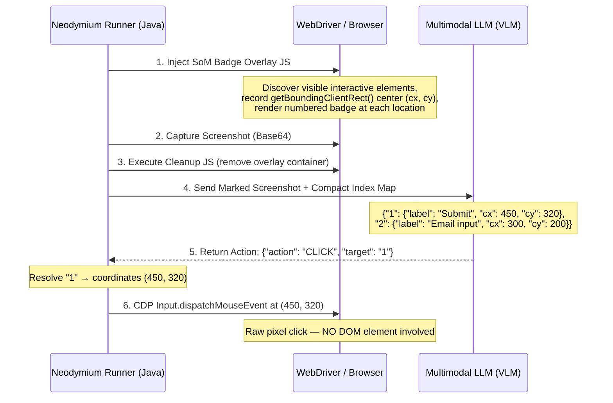
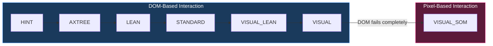

# Webpage Representation in AI Web Agents: Token Count & Reliability Analysis

This document analyzes how modern AI web agents and natural language automation tools serialize and present webpages to Large Language Models (LLMs). It evaluates different strategies across the dual axes of **Token Efficiency** and **Interaction Reliability**, and proposes a vision-guided coordinate interaction mode (`VISUAL_SOM`) as the ultimate fallback for Neodymium AI.

---

## 🗺️ Architectural Taxonomy of DOM Representation

```mermaid
graph TD
    A[Webpage Representation Strategies] --> B[Text-Based DOM]
    A --> C[Visual / Coordinates]
    
    B --> B1[Raw HTML Cleaning <br> Token: Ultra-High <br> Reliability: Low]
    B --> B2[Interactive Filtering <br> Token: Moderate <br> Reliability: High]
    B --> B3[Accessibility Tree AXTree <br> Token: Low <br> Reliability: Very High]
    
    C --> C1[Set-of-Mark SoM Tagging <br> Token: Flat / Visual <br> Reliability: Extremely High]
    C --> C2[Vision-Only Coordinate Prediction <br> Token: Flat / Visual <br> Reliability: Vision-Dependent]

    style B fill:#1a3a5c,stroke:#4a9eff
    style C fill:#5c1a3a,stroke:#ff4a9e
```



---

## ⚠️ Key Architectural Insight: Presentation vs Interaction

Before analyzing the strategies, it is critical to distinguish two **independent axes** that are often conflated:

| Axis | Question It Answers | Examples |
| :--- | :--- | :--- |
| **Presentation** | *How does the LLM see the page?* | Raw HTML, filtered DOM, AXTree, screenshot, marked screenshot |
| **Interaction** | *How does the agent act on the page?* | DOM-based click (Selenium `.click()` on a located element) vs Pixel-coordinate click (`Input.dispatchMouseEvent` at `(x, y)`) |

All existing Neodymium context levels (`HINT` through `VISUAL`) ultimately resolve to a **DOM element** via `data-neo-ref`. Even in `VISUAL` mode, the LLM sees a screenshot but its job is to map what it sees back to a `data-neo-ref` identifier in the text DOM context. The actual click is always performed through Selenium's standard DOM interaction.

**Set-of-Mark (SoM)** by itself is purely a **presentation technique** — it makes the LLM's job of identifying targets easier by overlaying numbered badges. If the badges still map back to DOM elements and we still click via DOM, we haven't gained a fundamentally new capability over `VISUAL` mode.

The real capability gap is: **when the DOM gives us nothing useful, can we bypass it entirely and click by pixel coordinates?** That is what a true `VISUAL_SOM` mode enables — it is not just "better visual grounding", it is a fundamentally different **interaction mechanism**.

---

## 🔍 Detailed Strategy Analysis

### 1. Raw HTML DOM Cleaning (The Legacy Approach)
*   **Methodology:** Grabs the full webpage HTML (`outerHTML`), strips script/style tags, and passes the remaining raw markup to the LLM.
*   **Token Count:** **Extremely High (20k - 100k+ tokens)**. Complex modern pages overflow context windows and result in massive LLM API bills.
*   **Reliability:** **Low**. The LLM gets lost in a forest of non-semantic utility wrapper `div`s, Tailwind CSS styling classes, and structural flexboxes, making it prone to selecting incorrect or hidden elements.

### 2. Interactive-Only DOM Filtering (Our `LEAN` Context / Browser-use)
*   **Methodology:** Executes a custom JavaScript traversal to extract only structurally interactive tags (e.g., `<button>`, `<a>`, `<input>`, `<select>`, `<textarea>`) and semantic layout tags (headings).
*   **Token Count:** **Low to Moderate (1,000 - 5,000 tokens)**. Typically represents a **80%+ reduction** compared to raw HTML.
*   **Reliability:** **High**. By hiding purely layout-focused wrapper divs, the LLM is restricted to actionable nodes. This prevents the agent from hallucinating clicks on non-clickable parent grids.

### 3. The Chrome Accessibility Tree (AXTree) (Stagehand)
*   **Methodology:** Bypasses standard HTML parsing by calling the Chrome DevTools Protocol (CDP) command `Accessibility.getFullAXTree`.
*   **How it Works:** The browser's rendering engine natively builds the AXTree to support screen readers. It contains semantic roles (e.g., `"button"`, `"link"`, `"textbox"`), names, states (disabled, expanded, checked), and structural landmarks.
*   **Token Count:** **Very Low (80% - 90% reduction)**. It contains zero presentational or decorative element nodes.
*   **Reliability:** **Extremely High**. The AXTree inherently resolves screen-reader mapping rules (`aria-label`, `aria-labelledby`, form labels), handles custom nested Shadow DOMs, and presents a pure, clean representation of developer intent.

### 4. Visual Tagging & Set-of-Mark (SoM) (Tarsier / Browser-use / Visual Agents)
*   **Methodology:** Prior to taking a screenshot, a JavaScript helper locates all interactive bounding boxes and overlays small, numbered tag labels (e.g. `[1]`, `[2]`, `[3]`) directly on top of the elements in the browser viewport.
*   **Visual Grounding:** The marked screenshot is sent to a Multimodal Vision-Language Model (VLM). The VLM processes the image and returns simple actions using the visual tags (e.g., `CLICK [4]`, `TYPE "admin" INTO [2]`).
*   **Token Count:** **Flat Visual Rate (Low text token overhead)**. Typically costs ~1,000 visual tokens depending on resolution, completely independent of DOM size.
*   **Reliability:** **Extremely High for Visual Reasoning.** It completely bypasses DOM-level challenges (such as HTML canvases, cross-origin iframes, or custom shadow-DOM closures) because it acts purely on visual space. However, it requires a high-resolution VLM and can struggle if tags overlap on dense UIs.
*   **Important Nuance:** SoM is strictly a *presentation* technique. By itself, it does not dictate how the agent *interacts* with the identified element. External frameworks typically combine SoM with pixel-coordinate clicking, but it can also be combined with DOM-based clicking if the element has a DOM presence.

### 5. Vision-Guided Coordinate Interaction (SoM + Pixel Click) — Proposed `VISUAL_SOM`
*   **Methodology:** Combines the SoM presentation technique with **pixel-coordinate interaction** to completely bypass the DOM for both identification *and* execution.
*   **How it Works:**
    1.  A JavaScript overlay script identifies all visible interactive elements (using the same discovery logic as `LEAN` mode), records each element's viewport `getBoundingClientRect()` center coordinates, and renders a high-contrast numbered badge at each location.
    2.  A screenshot of the badged page is captured.
    3.  The overlay is immediately removed to restore clean DOM state.
    4.  The LLM receives the marked screenshot plus a compact index-to-element mapping (e.g., `{"1": {"label": "Submit", "cx": 450, "cy": 320}}`).
    5.  The LLM responds with a simple action (e.g., `{"action": "CLICK", "target": "3"}`).
    6.  The runner performs a raw pixel click via CDP `Input.dispatchMouseEvent` at the recorded `(cx, cy)` coordinates — **no DOM element is involved.**
*   **Token Count:** **Flat Visual Rate + minimal text index.** The text component is even smaller than `LEAN` because it only contains the index map, not full attribute dumps.
*   **Reliability:** **Extremely High for elements with no DOM presence.** This is the only strategy that can interact with canvas-rendered buttons, WebGL interfaces, embedded PDFs, and cross-origin iframe content where script injection is blocked.
*   **Key Differentiator from `VISUAL` mode:** In `VISUAL`, the LLM sees a screenshot to help it find the right `data-neo-ref` in the DOM. In `VISUAL_SOM`, the LLM picks a numbered badge and we click at its pixel coordinates — **no DOM element is needed at all.**

---

## 📊 Trade-Off Matrix

| Strategy | Token Cost | Complexity | Shadow DOM / Iframe Support | Visual Grounding | Interaction | Best Used For |
| :--- | :--- | :--- | :--- | :--- | :--- | :--- |
| **Raw HTML** | 🔴 Ultra-High | 🟢 Low | 🟡 Medium | 🔴 None | DOM | Quick scripts on small static pages |
| **Interactive Filter** | 🟡 Moderate | 🟡 Medium | 🟡 Medium | 🔴 None | DOM | Text-based agents; standard E2E testing |
| **AXTree (Stagehand)** | 🟢 Very Low | 🔴 High (Requires CDP) | 🟢 High (Pierces automatically) | 🔴 None | DOM | Complex DOMs, enterprise accessibility-compliant pages |
| **Set-of-Mark (SoM)** | 🟢 Flat / Low | 🔴 High (Injects visual layers) | 🟢 High (Visual-only) | 🟢 Perfect | DOM or Pixel | Modern canvas/visual-heavy apps, cross-origin frames |
| **Coordinate Click (SoM + Pixel)** | 🟢 Flat / Low | 🔴 Very High | 🟢 Bypasses entirely | 🟢 Perfect | **Pixel** | Canvas UIs, WebGL, embedded PDFs, when DOM fails completely |

---

## 🔬 When Does DOM-Based Interaction Fail?

Understanding when the DOM pipeline is completely exhausted helps clarify why a pixel-coordinate fallback is needed:

| Scenario | Why DOM Fails | Pixel Click Solves It? |
| :--- | :--- | :--- |
| **`<canvas>` rendered UIs** (games, maps, drawing tools) | No clickable child DOM elements exist inside the canvas. Only pixels. | ✅ Click at the visual coordinate of the rendered button/control. |
| **WebGL / Three.js** | Entire interactive surface is a single `<canvas>` element. | ✅ Same as above. |
| **Cross-origin `<iframe>`** | Browser security blocks JS injection — cannot stamp `data-neo-ref` or extract DOM. | ✅ Badge is placed visually based on rendered position; click via viewport coordinates. |
| **Embedded PDF viewers** | Rendered content has no accessible DOM structure. | ✅ Buttons/links are visual-only; pixel click works. |
| **Custom paint-based widgets** (Figma-like editors) | The "buttons" are rendered on a canvas, not DOM elements. | ✅ Visual identification + coordinate click. |
| **Standard forms, links, buttons** | DOM works fine. No need for pixel clicking. | ⚠️ Overkill. DOM-based interaction is more reliable and cacheable. |

---

## 📐 `VISUAL_SOM` Technical Lifecycle in Neodymium



### Escalation Position

`VISUAL_SOM` sits at the absolute end of the escalation chain — the nuclear option when the entire DOM-based pipeline has exhausted itself:

```
HINT → AXTREE → LEAN → STANDARD → VISUAL_LEAN → VISUAL → VISUAL_SOM
                                                              ↑
                                               DOM interaction has failed entirely.
                                               Fall back to pixel-coordinate clicking.
```

### Implementation Phases

**Phase A: Client-Side Tag Injection (JS)**
*   A lightweight JavaScript script runs the same element discovery logic as `LEAN` mode (interactive elements, clickable divs/spans, forms).
*   For each visible element, it records:
    *   The element's viewport-relative center coordinates: `{ cx: rect.left + rect.width/2, cy: rect.top + rect.height/2 }`
    *   The element's `data-neo-ref` (if available, for hybrid fallback) and display label.
*   It renders a temporary overlay container `#neodymium-som-overlay` with absolute-positioned high-contrast badges (bright yellow background, black border, bold black text, `z-index: 2147483647`).
*   Badge placement uses the element's top-left corner offset to minimize visual occlusion of the element itself.

**Phase B: Screenshot & Immediate Cleanup**
*   Selenium WebDriver captures the viewport screenshot containing the visual markers.
*   Immediately after, a cleanup script removes `#neodymium-som-overlay` to prevent badges from interfering with subsequent DOM operations, click events, or mutation observers.

**Phase C: Prompt Formulation**
*   The LLM receives:
    1.  The annotated screenshot as multimodal input (visual tokens).
    2.  A compact system prompt explaining the badge protocol.
    3.  A minimal index-to-element mapping as text:
        ```json
        {
          "1": {"tag": "button", "text": "Submit", "cx": 450, "cy": 320},
          "2": {"tag": "input", "placeholder": "Email", "cx": 300, "cy": 200}
        }
        ```
*   The text payload is intentionally minimal — the visual badges on the screenshot are the primary grounding mechanism.

**Phase D: Action Resolution (Pixel Click)**
*   The LLM responds: `{"action": "CLICK", "target": "1"}`
*   The runner looks up target `"1"` in the recorded mapping → `(cx: 450, cy: 320)`.
*   The runner executes a raw pixel click via CDP:
    ```
    cdpCommand("Input.dispatchMouseEvent", {type: "mousePressed", x: 450, y: 320, button: "left"})
    cdpCommand("Input.dispatchMouseEvent", {type: "mouseReleased", x: 450, y: 320, button: "left"})
    ```
*   No DOM element, no selector, no `data-neo-ref` is used for the click itself.

---

## ⚖️ `VISUAL_SOM` Trade-Offs & Limitations

| Concern | Impact | Mitigation |
| :--- | :--- | :--- |
| **Coordinate fragility** | If viewport size changes between badge injection and click execution, coordinates break. | Must guarantee identical viewport dimensions. Lock viewport via `--window-size` flag. |
| **No `sendKeys()` support** | You can click a pixel, but you cannot type into a canvas pixel. Typing only works if the click focuses a real `<input>`. | For typing actions, `VISUAL_SOM` clicks the target first, then checks if focus landed on a real input and delegates to standard Selenium `sendKeys()`. |
| **Animation / scroll sensitivity** | If content scrolls or animates between screenshot capture and click dispatch, coordinates become stale. | Freeze CSS animations/transitions during injection via `* { animation: none !important; transition: none !important; }`. Scroll to top or specific viewport position first. |
| **Playbook replay** | Coordinates are viewport-dependent. Replaying at a different resolution breaks everything. Much harder to cache than `data-neo-ref`. | Playbook records the viewport size alongside coordinates. On replay, verify viewport matches or re-inject badges. |
| **Badge overlap on dense UIs** | Tables, grids, or dense toolbars may cause badges to stack on top of each other, confusing the VLM. | Implement a collision-avoidance algorithm in JS to offset overlapping badges, or draw leader lines from badges to target elements. |
| **Cost** | Requires a multimodal VLM call (visual tokens). Not cacheable via dHash in the same way as standard visual assertions. | Only triggered as absolute last resort. First run costs are amortized by playbook caching of the resolved action (even if coordinate-based). |
| **Cross-origin iframe coordinates** | Cannot inject JS into cross-origin frames, so element discovery within them is impossible. | Fall back to treating the iframe as a single visual region. The VLM can still see and click content inside it visually, using the parent viewport's coordinate space. |

---

## 💡 How Neodymium AI Integrates & Dominates These Approaches

Neodymium AI represents a highly advanced hybrid of these paradigms, engineered specifically to solve the cost-vs-reliability dilemma:

1.  **Adaptive Multi-Tier Escalation:**
    Rather than committing to a single representation strategy, Neodymium adapts dynamically:
    *   **`HINT` (Zero DOM):** If a locator hint is cached or provided, it sends **zero HTML elements**, achieving near-instant execution for practically 0 tokens.
    *   **`AXTREE` (Accessibility Tree):** Compact semantic tree via CDP.
    *   **`LEAN` (Interactive Elements):** Filtered interactive DOM elements only.
    *   **`STANDARD` (Full Text):** LEAN + all visible text content for assertions.
    *   **`VISUAL_LEAN` (Lean DOM + Screenshot):** Interactive elements plus base screenshot for visual checks.
    *   **`VISUAL` (Full DOM + Screenshot):** Maximum DOM context with visual grounding.
    *   **`VISUAL_SOM` (Marked Screenshot + Pixel Click):** *The ultimate fallback.* Bypasses the DOM entirely. Injects visual marker tags, captures a marked screenshot, and interacts via pixel coordinates. Used when the target element has **no DOM presence at all** (canvas, WebGL, cross-origin content).
2.  **Playbook Replay Caching (0-Token execution):**
    While frameworks like ZeroStep, Browser-use, and Midscene keep calling their LLMs/VLMs at runtime, Neodymium caches successful element-to-action paths. On replay, it bypasses the LLM completely, running **offline at native Selenium speed for exactly 0 tokens**.
3.  **Local Visual dHash Caching:**
    Instead of calling expensive Multimodal VLMs to perform repetitive visual checks on subsequent runs, Neodymium computes a 256-bit dHash of the SUT locally. Visual assertions are resolved in microseconds via local CPU-bound Hamming distance checks.

---

## 🧩 Summary: The Five Modes and Their Fundamental Boundaries



The fundamental architectural boundary in Neodymium's escalation chain is between **DOM-based interaction** (all modes from `HINT` through `VISUAL`) and **pixel-based interaction** (`VISUAL_SOM`). Crossing this boundary means abandoning DOM selectors entirely and relying on vision + raw coordinates. This should only happen as an absolute last resort, when the DOM pipeline has been fully exhausted.
