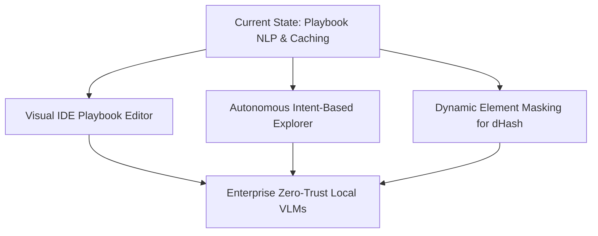

# Neodymium AI: Future Ideas & Strategic Roadmap

This document outlines strategic recommendations, future opportunities, and architectural ideas to evolve **Neodymium AI** as the premier, industry-leading JVM-native AI-driven test automation framework.

---

## 🗺️ Vision & Future Roadmap



---

## 💡 Core Strategic Ideas

### 1. IntelliJ IDEA & VSCode Visual Playbook Editor
While JSON Playbooks are human-readable, modifying complex paths or tracking dynamic changes in large suites can be tedious.
* **Concept:** Create a dedicated visual IDE extension for IntelliJ and VSCode that parses the cached `ai-playbooks` directory.
* **Capabilities:**
  * **Interactive Step Tracer:** Double-click any instruction in a `.java` or `.yaml` file to view its compiled playbook step.
  * **Visual Diff Inspector:** If a visual Hamming distance match fails (distance > 15), show a split visual diff of the recorded dHash screenshot vs the current SUT failure state.
  * **One-Click Sync:** Accept self-healed locators visually and merge them back to the Git working branch with a single button.

---

### 2. Autonomous Intent-Based QA Explorer
Evolve the experimental `AiPromptGenerator` (`@NeodymiumTestGenerator`) into a fully autonomous QA bot.
* **Concept:** Instead of step-by-step instructions, the QA engineer defines high-level goals (e.g., *"Test the checkout flow under 5 different currencies"* or *"Find broken links on the catalog page"*).
* **Execution:** 
  1. The agent autonomously crawls the application under test (SUT) using Large Action Models (LAMs).
  2. It attempts to complete the goal, recording all valid paths and UI states.
  3. Once successful, it automatically generates the standard `.yaml` test files and `.json` playbooks.
  4. It flags unexpected UI changes or error states as bugs during exploration.

---

### 3. Perceptual Screen Element-Level Masking for dHash Replay
Perceptual visual hashing (dHash) is highly effective, but dynamic UI components (such as live clocks, active usernames, changing banners, or personalized recommendations) will cause the Hamming distance comparison to fail (exceeding the threshold of 15).
* **Concept:** Introduce region or locator-based visual masking using inline NLP or standard configurations.
* **Example Instruction:**
  ```yaml
  steps: |
    Verify that the checkout receipt is visually correct (visual) (mask: #live-time, .user-name).
  ```
* **Execution:** Prior to generating the 256-bit dHash, the framework uses Selenium to locate the masked selectors (`#live-time`, `.user-name`), retrieves their coordinates, and paints those exact bounding boxes solid black on the captured screenshot buffer. This ensures robust visual validation on semi-dynamic pages.

---

### 4. Enterprise Zero-Trust / Local VLM Support
Enterprise companies are often restricted from sending SUT screenshots, DOM states, or proprietary data to external cloud APIs (like Google Gemini or OpenAI).
* **Concept:** Expand Neodymium's LLM engine to support local, on-premise execution using lightweight, open-source Vision-Language Models (VLMs) like **UI-TARS**, **Llama-3-Vision**, or **Qwen2-VL**.
* **Integration:**
  * Support running local models via **Ollama**, **vLLM**, or local **LangChain4j** providers.
  * Define optimized low-bit quantized model setups (e.g., 4-bit UI-TARS) that can execute directly on internal development machines or local Kubernetes QA clusters.

---

### 5. Continuous Self-Learning Playbook Optimizer
Test suites degrade in speed when web apps experience network jitter or minor DOM rendering slows.
* **Concept:** Implement a background optimization engine that monitors test execution telemetry over time.
* **Capabilities:**
  * **Dynamic Wait Tuning:** If a playbook step constantly triggers a transient retry before succeeding, automatically optimize the wait threshold or element state check within the playbook JSON cache.
  * **Selector Refinement:** If multiple alternative locators are found during self-healing, run minor offline background evaluations to score and swap in the most performant, stable selector.

---

### 6. AI-Driven Data Mutation & Dynamic Fuzzing
Natural language steps often require complex test data. Instead of hardcoding edge cases, let the AI generate them dynamically at runtime.
* **Concept:** Integrate dynamic fuzzing directly into steps using dynamic AI dataset generation.
* **Example Instruction:**
  ```yaml
  steps: |
    Type a dynamically generated invalid email address into the input field.
    Verify that the validation error 'Invalid email format' is visible.
  ```
* **Execution:** The agent detects the semantic request for dynamic data, asks the LLM (or a local generator) to generate mutated synthetic strings designed to trigger validation rules, and injects them dynamically during SUT execution.
