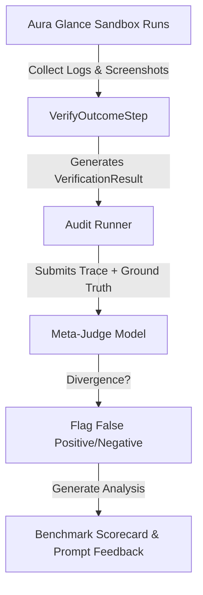
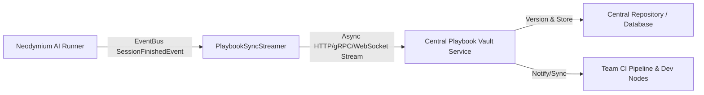
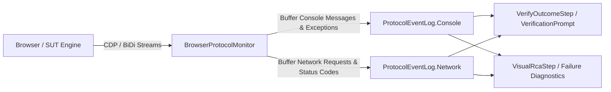
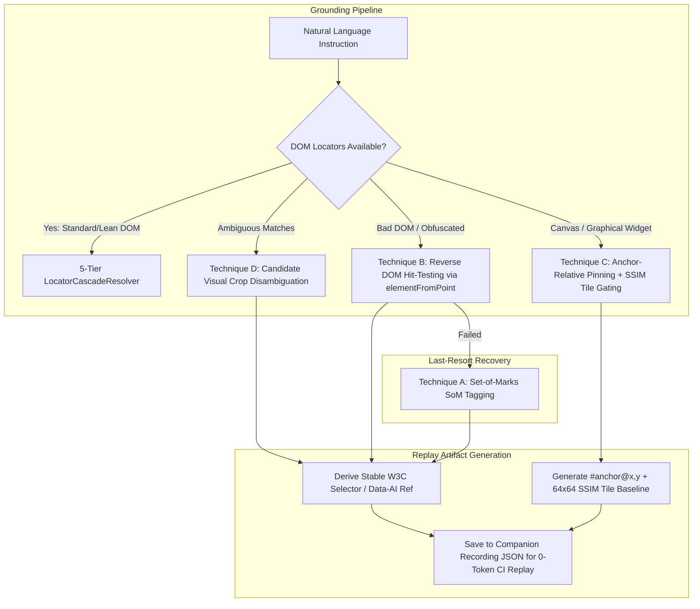
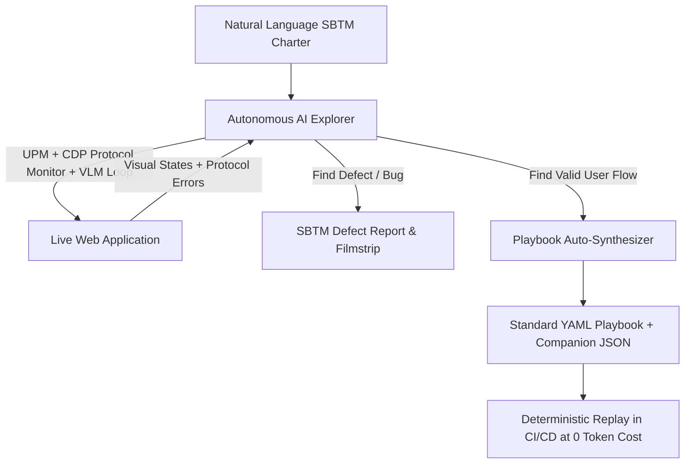

# Further Optimization Ideas - Neodymium AI

This document tracks future ideas, architecture designs, and optimization strategies for the Neodymium AI framework.

---

## 🪙 Token & Cost Optimization: Condensed JSON Payloads

### Background
During step execution, the LLM is queried with the SUT state (accessibility tree or DOM) and instructions to extract the necessary actions. Currently, the LLM returns a structured, verbose JSON response defining the step status and the resulting actions list. 

A typical LLM response length is around **313 characters** (~100 output tokens) due to structural formatting (whitespace/indentation) and empty placeholder attributes:

```json
{
  "status" : "SUCCESS",
  "reasoning" : "Navigating to the specified URL as requested.",
  "actions" : [ {
    "action" : "NAVIGATE",
    "locator" : "",
    "value" : "http://localhost:43377/AssertActionTest/testAssertHappyPath.html",
    "reasoning" : "Navigate to the test page."
  } ]
}
```

By condensing this response structure, we can significantly reduce completion tokens, lowering LLM API costs and execution latency.

---

### Proposals

#### 1. Minified & Non-Empty Payloads (Recommended)
Instruct the LLM to output minified JSON (no formatting whitespace) and completely omit empty or optional fields (e.g., omitting `locator: ""` when not needed, and omitting action-level `reasoning` if top-level `reasoning` covers it).

* **Proposed Format**:
  ```json
  {"status":"SUCCESS","reasoning":"Navigating to URL.","actions":[{"action":"NAVIGATE","value":"http://localhost:43377/AssertActionTest/testAssertHappyPath.html"}]}
  ```
* **Impact**:
  * **Size**: **141 characters** (a **~55% reduction** in output tokens).
  * **Implementation**: Requires updates to system prompts instructing the model to output compact JSON and omit unused properties. No parser changes are needed as Jackson naturally ignores missing fields or handles nulls gracefully.

---

#### 2. Short Key Aliases in Prompt and Parser
Add support for short, single-character key mappings within the prompt definitions and the Java parser (`ActionExtractionPrompt.java` and `VerificationPrompt.java`).

* **Proposed Mappings**:
  * `status` $\rightarrow$ `st`
  * `reasoning` $\rightarrow$ `r`
  * `targetContextLevel` $\rightarrow$ `tc`
  * `actions` $\rightarrow$ `acts`
  * `action` $\rightarrow$ `a`
  * `locator` $\rightarrow$ `l`
  * `value` $\rightarrow$ `v`

* **Proposed Format**:
  ```json
  {"st":"SUCCESS","r":"Navigating.","acts":[{"a":"NAVIGATE","v":"http://localhost:43377/AssertActionTest/testAssertHappyPath.html"}]}
  ```
* **Impact**:
  * **Size**: **117 characters** (a **~63% reduction** in output tokens).
  * **Implementation**: Requires code changes in `ActionExtractionPrompt.java` to check for these short key names when parsing the JSON response.

---

## 🔄 Redesign: Dynamic LLM Provider Configuration & Assignment

### Current Limitations
Currently, deciding whether to use a mock or live LLM provider is resolved by:
1. Package name scanning (e.g. checking if the active JUnit test class package contains `.mock.` or `.live.`).
2. Programmatically overriding properties in thread-local storage (`Neodymium.getData()`).

This approach has several drawbacks:
* **Coupling to package structure**: Tests must be located in specific subpackages to activate their respective providers.
* **Low flexibility**: Cannot easily run the same test method against different LLM providers (e.g. comparing Gemini 2.5 Flash vs. Gemini 2.5 Pro, or swapping to a mock provider for isolated assertions) without reorganizing packages or executing runtime property overrides.
* **Redundant Configuration**: Test classes require boilerplate config overrides.

---

### Proposed Redesign: Annotation-Driven & Scoped Registry Bindings

#### 1. Provider Registry Bindings
Instead of global property resolving, the `LlmRegistry` should support dynamic, scoped bindings. The test runner can set up these bindings on the registry during test instantiation.

```java
// Bind text capabilities to a specific provider name or class programmatically
session.getLlmRegistry().bind(LlmCapability.TEXT_ONLY, "mock-gemini");
```

#### 2. Annotation-Driven Assignment
Introduce new annotations to assign providers to specific test classes or methods:
* `@LlmProvider("mock")` or `@LlmProvider("gemini-live")`: Binds the provider by name to the test scope.
* `@LlmConfiguration(model = "gemini-2.5-pro", temperature = 0.2)`: Allows custom configuration parameters per test scope.

Example:
```java
@NeodymiumAiTest
@LlmProvider("mock") // Declares that this test class must run with the MockLlmProvider
public class MyActionIntegrationTest extends BaseAiTest {
    ...
}
```

#### 3. Task-Specific Model Routing & Property Design
Rather than relying on a single global `neodymium.ai.model` property, the property configuration should support assigning different models to different tasks (e.g. action extraction vs. visual verification vs. RCA analysis):

* **Task-Specific Properties Configuration (`neodymium.properties`)**:
  ```properties
  # Default fallback model
  neodymium.ai.model=gemini-2.5-flash

  # High-reasoning model for extracting Selenide actions
  neodymium.ai.task.extraction.model=gemini-2.5-pro

  # Faster/cheaper model for verifying page outcomes/screenshots
  neodymium.ai.task.verification.model=gemini-2.5-flash

  # Heavy model for visual root cause analysis (RCA) on failure
  neodymium.ai.task.rca.model=gemini-2.5-pro
  ```

* **Task-Based Registry Lookups**:
  Define a `LlmTask` enum and allow the pipeline execution engine to request providers from the registry matching the capability and specific task context:
  ```java
  public enum LlmTask
  {
      EXTRACTION,
      VERIFICATION,
      RCA,
      DEFAULT
  }
  ```
  ```java
  // Request the specific model instance registered/configured for verification
  final LlmProvider provider = session.getLlmRegistry().getProvider(LlmCapability.MULTIMODAL, LlmTask.VERIFICATION);
  ```

This decouples the provider lifecycle completely from class package locations, providing robust thread-isolation, cost control (by using cheaper models for simple verification tasks), and optimized reasoning capabilities tailored to each task.

---

## ⚖️ Offline Meta-Judge & Validation Benchmarking (LLM-as-a-Judge)

### Background
As system prompts, LLM model versions, and SUT web page layouts evolve, the semantic verification performed by the inline [VerificationPrompt](file:///../src/main/java/org/neodymium/ai/prompt/VerificationPrompt.java) can drift. To ensure the reliability of our test assertions and prevent silent false positives (where tests pass despite errors) or false negatives (where correct actions are marked as failed), we need an automated way to "verify the validator."

---

### Proposed Design: Meta-Judge Auditing Pipeline

We propose introducing a decoupled **Meta-Judge Auditing Pipeline** to benchmark the accuracy of our outcome verification system.

#### 1. Gold Standard Benchmark Dataset
Utilizing our self-contained test environment under the `Aura Glance Sandbox` (`src/test/resources/ai-test-pages/AuraGlanceTest/`), we define scenarios representing common execution success and failure topologies:
* **Expected Pass (Success):** Standard, bug-free flow transition (e.g., successful login redirect).
* **Expected Action Fail (Executor Error):** The agent clicks the wrong element or inputs invalid values (e.g., inputs numeric values in a name-only field).
* **Expected State Fail (System Error):** The agent performs correct actions, but the system displays a validation error or a 500 Server Error page.
* **Expected Silent Fail (State Stagnation):** The agent clicks a button, but the page doesn't update (e.g., cart quantity doesn't increment).

#### 2. Auditing Loop
During benchmark execution, the test suite captures:
1. The **Instruction** & **Actions** executed.
2. The **SUT State screenshots** (Before / After).
3. The **VerificationResult** produced inline (e.g., by Gemini 3.5 Flash).
4. The known **Ground Truth label** (Expected Pass/Fail).

A post-hoc evaluation job submits these traces to a high-tier reasoning model (e.g., Gemini Pro) acting as the **Meta-Judge**:


```mermaid
graph TD
    A[Aura Glance Sandbox Runs] -->|Collect Logs & Screenshots| B[VerifyOutcomeStep]
    B -->|Generates VerificationResult| C[Audit Runner]
    C -->|Submits Trace + Ground Truth| D[Meta-Judge Model]
    D -->|Divergence?| E[Flag False Positive/Negative]
    E -->|Generate Analysis| F[Benchmark Scorecard & Prompt Feedback]
```

#### 3. Output & Actionability
The Meta-Judge generates an **Evaluation Scorecard** detailing:
* **Precision / Recall / Accuracy** of the inline validator.
* **Trace Divergence Explanations:** Plain-English explanations of why a step was misjudged (e.g., *"The inline validator missed the validation message 'Out of stock' because the font size was small and the overall page transitioned to a PLP."*).
* **Prompt Recommendations:** Suggestions for adjusting rubrics or adding few-shot examples to the prompt system message.

---

## 🛡️ "Ultra" High-Strength Execution & Healing Mode

### Background
During test execution or self-healing, when standard action extraction or verification fails, the default reasoning prompt or condensed DOM structure may not contain enough semantic clues to succeed. In these situations, we need a high-strength fallback mode that commits more resources (tokens, models, and inputs) to recover the step and prevent test failure.

---

### Proposal
Introduce a configurable "Ultra Mode" for execution and self-healing:
* **Enriched DOM & Context Representation:** Bypass normal token-saving truncations to feed more complete DOM details, sibling attributes, or full CSS state to the LLM.
* **Multimodal & Visual Reasoning:** Dynamically capture and inject full screenshots, region crops, or visual bounding box overlays (e.g. Set-of-Mark prompting) to let the model visually locate elements.
* **Divergent Prompts & High-Reasoning Models:** Query the LLM using distinct prompt templates tailored for hard cases (e.g., using Chain-of-Thought reasoning). Automatically route these queries to high-tier reasoning models (such as Gemini Pro or Ultra equivalent) with optimized temperature and sampling settings.
* **Self-Reflection & Verification Loops:** Run a multi-turn reasoning loop where the model first proposes an action, evaluates its own proposal against the visual state, and refines it before final execution.
* **Cost & Resource Transparency:** Explicitly track and report the increased token usage, execution time, and estimated financial cost in the test report when Ultra Mode is triggered, ensuring full awareness of the overhead.
* **Visual-Only Coordinate Interaction:** Introduce support for pure visual-only interactions where the model identifies target elements solely from screenshots and interacts with the page via direct coordinate-based mouse clicks and inputs, bypassing DOM-based locators entirely (e.g., for interacting with canvas elements or non-standard custom graphics).
* **Hybrid DOM-Coordinate Interaction:** Retrieve target element locations/boundaries via the DOM, but perform the actual interactions (hovering, clicking, typing) by calculating screen coordinates and simulating mouse trajectories.
* **Human-like Input Simulation:** Emulate realistic mouse movements using curved trajectories (e.g., Bézier curves) and dynamic speed profiles (Fitts's Law) dispatched via low-level CDP (Chrome DevTools Protocol) events to bypass bot-detection mechanisms.
* **Post-Execution Session Audit & Drift Review:** Option to submit the entire execution history (the complete sequence of steps, screenshots, actions, and inputs) to a post-run review process (either inline or via a separate LLM evaluation step). This checks for gradual state drift, circular loops, or silent failures that might have caused the agent to wander off-track over a longer session, appending this audit analysis to the final test report.


---

## 🔌 Pluggable Verification Modules

### Background
Currently, page state verification focuses primarily on functional outcomes (e.g., did the page transition, or did an action complete successfully). However, real-browser test suites are also an excellent opportunity to audit content and UI standards. Introducing a pluggable, modular verification system would allow teams to opt-in to non-functional quality gates without overloading the core functional execution logic.

---

### Proposal
Introduce a pluggable verification framework where developers can register optional validation modules to run during or after test execution:
* **Locale Consistency Modules:** Verify that dynamic content (e.g., dates, times, currencies, and numbers) is formatted correctly according to the target locale configurations.
* **Language & Editorial Quality Modules:** Run automated checks using specialized LLM prompts to verify spelling, grammar, and adherence to specific brand guidelines (voice, tone, terminology).
* **Image-Text Consistency Modules:** Use multimodal LLMs to analyze page content and verify that visual assets (images, banners, product pictures) match their accompanying text descriptions (e.g., flagging placeholder images, or detecting if a "Red Jacket" product page displays an image of a blue shirt).
* **Visual Layout & Template Consistency Modules:** Match the current page layout against baseline template images or visual layout structures defined for specific page types (e.g., PLP, PDP, Checkout) to ensure structural and design consistency. This checks that layout blocks, headers, and footers align with the reference template, which may require capturing and evaluating "long" (full-page scroll) screenshots.
* **Local Screenshot Reference Comparison Module:** Validate the current page's visual state against a reference screenshot stored on the local filesystem. The system instructs the multimodal LLM to compare the live screen capture with the reference file using a user-specified comparison standard. The evaluation supports various comparison modes and criteria:
  * **Identical / Pixel-Approximate:** Confirming that the layout, structure, and spacing are identical to the baseline, allowing only minor background noise or anti-aliasing differences.
  * **Similar Design / Structural Equivalence:** Checking if the page retains a similar visual design, alignment, grid structure, and branding, even if the actual content or images have been updated.
  * **Different Locale Validation:** Evaluating the layout of a translated or localized page against a master reference to ensure text expansions, currency symbols, and multi-byte characters do not break the design or alignment.
  * **Missing or Excess Elements Detection:** Prompting the LLM to inspect both images side-by-side to call out specific missing elements (e.g., a header button or promo banner that is gone) or unexpected extra components (e.g., a stray modal or double footer).
* **Accessibility (a11y) Auditing Modules:** Run accessibility checks (e.g., validating ARIA labels, color contrast ratios, semantic HTML structure, and keyboard navigability) either as a main step action within the test flow or as an optional post-step audit check.

---

## 🗺️ Automated Exploratory Testing (SBTM)

### Background
Traditional automated testing executes static, predefined script paths. While effective, it misses visual regressions, logic gaps, or edge cases that occur off the beaten path. By combining LLM-based web page interaction with Session-Based Test Management (SBTM) principles, we can run autonomous exploratory test sessions guided by high-level human ideas.

---

### Proposal
Implement an automated exploratory testing engine in Neodymium:
* **Charter-Driven Exploration:** The engine accepts a natural-language SBTM Charter (e.g., *"Explore the shopping cart under high latency, adding/removing items rapidly, to identify race conditions or UI breakdowns"*).
* **Autonomous Interaction:** The LLM determines and executes interaction sequences on the SUT dynamically, balancing goal-oriented navigation (following the charter) with random path exploration.
* **Findings Recording & Session Protocol:** Automatically track all interactions, page transitions, visual states, and console logs during the session. At the end of the run, compile a comprehensive SBTM session protocol containing findings, suspected bugs, coverage metrics, and step-by-step reproduction logs.

---

## 📝 Miscellaneous Thoughts & Reflections

### 🧠 Pre-emptive Self-Healing & "Second Opinion" Thresholds
When an agentic step or locator execution fails or exhibits low confidence (low token probabilities, high complexity, or repeated execution exceptions), we should explore triggering an adaptive reflection phase.
* **Reflective Re-framing:** The agent pauses, steps back, and reflects on the current DOM state, its overall approach, and previous context to "heal" its strategy or request a second opinion under a different persona/prompt structure.
* **Check Existing Mechanics:** We need to review how Neodymium currently handles locator self-healing under the hood (heuristics, triggers, alternate DOM lookups) to ensure any future reasoning-level healing aligns with or expands upon this foundation.

---

## 📡 Playbook Synchronization & Central Service Streaming

### Background
Currently, playbooks (YAML) and companion recording JSON files are saved locally on disk (e.g. `src/test/resources/` or `target/ai-recordings/`). In distributed test environments (such as parallel CI nodes, cloud build runners, or multi-developer setups), new or updated playbook recordings generated on ephemeral worker nodes remain isolated within the local filesystem unless manually committed.

To support seamless team collaboration and automated baseline management across distributed test pipelines, the framework should support streaming updated or new playbooks and companion recordings to a centralized synchronization service.

---

### Proposed Design: Event-Driven Playbook Streaming


```mermaid
graph LR
    A[Neodymium AI Runner] -->|EventBus SessionFinishedEvent| B[PlaybookSyncStreamer]
    B -->|Async HTTP/gRPC/WebSocket Stream| C[Central Playbook Vault Service]
    C -->|Version & Store| D[Central Repository / Database]
    C -->|Notify/Sync| E[Team CI Pipeline & Dev Nodes]
```

#### 1. Remote / Streaming `PlaybookResourceManager`
Introduce a remote-capable implementation of `PlaybookResourceManager` (e.g., `StreamingPlaybookResourceManager` or `HttpPlaybookResourceManager`) that wraps local storage and streams updates:
* **Dual-Write / Async Buffer**: Writes locally (to `target/ai-recordings/`) for immediate test execution, while asynchronously queuing the updated playbook/recording JSON for streaming to the central service.
* **Non-Blocking Execution**: Streaming operations occur asynchronously in background worker threads to avoid adding latency to test execution.

#### 2. Features & Capabilities

* **Centralized Playbook Vault**: Maintains a single source of truth for all recorded SUT actions, baseline visual hashes, and locator candidates across the organization.
* **Live CI Replay Baseline Pulling**: Worker nodes running in `REPLAY_STRICT` mode can dynamically pull the latest validated companion JSON baselines from the central service if they are missing locally.
* **Conflict Resolution & Versioning**: The central service manages versioning (e.g., semantic tagging or git commit association) for recorded playbooks to prevent overwriting valid baselines when tests run concurrently across branches.
* **Real-time Session Streaming**: Stream executed actions, screenshot hashes, and execution metrics live to a centralized dashboard while test suites run.

#### 3. Configuration & Security Settings (`neodymium.properties`)

```properties
# Enable centralized playbook synchronization
neodymium.ai.sync.enabled=true

# Endpoint URL for the central playbook vault service
neodymium.ai.sync.endpoint=https://playbook-vault.internal/api/v1/sync

# Authentication token (passed dynamically via env variable)
neodymium.ai.sync.apiKey=${PLAYBOOK_SYNC_API_KEY}

# Sync scope: RECORDINGS_ONLY, PLAYBOOKS_ONLY, or ALL
neodymium.ai.sync.scope=ALL

# Strategy for handling conflicts: SERVER_WINS, CLIENT_WINS, or FAIL_ON_CONFLICT
neodymium.ai.sync.conflictStrategy=SERVER_WINS
```

---

## 🎯 Opt-In Strict Verification Mode for Replay

### Background
Currently, replay mode skips `VerifyOutcomeStep` execution for maximum execution speed (`if (mode.isReplay()) return;`). Even during live runs, failed outcome checks produce soft log warnings rather than failing the test run. While this maximizes execution speed, visual SSIM and selector resolution alone cannot catch subtle text/behavioral regressions (e.g., text changing from "Order Confirmed" to "Order Failed" while maintaining identical element structure).

### Proposal
Introduce an opt-in strict verification configuration flag:
```properties
# Enable strict semantic outcome verification (fails test on outcome assertion failure, including on replay)
neodymium.ai.verification.strictMode=true
```
* **Default (`false`)**: Fast execution — soft warnings logged in live mode; verification skipped on replay.
* **Strict (`true`)**: Verification steps run on replay and throw a `ConclusiveFailureException` if outcome checks or semantic assertions fail, enforcing strict semantic regression testing.

---

## 🧹 Configurable Overlay & Popup Dismissal Selectors

### Background
When an interactive action fails, `PrepareRetryStep` attempts to dismiss blocking UI overlays (such as cookie banners or popups) before re-attempting execution. Currently, the CSS selectors for overlay dismissal are hardcoded inside a JavaScript snippet in `PrepareRetryStep`:
```javascript
".modal, .overlay, .popup, [role=\"dialog\"], .cookie-banner, #cookie-consent"
```
This hardcoded list misses custom popups in modern web applications (e.g., OneTrust `#onetrust-consent-sdk`, Material UI `.MuiDialog-root`, or Tailwind overlays) and provides no mechanism for test authors to customize or disable overlay hiding.

### Proposal
Expose overlay dismissal selectors as a dynamic configuration property resolved via `AiConfiguration.getInstance()`:
```properties
# Configurable CSS selectors for automated overlay dismissal during retry
neodymium.ai.retry.overlaySelectors=.modal, .overlay, .popup, [role="dialog"], .cookie-banner, #cookie-consent, #onetrust-consent-sdk
```
* **Customization**: Allows test engineers to configure application-specific popup selectors per test suite or environment.
* **Disabling**: Setting `neodymium.ai.retry.overlaySelectors=""` disables automatic overlay hiding entirely for tests that explicitly test modal dialogs.

---

## 🔍 Fast Offline CSS Selector Syntax Validation via jsoup QueryParser

### Background
Currently, CSS selector strings compiled in playbooks or generated by LLMs during recording/healing are checked at runtime by passing them to Selenium `WebDriver` (`driver.findElements(By.cssSelector(...))`). If a CSS selector contains syntax errors, WebDriver throws an `InvalidSelectorException` only after a browser IPC call.

### Proposal
Utilize jsoup's internal query parser (`org.jsoup.select.QueryParser.parse(String query)`) for zero-cost, offline validation of CSS selectors before browser execution.

`QueryParser` parses a CSS selector into a structural AST (`Evaluator` hierarchy) in pure memory and throws `org.jsoup.select.SelectorParseException` if it encounters invalid syntax (e.g. unclosed attribute brackets, malformed pseudo-classes, or trailing combinators).

```java
public static boolean isCssSelectorValid(final String cssSelector)
{
    if (cssSelector == null || cssSelector.isBlank())
    {
        return false;
    }
    try
    {
        org.jsoup.select.QueryParser.parse(cssSelector);
        return true;
    }
    catch (org.jsoup.select.SelectorParseException e)
    {
        return false;
    }
}
```

### Key Use Cases
* **Playbook Pre-flight Linting**: Sanity-check all CSS selectors in YAML playbooks during test suite loading/discovery before launching browser instances.
* **LLM Candidate Filtering (`LocatorImprover`)**: Immediately reject malformed CSS selectors generated by AI recording or self-healing before sending them to the browser driver.
* **Startup Config Validation**: Validate dynamic configuration properties (such as `neodymium.ai.retry.overlaySelectors`) at initialization time.

### Technical Considerations
* **Scope**: Applies strictly to CSS selectors. XPath locators (starting with `//` or `xpath=`) should bypass `QueryParser` and use Java `XPathFactory` for validation.
* **Dependencies**: Ensures direct dependency usage of `org.jsoup:jsoup` in `pom.xml`.

---

## 🎨 Visual Root Cause Analysis (Visual RCA) Enhancements

### Background
When a test execution fails conclusively, Neodymium AI triggers `VisualRcaStep` (guarded by `neodymium.ai.visualRca.enabled`). Currently, Visual RCA inspects a single failure screenshot along with the failed step instruction and exception message to generate a high-level text explanation.

While effective for basic failure analysis, diagnosing complex UI failures (such as subtle layout shifts, element occlusion, or multi-step cascading errors) requires richer visual and structural context.

### Proposed Enhancements

#### 1. Baseline vs. Failure Screenshot Delta Analysis
* **Concept**: Feed both the golden/recorded baseline screenshot and the live failure screenshot (plus optional SSIM heatmap diff) side-by-side to the Vision LLM.
* **Benefit**: Allows the LLM to perform precise visual regression diagnosis—pinpointing missing components, altered layouts, styling glitches, or unintended text changes relative to expected state.

#### 2. Set-of-Mark (SOM) Bounding Box Overlays
* **Concept**: Superimpose numbered bounding box overlays (`[1]`, `[2]`, etc.) or DOM element outlines onto the failure screenshot before sending it to the Vision model.
* **Benefit**: Enables Visual RCA to cite specific visual element markers (e.g., *"Element [12] (`#submit-btn`) is occluded by Modal overlay [3] (`#cookie-consent`)"*) rather than vague visual descriptions.

#### 3. Multi-Step Trajectory Timeline (Failure Filmstrip)
* **Concept**: Attach a filmstrip sequence of screenshots from the last $N$ executed steps leading up to the failure.
* **Benefit**: Helps diagnose cascading failures where the true root cause occurred several steps prior to the failed assertion (e.g. an unhandled popup appeared 2 steps ago).

#### 4. Structured Diagnostic Schema & Report Integration
* **Concept**: Standardize Visual RCA response output into a typed JSON schema:
  * `category`: `ELEMENT_OCCLUDED`, `VISUAL_REGRESSION`, `DOM_CHANGE`, `ASSERTION_MISMATCH`, or `NETWORK_ERROR`
  * `confidence`: Score from `0.0` to `1.0`
  * `suggestedRemediation`: Actionable fix (e.g., *"Update selector from `#btn` to `#btn-primary` or add overlay dismissal step"*)
  * `summary` / `explanation`: Human-readable summary
* **Benefit**: Enables automated embedding of visual diagnostic cards directly into JUnit XML reports, Allure reports, and CI/CD dashboards.

---

## 🗺️ Strategic Roadmap Ideas (from IDEAS.md)

### 1. IntelliJ IDEA & VSCode Visual Playbook Editor
While JSON Playbooks are human-readable, modifying complex paths or tracking dynamic changes in large suites can be tedious.
* **Concept:** Create a dedicated visual IDE extension for IntelliJ and VSCode that parses the cached `ai-playbooks` directory.
* **Capabilities:**
  * **Interactive Step Tracer:** Double-click any instruction in a `.java` or `.yaml` file to view its compiled playbook step.
  * **Visual Diff Inspector:** If a visual Hamming distance match fails (distance > 15), show a split visual diff of the recorded dHash screenshot vs the current SUT failure state.
  * **One-Click Sync:** Accept self-healed locators visually and merge them back to the Git working branch with a single button.

---

### 2. Empirical Learning (Observed Execution Caching)
Web applications exhibit distinct runtime timing profiles, page loading characteristics, and visual stability periods (e.g., dynamic CSS animations, slow modal fades, or AJAX-driven element reveals).
* **Concept:** Implement a local, offline telemetry engine that learns the execution dynamics of the SUT over successive test runs.
* **Capabilities:**
  * **Adaptive Page Stability Waiting:** Automatically calculate the ideal stabilization delays between actions based on historically observed DOM mutations and visual changes, replacing static delays.
  * **Dynamic Timing/Timeout Profiling:** Track how long specific elements take to load or interact on a page. Cache these dynamic execution profiles to automatically set fine-grained, adaptive command timeouts for each step.
  * **Context Level Optimization:** Observe the exact context escalation paths that previously succeeded for specific instructions, proactively starting subsequent runs at the exact required context level to bypass wasted fallback cycles.

---

### 3. Autonomous Intent-Based QA Explorer
Evolve the experimental `AiPromptGenerator` (`@NeodymiumTestGenerator`) into a fully autonomous QA bot.
* **Concept:** Instead of step-by-step instructions, the QA engineer defines high-level goals (e.g., *"Test the checkout flow under 5 different currencies"* or *"Find broken links on the catalog page"*).
* **Execution:** 
  1. The agent autonomously crawls the application under test (SUT) using Large Action Models (LAMs).
  2. It attempts to complete the goal, recording all valid paths and UI states.
  3. Once successful, it automatically generates the standard `.yaml` test files and `.json` playbooks.
  4. It flags unexpected UI changes or error states as bugs during exploration.

---

### 4. Perceptual Screen Element-Level Masking for dHash Replay
Perceptual visual hashing (dHash) is highly effective, but dynamic UI components (such as live clocks, active usernames, changing banners, or personalized recommendations) will cause the Hamming distance comparison to fail (exceeding the threshold of 15).
* **Concept:** Introduce region or locator-based visual masking using inline NLP or standard configurations.
* **Example Instruction:**
  ```yaml
  steps: |
    Verify that the checkout receipt is visually correct (visual) (mask: #live-time, .user-name).
  ```
* **Execution:** Prior to generating the 256-bit dHash, the framework uses Selenium to locate the masked selectors (`#live-time`, `.user-name`), retrieves their coordinates, and paints those exact bounding boxes solid black on the captured screenshot buffer. This ensures robust visual validation on semi-dynamic pages.

---

### 5. Enterprise Zero-Trust / Local VLM Support
Enterprise companies are often restricted from sending SUT screenshots, DOM states, or proprietary data to external cloud APIs (like Google Gemini or OpenAI).
* **Concept:** Expand Neodymium's LLM engine to support local, on-premise execution using lightweight, open-source Vision-Language Models (VLMs) like **UI-TARS**, **Llama-3-Vision**, or **Qwen2-VL**.
* **Integration:**
  * Support running local models via **Ollama**, **vLLM**, or local **LangChain4j** providers.
  * Define optimized low-bit quantized model setups (e.g., 4-bit UI-TARS) that can execute directly on internal development machines or local Kubernetes QA clusters.

---

### 6. Continuous Self-Learning Playbook Optimizer
Test suites degrade in speed when web apps experience network jitter or minor DOM rendering slows.
* **Concept:** Implement a background optimization engine that monitors test execution telemetry over time.
* **Capabilities:**
  * **Dynamic Wait Tuning:** If a playbook step constantly triggers a transient retry before succeeding, automatically optimize the wait threshold or element state check within the playbook JSON cache.
  * **Selector Refinement:** If multiple alternative locators are found during self-healing, run minor offline background evaluations to score and swap in the most performant, stable selector.

---

### 7. AI-Driven Data Mutation & Dynamic Fuzzing
Natural language steps often require complex test data. Instead of hardcoding edge cases, let the AI generate them dynamically at runtime.
* **Concept:** Integrate dynamic fuzzing directly into steps using dynamic AI dataset generation.
* **Example Instruction:**
  ```yaml
  steps: |
    Type a dynamically generated invalid email address into the input field.
    Verify that the validation error 'Invalid email format' is visible.
  ```
* **Execution:** The agent detects the semantic request for dynamic data, asks the LLM (or a local generator) to generate mutated synthetic strings designed to trigger validation rules, and injects them dynamically during SUT execution.

---

### 8. `@AiPlaybook` Annotation & Playbook Recording Path Architecture
The current `@AiPlaybook` annotation handles basic YAML playbook loading and deterministic replay file binding (via `recordingMethod` and `recordingFileName`). However, as test suites scale, managing companion recording paths across multiple execution environments, datasets, and cross-class scenarios requires a dedicated architecture review.
* **Key Areas to Revisit & Explore:**
  * **Recording Directory Scoping:** Allow configuring custom output directories for recorded companion JSON files (e.g., separating integration baseline recordings from staging/prod baselines via annotation or properties).
  * **First-Class Cross-Class Replay Reference:** Support referencing recordings from different test classes directly via annotation (e.g., `recordingClass = LoginTest.class, recordingMethod = "testLogin"`).
  * **Explicit Shared Recording Registries:** Create a central registry/catalog for shared test workflows (e.g. login, guest checkout setup) where multiple test classes can bind to a single canonical baseline recording without duplicating JSON companion files.
  * **Annotation Syntax Streamlining:** Evaluate combining `@AiPlaybook`, `@AiMode`, and `@AiDataSet` into unified meta-annotations or composable test annotations to reduce boilerplate on test methods.

---

## 🌐 Continuous CDP / WebDriver BiDi Protocol Monitoring (Console & Network Interception)

### Background
Currently, Neodymium AI monitors page state via DOM snapshots and visual screenshots. However, silent failures—such as unhandled JavaScript runtime exceptions (`console.error`), unhandled Promise rejections, or failed AJAX/Fetch API calls (HTTP 4xx/5xx)—frequently do not render immediate visual error banners. This introduces a risk of false-positive test passes where functional failures in the application go undetected by visual assertions.

---

### Proposed Design: `BrowserProtocolMonitor`

Introduce a continuous protocol monitor attached to `AiSession` and `SelenideTargetExecutor` that listens to Chrome DevTools Protocol (CDP) and WebDriver BiDi event streams throughout the entire test lifecycle:


```mermaid
graph LR
    Browser[Browser / SUT Engine] -->|CDP / BiDi Streams| Monitor[BrowserProtocolMonitor]
    Monitor -->|Buffer Console Messages & Exceptions| ConsoleLog[ProtocolEventLog.Console]
    Monitor -->|Buffer Network Requests & Status Codes| NetworkLog[ProtocolEventLog.Network]
    ConsoleLog --> Verify[VerifyOutcomeStep / VerificationPrompt]
    NetworkLog --> Verify
    ConsoleLog --> RCA[VisualRcaStep / Failure Diagnostics]
    NetworkLog --> RCA
```

#### 1. JavaScript Console & Exception Listener
* **CDP Events**: Listen to `Console.messageAdded`, `Runtime.exceptionThrown`, and `Log.entryAdded`.
* **Telemetry Captured**: Timestamp, log level (`WARNING`, `ERROR`), message text, URL, line/column number, and full stack trace.
* **Rolling Buffer**: Maintained in `AiSession` and reset between playbook steps (or indexed per step).

#### 2. Network Traffic Interception & Status Tracking
* **CDP Events**: Listen to `Network.requestWillBeSent`, `Network.responseReceived`, and `Network.loadingFailed`.
* **Telemetry Captured**: Request URL, HTTP method, response status code (e.g. `500 Internal Server Error`, `404 Not Found`), MIME type, timing duration, and failure reason (e.g. `net::ERR_CONNECTION_REFUSED`, CORS error).
* **Failure Flagging**: Automatically flags any completed request with $\text{HTTP Status} \ge 400$ or failed network state.

---

## 🔍 Tri-Fold Multimodal Outcome Verification & Failure RCA

### Background
Outcome verification (`VerificationPrompt`) evaluates pre- and post-action visual screenshots and executed actions. When an API endpoint fails silently or a JavaScript runtime error crashes an event handler, the visual screenshot may appear normal, causing the LLM Judge to award an erroneous "PASS".

---

### Proposal: Tri-Fold Telemetry Injection

Inject protocol telemetry directly into `VerificationPrompt` and `VisualRcaPrompt`:

#### 1. Upgraded `absenceOfErrors` Rubric
Include the step's captured console errors and failed network requests in the LLM payload:
```json
{
  "protocolTelemetry": {
    "consoleErrors": [
      "Uncaught TypeError: Cannot read properties of undefined (reading 'items') at checkout.js:142"
    ],
    "failedNetworkRequests": [
      {
        "url": "https://example.com/api/v2/cart/checkout",
        "method": "POST",
        "status": 500,
        "statusText": "Internal Server Error"
      }
    ]
  }
}
```
If any unhandled exceptions or HTTP $\ge 400$ errors occurred during the step, the LLM Judge scores `absenceOfErrors` as **FAIL** with the exact backend/frontend failure cited in the rubric analysis.

#### 2. Enriched Visual Root Cause Analysis (Visual RCA)
When a test fails, include the latest network and console error stack traces in the Visual RCA payload. This enables the RCA model to determine whether a missing UI element was caused by a CSS rendering defect, a failed API response, or a crashed JavaScript event listener.

---

## 🏷️ Protocol-Level Assertions & Natural Language Tags

### Background
Test authors need the ability to enforce strict operational health checks directly within natural language steps without writing custom WebDriver glue code.

---

### Proposal: Built-In Protocol Control Tags and Actions

#### 1. Natural Language Playbook Control Tags
Allow test authors to append protocol assertion modifiers to any step:
* `Verify checkout modal opens (no-console-errors)`: Asserts that no JavaScript runtime exceptions occurred during modal rendering.
* `Click 'Submit Order' (no-network-errors)`: Asserts that all HTTP requests triggered by the action returned HTTP status $< 400$.
* `Click 'Apply Coupon' (expect-network-call: /api/coupons)`: Asserts that the specified network endpoint was called during the step.

#### 2. Built-In Executable Target Actions in `SelenideTargetExecutor`
* `ASSERT_NO_CONSOLE_ERRORS`: Queries `BrowserProtocolMonitor` and asserts that the step's console error buffer is empty.
* `ASSERT_NO_NETWORK_FAILURES`: Asserts that no HTTP requests completed with status $\ge 400$ or network-level errors during the step.
* `ASSERT_NETWORK_RESPONSE`: Asserts that a specified URL pattern was requested and returned an expected HTTP status (e.g. `target: "/api/cart"`, `value: "200"`).

---

## 👁️ Visual + DOM Hybrid Detection & Resilient Clicking on Bad DOM Trees

### Background
Real-world web applications frequently contain "bad" DOM trees that defeat pure DOM selectors and pure coordinate clicks alike:
* **Icon-only buttons with zero text/ARIA metadata** (e.g. `<button><svg><path ...></path></svg></button>`).
* **Non-semantic div soups** (`<div class="css-1a2b3c" onclick="...">` nested 15 levels deep without ARIA roles).
* **Obfuscated / dynamic class names** generated by Tailwind CSS, CSS Modules, or styled-components.
* **Invisible click interceptors & floating wrappers** where outer divs capture clicks intended for child icons.
* **Canvas / WebGL / SVG charts** with zero inspectable interactive DOM child nodes.

---

### Proposed Hybrid Architecture: Visual + DOM Fusion

To provide robust element interaction on bad DOM trees while maintaining **millisecond replay speeds with zero LLM calls in CI/CD**, we propose a multi-technique hybrid detection pipeline:


```mermaid
graph TD
    subgraph Detection["Grounding Pipeline"]
        Step[Natural Language Instruction] --> Primary{DOM Locators Available?}
        Primary -->|Yes: Standard/Lean DOM| Cascade[5-Tier LocatorCascadeResolver]
        Primary -->|Ambiguous Matches| TechD[Technique D: Candidate Visual Crop Disambiguation]
        Primary -->|Bad DOM / Obfuscated| TechB[Technique B: Reverse DOM Hit-Testing via elementFromPoint]
        Primary -->|Canvas / Graphical Widget| TechC[Technique C: Anchor-Relative Pinning + SSIM Tile Gating]
    end

    subgraph Fallback["Last-Resort Recovery"]
        TechB -->|Failed| TechA[Technique A: Set-of-Marks SoM Tagging]
    end

    subgraph Resolution["Replay Artifact Generation"]
        TechD --> Selector[Derive Stable W3C Selector / Data-AI Ref]
        TechB --> Selector
        TechC --> AnchorSpec[Generate #anchor@x,y + 64x64 SSIM Tile Baseline]
        TechA --> Selector
        Selector --> Playbook[Save to Companion Recording JSON for 0-Token CI Replay]
        AnchorSpec --> Playbook
    end
```

---

### Technique B: Reverse DOM Hit-Testing (`document.elementFromPoint`) & Upward Hierarchy Climbing

When the VLM identifies the target element visually on the screenshot (e.g., clicking a shopping cart icon at screen coordinates $x=842, y=315$):

1. **Hit-Testing**: The browser runtime invokes `document.elementFromPoint(x, y)` at the target coordinates.
2. **Upward Interactive Climbing**:
   - The element hit may be an un-clickable inner `<path>` or `<svg>`.
   - The runtime traverses up the DOM tree using `element.closest('button, a, [role="button"], [onclick], input, select, textarea, [tabindex]')`.
   - If no standard interactive tag is found, it inspects ancestors with `cursor: pointer` or registered event listeners.
3. **Bounding Box Validation**: Verifies that the resolved parent element bounds enclose the point $(x, y)$.
4. **Stable Selector Extraction**: The framework derives a resilient CSS/XPath locator for that live element (or stamps an automation ref ID) and records it into the companion JSON for fast CI replay.

---

### Technique C: Anchor-Relative Spatial Pinning with Local SSIM Luminance Gating

For un-inspectable canvas controls, WebGL surfaces, or custom SVG widgets where no interactive DOM element exists:

1. **Anchor Pinning**: Locate the nearest stable parent or sibling DOM container with an ID or unique class (e.g., `#analytics-canvas-container`).
2. **Relative Offset Calculation**: Record the target click point as an offset relative to that anchor (e.g., `#analytics-canvas-container@120,45`).
3. **Luminance Tile Baseline Capture**: Capture a $64 \times 64$ luminance matrix centered on the click coordinates.
4. **Replay SSIM Gating**:
   - During replay, calculate the SSIM score between the live $64 \times 64$ region and the baseline tile.
   - If $\text{SSIM} \ge 0.95$, dispatch the click immediately (native speed, zero LLM calls).
   - If $\text{SSIM} < 0.95$ (indicating layout shift, dynamic resizing, or altered graphics), abort the blind click safely and trigger self-healing.

---

### Technique D: Candidate Disambiguation via Visual Crop Comparison

When a DOM search produces multiple identical-looking elements (e.g. 5 identical `.btn-icon` elements with no distinguishing text or ARIA attributes):

1. **Candidate Region Extraction**: In a single pass, extract bounding client rectangles for all matching candidate elements.
2. **Visual Micro-Crops**: Crop screenshot thumbnails for each candidate.
3. **Multimodal Disambiguation**: Provide the micro-crops to the Vision LLM alongside the user instruction (e.g. *"Select candidate [2] (the pencil edit icon) rather than candidate [1] (the trash icon)"*).
4. **Index Binding**: Bind the selected candidate index directly to the recorded action.

---

### Technique A (Last-Resort Fallback): Set-of-Marks (SoM) Visual Badge Injection

If Techniques B, C, and D all fail to locate the target on a highly obfuscated or broken DOM tree:

1. **Badge Injection**: Inject temporary, high-contrast numbered badges (`[1]`, `[2]`, `[3]`, etc.) onto all visible clickable bounding boxes directly on the screenshot buffer.
2. **Visual Identification**: The VLM inspects the annotated image and returns the selected badge number.
3. **Element Mapping**: The runtime maps the badge number directly back to its live `WebElement` reference.

---

## 🧭 Autonomous Exploratory Mode (`ExecutionMode.AUTONOMOUS_EXPLORATION` / SBTM)

### Background
Traditional automated testing executes predefined test scripts. Autonomous exploratory testing allows an AI agent to explore an application dynamically under a high-level testing charter (e.g. discovering broken links, exploring checkout across edge cases, or validating form boundary conditions) and auto-generate deterministic test playbooks for CI/CD regression.

---

### Proposal: Dual-Mode Platform Architecture

Introduce `ExecutionMode.AUTONOMOUS_EXPLORATION`:


```mermaid
graph TD
    Charter[Natural Language SBTM Charter] --> Agent[Autonomous AI Explorer]
    Agent -->|UPM + CDP Protocol Monitor + VLM Loop| SUT[Live Web Application]
    SUT -->|Visual States + Protocol Errors| Agent
    Agent -->|Find Defect / Bug| DefectReport[SBTM Defect Report & Filmstrip]
    Agent -->|Find Valid User Flow| Synthesizer[Playbook Auto-Synthesizer]
    Synthesizer --> Playbook[Standard YAML Playbook + Companion JSON]
    Playbook --> CI[Deterministic Replay in CI/CD at 0 Token Cost]
```

1. **Charter-Driven Exploration**: The runner accepts a high-level testing charter (e.g., *"Explore product filtering and sorting options to verify no combinations produce empty or broken pages"*).
2. **Autonomous Navigation**: Uses UPM, CDP Protocol Monitoring, and the VLM loop to navigate, test edge cases, and discover defects dynamically.
3. **Playbook Auto-Synthesis**: Once a successful path is explored, automatically synthesizes standard YAML playbooks and companion JSON recordings for instant, zero-cost replay in CI/CD pipelines.


