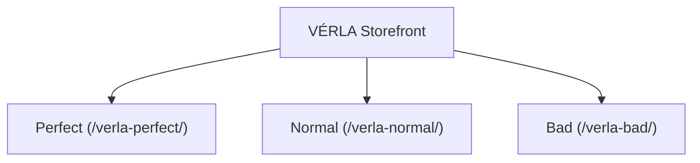

# VÉRLA Demo Store - Business Requirements and Specifications

This document defines the functional requirements, business rules, and quality dimensions of the **VÉRLA Demo Store** SUT (System Under Test) application. 

For detailed information on the sandbox architecture, multi-port server configuration, and interactive chaos injection drawers, see the parent test suite documentation in [aura-visual-defect-sandbox.md](aura-visual-defect-sandbox.md).

---

## 1. Quality-Level Dimensions (SUT Variations)

To benchmark SUT robustness, selector resilience, and visual regression capabilities, the VÉRLA storefront is served under three distinct paths. Each path represents the same visual storefront but contains radically different underlying DOM and HTML/CSS markup qualities.

### 1.1. Perfect Quality (`/verla-perfect/`)
- **Semantic HTML**: Standard layouts utilize proper semantic HTML5 tags (`<header>`, `<nav>`, `<main>`, `<section>`, `<aside>`, `<footer>`).
- **Locators & Selectors**: Every interactive element and form input is bound to unique, descriptive, and stable ID attributes (e.g., `id="nav-link-tops"`, `id="newsletter-email-input"`).
- **Accessibility (a11y)**: Built according to W3C standards and AAA accessibility guidelines, including explicit `<label>` element associations and correct `aria-*` attributes.

### 1.2. Normal Quality (`/verla-normal/`)
- **DOM Structure**: Semantic HTML tags are replaced with standard, generic `div` and `span` container structures.
- **Locators & Selectors**: Uses generic, inconsistent, or partially structured class and ID attributes (e.g., `id="inp_email"`, `class="cb-cat"`).
- **Accessibility (a11y)**: All `aria-*` elements are omitted. Form inputs lack explicit `<label>` tags and rely exclusively on `placeholder` attributes.

### 1.3. Bad Quality (`/verla-bad/`)
- **DOM Structure**: No semantic tags or standard form structures are used. Buttons and interactive inputs are constructed via styled generic tags (e.g. `div` or `span`) equipped with inline JS `onclick` attributes.
- **Locators & Selectors**: Missing standard IDs, duplicate IDs across page sections (e.g., multiple `id="prod-info"`), or randomized/obfuscated class names (e.g. `class="c-772x9"`), forcing brittle, deep-relative XPath lookups.
- **Accessibility (a11y)**: Total absence of labels, placeholder attributes, roles, and alternative image descriptions (`alt` tags).

---

## 2. Functional Requirements Specification

This section outlines the functional requirements of the VÉRLA storefront. Each requirement is structured with explicit preconditions, triggers, and expected outcomes to facilitate direct translation into automated test cases.

### 2.1. Product Catalog & Navigation (CAT)

#### REQ-CAT-01: Seeded Catalog Generation
- **Requirement**: The SUT must load and maintain a static product catalog definition on startup.
- **Business Rules**:
  - Exactly **340 unique products** must be loaded from the catalog definition file (`verla-products.json`) on server startup with varying amounts per category:
    - `Tops`: 120 products
    - `Bottoms`: 85 products
    - `Outerwear`: 45 products
    - `Footwear`: 30 products
    - `Accessories`: 60 products
  - Products must span these five primary categories.
  - Localization metadata and SUT translations are loaded from `verla-catalog.json`.
  - **Catalog Regeneration**: The static products file (`verla-products.json`) is generated by a developer utility. To regenerate the catalog (e.g. if the category configurations in `verla-catalog.json` are modified), the developer must temporarily enable and execute the JUnit test case `com.xceptance.neodymium.ai.core.RunServerTest#regenerateProductCatalogFile` (by removing its `@Disabled` annotation and running it). The test case reads the templates, generates the catalog products programmatically, and serializes the 340 products into `src/test/resources/ai-test-pages/verla-products.json`.
- **Test Extraction Guide**:
  - *Action*: Access the home page of any quality level.
  - *Expectation*: The page renders category links and featured product cards.

#### REQ-CAT-02: Product Detail Page (PDP) Dynamic Routing
- **Requirement**: Each product in the seeded catalog must have a dedicated URL matching the pattern `/verla-*/p/{slug}.html`.
- **Business Rules**:
  - PDP must display product image (dynamic SVG or raster), product name, base price, sale price (if applicable), color, description, and variant details.
  - **Stock Status & Size Selection**: The PDP size dropdown (`${product_sizes_html}`) must render size inventory status (e.g., `M (Out of stock)` with disabled option for stock $\le 0$, or `M (X left)` for low stock $\le 5$). When a size is selected, submitting the add-to-cart form appends the size to the product ID parameter (e.g., `SKU-TOP-1000:M`).
- **Test Extraction Guide**:
  - *Action*: Click on a product card or navigate directly to `/verla-*/p/{slug}.html`.
  - *Expectation*: Product details match the catalog configuration; size dropdown options are correctly styled and interactive based on stock levels.

#### REQ-CAT-03: Category Listing (PLP) Filtration & Sorting
- **Requirement**: Category pages (`/verla-*/c/{category}.html`) must display filtered grids.
- **Business Rules**:
  - Refinement sidebar filters must support Color, Price Range (`0-50`, `50-100`, `100-200`), and Sale items (Offer checkbox).
  - Sort dropdown must support "Price: Low to High" and "Price: High to Low".
  - Refinements must send query parameters (e.g. `?color=olive&sort=price-asc`) via HTMX and dynamically update the product grid.
  - **Quick Add Stock Check**: On PLP, when size choices are displayed under the "Quick Add" button, sizes with 0 stock must be disabled and have `(0)` appended to their label (e.g., `M (0)`). Accessories bypass size selection and add to cart directly.
  - **Infinite Scroll**: Scrolling to the bottom of the PLP must asynchronously load the next page of 12 products.
- **Test Extraction Guide**:
  - *Action*: Select a category, apply a color filter, select a sorting option, and scroll down.
  - *Expectation*: Product grid displays filtered matching products sorted accordingly; new items are appended upon scroll without a full page reload.

---

### 2.2. Product Search & Autocomplete (SRH)

#### REQ-SRH-01: Standard Text Search
- **Requirement**: SUT must support keyword queries via a global search form.
- **Business Rules**:
  - Submitting a query from the header search bar must redirect to `/verla-*/plp.html?q={query}`.
  - Products are matched against English names and descriptions (case-insensitive).
- **Test Extraction Guide**:
  - *Action*: Type keyword (e.g., 'Minimalist') in search and click search icon or press Enter.
  - *Expectation*: PLP loads displaying only matching items.

#### REQ-SRH-02: Search-as-you-Type Autocomplete
- **Requirement**: The search input field must display dynamic autocomplete suggestions.
- **Business Rules**:
  - As the user types (on `keyup changed delay:300ms`), suggestions are queried via GET `/verla-*/api/search/suggest`.
  - The dropdown renders up to **6 product matches** formatted as mini product cards.
  - If there are more than 6 matches, a "+ X more products. View all." link is shown which submits the search form.
  - Clicking outside the search area automatically dismisses the suggestions dropdown.
- **Test Extraction Guide**:
  - *Action*: Input 'mini' into the search box.
  - *Expectation*: Autocomplete suggestions dropdown appears containing relevant results.

---

### 2.3. User Authentication & Profile (AUT)

#### REQ-AUT-01: Customer Registration
- **Requirement**: SUT must allow customers to register a new account at `/verla-*/register.html`.
- **Validation Rules**:
  - **HTTP Method**: The SUT registration endpoint requires an HTTP `PUT` request targeting `/verla-*/api/auth/register` (not `POST`).
  - Email format must contain `@` and be unique.
  - Password must be $\ge$ 6 characters and match the confirmation.
- **Test Extraction Guide**:
  - *Action*: Submit registration form with valid or invalid fields.
  - *Expectation*: Valid inputs redirect to `/verla-*/account.html` with an active session. Invalid inputs show corresponding validation errors.

#### REQ-AUT-02: Customer Login & Logout
- **Requirement**: SUT must manage secure user sessions.
- **Business Rules**:
  - Successful login stores a `verla_session_id` cookie.
  - Logout clears the session and deletes the cookie.
- **Test Extraction Guide**:
  - *Action*: Login with credentials, then trigger logout.
  - *Expectation*: Login redirects to Account Dashboard. Logout clears session state and redirects to Home.

#### REQ-AUT-03: Address Book Management
- **Requirement**: Users must be able to save shipping addresses in their Account Dashboard.
- **Business Rules**:
  - Changing the country in the "Add Address" form triggers country-specific formatting (e.g., US/CA shows States; JP shows Prefecture/Ward).
  - **Inline Replacements**: Forms must target `#account-page-container` using `hx-target` and swap using `hx-swap="outerHTML"` to ensure pages update dynamically without nesting the sidebar layout.
- **Test Extraction Guide**:
  - *Action*: Add a new address and verify. Delete a saved address and verify.
  - *Expectation*: Added address appears in profile. Deleted address is removed from profile.

#### REQ-AUT-04: Payment Wallet Management
- **Requirement**: Users must be able to save credit cards in their Account Dashboard.
- **Business Rules**:
  - **Inline Replacements**: Card additions and deletions must target `#account-page-container` using `hx-target` and swap using `hx-swap="outerHTML"`.
- **Test Extraction Guide**:
  - *Action*: Add credit card details. Delete saved card.
  - *Expectation*: Card is added or deleted from the dashboard list.

---

### 2.4. Shopping Cart & Localized Checkout (CRT)

#### REQ-CRT-01: Cart Operations
- **Requirement**: SUT must support adding, updating, and removing cart items.
- **Business Rules**:
  - **Mini-Cart Dropdown**: In `perfect` and `normal` SUTs, hovering over the Cart icon in the header displays a dynamic mini-cart dropdown containing all cart items (thumbnails, name, size, quantity, unit price, subtotal, and a checkout link). If the cart is empty, hovering displays a "Cart is Empty." message.
  - **Cart Page Variant Display**: Cart page displays sizes next to product names (e.g. `Organic Sand tshirts (M)`). Updates and removals must be submitted via the specific Variant SKU (e.g. `SKU-TOP-1000:M`).
  - **Inline Recalculation & Coupon Error Handling**: Applying an invalid coupon must display the error message inline inside the Order Summary sidebar without breaking the Cart page headers or layout.
  - Header cart count badge must update instantly via HTMX when items are added/removed.
  - Cart page (`/verla-*/cart.html`) must display item details, subtotal, and support quantity updates.
  - Setting quantity to `0` or clicking the delete icon removes the item.
- **Test Extraction Guide**:
  - *Action*: Add item from PDP, view Cart, update quantity to 0.
  - *Expectation*: Header count matches active cart state; removing item clears it from list.

#### REQ-CRT-02: Currency & Country Selection
- **Requirement**: SUT must support international localization settings.
- **Business Rules**:
  - Selecting a country from the country selection modal (ID `country-trigger-btn`) updates the localized language and converts product prices to the target currency.
- **Test Extraction Guide**:
  - *Action*: Select 'Sweden (SE)' from the country list.
  - *Expectation*: Prices update to display Swedish Krona (`kr`) format.

---

### 2.5. Checkout, Coupons, & Order Management (CHKP)

#### REQ-CHKP-01: Coupon Code Application
- **Requirement**: SUT must validate and calculate dynamic coupon discounts at Checkout.
- **Business Rules**:
  - `10p-off`: 10% subtotal deduction.
  - `FREEGIFT`: Automatically appends a zero-cost promotional gift item (VÉRLA Signature Tote Bag) to the order.
  - `FREESHIP`: Waives the default `9.99` shipping fee (shipping is also automatically free on orders with a subtotal $\ge 150.00$).
  - `BOGO`: Buy-One-Get-One-Free discount applied individually to any product variant where the quantity is $\ge$ 2. The discount is calculated as `price * (quantity / 2)` per item.
- **Test Extraction Guide**:
  - *Action*: Type coupon in field and submit.
  - *Expectation*: Checkout summary instantly recalculates subtotal, discounts, shipping fees, and totals; free gift item is appended if using `FREEGIFT`.

#### REQ-CHKP-02: Checkout Processing & Payment Simulation
- **Requirement**: Checkout page (`/verla-*/checkout.html`) must process guest and authenticated checkouts.
- **Business Rules**:
  - **Payment Simulator**:
    - Credit card numbers ending in `100` succeed.
    - Credit card numbers ending in `200` fail, returning a `400 Bad Request` with message `"Card declined by provider."`
  - Successful checkout clears the cart and generates an order number (Format: `V-[6-digit-random]-[countryCode]`).
- **Test Extraction Guide**:
  - *Action*: Submit checkout with card ending in `200`, then correct to `100`.
  - *Expectation*: Declined card triggers validation error block. Approved card triggers checkout success screen with order details.

#### REQ-CHKP-03: Guest Order Tracking
- **Requirement**: Users must be able to track completed guest orders at `/verla-*/track-orders.html`.
- **Business Rules**:
  - Accessing the order requires both the Order Number and the Shipping Zip Code.
- **Test Extraction Guide**:
  - *Action*: Input valid order number and zip code on tracking page.
  - *Expectation*: Dynamic order details (shipping address, items, totals, status) are displayed.

---

## 3. Supported Countries & Currencies Reference

The VÉRLA storefront supports localization and dynamic currency formatting for the following country profiles:

| Country Name | Country Code | Locale | Currency | Symbol | Conversion Rate |
| :--- | :--- | :--- | :--- | :--- | :--- |
| **United States** | `US` | `en` | USD | `$` | 1.00 |
| **United Kingdom** | `UK` | `en` | GBP | `£` | 0.80 |
| **Canada (EN)** | `CA_EN` | `en` | CAD | `CAD $` | 1.35 |
| **Canada (FR)** | `CA_FR` | `fr` | CAD | `CAD $` | 1.35 |
| **Germany** | `DE` | `de` | EUR | `€` | 0.92 |
| **Poland** | `PL` | `pl` | PLN | `zł` | 4.00 |
| **Sweden** | `SE` | `se` | SEK | `kr` | 10.50 |
| **Finland** | `FI` | `fi` | EUR | `€` | 0.92 |
| **Japan** | `JP` | `ja` | JPY | `¥` | 150.00 |
