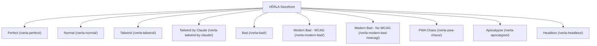

# VÉRLA Demo Store - Business Requirements and Specifications

This document defines the functional requirements, business rules, and quality dimensions of the **VÉRLA Demo Store** SUT (System Under Test) application. 

For detailed information on the sandbox architecture, multi-port server configuration, and interactive chaos injection drawers, see the parent test suite documentation in [aura-visual-defect-sandbox.md](aura-visual-defect-sandbox.md).

---

## 1. Quality-Level Dimensions (SUT Variations)

To benchmark SUT robustness, selector resilience, and visual regression capabilities, the VÉRLA storefront is served under several distinct paths. Each path represents the same visual storefront but contains radically different underlying DOM and HTML/CSS markup qualities.

```mermaid
graph TD
    A[VÉRLA Storefront] --> B["Perfect (/verla-perfect/)"]
    A --> C["Normal (/verla-normal/)"]
    A --> D["Tailwind (/verla-tailwind/)"]
    A --> D2["Tailwind by Claude (/verla-tailwind-by-claude/)"]
    A --> E["Bad (/verla-bad/)"]
    A --> F["Modern Bad - WCAG (/verla-modern-bad/)"]
    A --> G["Modern Bad - No WCAG (/verla-modern-bad-nowcag/)"]
    A --> H["PWA Chaos (/verla-pwa-chaos/)"]
    A --> I["Apocalypse (/verla-apocalypse/)"]
    A --> J["Headless (/verla-headless/)"]
```

### 1.1. Perfect Quality (`/verla-perfect/`)
- **Semantic HTML**: Standard layouts utilize proper semantic HTML5 tags (`<header>`, `<nav>`, `<main>`, `<section>`, `<aside>`, `<footer>`).
- **Locators & Selectors**: Every interactive element and form input is bound to unique, descriptive, and stable ID attributes (e.g., `id="nav-link-tops"`, `id="newsletter-email-input"`).
- **Accessibility (a11y)**: Built according to W3C standards and AAA accessibility guidelines, including explicit `<label>` element associations and correct `aria-*` attributes.

### 1.2. Normal Quality (`/verla-normal/`)
- **DOM Structure**: Semantic HTML tags are replaced with standard, generic `div` and `span` container structures.
- **Locators & Selectors**: Uses generic, inconsistent, or partially structured class and ID attributes (e.g., `id="inp_email"`, `class="cb-cat"`).
- **Accessibility (a11y)**: All `aria-*` elements are omitted. Form inputs lack explicit `<label>` tags and rely exclusively on `placeholder` attributes.

### 1.3. Tailwind Version (`/verla-tailwind/`)
- **Tailwind CSS Utility Styling**: Fully styled using modern Tailwind CSS utility classes and design tokens matching the VÉRLA terracotta theme.
- **Normal Quality Compatibility**: Identical to `verla-normal` in selectors, form names, dynamic HTMX endpoints, and business logic.

### 1.3.1. Tailwind Utility-First (`/verla-tailwind-by-claude/`)

A strict, from-scratch Tailwind rebuild of `verla-normal`. Where `/verla-tailwind/` is a hybrid (CDN plus a large hand-written semantic stylesheet), this variant is what a real Tailwind codebase looks like:

- **No remote resources, no Node at runtime**: the stylesheet is a Tailwind v4 build committed at `ai-test-pages/shared/verla-tailwind.css` and served as a static file. `verla-tailwind-by-claude/build.sh` regenerates it and is development-only; nothing in the test path invokes Node.
- **No semantic class names**: every element - including the fragments rendered from `EmbeddedHtmlServer` (product cards, mini cart, cart table, search suggestions, address fields) - carries utilities only. There is no `.product-card`, `.form-control`, or `.btn-primary`.
- **No inline styles and no embedded `<style>` block**: the layout links one stylesheet and nothing else.
- **State as data attributes**: open/active/added states are `data-open`, `data-active`, `data-state`, `data-show`, styled with `data-[open=true]:visible`-style variants, plus `group-hover:` / `group-focus-within:` for the quick-add reveal and mini cart. JS toggles attributes, never style properties.
- **Design tokens in `@theme`**: the terracotta/sand palette, serif/sans families, and keyframes are Tailwind theme variables, so they generate real utilities (`bg-terracotta-500`, `text-muted`, `font-serif`, `animate-fade-in`).
- **Mobile-first responsive**: breakpoints are min-width `sm:`/`md:`/`lg:` variants rather than the max-width media queries used by `verla-normal`.
- **Deliberately no `container` utility**: the layout uses explicit `mx-auto w-full max-w-7xl px-6`, avoiding a collision with Tailwind's own `container`.

This makes it a useful contrast case for the locator pipeline: identical business logic and IDs to `verla-normal`, but zero semantic class signal to latch onto.

### 1.4. Bad Quality (`/verla-bad/`)
- **DOM Structure**: No semantic tags or standard form structures are used. Buttons and interactive inputs are constructed via styled generic tags (e.g. `div` or `span`) equipped with inline JS `onclick` attributes.
- **Locators & Selectors**: Missing standard IDs, duplicate IDs across page sections (e.g., multiple `id="prod-info"`), or randomized/obfuscated class names (e.g. `class="c-772x9"`), forcing brittle, deep-relative XPath lookups.
- **Accessibility (a11y)**: Total absence of labels, placeholder attributes, roles, and alternative image descriptions (`alt` tags).

### 1.4. Modern Bad - WCAG (`/verla-modern-bad/`)
- **Modern CSS Framework Noise**: Heavy Tailwind CSS utility classes and deep wrapper trees simulating modern Single Page App architectures.
- **Accessibility (a11y)**: Retains full WCAG semantic elements (`<button>`, `<a href>`, `aria-label`, `<label>`).

### 1.5. Modern Bad - No WCAG (`/verla-modern-bad-nowcag/`)
- **React Div Soup**: Massive Tailwind utility classes, randomized React-style dynamic IDs (`react-div-719x`, `v-btn-992a`), and styled clickable divs replacing buttons/links with zero accessibility semantics.

### 1.6. PWA Chaos (`/verla-pwa-chaos/`)
- **Bath & Body Works Architecture**: Replicates complex real-world headless PWA anti-patterns.
- **DOM & Styling**: Chakra UI / Emotion CSS-in-JS class hashes (`emotion-jvwy60`, `emotion-1ss52ls`), Wick Design System components (`wick-linkbox`, `wick-stack`, `wick-marquee__root`), Zag.js state machines (`data-scope="marquee"`), rotating reveal search prompt, VideoJS `MEDIA_ERR_DECODE` error modal dialog, OneTrust cookie banner, delayed 20% discount marketing popup, and slide-over mini-cart drawer.

### 1.7. Apocalypse (`/verla-apocalypse/`)
- **Extreme Web Anti-Patterns**: Pushes AI multimodal reasoning, waiting mechanisms, and locator pipelines to the limit.
- **Progressive Hydration Ghost Clicks**: SSR HTML renders instantly, but JavaScript event listeners intentionally delay attachment for 1500ms, dropping unhydrated clicks without errors.
- **Cumulative Layout Shift (CLS)**: Delayed announcement bar pops in at $t=350\text{ms}$, pushing all viewport coordinates down by 44px.
- **Pure CSS Pseudo-Element Text**: Buttons, badges, and headings have empty DOM text nodes (``), rendering visual text purely via CSS `::before { content: '...' }` so standard `.getText()` returns empty strings.
- **Floating Overlay Storm**: Concurrently active GDPR banner, bouncing Intercom-style live chat bubble at `bottom: 24px; right: 24px; z-index: 2500` occluding checkout action zones, dynamic social proof toasts every 6s, and a delayed spin-to-win discount modal at $t=4500\text{ms}$.
- **Torture Form Controls**: 4-box split credit card inputs (`card-part-1` through `card-part-4`) with auto-advancing focus.

### 1.8. Headless (`/verla-headless/`)

A composable-commerce SPA profile. Where `verla-pwa-chaos` models a chaotic *rendered* page, this variant models a page that is **not rendered yet**: the server ships a shell and the browser assembles the content from per-entity API calls. It is the only variant in the suite whose product markup contains no product data.

The profile was measured against a production SFCC PWA Kit storefront (1.77 MB initial HTML, 3.27 MB total across 210 requests, 87 of them XHR, `load` at 10.7 s against `DOMContentLoaded` at 0.72 s).

- **Client-Side Routing (single document)**: The variant is a true SPA. Category, product, cart, checkout and content pages are **routes, not documents**. Internal link clicks and product-tile clicks are intercepted, the route body is fetched as a fragment (`X-PWA-Router: true`), and only `#main-body` is swapped; `history.pushState` updates the URL and `popstate` handles Back/Forward. The shell - header, search, cart badge, footer, icon sprite and preloaded state - is created once on first load and is *literally the same DOM node* for the rest of the session. A full home → category → PDP → cart → checkout → Back journey produces exactly **one** navigation entry.
  - Each navigation first resolves the route through `api/scapi/route?path=…`, so a route transition costs an API call before its body is even requested.
  - Route transitions are announced through `data-route-state` (`loading` / `ready`) on `<html>` and on `#main-body`. This, not a page load, is the signal to wait on when navigating.
  - Deep links still work: requesting any route as a document returns the full shell, while the same route requested with the router header returns a bare fragment that repeats neither the hydration blob nor the sprite.
  - Because the shell survives, the cart badge is reconciled from `api/bff/basket` rather than re-rendered with the page - so it can lag behind an add that appeared to succeed.
- **Client-Side Tile Rendering (N+1 fan-out)**: Product tiles are delivered as skeletons carrying only `data-pid`. Each tile then fetches its own product document (`api/scapi/product?id=…`) plus its own image rendition (`api/scapi/image?id=…&sw=960`) - two requests per tile. Tiles flip `data-state` from `pending` to `loading` to `ready` individually, so **there is no moment at which "the grid" is complete**, only tiles that have each arrived.
- **API-Built Quick Add**: The grid supports quick add exactly as the server-rendered variants do - press Add, choose a size, item lands in the cart - but the control is **assembled client-side from the product document**. Sizes and per-size stock travel in the document's `variants` array, never in the tile markup, so:
  - The quick add button does not exist until that tile's own request returns. A test that reaches for it as soon as the grid appears finds nothing to click.
  - Pressing Add opens the size selector and performs **no** basket call; only choosing a size adds. Exhausted sizes render disabled and suffixed `(0)`, matching the baseline contract.
  - Accessories publish no variants (`requiresSize: false`) and add directly, skipping size selection.
  - The selector contract is deliberately shared with the other variants (`.product-quick-add`, `data-product-id`, `data-category`, `.quick-add-dropdown`, `.size-btn`, `data-size`) so cross-variant tests can reuse locators; only the *timing* and the *source of the data* differ.
  - Availability is published as `data-orderable` but not enforced client-side - the basket endpoint stays the authority, as in the server-rendered variants.
- **Hydration Blob Trap**: A `<script id="__PRELOADED_STATE__" type="application/json">` element carries the full product documents for every tile on the page. The data is therefore present in the delivered source *before* it is rendered anywhere - a page scrape reads prices the user cannot yet see, while a DOM assertion on the same tile returns an empty string.
- **Session Bootstrap Race**: Two OAuth token requests (`api/scapi/token`) are issued concurrently. The customer id the page holds during its first moments is a bootstrap id, and `api/bff/basket`, `api/bff/wishlist` and `api/bff/getWishlist` **reject it with HTTP 400**. The failures are swallowed, so nothing on screen indicates the basket is unusable. Add-to-cart issued before the session settles is rejected the same way. The settle window is **randomized per session**, which defeats fixed sleeps by design.
  - The correct readiness signal is `api/scapi/session`, which reports `{"ready":true,…}` and flips `data-session-state` on `<html>` from `BOOTSTRAPPING` to `SETTLED`.
- **Deferred Content Slots**: The announcement bar, footer link list and footer legal line are empty `data-cms-slot` containers in the delivered document, each filled by its own `api/cms/slot?id=…` request after first paint. The footer therefore grows underneath anything the user has already reached.
- **Deferred Hydration**: Routing and tile listeners attach only after a configured boot delay. `data-hydrated` on `<html>` and `<body>` flips to `true` when listeners are live. Before that the page behaves like plain SSR markup: a tile click is dropped silently, and a link click performs a **full document load** instead of a client-side route change - so the same click yields a different execution model depending on when it lands.
- **CSS-in-JS Emission**: Styling is emitted as dozens of separate `<style>` elements carrying `css-1tpd03i`-style hashes, rather than one stylesheet.
- **Icon Sprite via `<use>`**: An inlined `__SVG_SPRITE_NODE__` sprite backs icon-only controls, which consequently carry no text node.
- **Oversized Renditions**: Only the 960px rendition is published, so every tile pulls it regardless of display size.

#### 1.8.1. Configuration

Every anti-pattern above is always structurally present; `config/verla.properties` controls only their *magnitude*, so CI runs stay affordable while demos can be brutal. See the `verla.headless.*` block for the full set.

| Property | Default | Real-world reference |
| --- | --- | --- |
| `verla.headless.hydration.kb` | 120 | 907 |
| `verla.headless.sprite.kb` | 40 | 621 |
| `verla.headless.image.kb` | 24 | ~27 per image |
| `verla.headless.styletags` | 60 | 176 |
| `verla.headless.tile.fanout` | 12 | ~28 |
| `verla.headless.session.race.min/max` | 400 / 1600 ms | randomized |
| `verla.headless.boot.min/max` | 600 / 1200 ms | ~1500 ms |

Setting `verla.headless.enabled = false` renders the variant server-side, which makes it a direct A/B control for the cost of the client-side pipeline. Setting `verla.headless.tile.fanout = 0` removes the fan-out while keeping the rest of the profile.

> **Note on overlap**: the CSS-in-JS hash dimension is shared with `verla-pwa-chaos`. The axis unique to this variant is client-side assembly - request fan-out, the session race, and deferred content - not class-name obfuscation. Static content pages (`about`, `faq`, `contact`, `shipping`, `stores`, `careers`, `track-orders`) reuse the `verla-normal` bodies unchanged, since their markup quality does not carry the profile.

---

## 2. Functional Requirements Specification

This section outlines the functional requirements of the VÉRLA storefront. Each requirement is structured with explicit preconditions, triggers, and expected outcomes to facilitate direct translation into automated test cases.

### 2.1. Product Catalog & Navigation (CAT)

#### REQ-CAT-01: Seeded Catalog Generation
- **Requirement**: The SUT must load and maintain a static product catalog definition on startup.
- **Business Rules**:
  - Exactly **340 unique products** must be loaded from the catalog definition file (`verla-products.json`) on server startup with varying amounts per category:
    - `Tops`: 120 products
    - `Bottoms`: 85 products
    - `Outerwear`: 45 products
    - `Footwear`: 30 products
    - `Accessories`: 60 products
  - Products must span these five primary categories.
  - Localization metadata and SUT translations are loaded from `verla-catalog.json`.
  - **Catalog Regeneration**: The static products file (`verla-products.json`) is generated by a developer utility. To regenerate the catalog (e.g. if the category configurations in `verla-catalog.json` are modified), the developer must temporarily enable and execute the JUnit test case `com.xceptance.neodymium.ai.core.RunServerTest#regenerateProductCatalogFile` (by removing its `@Disabled` annotation and running it). The test case reads the templates, generates the catalog products programmatically, and serializes the 340 products into `src/test/resources/ai-test-pages/verla-products.json`.
- **Test Extraction Guide**:
  - *Action*: Access the home page of any quality level.
  - *Expectation*: The page renders category links and featured product cards.

#### REQ-CAT-02: Product Detail Page (PDP) Dynamic Routing
- **Requirement**: Each product in the seeded catalog must have a dedicated URL matching the pattern `/verla-*/p/{slug}.html`.
- **Business Rules**:
  - PDP must display product image (dynamic SVG or raster), product name, base price, sale price (if applicable), color, description, and variant details.
  - **Stock Status & Size Selection**: The PDP size dropdown (`${product_sizes_html}`) must render size inventory status (e.g., `M (Out of stock)` with disabled option for stock $\le 0$, or `M (X left)` for low stock $\le 5$). When a size is selected, submitting the add-to-cart form appends the size to the product ID parameter (e.g., `SKU-TOP-1000:M`).
- **Test Extraction Guide**:
  - *Action*: Click on a product card or navigate directly to `/verla-*/p/{slug}.html`.
  - *Expectation*: Product details match the catalog configuration; size dropdown options are correctly styled and interactive based on stock levels.

#### REQ-CAT-03: Category Listing (PLP) Filtration & Sorting
- **Requirement**: Category pages (`/verla-*/c/{category}.html`) must display filtered grids.
- **Business Rules**:
  - Refinement sidebar filters must support Color, Price Range (`0-50`, `50-100`, `100-200`), and Sale items (Offer checkbox).
  - Sort dropdown must support "Price: Low to High" and "Price: High to Low".
  - Refinements must send query parameters (e.g. `?color=olive&sort=price-asc`) via HTMX and dynamically update the product grid.
  - **Quick Add Stock Check**: On PLP, when size choices are displayed under the "Quick Add" button, sizes with 0 stock must be disabled and have `(0)` appended to their label (e.g., `M (0)`). Accessories bypass size selection and add to cart directly.
  - **Infinite Scroll**: Scrolling to the bottom of the PLP must asynchronously load the next page of 12 products.
- **Test Extraction Guide**:
  - *Action*: Select a category, apply a color filter, select a sorting option, and scroll down.
  - *Expectation*: Product grid displays filtered matching products sorted accordingly; new items are appended upon scroll without a full page reload.

---

### 2.2. Product Search & Autocomplete (SRH)

#### REQ-SRH-01: Standard Text Search
- **Requirement**: SUT must support keyword queries via a global search form.
- **Business Rules**:
  - Submitting a query from the header search bar must redirect to `/verla-*/plp.html?q={query}`.
  - Products are matched against English names and descriptions (case-insensitive).
- **Test Extraction Guide**:
  - *Action*: Type keyword (e.g., 'Minimalist') in search and click search icon or press Enter.
  - *Expectation*: PLP loads displaying only matching items.

#### REQ-SRH-02: Search-as-you-Type Autocomplete
- **Requirement**: The search input field must display dynamic autocomplete suggestions.
- **Business Rules**:
  - As the user types (on `keyup changed delay:300ms`), suggestions are queried via GET `/verla-*/api/search/suggest`.
  - The dropdown renders up to **6 product matches** formatted as mini product cards.
  - If there are more than 6 matches, a "+ X more products. View all." link is shown which submits the search form.
  - Clicking outside the search area automatically dismisses the suggestions dropdown.
- **Test Extraction Guide**:
  - *Action*: Input 'mini' into the search box.
  - *Expectation*: Autocomplete suggestions dropdown appears containing relevant results.

---

### 2.3. User Authentication & Profile (AUT)

#### REQ-AUT-01: Customer Registration
- **Requirement**: SUT must allow customers to register a new account at `/verla-*/register.html`.
- **Validation Rules**:
  - **HTTP Method**: The SUT registration endpoint requires an HTTP `PUT` request targeting `/verla-*/api/auth/register` (not `POST`).
  - Email format must contain `@` and be unique.
  - Password must be $\ge$ 6 characters and match the confirmation.
- **Test Extraction Guide**:
  - *Action*: Submit registration form with valid or invalid fields.
  - *Expectation*: Valid inputs redirect to `/verla-*/account.html` with an active session. Invalid inputs show corresponding validation errors.

#### REQ-AUT-02: Customer Login & Logout
- **Requirement**: SUT must manage secure user sessions.
- **Business Rules**:
  - Successful login stores a `verla_session_id` cookie.
  - Logout clears the session and deletes the cookie.
- **Test Extraction Guide**:
  - *Action*: Login with credentials, then trigger logout.
  - *Expectation*: Login redirects to Account Dashboard. Logout clears session state and redirects to Home.

#### REQ-AUT-03: Address Book Management
- **Requirement**: Users must be able to save shipping addresses in their Account Dashboard.
- **Business Rules**:
  - Changing the country in the "Add Address" form triggers country-specific formatting (e.g., US/CA shows States; JP shows Prefecture/Ward).
  - **Inline Replacements**: Forms must target `#account-page-container` using `hx-target` and swap using `hx-swap="outerHTML"` to ensure pages update dynamically without nesting the sidebar layout.
- **Test Extraction Guide**:
  - *Action*: Add a new address and verify. Delete a saved address and verify.
  - *Expectation*: Added address appears in profile. Deleted address is removed from profile.

#### REQ-AUT-04: Payment Wallet Management
- **Requirement**: Users must be able to save credit cards in their Account Dashboard.
- **Business Rules**:
  - **Inline Replacements**: Card additions and deletions must target `#account-page-container` using `hx-target` and swap using `hx-swap="outerHTML"`.
- **Test Extraction Guide**:
  - *Action*: Add credit card details. Delete saved card.
  - *Expectation*: Card is added or deleted from the dashboard list.

---

### 2.4. Shopping Cart & Localized Checkout (CRT)

#### REQ-CRT-01: Cart Operations
- **Requirement**: SUT must support adding, updating, and removing cart items.
- **Business Rules**:
  - **Mini-Cart Dropdown**: In `perfect` and `normal` SUTs, hovering over the Cart icon in the header displays a dynamic mini-cart dropdown containing all cart items (thumbnails, name, size, quantity, unit price, subtotal, and a checkout link). If the cart is empty, hovering displays a "Cart is Empty." message.
  - **Cart Page Variant Display**: Cart page displays sizes next to product names (e.g. `Organic Sand tshirts (M)`). Updates and removals must be submitted via the specific Variant SKU (e.g. `SKU-TOP-1000:M`).
  - **Inline Recalculation & Coupon Error Handling**: Applying an invalid coupon must display the error message inline inside the Order Summary sidebar without breaking the Cart page headers or layout.
  - Header cart count badge must update instantly via HTMX when items are added/removed.
  - Cart page (`/verla-*/cart.html`) must display item details, subtotal, and support quantity updates.
  - Setting quantity to `0` or clicking the delete icon removes the item.
- **Test Extraction Guide**:
  - *Action*: Add item from PDP, view Cart, update quantity to 0.
  - *Expectation*: Header count matches active cart state; removing item clears it from list.

#### REQ-CRT-02: Currency & Country Selection
- **Requirement**: SUT must support international localization settings.
- **Business Rules**:
  - Selecting a country from the country selection modal (ID `country-trigger-btn`) updates the localized language and converts product prices to the target currency.
- **Test Extraction Guide**:
  - *Action*: Select 'Sweden (SE)' from the country list.
  - *Expectation*: Prices update to display Swedish Krona (`kr`) format.

---

### 2.5. Checkout, Coupons, & Order Management (CHKP)

#### REQ-CHKP-01: Coupon Code Application
- **Requirement**: SUT must validate and calculate dynamic coupon discounts at Checkout.
- **Business Rules**:
  - `10p-off`: 10% subtotal deduction.
  - `FREEGIFT`: Automatically appends a zero-cost promotional gift item (VÉRLA Signature Tote Bag) to the order.
  - `FREESHIP`: Waives the default `9.99` shipping fee (shipping is also automatically free on orders with a subtotal $\ge 150.00$).
  - `BOGO`: Buy-One-Get-One-Free discount applied individually to any product variant where the quantity is $\ge$ 2. The discount is calculated as `price * (quantity / 2)` per item.
- **Test Extraction Guide**:
  - *Action*: Type coupon in field and submit.
  - *Expectation*: Checkout summary instantly recalculates subtotal, discounts, shipping fees, and totals; free gift item is appended if using `FREEGIFT`.

#### REQ-CHKP-02: Checkout Processing & Payment Simulation
- **Requirement**: Checkout page (`/verla-*/checkout.html`) must process guest and authenticated checkouts.
- **Business Rules**:
  - **Payment Simulator**:
    - Credit card numbers ending in `100` succeed.
    - Credit card numbers ending in `200` fail, returning a `400 Bad Request` with message `"Card declined by provider."`
  - Successful checkout clears the cart and generates an order number (Format: `V-[6-digit-random]-[countryCode]`).
- **Test Extraction Guide**:
  - *Action*: Submit checkout with card ending in `200`, then correct to `100`.
  - *Expectation*: Declined card triggers validation error block. Approved card triggers checkout success screen with order details.

#### REQ-CHKP-03: Guest Order Tracking
- **Requirement**: Users must be able to track completed guest orders at `/verla-*/track-orders.html`.
- **Business Rules**:
  - Accessing the order requires both the Order Number and the Shipping Zip Code.
- **Test Extraction Guide**:
  - *Action*: Input valid order number and zip code on tracking page.
  - *Expectation*: Dynamic order details (shipping address, items, totals, status) are displayed.

---

## 3. Supported Countries & Currencies Reference

The VÉRLA storefront supports localization and dynamic currency formatting for the following country profiles:

| Country Name | Country Code | Locale | Currency | Symbol | Conversion Rate |
| :--- | :--- | :--- | :--- | :--- | :--- |
| **United States** | `US` | `en` | USD | `$` | 1.00 |
| **United Kingdom** | `UK` | `en` | GBP | `£` | 0.80 |
| **Canada (EN)** | `CA_EN` | `en` | CAD | `CAD $` | 1.35 |
| **Canada (FR)** | `CA_FR` | `fr` | CAD | `CAD $` | 1.35 |
| **Germany** | `DE` | `de` | EUR | `€` | 0.92 |
| **Poland** | `PL` | `pl` | PLN | `zł` | 4.00 |
| **Sweden** | `SE` | `se` | SEK | `kr` | 10.50 |
| **Finland** | `FI` | `fi` | EUR | `€` | 0.92 |
| **Japan** | `JP` | `ja` | JPY | `¥` | 150.00 |
