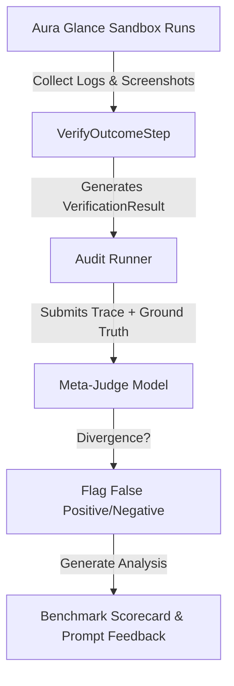

# [IDEA-20260717] Offline Meta-Judge & Validation Benchmarking (LLM-as-a-Judge)

- **Status:** `Proposed`
- **Proposed:** 2026-07-17
- **Resolved:** Pending
- **Component:** `neodymium-core (QualityJudgeToolInterceptor, VerificationPrompt)`
- **Category:** `AI & VLM`
- **Author:** Neodymium Core Team

---

As system prompts, LLM model versions, and SUT web page layouts evolve, the semantic verification performed by the inline [VerificationPrompt](file:///../src/main/java/org/neodymium/ai/prompt/VerificationPrompt.java) can drift. To ensure the reliability of our test assertions and prevent silent false positives (where tests pass despite errors) or false negatives (where correct actions are marked as failed), we need an automated way to "verify the validator."

---

### Proposed Design: Meta-Judge Auditing Pipeline

We propose introducing a decoupled **Meta-Judge Auditing Pipeline** to benchmark the accuracy of our outcome verification system.

#### 1. Gold Standard Benchmark Dataset
Utilizing our self-contained test environment under the `Aura Glance Sandbox` (`src/test/resources/ai-test-pages/AuraGlanceTest/`), we define scenarios representing common execution success and failure topologies:
* **Expected Pass (Success):** Standard, bug-free flow transition (e.g., successful login redirect).
* **Expected Action Fail (Executor Error):** The agent clicks the wrong element or inputs invalid values (e.g., inputs numeric values in a name-only field).
* **Expected State Fail (System Error):** The agent performs correct actions, but the system displays a validation error or a 500 Server Error page.
* **Expected Silent Fail (State Stagnation):** The agent clicks a button, but the page doesn't update (e.g., cart quantity doesn't increment).

#### 2. Auditing Loop
During benchmark execution, the test suite captures:
1. The **Instruction** & **Actions** executed.
2. The **SUT State screenshots** (Before / After).
3. The **VerificationResult** produced inline (e.g., by Gemini 3.5 Flash).
4. The known **Ground Truth label** (Expected Pass/Fail).

A post-hoc evaluation job submits these traces to a high-tier reasoning model (e.g., Gemini Pro) acting as the **Meta-Judge**:

#### 3. Output & Actionability
The Meta-Judge generates an **Evaluation Scorecard** detailing:
* **Precision / Recall / Accuracy** of the inline validator.
* **Trace Divergence Explanations:** Plain-English explanations of why a step was misjudged (e.g., *"The inline validator missed the validation message 'Out of stock' because the font size was small and the overall page transitioned to a PLP."*).
* **Prompt Recommendations:** Suggestions for adjusting rubrics or adding few-shot examples to the prompt system message.
