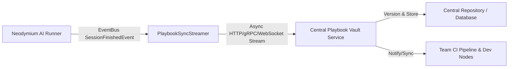

# [IDEA-20260719] Playbook Synchronization & Central Service Streaming

- **Status:** `Proposed`
- **Proposed:** 2026-07-19
- **Resolved:** Pending
- **Component:** `aura-manager, neodymium-core (PlaybookSyncService)`
- **Category:** `Tooling & DX`
- **Author:** Neodymium Core Team

---

Currently, playbooks (YAML) and companion recording JSON files are saved locally on disk (e.g. `src/test/resources/` or `target/ai-recordings/`). In distributed test environments (such as parallel CI nodes, cloud build runners, or multi-developer setups), new or updated playbook recordings generated on ephemeral worker nodes remain isolated within the local filesystem unless manually committed.

To support seamless team collaboration and automated baseline management across distributed test pipelines, the framework should support streaming updated or new playbooks and companion recordings to a centralized synchronization service.

---

### Proposed Design: Event-Driven Playbook Streaming



#### 1. Remote / Streaming `PlaybookResourceManager`
Introduce a remote-capable implementation of `PlaybookResourceManager` (e.g., `StreamingPlaybookResourceManager` or `HttpPlaybookResourceManager`) that wraps local storage and streams updates:
* **Dual-Write / Async Buffer**: Writes locally (to `target/ai-recordings/`) for immediate test execution, while asynchronously queuing the updated playbook/recording JSON for streaming to the central service.
* **Non-Blocking Execution**: Streaming operations occur asynchronously in background worker threads to avoid adding latency to test execution.

#### 2. Features & Capabilities

* **Centralized Playbook Vault**: Maintains a single source of truth for all recorded SUT actions, baseline visual hashes, and locator candidates across the organization.
* **Live CI Replay Baseline Pulling**: Worker nodes running in `REPLAY_STRICT` mode can dynamically pull the latest validated companion JSON baselines from the central service if they are missing locally.
* **Conflict Resolution & Versioning**: The central service manages versioning (e.g., semantic tagging or git commit association) for recorded playbooks to prevent overwriting valid baselines when tests run concurrently across branches.
* **Real-time Session Streaming**: Stream executed actions, screenshot hashes, and execution metrics live to a centralized dashboard while test suites run.

#### 3. Configuration & Security Settings (`neodymium.properties`)

```properties
# Enable centralized playbook synchronization
neodymium.ai.sync.enabled=true

# Endpoint URL for the central playbook vault service
neodymium.ai.sync.endpoint=https://playbook-vault.internal/api/v1/sync

# Authentication token (passed dynamically via env variable)
neodymium.ai.sync.apiKey=${PLAYBOOK_SYNC_API_KEY}

# Sync scope: RECORDINGS_ONLY, PLAYBOOKS_ONLY, or ALL
neodymium.ai.sync.scope=ALL

# Strategy for handling conflicts: SERVER_WINS, CLIENT_WINS, or FAIL_ON_CONFLICT
neodymium.ai.sync.conflictStrategy=SERVER_WINS
```
