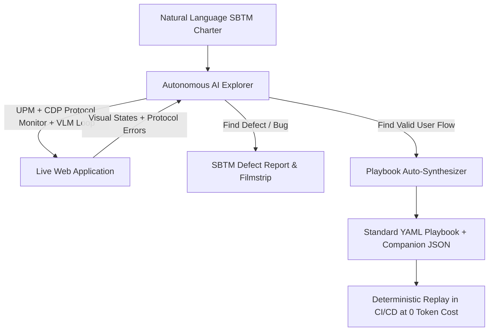

# [IDEA-20260913] Autonomous Exploratory Mode (`ExecutionMode.AUTONOMOUS_EXPLORATION` / SBTM)

- **Status:** `Proposed`
- **Proposed:** 2026-09-13
- **Resolved:** Pending
- **Component:** `neodymium-core (ExecutionMode, AutonomousExplorer)`
- **Category:** `Autonomous QA`
- **Author:** Neodymium Core Team

---

Traditional automated testing executes predefined test scripts. Autonomous exploratory testing allows an AI agent to explore an application dynamically under a high-level testing charter (e.g. discovering broken links, exploring checkout across edge cases, or validating form boundary conditions) and auto-generate deterministic test playbooks for CI/CD regression.

---

### Proposal: Dual-Mode Platform Architecture

Introduce `ExecutionMode.AUTONOMOUS_EXPLORATION`:

1. **Charter-Driven Exploration**: The runner accepts a high-level testing charter (e.g., *"Explore product filtering and sorting options to verify no combinations produce empty or broken pages"*).
2. **Autonomous Navigation**: Uses UPM, CDP Protocol Monitoring, and the VLM loop to navigate, test edge cases, and discover defects dynamically.
3. **Playbook Auto-Synthesis**: Once a successful path is explored, automatically synthesizes standard YAML playbooks and companion JSON recordings for instant, zero-cost replay in CI/CD pipelines.
