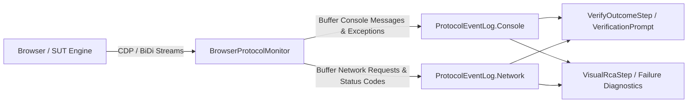

# [IDEA-20260913] Continuous CDP / WebDriver BiDi Protocol Monitoring (Console & Network Interception)

- **Status:** `Proposed`
- **Proposed:** 2026-09-13
- **Resolved:** Pending
- **Component:** `neodymium-core (BrowserProtocolMonitor)`
- **Category:** `Protocol & Monitoring`
- **Author:** Neodymium Core Team

---

Currently, Neodymium AI monitors page state via DOM snapshots and visual screenshots. However, silent failures—such as unhandled JavaScript runtime exceptions (`console.error`), unhandled Promise rejections, or failed AJAX/Fetch API calls (HTTP 4xx/5xx)—frequently do not render immediate visual error banners. This introduces a risk of false-positive test passes where functional failures in the application go undetected by visual assertions.

---

### Proposed Design: `BrowserProtocolMonitor`

Introduce a continuous protocol monitor attached to `AiSession` and `SelenideTargetExecutor` that listens to Chrome DevTools Protocol (CDP) and WebDriver BiDi event streams throughout the entire test lifecycle:

#### 1. JavaScript Console & Exception Listener
* **CDP Events**: Listen to `Console.messageAdded`, `Runtime.exceptionThrown`, and `Log.entryAdded`.
* **Telemetry Captured**: Timestamp, log level (`WARNING`, `ERROR`), message text, URL, line/column number, and full stack trace.
* **Rolling Buffer**: Maintained in `AiSession` and reset between playbook steps (or indexed per step).

#### 2. Network Traffic Interception & Status Tracking
* **CDP Events**: Listen to `Network.requestWillBeSent`, `Network.responseReceived`, and `Network.loadingFailed`.
* **Telemetry Captured**: Request URL, HTTP method, response status code (e.g. `500 Internal Server Error`, `404 Not Found`), MIME type, timing duration, and failure reason (e.g. `net::ERR_CONNECTION_REFUSED`, CORS error).
* **Failure Flagging**: Automatically flags any completed request with $\text{HTTP Status} \ge 400$ or failed network state.
