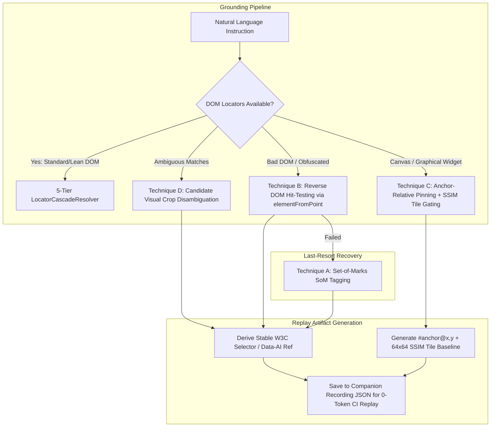

# [IDEA-20260913] Visual + DOM Hybrid Detection & Resilient Clicking on Bad DOM Trees

- **Status:** `Partially Implemented`
- **Proposed:** 2026-09-13
- **Resolved:** Pending
- **Component:** `neodymium-core (LocatorCascadeResolver, VisualMarkerProvider)`
- **Category:** `AI & VLM`
- **Author:** Neodymium Core Team

---

Real-world web applications frequently contain "bad" DOM trees that defeat pure DOM selectors and pure coordinate clicks alike:
* **Icon-only buttons with zero text/ARIA metadata** (e.g. `<button><svg><path ...></path></svg></button>`).
* **Non-semantic div soups** (`
` nested 15 levels deep without ARIA roles).
* **Obfuscated / dynamic class names** generated by Tailwind CSS, CSS Modules, or styled-components.
* **Invisible click interceptors & floating wrappers** where outer divs capture clicks intended for child icons.
* **Canvas / WebGL / SVG charts** with zero inspectable interactive DOM child nodes.

---

### Proposed Hybrid Architecture: Visual + DOM Fusion

To provide robust element interaction on bad DOM trees while maintaining **millisecond replay speeds with zero LLM calls in CI/CD**, we propose a multi-technique hybrid detection pipeline:

---

### Technique B: Reverse DOM Hit-Testing (`document.elementFromPoint`) & Upward Hierarchy Climbing

When the VLM identifies the target element visually on the screenshot (e.g., clicking a shopping cart icon at screen coordinates $x=842, y=315$):

1. **Hit-Testing**: The browser runtime invokes `document.elementFromPoint(x, y)` at the target coordinates.
2. **Upward Interactive Climbing**:
   - The element hit may be an un-clickable inner `<path>` or `<svg>`.
   - The runtime traverses up the DOM tree using `element.closest('button, a, [role="button"], [onclick], input, select, textarea, [tabindex]')`.
   - If no standard interactive tag is found, it inspects ancestors with `cursor: pointer` or registered event listeners.
3. **Bounding Box Validation**: Verifies that the resolved parent element bounds enclose the point $(x, y)$.
4. **Stable Selector Extraction**: The framework derives a resilient CSS/XPath locator for that live element (or stamps an automation ref ID) and records it into the companion JSON for fast CI replay.

---

### Technique C: Anchor-Relative Spatial Pinning with Local SSIM Luminance Gating

For un-inspectable canvas controls, WebGL surfaces, or custom SVG widgets where no interactive DOM element exists:

1. **Anchor Pinning**: Locate the nearest stable parent or sibling DOM container with an ID or unique class (e.g., `#analytics-canvas-container`).
2. **Relative Offset Calculation**: Record the target click point as an offset relative to that anchor (e.g., `#analytics-canvas-container@120,45`).
3. **Luminance Tile Baseline Capture**: Capture a $64 \times 64$ luminance matrix centered on the click coordinates.
4. **Replay SSIM Gating**:
   - During replay, calculate the SSIM score between the live $64 \times 64$ region and the baseline tile.
   - If $\text{SSIM} \ge 0.95$, dispatch the click immediately (native speed, zero LLM calls).
   - If $\text{SSIM} < 0.95$ (indicating layout shift, dynamic resizing, or altered graphics), abort the blind click safely and trigger self-healing.

---

### Technique D: Candidate Disambiguation via Visual Crop Comparison

When a DOM search produces multiple identical-looking elements (e.g. 5 identical `.btn-icon` elements with no distinguishing text or ARIA attributes):

1. **Candidate Region Extraction**: In a single pass, extract bounding client rectangles for all matching candidate elements.
2. **Visual Micro-Crops**: Crop screenshot thumbnails for each candidate.
3. **Multimodal Disambiguation**: Provide the micro-crops to the Vision LLM alongside the user instruction (e.g. *"Select candidate [2] (the pencil edit icon) rather than candidate [1] (the trash icon)"*).
4. **Index Binding**: Bind the selected candidate index directly to the recorded action.

---

### Technique A (Last-Resort Fallback): Set-of-Marks (SoM) Visual Badge Injection

If Techniques B, C, and D all fail to locate the target on a highly obfuscated or broken DOM tree:

1. **Badge Injection**: Inject temporary, high-contrast numbered badges (`[1]`, `[2]`, `[3]`, etc.) onto all visible clickable bounding boxes directly on the screenshot buffer.
2. **Visual Identification**: The VLM inspects the annotated image and returns the selected badge number.
3. **Element Mapping**: The runtime maps the badge number directly back to its live `WebElement` reference.
