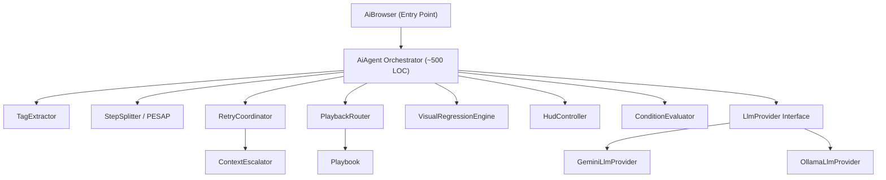
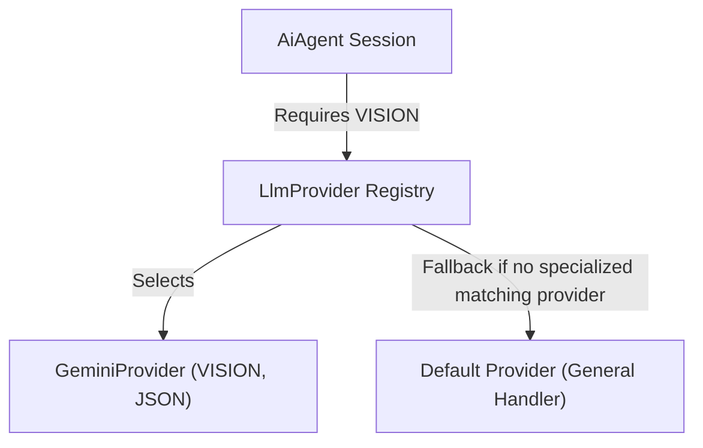
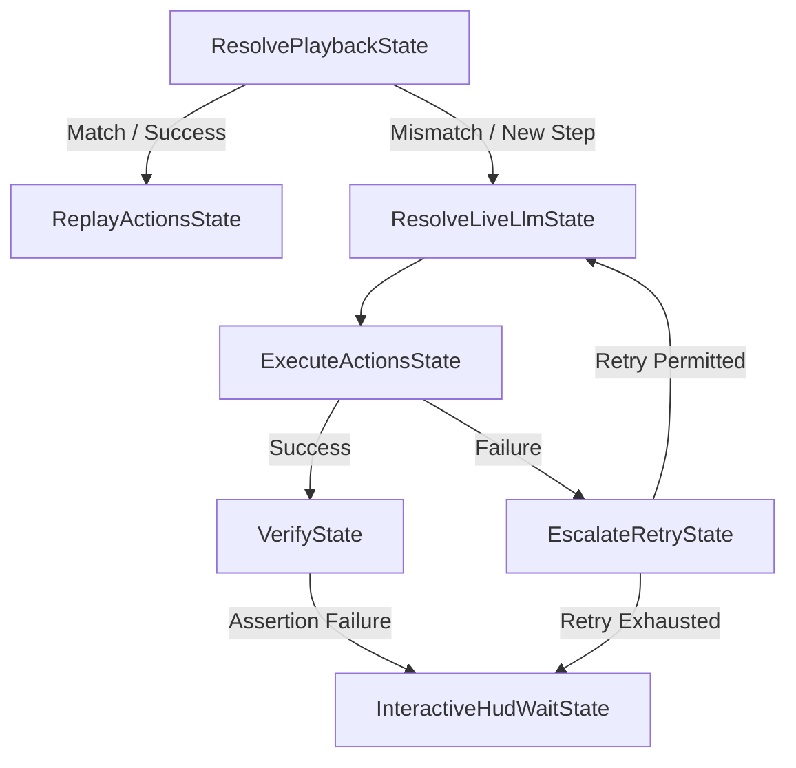

# Comprehensive Architectural & Reliability Improvement Proposal for Neodymium AI Agent

> [!CAUTION]
> **DEPRECATED / ARCHIVED DOCUMENTATION (v1 Architecture)**
> This document describes historical v1 architecture proposals and gap analyses.
> It has been superseded by the **v2 Architecture**: see [`doc/redesign-v2/architecture.md`](file:///home/rschwietzke/projects/GIT/neodymium-library/doc/redesign-v2/architecture.md) and [`doc/redesign-v2/annotations.md`](file:///home/rschwietzke/projects/GIT/neodymium-library/doc/redesign-v2/annotations.md).

This document is a deep architectural audit covering **architecture, reliability, concurrency, testability, and future-proofness** across the entire `com.xceptance.neodymium.ai` subsystem.

---

## Table of Contents

1. [Monolithic Orchestrator Decomposition](#1-monolithic-orchestrator-decomposition)
2. [Eliminating ThreadLocals & Isolating Execution Sessions](#2-eliminating-threadlocals--isolating-execution-sessions)
3. [Resource Lifecycle & Cleanup Gaps](#3-resource-lifecycle--cleanup-gaps)
4. [Playbook Persistence Reliability](#4-playbook-persistence-reliability)
5. [Pluggable LLM Provider & Capability Architecture](#5-pluggable-llm-provider-capabilitiy-architecture)
6. [Action Registry: Static Globals & SPI](#6-action-registry-static-globals--spi)
7. [Exception Taxonomy & Error Handling Anti-Patterns](#7-exception-taxonomy--error-handling-anti-patterns)
8. [Code Duplication & DRY Violations](#8-code-duplication--dry-violations)
9. [Configuration Sprawl & Validation](#9-configuration-sprawl--validation)
10. [Security: PII Exposure in LLM Payloads](#10-security-pii-exposure-in-llm-payloads)
11. [Testability & Mock Infrastructure](#11-testability--mock-infrastructure)
12. [Visual Regression Brittleness](#12-visual-regression-brittleness)
13. [Replay Logic & Playback Routing Architecture](#13-replay-logic--playback-routing-architecture)
14. [State Machine Step Execution & Recovery Architecture](#14-state-machine-step-execution--recovery-architecture)
15. [Event-Driven HUD Interaction & Transition Control](#15-event-driven-hud-interaction--transition-control)

---

## 1. Monolithic Orchestrator Decomposition

### Current State
[AiAgent.java](file:///home/rschwietzke/projects/GIT/neodymium-library/src/main/java/com/xceptance/neodymium/ai/core/AiAgent.java) is **3,347 lines** and handles:
- Instruction tag extraction (bug, optional, timeout, no-replay)
- Step splitting via JIT PESAP
- Playbook replay vs. recording routing
- Visual hash comparison and fast-fail
- Compound step accumulation
- Retry coordination (error retries, no-action retries, context escalation)
- HUD polling and user interaction
- Expected failure/defect tracking
- Condition caching and evaluation
- SPLIT action processing and list mutation
- Allure report attachment
- Debug dump file writing

> [!WARNING]
> A single class carrying **13+ responsibilities** makes targeted testing impossible, increases merge conflict risk, and creates cognitive overhead for any contributor.

### Proposed Decomposition



| Delegate | Current Location | Responsibility |
|----------|-----------------|---------------|
| `TagExtractor` | [AiAgent L129-171](file:///home/rschwietzke/projects/GIT/neodymium-library/src/main/java/com/xceptance/neodymium/ai/core/AiAgent.java#L129-L171) + [L420-454](file:///home/rschwietzke/projects/GIT/neodymium-library/src/main/java/com/xceptance/neodymium/ai/core/AiAgent.java#L420-L454) | Extract all `(tag:...)` metadata into `InstructionMetadata` record |
| `StepSplitter` | [AiAgent L1853-2018](file:///home/rschwietzke/projects/GIT/neodymium-library/src/main/java/com/xceptance/neodymium/ai/core/AiAgent.java#L1853-L2018) + [L551-591](file:///home/rschwietzke/projects/GIT/neodymium-library/src/main/java/com/xceptance/neodymium/ai/core/AiAgent.java#L551-L591) | JIT PESAP calls, step-splitting, list mutation |
| `RetryCoordinator` | Spread across `executeStep` [L795-1387](file:///home/rschwietzke/projects/GIT/neodymium-library/src/main/java/com/xceptance/neodymium/ai/core/AiAgent.java#L795-L1387) and `getActionsFromLLM` [L2088-2521](file:///home/rschwietzke/projects/GIT/neodymium-library/src/main/java/com/xceptance/neodymium/ai/core/AiAgent.java#L2088-L2521) | Separate retry budgets for errors, no-actions, and escalation |
| `PlaybackRouter` | [getStepActions L1694-1841](file:///home/rschwietzke/projects/GIT/neodymium-library/src/main/java/com/xceptance/neodymium/ai/core/AiAgent.java#L1694-L1841) | Playbook replay vs. recording decision + visual hash routing |
| `HudController` | [waitForHudAction L1544-1692](file:///home/rschwietzke/projects/GIT/neodymium-library/src/main/java/com/xceptance/neodymium/ai/core/AiAgent.java#L1544-L1692) + [processHudActionException L2774-2957](file:///home/rschwietzke/projects/GIT/neodymium-library/src/main/java/com/xceptance/neodymium/ai/core/AiAgent.java#L2774-L2957) | HUD polling, JSON parsing, flow control exceptions |
| `VisualRegressionEngine` | [L1477-1524](file:///home/rschwietzke/projects/GIT/neodymium-library/src/main/java/com/xceptance/neodymium/ai/core/AiAgent.java#L1477-L1524) + [L3084-3115](file:///home/rschwietzke/projects/GIT/neodymium-library/src/main/java/com/xceptance/neodymium/ai/core/AiAgent.java#L3084-L3115) + [L744-793](file:///home/rschwietzke/projects/GIT/neodymium-library/src/main/java/com/xceptance/neodymium/ai/core/AiAgent.java#L744-L793) | dHash comparison, defective state fast-fail, Hamming thresholds |
| `ConditionEvaluator` | [L3117-3191](file:///home/rschwietzke/projects/GIT/neodymium-library/src/main/java/com/xceptance/neodymium/ai/core/AiAgent.java#L3117-L3191) | `If...then` condition parsing and caching |

---

## 2. Eliminating ThreadLocals & Isolating Execution Sessions

### Current Problem
The subsystem uses several static `ThreadLocal` variables for tracking context:
- `AiAgent.activeAgent` and `AiAgent.activeResult` thread-locals.
- `IncludeAction` uses a static `ThreadLocal<List<String>> RUNTIME_INCLUDE_STACK`.
- `BranchAction` uses a static `ThreadLocal<Boolean> lastConditionResult`.
- `LlmClient` uses a static `ThreadLocal<LlmMode> currentCallMode`.

Using `ThreadLocal` state is an anti-pattern for concurrent test execution. When tests are executed in parallel (or thread pools are reused), it causes:
- Cross-test state pollution (stale values from previous executions leaking).
- Memory leakage if the thread pool threads are not discarded or if the runner terminates abnormally.

### Proposed Solution: Context Passing & Session-Scoped Action Execution
To guarantee isolation, we must remove all `ThreadLocal` variables. Instead, each `AiBrowser` and `AiAgent` runs its own isolated session context. Any state required during the execution run is maintained inside the session or inside the `ActionExecutor` instance (which is created per-execution run).

#### 1. Isolated State in `ActionExecutor`
Since `ActionExecutor` is instantiated per execution run and passed into plugins, it is the natural holder of isolated session execution state:

```java
package com.xceptance.neodymium.ai.action;

import java.util.ArrayList;
import java.util.List;

/**
 * Translates Actions into Webdriver calls. Holds isolated session execution state.
 *
 * @author AI-generated: Gemini 3.5 Flash
 * @author Xceptance GmbH 2026
 */
public class ActionExecutor
{
    private final List<String> includeStack = new ArrayList<>();
    private Boolean lastConditionResult = null;

    public List<String> getIncludeStack()
    {
        return includeStack;
    }

    public Boolean getLastConditionResult()
    {
        return lastConditionResult;
    }

    public void setLastConditionResult(final Boolean result)
    {
        this.lastConditionResult = result;
    }
}
```

#### 2. Action Plugin Integration Without ThreadLocals
The action plugins will query the run-scoped `ActionExecutor` parameter directly:

*   **`IncludeAction`**:
    ```java
    final List<String> stack = executor.getIncludeStack();
    if (stack.contains(path))
    {
        throw new DefinitiveAssertionError("Circular dynamic inclusion detected: " + path);
    }
    stack.add(path);
    try
    {
        // Execute steps recursively...
    }
    finally
    {
        stack.remove(stack.size() - 1);
    }
    ```

*   **`BranchAction`**:
    ```java
    executor.setLastConditionResult(conditionMet);
    ```

---

## 3. Resource Lifecycle & Cleanup Gaps

### 3.1 `AiBrowser.close()` Does Not Release Agent State

[AiBrowser.close()](file:///home/rschwietzke/projects/GIT/neodymium-library/src/main/java/com/xceptance/neodymium/ai/core/AiBrowser.java#L370-L382) only logs stats. It does **not**:
- Null out the `AiAgent` reference
- Clear the `AiStats` accumulated state
- Dispose of `PageAnalyzer` resources (which may hold WebDriver references)
- Save the playbook if recording was interrupted

> [!WARNING]
> If a test creates an `AiBrowser`, encounters an exception before `execute()` completes, and then `close()` runs, the playbook's `isChanged()` flag will never be checked and the playbook will be silently dropped.

**Fix**: Move the playbook-save responsibility from `AiAgent.execute()`'s `finally` block into `AiBrowser.close()`, ensuring it always fires regardless of where the failure occurred.

### 3.2 Debug Dump File Leakage

[AiAgent L1672-1677](file:///home/rschwietzke/projects/GIT/neodymium-library/src/main/java/com/xceptance/neodymium/ai/core/AiAgent.java#L1672-L1677):
```java
java.io.File txtFile = new java.io.File("tmp/neodymium-ai-dump-" + timestamp + ".txt");
java.io.File htmlFile = new java.io.File("tmp/neodymium-ai-dump-" + timestamp + ".html");
```

Similarly, [L97](file:///home/rschwietzke/projects/GIT/neodymium-library/src/main/java/com/xceptance/neodymium/ai/core/AiAgent.java#L97):
```java
java.io.File file = new java.io.File("tmp/neodymium-ai.log");
```

These files:
- Use **relative paths** (fragile depending on CWD)
- Are never cleaned up
- Accumulate indefinitely across CI runs
- May contain **sensitive DOM content** (PII, credentials)

> [!CAUTION]
> **Fix**: Use a configurable temp directory with automatic cleanup in `AiBrowser.close()`, or write to the Allure results directory where lifecycle management already exists.

### 3.3 Selenide Global Timeout Mutation

[AiAgent L954-1002](file:///home/rschwietzke/projects/GIT/neodymium-library/src/main/java/com/xceptance/neodymium/ai/core/AiAgent.java#L954-L1002): The agent directly mutates `com.codeborne.selenide.Configuration.timeout` (a static global field) and restores it in a `finally` block. This is correct for single-threaded use, but in parallel test execution it creates a **global state race condition**.

> [!IMPORTANT]
> **Fix**: Use Selenide's `using()` / `withTimeout()` API instead of mutating the global field. If Selenide doesn't support that for your use case, document the concurrency limitation.

---

## 4. Playbook Persistence Reliability

### 4.1 Non-Atomic File Writes

[PlaybookManager.savePlaybook()](file:///home/rschwietzke/projects/GIT/neodymium-library/src/main/java/com/xceptance/neodymium/ai/playbook/PlaybookManager.java#L85-L112) writes directly to the target file:

```java
try (final FileWriter writer = new FileWriter(file))
{
    GSON.toJson(playbook, writer);
}
```

If the JVM crashes or a `SIGKILL` arrives mid-write, the file will be **truncated** — leaving a corrupted JSON blob that causes `loadPlaybook()` to fail on the next run, with no recovery possible.

> [!CAUTION]
> **Fix**: Write to a temporary file first, then atomically rename using Java NIO `StandardCopyOption.ATOMIC_MOVE`:
> ```java
> final File tmp = new File(file.getPath() + ".tmp");
> try (final FileWriter w = new FileWriter(tmp))
> {
>     GSON.toJson(playbook, w);
> }
> Files.move(tmp.toPath(), file.toPath(), StandardCopyOption.ATOMIC_MOVE);
> ```

### 4.2 Property Lookup Performance in `getPlaybookDirectory()`

[PlaybookManager L186-276](file:///home/rschwietzke/projects/GIT/neodymium-library/src/main/java/com/xceptance/neodymium/ai/playbook/PlaybookManager.java#L186-L276) performs up to **10+ property file loads** per call (thread-local data → system props → `ai.properties` → `neodymium.properties` at each level of the package hierarchy). This is called at minimum once per `savePlaybook()` and once per `loadPlaybook()`.

[PlaybookManager L298-306](file:///home/rschwietzke/projects/GIT/neodymium-library/src/main/java/com/xceptance/neodymium/ai/playbook/PlaybookManager.java#L298-L306):
```java
final Properties aiProps = PropertiesUtil.loadPropertiesFromFile("config/ai.properties");
```

If `PropertiesUtil.loadPropertiesFromFile()` re-reads from disk each time, this is unnecessary I/O overhead.

> [!TIP]
> **Fix**: Cache the resolved directory once per playbook ID in a `Map<String, String>`, invalidated only on config reload.

---

## 5. Pluggable LLM Provider & Capability Architecture

### Current Problem
`LlmClient` is tightly coupled to Google Gemini and configures a single hardcoded client. It does not support:
- Multiple concurrently active LLM providers per browser/client session.
- Capability-based routing (e.g., using a cheap local Ollama instance for step splitting/text reasoning, and routing visual audit calls to a high-end Gemini vision model).
- Clear client capability announcements and reliable fallbacks.

### Proposed: Pluggable Capability-Announcing LLM Architecture
Instead of a single global LLM connection, we define a pluggable `LlmProvider` system. Each provider announces its specific capabilities. Individual `AiBrowser` or `AiAgent` sessions hold their own registries of configured providers. If no matching specialized provider is registered for a capability, the registry falls back to a designated **default provider (General Handler)**.



#### 1. Capability Enumeration
```java
package com.xceptance.neodymium.ai.core;

/**
 * Declares the capabilities supported by an LLM provider instance.
 *
 * @author AI-generated: Gemini 3.5 Flash
 * @author Xceptance GmbH 2026
 */
public enum LlmCapability
{
    /** Can process standard text reasoning tasks. */
    TEXT_ONLY,
    
    /** Can process screenshots and perform visual checks. */
    VISION,
    
    /** Can reliably return well-formed JSON payloads. */
    STRUCTURED_JSON,
    
    /** Can break compound instructions into steps (PESAP). */
    STEP_SPLITTING
}
```

#### 2. The `LlmProvider` Interface
```java
package com.xceptance.neodymium.ai.core;

import java.util.List;
import java.util.Set;
import dev.langchain4j.data.message.ChatMessage;

/**
 * Pluggable interface for LLM integrations that announces its capabilities.
 *
 * @author AI-generated: Gemini 3.5 Flash
 * @author Xceptance GmbH 2026
 */
public interface LlmProvider
{
    /**
     * Announces the capabilities supported by this specific provider.
     *
     * @return the set of supported capabilities
     */
    Set<LlmCapability> getCapabilities();

    /**
     * Sends the list of chat messages to the LLM and returns the text response.
     *
     * @param mode     the execution mode
     * @param messages the chat history and context
     * @return the text response from the LLM
     */
    String chat(final LlmMode mode, final List<ChatMessage> messages);

    /**
     * Returns the token usage of the last call.
     *
     * @return the token usage
     */
    LlmTokenUsage getLastCallUsage();
}
```

#### 3. Registry & Fallback Routing Implementation
The registry coordinates matches, returning the default provider (General Handler) if no specialized capability is met:

```java
package com.xceptance.neodymium.ai.core;

import java.util.ArrayList;
import java.util.List;

/**
 * Registry matching capabilities to providers with default fallback routing.
 *
 * @author AI-generated: Gemini 3.5 Flash
 * @author Xceptance GmbH 2026
 */
public final class LlmRegistry
{
    private final List<LlmProvider> providers = new ArrayList<>();
    private LlmProvider defaultProvider;

    public void registerProvider(final LlmProvider provider)
    {
        providers.add(provider);
    }

    public void setDefaultProvider(final LlmProvider provider)
    {
        this.defaultProvider = provider;
        registerProvider(provider);
    }

    /**
     * Selects the provider matching the capability, falling back to the default provider if none matches.
     *
     * @param requiredCapability the requested capability
     * @return the selected provider
     */
    public LlmProvider getProviderFor(final LlmCapability requiredCapability)
    {
        return providers.stream()
                .filter(p -> p.getCapabilities().contains(requiredCapability))
                .findFirst()
                .orElseGet(() -> {
                    if (defaultProvider != null)
                    {
                        return defaultProvider;
                    }
                    throw new IllegalStateException("No provider found for capability " 
                            + requiredCapability + " and no default fallback provider is set.");
                });
    }
}
```

---

## 6. Action Registry: Static Globals & SPI

### Current Issues in [ActionRegistry](file:///home/rschwietzke/projects/GIT/neodymium-library/src/main/java/com/xceptance/neodymium/ai/action/ActionRegistry.java)

1. **Non-thread-safe map** (`LinkedHashMap` — see §2.1)
2. **No deregistration support** — once a plugin is registered, it cannot be removed (e.g., for test isolation)
3. **No priority/ordering guarantees** for SPI-loaded plugins
4. **Init is lazy** but uses a `boolean` flag without volatile — first concurrent caller may see partially initialized state
5. **Direct coupling to `Neodymium.aiConfiguration()`** inside `init()` — prevents standalone unit testing

### Proposed Improvements

- Use `ConcurrentHashMap` + `volatile initialized`
- Add `ServiceLoader<AiActionPlugin>` discovery
- Add `reset()` method for test teardown
- Accept `AiConfiguration` as a parameter to `init()` instead of reading a global singleton

---

## 7. Exception Taxonomy & Error Handling Anti-Patterns

### 7.1 Inner Exception Classes Pollution

`AiAgent` defines **4 inner exception classes** inside one file:
- `AiAgentException` (RuntimeException) — [L2612-2624](file:///home/rschwietzke/projects/GIT/neodymium-library/src/main/java/com/xceptance/neodymium/ai/core/AiAgent.java#L2612-L2624)
- `DefinitiveAssertionError` (AssertionError) — [L2631-2742](file:///home/rschwietzke/projects/GIT/neodymium-library/src/main/java/com/xceptance/neodymium/ai/core/AiAgent.java#L2631-L2742) — **110 lines!**
- `ExpectedFailureAbortException` (RuntimeException) — [L3330-3345](file:///home/rschwietzke/projects/GIT/neodymium-library/src/main/java/com/xceptance/neodymium/ai/core/AiAgent.java#L3330-L3345)
- `HudActionException` is a separate file but used as flow-control, not as an error

These should be top-level classes in a `com.xceptance.neodymium.ai.core.exception` package.

### 7.2 Exceptions as Flow Control

`HudActionException` is used extensively as a **control flow mechanism** (not an error signal):
- `SKIP`, `REWIND`, `ADD`, `EDIT`, `APPEND`, `REORDER`, `SAVE_EXIT`

Using exceptions for non-exceptional control flow is expensive (stack trace capture) and confusing. Consider refactoring `waitForHudAction()` to return a `HudAction` result object instead of throwing.

### 7.3 Silent Exception Swallowing

Multiple places swallow exceptions with empty catch blocks:

- [AiBrowser L219](file:///home/rschwietzke/projects/GIT/neodymium-library/src/main/java/com/xceptance/neodymium/ai/core/AiBrowser.java#L219): `catch (Exception e) {}`
- [AiBrowser L262](file:///home/rschwietzke/projects/GIT/neodymium-library/src/main/java/com/xceptance/neodymium/ai/core/AiBrowser.java#L262): `catch (Exception e) { // safely ignore }`
- [AiAgent L293-296](file:///home/rschwietzke/projects/GIT/neodymium-library/src/main/java/com/xceptance/neodymium/ai/core/AiAgent.java#L293-L296): JSON parse exception silently ignored
- [AiAgent L976](file:///home/rschwietzke/projects/GIT/neodymium-library/src/main/java/com/xceptance/neodymium/ai/core/AiAgent.java#L976): `NumberFormatException ignored`

> [!WARNING]
> At minimum, add `LOG.debug()` to these catch blocks. A `NumberFormatException` in timeout parsing could lead to confusing default behavior.

### 7.4 Exception Type Selection in Java Test Automation

As documented in our Java Test Exception Handling patterns, catching broad `Throwable` variables can mask critical JVM failures such as `OutOfMemoryError` or `StackOverflowError`. 

> [!IMPORTANT]
> **Standard Rule**: Catch blocks evaluating dynamic test conditions or retry attempts must target `Exception` and `AssertionError` explicitly, rather than general `Throwable`, unless there is an absolute requirement to trap virtual machine errors.

---

## 8. Code Duplication & DRY Violations

### 8.1 HUD Update Pattern (Repeated 10+ Times)

The pattern of building `plannedStrs` → calling `injectOrUpdateHud()` → calling `waitForHudAction()` is **copy-pasted at least 10 times** across `executeStep()`:

| Location | Context |
|----------|---------|
| [L806-818](file:///home/rschwietzke/projects/GIT/neodymium-library/src/main/java/com/xceptance/neodymium/ai/core/AiAgent.java#L806-L818) | Initial HUD "Loading reasoning..." |
| [L830-857](file:///home/rschwietzke/projects/GIT/neodymium-library/src/main/java/com/xceptance/neodymium/ai/core/AiAgent.java#L830-L857) | Post-action HUD with reasoning |
| [L1121-1133](file:///home/rschwietzke/projects/GIT/neodymium-library/src/main/java/com/xceptance/neodymium/ai/core/AiAgent.java#L1121-L1133) | Max retries reached HUD |
| [L1146-1159](file:///home/rschwietzke/projects/GIT/neodymium-library/src/main/java/com/xceptance/neodymium/ai/core/AiAgent.java#L1146-L1159) | Retry wait HUD |
| [L1179-1196](file:///home/rschwietzke/projects/GIT/neodymium-library/src/main/java/com/xceptance/neodymium/ai/core/AiAgent.java#L1179-L1196) | Definitive assertion HUD |
| [L1281-1293](file:///home/rschwietzke/projects/GIT/neodymium-library/src/main/java/com/xceptance/neodymium/ai/core/AiAgent.java#L1281-L1293) | Escalation assertion HUD |
| [L1307-1321](file:///home/rschwietzke/projects/GIT/neodymium-library/src/main/java/com/xceptance/neodymium/ai/core/AiAgent.java#L1307-L1321) | Non-escalated assertion HUD |
| [L1356-1369](file:///home/rschwietzke/projects/GIT/neodymium-library/src/main/java/com/xceptance/neodymium/ai/core/AiAgent.java#L1356-L1369) | Unexpected error HUD |

**Fix**: Extract into a `HudController.showError(instruction, futureInstructions, performedInstructions, unresolvedInstruction, message, allowAutoSkip)` method.

### 8.2 Escalation Logic Duplicated

Context escalation logic is implemented **twice** with nearly identical code:

1. In `executeStep()` for `ActionExecutionException` — [L1085-1106](file:///home/rschwietzke/projects/GIT/neodymium-library/src/main/java/com/xceptance/neodymium/ai/core/AiAgent.java#L1085-L1106)
2. In `executeStep()` for `AssertionError` — [L1256-1298](file:///home/rschwietzke/projects/GIT/neodymium-library/src/main/java/com/xceptance/neodymium/ai/core/AiAgent.java#L1256-L1298)
3. In `getActionsFromLLM()` — [L2468-2482](file:///home/rschwietzke/projects/GIT/neodymium-library/src/main/java/com/xceptance/neodymium/ai/core/AiAgent.java#L2468-L2482)

**Fix**: Extract into `RetryCoordinator.tryEscalate(currentLevel, error, result, stepDetails) → Optional<ContextLevel>`.

### 8.3 Optional Step Handling Triplicated

Optional step exception handling is repeated for **three** different exception types:
- `ActionExecutionException` — [L1034-1046](file:///home/rschwietzke/projects/GIT/neodymium-library/src/main/java/com/xceptance/neodymium/ai/core/AiAgent.java#L1034-L1046)
- `AssertionError` — [L1215-1229](file:///home/rschwietzke/projects/GIT/neodymium-library/src/main/java/com/xceptance/neodymium/ai/core/AiAgent.java#L1215-L1229)
- `Exception` — [L1330-1342](file:///home/rschwietzke/projects/GIT/neodymium-library/src/main/java/com/xceptance/neodymium/ai/core/AiAgent.java#L1330-L1342)

**Fix**: Create `handleOptionalStepFailure(instruction, error, playbook) → boolean` that returns `true` if the step was optional and handled.

### 8.4 `isNoReplay` Check Duplicated

The `(no-replay)` check occurs in **two places** with identical logic:
- [AiAgent L741-742](file:///home/rschwietzke/projects/GIT/neodymium-library/src/main/java/com/xceptance/neodymium/ai/core/AiAgent.java#L741-L742) — `executeStep()`
- [AiAgent L1701-1702](file:///home/rschwietzke/projects/GIT/neodymium-library/src/main/java/com/xceptance/neodymium/ai/core/AiAgent.java#L1701-L1702) — `getStepActions()`

---

## 9. Configuration Sprawl & Validation

### 9.1 Multiple Configuration Sources Without Hierarchy

Configuration values are read from **at least 5 sources** with unclear precedence:
- `AiConfiguration` (Owner framework — [AiConfiguration.java](file:///home/rschwietzke/projects/GIT/neodymium-library/src/main/java/com/xceptance/neodymium/ai/config/AiConfiguration.java))
- `Neodymium.getData()` thread-local test data overrides
- `System.getProperty()` direct calls
- `Boolean.getBoolean()` direct calls (e.g., [L2094](file:///home/rschwietzke/projects/GIT/neodymium-library/src/main/java/com/xceptance/neodymium/ai/core/AiAgent.java#L2094): `Boolean.getBoolean("neodymium.ai.offline")`)
- `PropertiesUtil.loadPropertiesFromFile()` in PlaybookManager

The `getMaxRetries()` method ([L2077-2086](file:///home/rschwietzke/projects/GIT/neodymium-library/src/main/java/com/xceptance/neodymium/ai/core/AiAgent.java#L2077-L2086)) manually checks test data before falling back to config — a pattern repeated ad-hoc elsewhere.

> [!IMPORTANT]
> **Fix**: Establish a clear precedence: Test Data → System Property → `ai.properties` → `neodymium.properties` → Default. All reads should go through `AiConfiguration` which already has `@LoadPolicy(LoadType.MERGE)`.

### 9.2 No Startup Validation

There is **no fail-fast validation** of the configuration at startup. If `neodymium.ai.model` is set to a non-existent model name, the failure only surfaces on the first LLM call deep inside a test step. Similarly, `maxOutputTokens` is hardcoded to `4096` in `LlmClient` — not configurable at all.

**Fix**: Add a `validate()` method to `AiConfiguration` that checks:
- API key format (non-blank)
- Model name against a known set (with warning)
- Timeout values are positive
- Playbook directory is writable

---

## 10. Security: PII Exposure in LLM Payloads

### Current State

Every DOM snapshot sent to the LLM contains:
- Email addresses in form fields
- Passwords in `type=password` inputs (masked visually but present in DOM attributes)
- Credit card numbers in checkout forms
- Personal data marked with GDPR-relevant `autocomplete` attributes

Screenshots sent via `chatWithScreenshot()` may display these values visually.

### Proposed: `ContextAnonymizer` Delegate

```java
package com.xceptance.neodymium.ai.core;

import java.awt.image.BufferedImage;
import java.util.List;
import org.openqa.selenium.WebElement;

/**
 * Anonymizes DOM content and visual screenshots to protect PII.
 *
 * @author AI-generated: Gemini 3.5 Flash
 * @author Xceptance GmbH 2026
 */
public final class ContextAnonymizer
{
    private ContextAnonymizer()
    {
        // Static utility class
    }

    /**
     * Redacts sensitive elements in the raw DOM string.
     *
     * @param rawDom the original DOM string
     * @return the redacted DOM string
     */
    public static String redactDom(final String rawDom)
    {
        // Redact input[type=password], input[autocomplete~=cc-*], [data-neo-private]
        return rawDom;
    }

    /**
     * Masks sensitive areas in a screenshot.
     *
     * @param img               the original screenshot image
     * @param sensitiveElements the list of sensitive elements to mask
     * @return the masked image
     */
    public static BufferedImage maskScreenshot(final BufferedImage img, final List<WebElement> sensitiveElements)
    {
        // Paint black rectangles over sensitive element coordinates
        return img;
    }
}
```

This should be applied in `PageAnalyzer.getPageContext()` **before** the DOM is sent to the LLM, not at the `AiAgent` level.

---

## 11. Testability & Mock Infrastructure

### Current State

The [testing package](file:///home/rschwietzke/projects/GIT/neodymium-library/src/main/java/com/xceptance/neodymium/ai/testing) already provides:
- `MockLlmClient` — canned LLM responses
- `MockPageAnalyzer` — canned page context
- `MockActionExecutor` — action recording without WebDriver

This is excellent foundational infrastructure. However:

### Issues

1. **Test mocks live in `src/main/java`** — they ship with the production artifact and are accessible to end users. Should be in `src/test/java` or a separate `neodymium-testing` module.

2. **`AiAgent` constructor requires 4 concrete dependencies** — DI is manual but functional. However, `AiAgent.execute()` reads from `Neodymium.aiConfiguration()` and `Neodymium.getData()` global singletons **during execution**, bypassing constructor injection. This means:
   - You cannot test `execute()` without initializing the full `Neodymium` static context
   - Mock granularity is limited to the 4 constructor params

3. **`PageAnalyzer` is a 1,507-line concrete class** with no interface — it cannot be stubbed without the `MockPageAnalyzer` subclass. Extracting a `PageContext` interface would allow proper DI.

4. **`ActionExecutor` is a 1,032-line concrete class** — same issue.

> [!TIP]
> **Recommendation**: Extract `PageContextProvider` and `ActionDriver` interfaces from `PageAnalyzer` and `ActionExecutor` respectively. Inject these into `AiAgent` instead of concrete classes.

---

## 12. Visual Regression Brittleness

### 12.1 Hardcoded Hamming Threshold

The value `15` appears as a magic number in **4 different locations**:
- [L1505](file:///home/rschwietzke/projects/GIT/neodymium-library/src/main/java/com/xceptance/neodymium/ai/core/AiAgent.java#L1505), [L1511](file:///home/rschwietzke/projects/GIT/neodymium-library/src/main/java/com/xceptance/neodymium/ai/core/AiAgent.java#L1511) — expected failure hash comparison
- [L1741](file:///home/rschwietzke/projects/GIT/neodymium-library/src/main/java/com/xceptance/neodymium/ai/core/AiAgent.java#L1741), [L1744](file:///home/rschwietzke/projects/GIT/neodymium-library/src/main/java/com/xceptance/neodymium/ai/core/AiAgent.java#L1744) — replay visual match
- [L757-758](file:///home/rschwietzke/projects/GIT/neodymium-library/src/main/java/com/xceptance/neodymium/ai/core/AiAgent.java#L757-L758) — defective state fast-fail

**Fix**: Extract to a configuration property `neodymium.ai.visual.hammingThreshold` with a default of `15`.

### 12.2 Dynamic Error Message Comparison

Expected failure replay compares error messages as literal strings. If the application generates dynamic content in errors (e.g., timestamps, order IDs), the comparison fails on subsequent runs despite the same underlying defect.

**Fix**: Sanitize error messages before comparison:
```java
public static String sanitizeErrorMessage(final String message)
{
    return message
            .replaceAll("\\b\\d+\\b", "<NUM>")
            .replaceAll("[0-9a-fA-F]{8}-[0-9a-fA-F]{4}-...", "<UUID>");
}
```

---

## 13. Replay Logic & Playback Routing Architecture

### Current Problem
The playbook playback and recording coordination logic is tightly coupled within the monolithic `AiAgent` class (specifically the 100+ line `getStepActions()` method). It mixes:
- Replay state transitions (moving from replaying to recording when instructions diverge).
- Visual hash comparison execution using hardcoded metrics.
- Expected failure short-circuiting.
- ThreadLocal state references.

This tight coupling makes it impossible to unit-test the playback routing logic without instantiating full Selenium WebDrivers and loading active browser tabs.

### Proposed: The `PlaybackRouter` Component
Decompose this execution path into a dedicated `PlaybackRouter` component that accepts decoupled interfaces for screenshot capture and playbook tracking.

#### 1. Decoupled Interface Definitions

*   **`ScreenshotProvider`**:
    ```java
    package com.xceptance.neodymium.ai.util;

    /**
     * Interface to capture browser screenshots without direct WebDriver dependencies.
     *
     * @author AI-generated: Gemini 3.5 Flash
     * @author Xceptance GmbH 2026
     */
    public interface ScreenshotProvider
    {
        /**
         * Captures the current page view and returns its Base64 PNG representation.
         *
         * @param context descriptive context label for logging
         * @return the Base64 encoded screenshot string
         */
        String captureScreenshot(final String context);
    }
    ```

*   **`PlaybackRouter` Interface**:
    ```java
    package com.xceptance.neodymium.ai.playbook;

    import java.util.List;
    import java.util.Optional;
    import com.xceptance.neodymium.ai.action.Action;
    import com.xceptance.neodymium.ai.core.InstructionMetadata;
    import com.xceptance.neodymium.ai.core.StepDetails;

    /**
     * Handles playbook playback evaluation, visual verification, and recording transitions.
     *
     * @author AI-generated: Gemini 3.5 Flash
     * @author Xceptance GmbH 2026
     */
    public interface PlaybackRouter
    {
        /**
         * Evaluates whether recorded actions can be safely replayed.
         * Returns empty if the orchestrator must fall back to recording/LLM call.
         *
         * @param stepIndex     the current step index in the run
         * @param instruction   the instruction text to execute
         * @param metadata      metadata containing tags (e.g. no-replay)
         * @param playbook      the active playbook instance
         * @param stepDetails   the execution details tracking step state
         * @return the list of actions to replay, or Optional.empty() if recording is required
         */
        Optional<List<Action>> tryReplay(
                final int stepIndex,
                final String instruction,
                final InstructionMetadata metadata,
                final Playbook playbook,
                final StepDetails stepDetails);
    }
    ```

#### 2. Replay Flow Decision Rules
The `PlaybackRouter` enforces the following execution state machine rules during each step:

```
                  ┌────────────────────────┐
                  │   Evaluate Replay      │
                  └───────────┬────────────┘
                              │
                    No-Replay tag present?
                    Yes ──► Record/LLM Path
                              │ No
                    Playbook in recording mode?
                    Yes ──► Prompt matches current step?
                              │ No                │ Yes
                    Record/LLM Path               └───► Replay recorded actions
                              │ No
                    Prompt matches recorded step?
                    No ──► Playbook recording = true ────► Record/LLM Path
                              │ Yes (Prompt matches)
                    Visual hash comparison (dHash)
                    Hamming distance <= threshold?
                    No ──► Trigger self-healing retry (LLM Path)
                              │ Yes
                     Replay recorded actions
```

#### 3. Concrete Implementation
The `DefaultPlaybackRouter` class cleanly coordinates this logic:

```java
package com.xceptance.neodymium.ai.playbook;

import java.util.ArrayList;
import java.util.List;
import java.util.Optional;
import com.xceptance.neodymium.ai.action.Action;
import com.xceptance.neodymium.ai.action.ActionExecutor.ActionExecutionException;
import com.xceptance.neodymium.ai.core.InstructionMetadata;
import com.xceptance.neodymium.ai.core.StepDetails;
import com.xceptance.neodymium.ai.util.ScreenshotHasher;
import com.xceptance.neodymium.ai.util.ScreenshotProvider;

/**
 * Default implementation of PlaybackRouter using ScreenshotProvider.
 *
 * @author AI-generated: Gemini 3.5 Flash
 * @author Xceptance GmbH 2026
 */
public final class DefaultPlaybackRouter implements PlaybackRouter
{
    private final ScreenshotProvider screenshotProvider;
    private final int hammingThreshold;

    public DefaultPlaybackRouter(final ScreenshotProvider screenshotProvider, final int hammingThreshold)
    {
        this.screenshotProvider = screenshotProvider;
        this.hammingThreshold = hammingThreshold;
    }

    @Override
    public Optional<List<Action>> tryReplay(
            final int stepIndex,
            final String instruction,
            final InstructionMetadata metadata,
            final Playbook playbook,
            final StepDetails stepDetails)
    {
        if (metadata.isNoReplay())
        {
            return Optional.empty();
        }

        PlaybookStep step = playbook.getCurrentStep();
        if (playbook.isRecording())
        {
            // Only allow shortcut replay if we match the active recording step exactly
            if (step.getPromptLine() != null && step.getPromptLine().equals(instruction) && !step.getActions().isEmpty() && !step.failed())
            {
                stepDetails.setReplayed(true);
                return Optional.of(new ArrayList<>(step.getActions()));
            }
            return Optional.empty();
        }

        // Handle expected failures immediately on replay
        if (step.isExpectedFailure())
        {
            stepDetails.setReplayed(true);
            final String errorMsg = step.getExpectedErrorMessage() != null ? step.getExpectedErrorMessage() : "Recorded expected failure";
            throw new ActionExecutionException(errorMsg, null);
        }

        // Validate if prompt differs from recorded step
        if (step.getPromptLine() == null || !step.getPromptLine().equals(instruction))
        {
            playbook.setRecording(true);
            playbook.removeFutureSteps();
            return Optional.empty();
        }

        // Perform visual verification if screenshot hash exists
        if (step.getScreenshotHash() != null)
        {
            final String currentScreenshot = screenshotProvider.captureScreenshot("Replay: " + instruction);
            final String currentHash = ScreenshotHasher.computeHash(currentScreenshot);
            final int distance = ScreenshotHasher.getHammingDistance(step.getScreenshotHash(), currentHash);

            if (distance <= hammingThreshold)
            {
                stepDetails.setReplayed(true);
                return Optional.of(new ArrayList<>(step.getActions()));
            }
            else
            {
                // Force self-healing by throwing mismatch exception
                throw new ActionExecutionException("Visual screenshot hash mismatch (distance: " + distance + ")", null);
            }
        }

        stepDetails.setReplayed(true);
        return Optional.of(new ArrayList<>(step.getActions()));
    }
}
```

---

## 14. State Machine Step Execution & Recovery Architecture

### Current Problem
The execution flow within `AiAgent` runs as a highly coupled procedural loop. If a step fails, retry logic must manually perform loops and context updates. There is no clean way to verify individual execution states or securely handle SUT (System Under Test) state mutations when jumping back to earlier steps during execution.

### Proposed: State Machine execution Engine
We refactor step execution into a strongly-typed state machine. The execution runs by transitioning through distinct states, each modeling its recovery and browser state restoration logic.



#### 1. Execution Context Session
The `ExecutionContext` stores the session state, isolated from thread-locals:

```java
package com.xceptance.neodymium.ai.core;

import java.util.ArrayList;
import java.util.List;
import com.xceptance.neodymium.ai.playbook.Playbook;

/**
 * Carries the isolated execution state for a browser session.
 *
 * @author AI-generated: Gemini 3.5 Flash
 * @author Xceptance GmbH 2026
 */
public final class ExecutionContext
{
    private final List<String> stepsList = new ArrayList<>();
    private final Playbook playbook;
    private final AiExecutionResult result;
    private int stepCursor = 0;

    public ExecutionContext(final List<String> steps, final Playbook playbook, final AiExecutionResult result)
    {
        this.stepsList.addAll(steps);
        this.playbook = playbook;
        this.result = result;
    }

    public List<String> getStepsList()
    {
        return stepsList;
    }

    public Playbook getPlaybook()
    {
        return playbook;
    }

    public AiExecutionResult getResult()
    {
        return result;
    }

    public int getStepCursor()
    {
        return stepCursor;
    }

    public void setStepCursor(final int stepCursor)
    {
        this.stepCursor = stepCursor;
    }

    public void incrementStepCursor()
    {
        this.stepCursor++;
    }

    public void truncateStepHistory(final int targetIndex)
    {
        if (targetIndex >= 0 && targetIndex < stepsList.size())
        {
            // Truncate executed playbook steps and results to align state
            if (playbook != null && playbook.getSteps().size() > targetIndex)
            {
                playbook.getSteps().subList(targetIndex, playbook.getSteps().size()).clear();
                playbook.setChanged(true);
            }
        }
    }
}
```

#### 2. The State Interface
Each step in the lifecycle is represented by an implementation of the `State` interface:

```java
package com.xceptance.neodymium.ai.state;

import com.xceptance.neodymium.ai.core.ExecutionContext;

/**
 * Interface representing a state in the AI Agent execution loop.
 *
 * @author AI-generated: Gemini 3.5 Flash
 * @author Xceptance GmbH 2026
 */
public interface State
{
    /**
     * Executes the logic of this state and returns the transition details.
     *
     * @param context the session execution context
     * @return the transition to the next state
     */
    StateTransition execute(final ExecutionContext context);
}
```

---

## 15. Event-Driven HUD Interaction & Transition Control

### Current Problem
HUD actions (Rewinds, Step Additions, Edits, and Saves) are handled by throwing a `HudActionException` out of the step runner. This exception-based flow control makes debugging difficult and makes it impossible to unit-test HUD interactions.

### Proposed: The event-driven HudAction Model
We model all user interactions as structured `HudAction` events. When a step fails or execution pauses, the state machine transitions to `InteractiveHudWaitState` which blocks and waits for a user action, returning the transition destination directly without throwing exceptions.

```java
package com.xceptance.neodymium.ai.core;

import java.util.Map;

/**
 * Representation of a user action triggered via the interactive HUD.
 *
 * @author AI-generated: Gemini 3.5 Flash
 * @author Xceptance GmbH 2026
 */
public record HudAction(
        HudActionType type,
        int targetIndex,
        String instruction,
        Map<String, String> dataBindings)
{
}
```

#### Transition Evaluation in `InteractiveHudWaitState`:
```java
package com.xceptance.neodymium.ai.state;

import com.xceptance.neodymium.ai.core.ExecutionContext;
import com.xceptance.neodymium.ai.core.HudAction;
import com.xceptance.neodymium.ai.core.HudCommunicator;

/**
 * Blocks execution and waits for interactive user commands via the HUD.
 * Transitions state and updates the execution context cursor based on user input.
 *
 * @author AI-generated: Gemini 3.5 Flash
 * @author Xceptance GmbH 2026
 */
public final class InteractiveHudWaitState implements State
{
    private final HudCommunicator hudCommunicator;

    public InteractiveHudWaitState(final HudCommunicator hudCommunicator)
    {
        this.hudCommunicator = hudCommunicator;
    }

    @Override
    public StateTransition execute(final ExecutionContext context)
    {
        final HudAction action = hudCommunicator.waitForAction(context);

        return switch (action.type())
        {
            case REWIND -> {
                context.setStepCursor(action.targetIndex());
                context.truncateStepHistory(action.targetIndex());
                yield new StateTransition(new ResolvePlaybackState());
            }
            case EDIT -> {
                context.getStepsList().set(action.targetIndex(), action.instruction());
                context.setStepCursor(action.targetIndex());
                context.getPlaybook().getSteps().get(action.targetIndex()).clearActions();
                context.getPlaybook().setRecording(true);
                yield new StateTransition(new ResolveLiveLlmState());
            }
            case ADD -> {
                context.getStepsList().add(action.targetIndex(), action.instruction());
                context.setStepCursor(action.targetIndex());
                yield new StateTransition(new ResolveLiveLlmState());
            }
            case SAVE_EXIT -> {
                context.getPlaybook().save();
                yield new StateTransition(new TerminateExecutionState());
            }
            case SKIP -> {
                context.incrementStepCursor();
                yield new StateTransition(new ResolvePlaybackState());
            }
        };
    }
}
```

#### Decoupled `HudCommunicator` Interface:
```java
package com.xceptance.neodymium.ai.core;

/**
 * Interface to communicate agent progress, retries, and errors to the interactive HUD.
 *
 * @author AI-generated: Gemini 3.5 Flash
 * @author Xceptance GmbH 2026
 */
public interface HudCommunicator
{
    /** Notifies HUD of standard execution progress. */
    void notifyProgress(final ExecutionContext context, final String statusMessage);

    /** Blocks execution until user performs an action on the HUD. */
    HudAction waitForAction(final ExecutionContext context);
}
```

---

## Summary: Priority Matrix

| # | Issue | Severity | Effort | Impact |
|---|-------|----------|--------|--------|
| 4.1 | Non-atomic playbook writes | 🔴 Critical | Low | Data loss prevention |
| 2.1 | `ActionRegistry` thread safety | 🔴 Critical | Low | Parallel test safety |
| 3.3 | Selenide global timeout mutation | 🟠 High | Medium | Parallel test safety |
| 10 | PII exposure to LLM APIs | 🟠 High | Medium | GDPR/Security compliance |
| 2   | Static `ThreadLocal` variables in registry/plugins | 🟠 High | Medium | Parallel safety & memory leak prevention |
| 14  | Monolithic Loop Execution | 🟡 Medium | High | Pluggable step execution & recovery state machine |
| 15  | Coupled HUD exception flow control | 🟡 Medium | Medium | Event-driven HUD actions & clean transitions |
| 13  | Coupled Playback / Replay Logic | 🟡 Medium | High | Unit testability and modularity of playback routing |
| 7.2 | Exceptions as flow control | 🟡 Medium | High | Performance & clarity |
| 1   | Monolithic decomposition | 🟡 Medium | High | Maintainability & testability |
| 8   | Code duplication (HUD, escalation, optional) | 🟡 Medium | Medium | Maintainability |
| 5   | LLM provider coupling (needs Pluggable Capability Registry) | 🟡 Medium | Medium | Extensibility & Hybrid Local/Cloud Routing with Fallbacks |
| 9.1 | Configuration source confusion | 🟡 Medium | Medium | Debuggability |
| 3.1 | `AiBrowser.close()` incomplete | 🟢 Low | Low | Resource cleanup |
| 3.2 | Debug dump file leakage | 🟢 Low | Low | Disk space & security |
| 12.1 | Hardcoded Hamming threshold | 🟢 Low | Low | Configurability |
| 11  | Test mocks in `src/main` | 🟢 Low | Low | Clean packaging |

---

> [!NOTE]
> This proposal is an analysis document. No implementation changes should be made until the user reviews and approves the priority ordering and specific approaches above. Each section is designed to be independently implementable.
