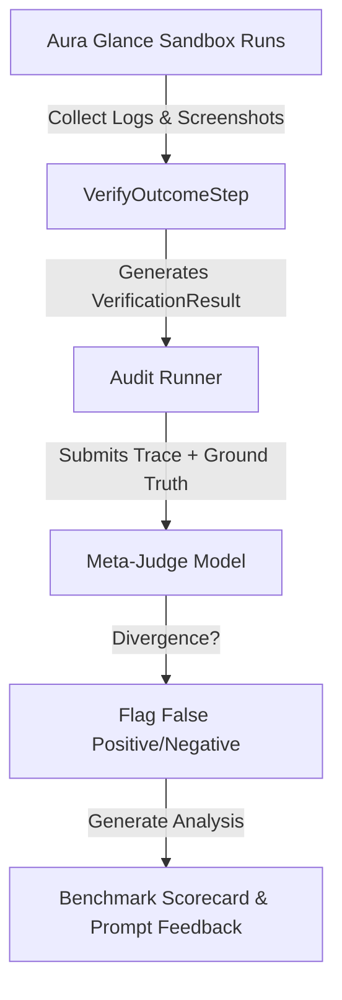
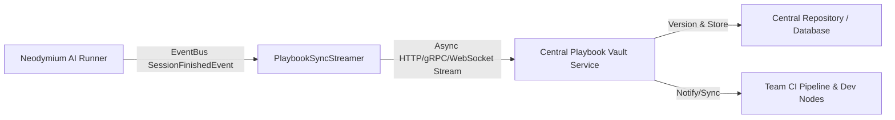

# Further Optimization Ideas - Neodymium AI

This document tracks future ideas, architecture designs, and optimization strategies for the Neodymium AI framework.

---

## 🪙 Token & Cost Optimization: Condensed JSON Payloads

### Background
During step execution, the LLM is queried with the SUT state (accessibility tree or DOM) and instructions to extract the necessary actions. Currently, the LLM returns a structured, verbose JSON response defining the step status and the resulting actions list. 

A typical LLM response length is around **313 characters** (~100 output tokens) due to structural formatting (whitespace/indentation) and empty placeholder attributes:

```json
{
  "status" : "SUCCESS",
  "reasoning" : "Navigating to the specified URL as requested.",
  "actions" : [ {
    "action" : "NAVIGATE",
    "locator" : "",
    "value" : "http://localhost:43377/AssertActionTest/testAssertHappyPath.html",
    "reasoning" : "Navigate to the test page."
  } ]
}
```

By condensing this response structure, we can significantly reduce completion tokens, lowering LLM API costs and execution latency.

---

### Proposals

#### 1. Minified & Non-Empty Payloads (Recommended)
Instruct the LLM to output minified JSON (no formatting whitespace) and completely omit empty or optional fields (e.g., omitting `locator: ""` when not needed, and omitting action-level `reasoning` if top-level `reasoning` covers it).

* **Proposed Format**:
  ```json
  {"status":"SUCCESS","reasoning":"Navigating to URL.","actions":[{"action":"NAVIGATE","value":"http://localhost:43377/AssertActionTest/testAssertHappyPath.html"}]}
  ```
* **Impact**:
  * **Size**: **141 characters** (a **~55% reduction** in output tokens).
  * **Implementation**: Requires updates to system prompts instructing the model to output compact JSON and omit unused properties. No parser changes are needed as Jackson naturally ignores missing fields or handles nulls gracefully.

---

#### 2. Short Key Aliases in Prompt and Parser
Add support for short, single-character key mappings within the prompt definitions and the Java parser (`ActionExtractionPrompt.java` and `VerificationPrompt.java`).

* **Proposed Mappings**:
  * `status` $\rightarrow$ `st`
  * `reasoning` $\rightarrow$ `r`
  * `targetContextLevel` $\rightarrow$ `tc`
  * `actions` $\rightarrow$ `acts`
  * `action` $\rightarrow$ `a`
  * `locator` $\rightarrow$ `l`
  * `value` $\rightarrow$ `v`

* **Proposed Format**:
  ```json
  {"st":"SUCCESS","r":"Navigating.","acts":[{"a":"NAVIGATE","v":"http://localhost:43377/AssertActionTest/testAssertHappyPath.html"}]}
  ```
* **Impact**:
  * **Size**: **117 characters** (a **~63% reduction** in output tokens).
  * **Implementation**: Requires code changes in `ActionExtractionPrompt.java` to check for these short key names when parsing the JSON response.

---

## 🔄 Redesign: Dynamic LLM Provider Configuration & Assignment

### Current Limitations
Currently, deciding whether to use a mock or live LLM provider is resolved by:
1. Package name scanning (e.g. checking if the active JUnit test class package contains `.mock.` or `.live.`).
2. Programmatically overriding properties in thread-local storage (`Neodymium.getData()`).

This approach has several drawbacks:
* **Coupling to package structure**: Tests must be located in specific subpackages to activate their respective providers.
* **Low flexibility**: Cannot easily run the same test method against different LLM providers (e.g. comparing Gemini 2.5 Flash vs. Gemini 2.5 Pro, or swapping to a mock provider for isolated assertions) without reorganizing packages or executing runtime property overrides.
* **Redundant Configuration**: Test classes require boilerplate config overrides.

---

### Proposed Redesign: Annotation-Driven & Scoped Registry Bindings

#### 1. Provider Registry Bindings
Instead of global property resolving, the `LlmRegistry` should support dynamic, scoped bindings. The test runner can set up these bindings on the registry during test instantiation.

```java
// Bind text capabilities to a specific provider name or class programmatically
session.getLlmRegistry().bind(LlmCapability.TEXT_ONLY, "mock-gemini");
```

#### 2. Annotation-Driven Assignment
Introduce new annotations to assign providers to specific test classes or methods:
* `@LlmProvider("mock")` or `@LlmProvider("gemini-live")`: Binds the provider by name to the test scope.
* `@LlmConfiguration(model = "gemini-2.5-pro", temperature = 0.2)`: Allows custom configuration parameters per test scope.

Example:
```java
@NeodymiumAiTest
@LlmProvider("mock") // Declares that this test class must run with the MockLlmProvider
public class MyActionIntegrationTest extends BaseAiTest {
    ...
}
```

#### 3. Task-Specific Model Routing & Property Design
Rather than relying on a single global `neodymium.ai.model` property, the property configuration should support assigning different models to different tasks (e.g. action extraction vs. visual verification vs. RCA analysis):

* **Task-Specific Properties Configuration (`neodymium.properties`)**:
  ```properties
  # Default fallback model
  neodymium.ai.model=gemini-2.5-flash

  # High-reasoning model for extracting Selenide actions
  neodymium.ai.task.extraction.model=gemini-2.5-pro

  # Faster/cheaper model for verifying page outcomes/screenshots
  neodymium.ai.task.verification.model=gemini-2.5-flash

  # Heavy model for visual root cause analysis (RCA) on failure
  neodymium.ai.task.rca.model=gemini-2.5-pro
  ```

* **Task-Based Registry Lookups**:
  Define a `LlmTask` enum and allow the pipeline execution engine to request providers from the registry matching the capability and specific task context:
  ```java
  public enum LlmTask
  {
      EXTRACTION,
      VERIFICATION,
      RCA,
      DEFAULT
  }
  ```
  ```java
  // Request the specific model instance registered/configured for verification
  final LlmProvider provider = session.getLlmRegistry().getProvider(LlmCapability.MULTIMODAL, LlmTask.VERIFICATION);
  ```

This decouples the provider lifecycle completely from class package locations, providing robust thread-isolation, cost control (by using cheaper models for simple verification tasks), and optimized reasoning capabilities tailored to each task.

---

## ⚖️ Offline Meta-Judge & Validation Benchmarking (LLM-as-a-Judge)

### Background
As system prompts, LLM model versions, and SUT web page layouts evolve, the semantic verification performed by the inline [VerificationPrompt](file:///../src/main/java/org/neodymium/ai/prompt/VerificationPrompt.java) can drift. To ensure the reliability of our test assertions and prevent silent false positives (where tests pass despite errors) or false negatives (where correct actions are marked as failed), we need an automated way to "verify the validator."

---

### Proposed Design: Meta-Judge Auditing Pipeline

We propose introducing a decoupled **Meta-Judge Auditing Pipeline** to benchmark the accuracy of our outcome verification system.

#### 1. Gold Standard Benchmark Dataset
Utilizing our self-contained test environment under the `Aura Glance Sandbox` (`src/test/resources/ai-test-pages/AuraGlanceTest/`), we define scenarios representing common execution success and failure topologies:
* **Expected Pass (Success):** Standard, bug-free flow transition (e.g., successful login redirect).
* **Expected Action Fail (Executor Error):** The agent clicks the wrong element or inputs invalid values (e.g., inputs numeric values in a name-only field).
* **Expected State Fail (System Error):** The agent performs correct actions, but the system displays a validation error or a 500 Server Error page.
* **Expected Silent Fail (State Stagnation):** The agent clicks a button, but the page doesn't update (e.g., cart quantity doesn't increment).

#### 2. Auditing Loop
During benchmark execution, the test suite captures:
1. The **Instruction** & **Actions** executed.
2. The **SUT State screenshots** (Before / After).
3. The **VerificationResult** produced inline (e.g., by Gemini 3.5 Flash).
4. The known **Ground Truth label** (Expected Pass/Fail).

A post-hoc evaluation job submits these traces to a high-tier reasoning model (e.g., Gemini Pro) acting as the **Meta-Judge**:



#### 3. Output & Actionability
The Meta-Judge generates an **Evaluation Scorecard** detailing:
* **Precision / Recall / Accuracy** of the inline validator.
* **Trace Divergence Explanations:** Plain-English explanations of why a step was misjudged (e.g., *"The inline validator missed the validation message 'Out of stock' because the font size was small and the overall page transitioned to a PLP."*).
* **Prompt Recommendations:** Suggestions for adjusting rubrics or adding few-shot examples to the prompt system message.

---

## 🛡️ "Ultra" High-Strength Execution & Healing Mode

### Background
During test execution or self-healing, when standard action extraction or verification fails, the default reasoning prompt or condensed DOM structure may not contain enough semantic clues to succeed. In these situations, we need a high-strength fallback mode that commits more resources (tokens, models, and inputs) to recover the step and prevent test failure.

---

### Proposal
Introduce a configurable "Ultra Mode" for execution and self-healing:
* **Enriched DOM & Context Representation:** Bypass normal token-saving truncations to feed more complete DOM details, sibling attributes, or full CSS state to the LLM.
* **Multimodal & Visual Reasoning:** Dynamically capture and inject full screenshots, region crops, or visual bounding box overlays (e.g. Set-of-Mark prompting) to let the model visually locate elements.
* **Divergent Prompts & High-Reasoning Models:** Query the LLM using distinct prompt templates tailored for hard cases (e.g., using Chain-of-Thought reasoning). Automatically route these queries to high-tier reasoning models (such as Gemini Pro or Ultra equivalent) with optimized temperature and sampling settings.
* **Self-Reflection & Verification Loops:** Run a multi-turn reasoning loop where the model first proposes an action, evaluates its own proposal against the visual state, and refines it before final execution.
* **Cost & Resource Transparency:** Explicitly track and report the increased token usage, execution time, and estimated financial cost in the test report when Ultra Mode is triggered, ensuring full awareness of the overhead.
* **Visual-Only Coordinate Interaction:** Introduce support for pure visual-only interactions where the model identifies target elements solely from screenshots and interacts with the page via direct coordinate-based mouse clicks and inputs, bypassing DOM-based locators entirely (e.g., for interacting with canvas elements or non-standard custom graphics).
* **Hybrid DOM-Coordinate Interaction:** Retrieve target element locations/boundaries via the DOM, but perform the actual interactions (hovering, clicking, typing) by calculating screen coordinates and simulating mouse trajectories.
* **Human-like Input Simulation:** Emulate realistic mouse movements using curved trajectories (e.g., Bézier curves) and dynamic speed profiles (Fitts's Law) dispatched via low-level CDP (Chrome DevTools Protocol) events to bypass bot-detection mechanisms.
* **Post-Execution Session Audit & Drift Review:** Option to submit the entire execution history (the complete sequence of steps, screenshots, actions, and inputs) to a post-run review process (either inline or via a separate LLM evaluation step). This checks for gradual state drift, circular loops, or silent failures that might have caused the agent to wander off-track over a longer session, appending this audit analysis to the final test report.


---

## 🔌 Pluggable Verification Modules

### Background
Currently, page state verification focuses primarily on functional outcomes (e.g., did the page transition, or did an action complete successfully). However, real-browser test suites are also an excellent opportunity to audit content and UI standards. Introducing a pluggable, modular verification system would allow teams to opt-in to non-functional quality gates without overloading the core functional execution logic.

---

### Proposal
Introduce a pluggable verification framework where developers can register optional validation modules to run during or after test execution:
* **Locale Consistency Modules:** Verify that dynamic content (e.g., dates, times, currencies, and numbers) is formatted correctly according to the target locale configurations.
* **Language & Editorial Quality Modules:** Run automated checks using specialized LLM prompts to verify spelling, grammar, and adherence to specific brand guidelines (voice, tone, terminology).
* **Image-Text Consistency Modules:** Use multimodal LLMs to analyze page content and verify that visual assets (images, banners, product pictures) match their accompanying text descriptions (e.g., flagging placeholder images, or detecting if a "Red Jacket" product page displays an image of a blue shirt).
* **Visual Layout & Template Consistency Modules:** Match the current page layout against baseline template images or visual layout structures defined for specific page types (e.g., PLP, PDP, Checkout) to ensure structural and design consistency. This checks that layout blocks, headers, and footers align with the reference template, which may require capturing and evaluating "long" (full-page scroll) screenshots.
* **Local Screenshot Reference Comparison Module:** Validate the current page's visual state against a reference screenshot stored on the local filesystem. The system instructs the multimodal LLM to compare the live screen capture with the reference file using a user-specified comparison standard. The evaluation supports various comparison modes and criteria:
  * **Identical / Pixel-Approximate:** Confirming that the layout, structure, and spacing are identical to the baseline, allowing only minor background noise or anti-aliasing differences.
  * **Similar Design / Structural Equivalence:** Checking if the page retains a similar visual design, alignment, grid structure, and branding, even if the actual content or images have been updated.
  * **Different Locale Validation:** Evaluating the layout of a translated or localized page against a master reference to ensure text expansions, currency symbols, and multi-byte characters do not break the design or alignment.
  * **Missing or Excess Elements Detection:** Prompting the LLM to inspect both images side-by-side to call out specific missing elements (e.g., a header button or promo banner that is gone) or unexpected extra components (e.g., a stray modal or double footer).
* **Accessibility (a11y) Auditing Modules:** Run accessibility checks (e.g., validating ARIA labels, color contrast ratios, semantic HTML structure, and keyboard navigability) either as a main step action within the test flow or as an optional post-step audit check.

---

## 🗺️ Automated Exploratory Testing (SBTM)

### Background
Traditional automated testing executes static, predefined script paths. While effective, it misses visual regressions, logic gaps, or edge cases that occur off the beaten path. By combining LLM-based web page interaction with Session-Based Test Management (SBTM) principles, we can run autonomous exploratory test sessions guided by high-level human ideas.

---

### Proposal
Implement an automated exploratory testing engine in Neodymium:
* **Charter-Driven Exploration:** The engine accepts a natural-language SBTM Charter (e.g., *"Explore the shopping cart under high latency, adding/removing items rapidly, to identify race conditions or UI breakdowns"*).
* **Autonomous Interaction:** The LLM determines and executes interaction sequences on the SUT dynamically, balancing goal-oriented navigation (following the charter) with random path exploration.
* **Findings Recording & Session Protocol:** Automatically track all interactions, page transitions, visual states, and console logs during the session. At the end of the run, compile a comprehensive SBTM session protocol containing findings, suspected bugs, coverage metrics, and step-by-step reproduction logs.

---

## 📝 Miscellaneous Thoughts & Reflections

### 🧠 Pre-emptive Self-Healing & "Second Opinion" Thresholds
When an agentic step or locator execution fails or exhibits low confidence (low token probabilities, high complexity, or repeated execution exceptions), we should explore triggering an adaptive reflection phase.
* **Reflective Re-framing:** The agent pauses, steps back, and reflects on the current DOM state, its overall approach, and previous context to "heal" its strategy or request a second opinion under a different persona/prompt structure.
* **Check Existing Mechanics:** We need to review how Neodymium currently handles locator self-healing under the hood (heuristics, triggers, alternate DOM lookups) to ensure any future reasoning-level healing aligns with or expands upon this foundation.

---

## 📡 Playbook Synchronization & Central Service Streaming

### Background
Currently, playbooks (YAML) and companion recording JSON files are saved locally on disk (e.g. `src/test/resources/` or `target/ai-recordings/`). In distributed test environments (such as parallel CI nodes, cloud build runners, or multi-developer setups), new or updated playbook recordings generated on ephemeral worker nodes remain isolated within the local filesystem unless manually committed.

To support seamless team collaboration and automated baseline management across distributed test pipelines, the framework should support streaming updated or new playbooks and companion recordings to a centralized synchronization service.

---

### Proposed Design: Event-Driven Playbook Streaming



#### 1. Remote / Streaming `PlaybookResourceManager`
Introduce a remote-capable implementation of `PlaybookResourceManager` (e.g., `StreamingPlaybookResourceManager` or `HttpPlaybookResourceManager`) that wraps local storage and streams updates:
* **Dual-Write / Async Buffer**: Writes locally (to `target/ai-recordings/`) for immediate test execution, while asynchronously queuing the updated playbook/recording JSON for streaming to the central service.
* **Non-Blocking Execution**: Streaming operations occur asynchronously in background worker threads to avoid adding latency to test execution.

#### 2. Features & Capabilities

* **Centralized Playbook Vault**: Maintains a single source of truth for all recorded SUT actions, baseline visual hashes, and locator candidates across the organization.
* **Live CI Replay Baseline Pulling**: Worker nodes running in `REPLAY_STRICT` mode can dynamically pull the latest validated companion JSON baselines from the central service if they are missing locally.
* **Conflict Resolution & Versioning**: The central service manages versioning (e.g., semantic tagging or git commit association) for recorded playbooks to prevent overwriting valid baselines when tests run concurrently across branches.
* **Real-time Session Streaming**: Stream executed actions, screenshot hashes, and execution metrics live to a centralized dashboard while test suites run.

#### 3. Configuration & Security Settings (`neodymium.properties`)

```properties
# Enable centralized playbook synchronization
neodymium.ai.sync.enabled=true

# Endpoint URL for the central playbook vault service
neodymium.ai.sync.endpoint=https://playbook-vault.internal/api/v1/sync

# Authentication token (passed dynamically via env variable)
neodymium.ai.sync.apiKey=${PLAYBOOK_SYNC_API_KEY}

# Sync scope: RECORDINGS_ONLY, PLAYBOOKS_ONLY, or ALL
neodymium.ai.sync.scope=ALL

# Strategy for handling conflicts: SERVER_WINS, CLIENT_WINS, or FAIL_ON_CONFLICT
neodymium.ai.sync.conflictStrategy=SERVER_WINS
```

