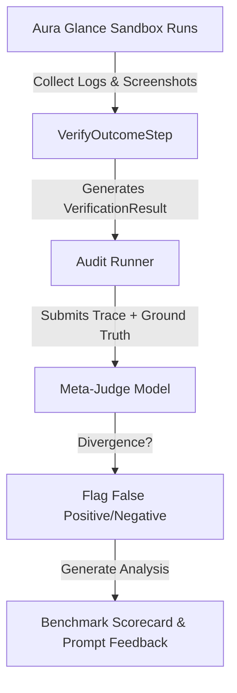

# Further Optimization Ideas - Neodymium AI

This document tracks future ideas, architecture designs, and optimization strategies for the Neodymium AI framework.

---

## 🪙 Token & Cost Optimization: Condensed JSON Payloads

### Background
During step execution, the LLM is queried with the SUT state (accessibility tree or DOM) and instructions to extract the necessary actions. Currently, the LLM returns a structured, verbose JSON response defining the step status and the resulting actions list. 

A typical LLM response length is around **313 characters** (~100 output tokens) due to structural formatting (whitespace/indentation) and empty placeholder attributes:

```json
{
  "status" : "SUCCESS",
  "reasoning" : "Navigating to the specified URL as requested.",
  "actions" : [ {
    "action" : "NAVIGATE",
    "locator" : "",
    "value" : "http://localhost:43377/AssertActionTest/testAssertHappyPath.html",
    "reasoning" : "Navigate to the test page."
  } ]
}
```

By condensing this response structure, we can significantly reduce completion tokens, lowering LLM API costs and execution latency.

---

### Proposals

#### 1. Minified & Non-Empty Payloads (Recommended)
Instruct the LLM to output minified JSON (no formatting whitespace) and completely omit empty or optional fields (e.g., omitting `locator: ""` when not needed, and omitting action-level `reasoning` if top-level `reasoning` covers it).

* **Proposed Format**:
  ```json
  {"status":"SUCCESS","reasoning":"Navigating to URL.","actions":[{"action":"NAVIGATE","value":"http://localhost:43377/AssertActionTest/testAssertHappyPath.html"}]}
  ```
* **Impact**:
  * **Size**: **141 characters** (a **~55% reduction** in output tokens).
  * **Implementation**: Requires updates to system prompts instructing the model to output compact JSON and omit unused properties. No parser changes are needed as Jackson naturally ignores missing fields or handles nulls gracefully.

---

#### 2. Short Key Aliases in Prompt and Parser
Add support for short, single-character key mappings within the prompt definitions and the Java parser (`ActionExtractionPrompt.java` and `VerificationPrompt.java`).

* **Proposed Mappings**:
  * `status` $\rightarrow$ `st`
  * `reasoning` $\rightarrow$ `r`
  * `targetContextLevel` $\rightarrow$ `tc`
  * `actions` $\rightarrow$ `acts`
  * `action` $\rightarrow$ `a`
  * `locator` $\rightarrow$ `l`
  * `value` $\rightarrow$ `v`

* **Proposed Format**:
  ```json
  {"st":"SUCCESS","r":"Navigating.","acts":[{"a":"NAVIGATE","v":"http://localhost:43377/AssertActionTest/testAssertHappyPath.html"}]}
  ```
* **Impact**:
  * **Size**: **117 characters** (a **~63% reduction** in output tokens).
  * **Implementation**: Requires code changes in `ActionExtractionPrompt.java` to check for these short key names when parsing the JSON response.

---

## 🔄 Redesign: Dynamic LLM Provider Configuration & Assignment

### Current Limitations
Currently, deciding whether to use a mock or live LLM provider is resolved by:
1. Package name scanning (e.g. checking if the active JUnit test class package contains `.mock.` or `.live.`).
2. Programmatically overriding properties in thread-local storage (`Neodymium.getData()`).

This approach has several drawbacks:
* **Coupling to package structure**: Tests must be located in specific subpackages to activate their respective providers.
* **Low flexibility**: Cannot easily run the same test method against different LLM providers (e.g. comparing Gemini 2.5 Flash vs. Gemini 2.5 Pro, or swapping to a mock provider for isolated assertions) without reorganizing packages or executing runtime property overrides.
* **Redundant Configuration**: Test classes require boilerplate config overrides.

---

### Proposed Redesign: Annotation-Driven & Scoped Registry Bindings

#### 1. Provider Registry Bindings
Instead of global property resolving, the `LlmRegistry` should support dynamic, scoped bindings. The test runner can set up these bindings on the registry during test instantiation.

```java
// Bind text capabilities to a specific provider name or class programmatically
session.getLlmRegistry().bind(LlmCapability.TEXT_ONLY, "mock-gemini");
```

#### 2. Annotation-Driven Assignment
Introduce new annotations to assign providers to specific test classes or methods:
* `@LlmProvider("mock")` or `@LlmProvider("gemini-live")`: Binds the provider by name to the test scope.
* `@LlmConfiguration(model = "gemini-2.5-pro", temperature = 0.2)`: Allows custom configuration parameters per test scope.

Example:
```java
@NeodymiumAiTest
@LlmProvider("mock") // Declares that this test class must run with the MockLlmProvider
public class MyActionIntegrationTest extends BaseAiTest {
    ...
}
```

#### 3. Task-Specific Model Routing & Property Design
Rather than relying on a single global `neodymium.ai.model` property, the property configuration should support assigning different models to different tasks (e.g. action extraction vs. visual verification vs. RCA analysis):

* **Task-Specific Properties Configuration (`neodymium.properties`)**:
  ```properties
  # Default fallback model
  neodymium.ai.model=gemini-2.5-flash

  # High-reasoning model for extracting Selenide actions
  neodymium.ai.task.extraction.model=gemini-2.5-pro

  # Faster/cheaper model for verifying page outcomes/screenshots
  neodymium.ai.task.verification.model=gemini-2.5-flash

  # Heavy model for visual root cause analysis (RCA) on failure
  neodymium.ai.task.rca.model=gemini-2.5-pro
  ```

* **Task-Based Registry Lookups**:
  Define a `LlmTask` enum and allow the pipeline execution engine to request providers from the registry matching the capability and specific task context:
  ```java
  public enum LlmTask
  {
      EXTRACTION,
      VERIFICATION,
      RCA,
      DEFAULT
  }
  ```
  ```java
  // Request the specific model instance registered/configured for verification
  final LlmProvider provider = session.getLlmRegistry().getProvider(LlmCapability.MULTIMODAL, LlmTask.VERIFICATION);
  ```

This decouples the provider lifecycle completely from class package locations, providing robust thread-isolation, cost control (by using cheaper models for simple verification tasks), and optimized reasoning capabilities tailored to each task.

---

## ⚖️ Offline Meta-Judge & Validation Benchmarking (LLM-as-a-Judge)

### Background
As system prompts, LLM model versions, and SUT web page layouts evolve, the semantic verification performed by the inline [VerificationPrompt](file:///../src/main/java/org/neodymium/ai/prompt/VerificationPrompt.java) can drift. To ensure the reliability of our test assertions and prevent silent false positives (where tests pass despite errors) or false negatives (where correct actions are marked as failed), we need an automated way to "verify the validator."

---

### Proposed Design: Meta-Judge Auditing Pipeline

We propose introducing a decoupled **Meta-Judge Auditing Pipeline** to benchmark the accuracy of our outcome verification system.

#### 1. Gold Standard Benchmark Dataset
Utilizing our self-contained test environment under the `Aura Glance Sandbox` (`src/test/resources/ai-test-pages/AuraGlanceTest/`), we define scenarios representing common execution success and failure topologies:
* **Expected Pass (Success):** Standard, bug-free flow transition (e.g., successful login redirect).
* **Expected Action Fail (Executor Error):** The agent clicks the wrong element or inputs invalid values (e.g., inputs numeric values in a name-only field).
* **Expected State Fail (System Error):** The agent performs correct actions, but the system displays a validation error or a 500 Server Error page.
* **Expected Silent Fail (State Stagnation):** The agent clicks a button, but the page doesn't update (e.g., cart quantity doesn't increment).

#### 2. Auditing Loop
During benchmark execution, the test suite captures:
1. The **Instruction** & **Actions** executed.
2. The **SUT State screenshots** (Before / After).
3. The **VerificationResult** produced inline (e.g., by Gemini 3.5 Flash).
4. The known **Ground Truth label** (Expected Pass/Fail).

A post-hoc evaluation job submits these traces to a high-tier reasoning model (e.g., Gemini Pro) acting as the **Meta-Judge**:



#### 3. Output & Actionability
The Meta-Judge generates an **Evaluation Scorecard** detailing:
* **Precision / Recall / Accuracy** of the inline validator.
* **Trace Divergence Explanations:** Plain-English explanations of why a step was misjudged (e.g., *"The inline validator missed the validation message 'Out of stock' because the font size was small and the overall page transitioned to a PLP."*).
* **Prompt Recommendations:** Suggestions for adjusting rubrics or adding few-shot examples to the prompt system message.


