# Neo Aura AI v2: Decoupled & Event-Driven Architecture

This document describes the architectural redesign (v2) of the Neo Aura AI test automation suite. The goal of this redesign is to transition the AI orchestration engine from a browser-centric, coupled procedural loop into a domain-agnostic, event-driven state machine that is easy to extend, test, parallelize, and reuse across different automation domains.

---

## 1. Architectural Blueprint (Overview)

The diagram below showcases the decoupled components of the `AiSession` lifecycle in v2. The core runner operates on abstract interfaces, delegating state capture, action execution, persistence, and reporting to specialized handlers.

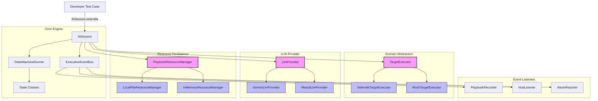

---

## 2. Decoupled Core Components

### A. Driver & Action Abstraction: `TargetExecutor`
The core engine does not make direct calls to Selenide, Selenium, or any specific driver. Furthermore, actions (like `Click`, `Type`, `SendRequest`) belong directly to the target session domain (e.g., Browser, REST API). 

To unify driver bridge control, state capture, action execution, and self-healing recovery, we define a single **`TargetExecutor`** interface. The session creates and delegates to the matching executor for its type.

```java
public interface TargetExecutor
{
    /**
     * Extracts the current SUT state representation based on a capture context.
     * 
     * @param context the context specifying level of detail (e.g. AXTREE vs LEAN) and screenshots
     * @return a snapshot of the current state
     */
    SutState captureState(StateCaptureContext context);

    /**
     * Executes the parsed Action. The TargetExecutor hosts the 
     * list/registry of actions it supports and handles routing and execution.
     * 
     * @param action the parsed action to execute
     * @throws Exception if execution fails
     */
    void execute(Action action) throws Exception;

    /**
     * Returns the structured definitions of all actions supported 
     * by this executor, allowing the prompt builder to format them dynamically.
     */
    List<ActionDefinition> getSupportedActions();

}
```

### Structured Action Representation
Instead of returning raw prompt instruction strings, the executor returns structured **`ActionDefinition`** objects. This allows the prompt builder to format the action guidelines dynamically based on model preferences (e.g. JSON schema structure vs. natural language list):

```java
public record ActionDefinition(
    String name,
    String description,
    List<ParameterDefinition> parameters,
    String defaultPromptInstruction
) {}

public record ParameterDefinition(
    String name,
    String type,
    String description,
    boolean required
) {}
```

#### Concrete Action Invocation Model
To maintain 100% backward-compatibility with the 22 existing browser action plugins (like `ClickAction` and `TypeAction`), the **`Action`** class remains a concrete, serializable data class. To support REST APIs, CLI, or database domains, it includes a generic parameters map:

```java
public class Action
{
    private String type;                     // e.g., "CLICK", "NAVIGATE", "SEND_REQUEST"
    private String target;                   // SUT target (e.g. selector "#btn" or URL path "/api/login")
    private List<String> value;              // Interaction value list (e.g. ["admin"], ["POST"])
    private String description;              // Human-readable action description
    private String reasoning;                // LLM reasoning details
    
    // Extensibility map to attach domain-specific typed parameters
    private transient Map<String, Object> parameters = new HashMap<>();

    public Action() {}

    public Action(String type, String target, String description)
    {
        this.type = type;
        this.target = target;
        this.description = description;
    }

    // Standard getters & setters...
    public String getType() { return type; }
    public String getTarget() { return target; }
    public String getValue() { return value != null && !value.isEmpty() ? value.get(0) : null; }
    
    public Map<String, Object> getParameters() { return parameters; }
}
```

* **Control Flow Decoupling**: Legacy action plugins that handled structural control flow (like `IncludeAction`, `BranchAction`, or `SplitAction`) are gradually retired or refactored. Their logical flow control (e.g. dynamic step splicing, conditional branching) is intercepted and managed directly by the core State Machine Pipeline, keeping action execution clean and side-effect free.

---

The returned **`SutState`** represents the SUT state in an extensible format:

```java
public interface SutState
{
    /**
     * The primary text content representing the state (DOM, JSON body, CLI printout).
     * Used by the prompt builder to feed state context to the LLM.
     */
    String getTextContent();

    /**
     * Optional visual or binary attachments (like screenshots, API response traces).
     */
    List<SutAttachment> getAttachments();

    /**
     * Perceptual visual hash (dHash) or content hash used to detect state divergence.
     */
    String getContentHash();
}
```

### Domain-Specific SUT State Implementations
Concrete executors extend the base `SutState` to capture and expose domain-specific properties:

1. **`BrowserSutState`** (Web Browsers):
   * `getTextContent()`: Returns the page DOM HTML.
   * `getContentHash()`: Returns the perceptual screenshot dHash.
   * `getAttachments()`: Returns the screenshot image attachment.
   * **Extended Properties**: `getUrl()`, `getBrowserConsoleLogs()`, `getActiveElement()`.
2. **`RestSutState`** (REST APIs):
   * `getTextContent()`: Returns the formatted API response body.
   * `getContentHash()`: Returns the SHA-256 hash of response headers + body.
   * **Extended Properties**: `getStatusCode()` (e.g. 200, 404), `getHeaders()` (response headers map), `getDurationMs()`.

This enables the exact same execution runner to drive a Web Browser, a REST API, a database, or a terminal session, simply by changing the active executor, while giving custom action plugins or assertions full access to rich, domain-specific state data.


---

### B. Action Plugins Scoped to the Executor
Action plugins are registered inside the concrete `TargetExecutor` implementing class. They are typed to the specific SUT resources (like drivers or HTTP clients) and states that the executor manages.

#### 1. Browser Action Plugin Example
Browser actions receive the active `SelenideDriver` resource and operate on a `BrowserSutState`:

```java
public interface BrowserActionPlugin
{
    String getActionName();
    String getPromptInstructions();
    void execute(Action action, SelenideDriver driver, BrowserSutState state) throws Exception;
}
```

#### 2. REST API Action Plugin Example
REST action plugins operate on raw HTTP request builders/clients and inspect the typed `RestSutState`:

```java
public interface RestActionPlugin
{
    String getActionName();
    String getPromptInstructions();
    void execute(Action action, HttpClient client, RestSutState state) throws Exception;
}
```

* **Type-Safe Downcasting**: Since these action plugins are registered directly inside the corresponding domain executor package (e.g. `com.xceptance.neodymium.ai.rest.action`), they can safely downcast the generic `SutState` to the type-specific implementation (`RestSutState` or `BrowserSutState`) to assert status codes, inspect headers, or query session logs.
* **Separation of Concerns**: This keeps the core state machine runner completely domain-blind, while allowing the individual actions to utilize 100% of the SUT's specialized state properties.

The **`SelenideTargetExecutor`** implements `TargetExecutor` by:
1. Instantiating the Selenide WebDriver instance.
2. Initializing and registering the browser actions (`ClickAction`, `TypeAction`, etc.).
3. Implementing `execute(Action action)` by routing to the appropriate registered `BrowserActionPlugin`, passing it the active driver and the downcast `BrowserSutState`.
4. Implementing `getSupportedActions()` by compiling the list of structured `ActionDefinition` objects from the registered action plugins.

---

### C. Failure Handling & Step Recovery
When a step execution or validation fails, the runner does not terminate the browser session or replay from the start. Instead, it handles the failure directly in the active session context using the following escalation flow:

1. **Active Healing & Escalation**:
   * The runner enters a localized healing phase (e.g., retrying the action with alternate locators, waiting for dynamic elements, or upgrading the context detail level).
   * It attempts to resolve the failure using self-healing rules until the retry budget/escalation limits are exhausted.
2. **Interactive Break (Debug Mode)**:
   * If self-healing cannot resolve the issue and the session is in interactive debug mode (HUD active), the runner breaks execution, reports the failure details to the HUD, and pauses to wait for user intervention (e.g. manually editing the step or updating the SUT state and resuming).
3. **Conclusive Failure**:
   * If in non-interactive/CI mode, or if all healing options are exhausted and no debugger/HUD is present, the execution halts and fails for good.

---

### D. Event-Driven Lifecycle: `ExecutionEventBus`
The `StateMachineRunner` transitions through step resolution and execution, publishing simple domain events. It is entirely free of logging, reporting, HUD, or serialization concerns.

#### 1. The `ExecutionEvent` and `ExecutionEventBus` Contracts
Every event implements `ExecutionEvent` and carries a reference to the active `ExecutionContext` to let subscribers easily query session data, variables, playbooks, and states:

```java
public interface ExecutionEvent
{
    /**
     * @return the execution context of the active session.
     */
    ExecutionContext getContext();
}

public interface ExecutionEventListener
{
    void onEvent(ExecutionEvent event);
}
```

#### 2. Re-entrancy Loop Protection
Since the session runs entirely on a single thread, the `ExecutionEventBus` implements a simple instance-level guard set to track currently executing listeners and prevent infinite loops or stack overflows from recursive event publishing:

```java
public final class ExecutionEventBus
{
    private final List<ExecutionEventListener> listeners = new CopyOnWriteArrayList<>();
    private final Set<ExecutionEventListener> activeListeners = new HashSet<>();

    public void publish(final ExecutionEvent event)
    {
        for (final ExecutionEventListener listener : this.listeners)
        {
            // Guard: Prevent re-entrant loops by skipping listeners currently on the call stack
            if (!this.activeListeners.contains(listener))
            {
                this.activeListeners.add(listener);
                try
                {
                    listener.onEvent(event);
                }
                finally
                {
                    this.activeListeners.remove(listener);
                }
            }
        }
    }
}
```

#### 3. Core Events:
* **`StepStartedEvent`**: Dispatched when a new instruction starts.
* **`StateCapturedEvent`**: Contains the `SutState` (DOM and screenshot) prior to action execution.
* **`ActionExecutedEvent`**: Dispatched when a single action finishes.
* **`StepFinishedEvent`**: Contains the outcome, reasoning, and healed context level.
* **`SessionFinishedEvent`**: Dispatched when the test session completes.
* **`DiagnosticInfoEvent` / `DiagnosticWarningEvent` / `DiagnosticErrorEvent`**: Dispatched by hooks or runner steps to log soft diagnostics.

#### 4. Listeners:
* **`PlaybookRecorder`**: Listens to step and action events to build the recording and saves it via `PlaybookResourceManager` upon session success.
* **`HudListener`**: Renders the glassmorphic interactive HUD on the browser, handles breakpoints, and pauses the runner on execution errors to await manual overrides.
* **`AllureReporter` / `AuraServerReporter`**: Collect step details and screenshots to output test reports.

---

## 3. Playbook vs. PlaybookRecording (Terminology & Divergence)

To prevent class and file naming collisions, we draw a strict line between developer intention (manual) and execution cache (automated):

1. **`Playbook`**: The user-defined scenario written in YAML (e.g., `shop-checkout.yaml`). It is read-only during execution.
2. **`PlaybookRecording`**: The autogenerated JSON file containing concrete actions, selectors, and visual dHashes (e.g., `shop-checkout.recording.json`).

```
                    Playbook (YAML)
                 "Open shop, search shoes"
                           │
                           ▼
                  [State Machine Runner] ◄─── PlaybookRecording (JSON)
                           │                  - Action: CLICK #btn
                           │                  - preStateHash: ABC123XYZ
                           ▼
                 Divergence Event?
               ┌───────────┴───────────┐
               ▼ (No)                  ▼ (Yes)
          [REPLAY MODE]            [RECORD MODE]
       Execute cached action    Fallback to Live LLM
                                Update PlaybookRecording
```

### Divergence Detection & Healing Rules
A **Divergence Point** is detected when:
* The user edits or inserts a step in the `Playbook`.
* The current page `dHash` does not match the `preStateHash` stored in the corresponding step of the `PlaybookRecording`.
* A replayed action fails to execute at runtime.

Once a divergence occurs, the runner switches permanently from `REPLAY` to `RECORD` mode for all subsequent steps. This prevents cascading failures because downstream states are causally linked to upstream actions.

---

## 4. Resource Decoupling: `PlaybookResourceManager`

To ensure playbooks and recordings can be loaded from and saved to anywhere (local files, classpath resources, database records, or remote API endpoints) without coupling the runner to disk file structures, all resource access is delegated to a **`PlaybookResourceManager`**:

```java
public interface PlaybookResourceManager
{
    /**
     * Opens an input stream to read a resource's raw content.
     * 
     * @param identifier the resource path, database key, or classpath URI
     */
    InputStream read(String identifier) throws IOException;

    /**
     * Writes raw content (e.g. serialized PlaybookRecording JSON) to a target identifier.
     */
    void write(String identifier, String content) throws IOException;

    /**
     * Resolves a relative resource identifier (like an include path) 
     * against a parent playbook's identifier.
     * 
     * @param parentIdentifier the identifier of the parent playbook
     * @param relativePath the relative target (e.g., "includes/login.yaml")
     * @return the resolved absolute or fully qualified identifier
     */
    String resolveInclude(String parentIdentifier, String relativePath);
}
```

### Component Roles & Resource Resolution

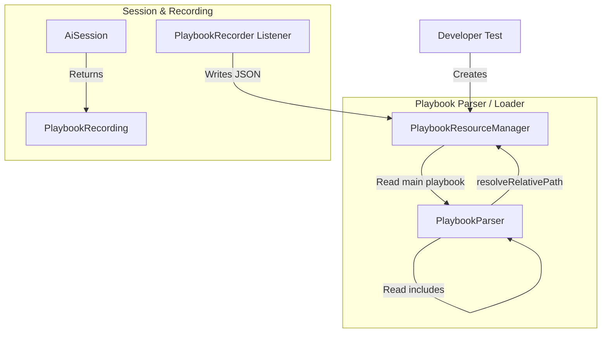

1. **Playbook Parser / Loader**:
   * When loading a playbook (e.g. `Playbook.from("src/test/resources/my-playbook.yaml", resourceManager)`), the parser reads the source stream.
   * When it encounters an include directive (e.g. `include: common/login.yaml`), the parser calls `resourceManager.resolveInclude("src/test/resources/my-playbook.yaml", "common/login.yaml")` to compute the path to the included file, and recursively reads its stream.
2. **`PlaybookRecorder` (Event Listener)**:
   * When execution completes, the recorder listener captures the returned `PlaybookRecording` and serializes it to JSON.
   * It writes the output by calling `resourceManager.write("src/test/resources/my-playbook-recording.json", json)`.
3. **Internal Session Assets**:
   * The `AiSession` is initialized with the active `PlaybookResourceManager` so that pipeline steps can resolve and load external assets (like dynamic assertion data or region masks) relative to the active playbook directory.

#### Common Implementations:
* **`LocalFileResourceManager`**: Resolves includes and reads/writes using local file system absolute/relative path strings (default for local test cases).
* **`ClasspathResourceManager`**: Resolves relative classpath paths and reads resources using Java's ClassLoader stream API (read-only).
* **`InMemoryResourceManager`**: Holds playbooks and recordings in memory without writing them to disk (enabling a playbook recording generated in one run to be passed directly to the next replay session without any disk I/O).

---

## 5. Thread Isolation and Concurrency

* All static `ThreadLocal` variables (previously used for the active agent and run results) are removed.
* The `AiSession` acts as the single owner of the execution context, holding the `TargetExecutor`, `PlaybookResourceManager`, `ExecutionEventBus`, and statistics.
* This permits running multiple AI test sessions concurrently in parallel JVM threads (essential for multi-browser testing or high-throughput CI runs).

---

## 6. Debugger & Session Control Interface (HUD Decoupling)

In v2, the HUD is not a coupled controller inside the loop. Instead, it interacts with the `AiSession` through a clean **Debugger** interface. 

### A. The `SessionDebugger` Interface
The debugger allows an external client (like the Selenide HUD or Aura Server) to inspect and control the execution.

```java
public interface SessionDebugger
{
    /**
     * Pauses the execution before the next step starts.
     */
    void pause();

    /**
     * Resumes a paused execution.
     */
    void resume();

    /**
     * Executes the single next step and pauses again.
     */
    void stepOver();

    /**
     * Rewinds execution cursor to a previous step index.
     * Truncates recording steps accordingly.
     */
    void rewindTo(final int stepIndex);

    /**
     * Mutates the active playbook dynamically (e.g. user inserts/edits steps).
     */
    void updatePlaybook(final Playbook updatedPlaybook);

    /**
     * Adds or removes a breakpoint at the given step index.
     */
    void toggleBreakpoint(final int stepIndex, final boolean enabled);

    /**
     * @return the current status (PAUSED, RUNNING, FINISHED) and details.
     */
    DebugSnapshot getDebugSnapshot();
}
```

### B. The Debug Execution Loop
When the session is initialized in **Debug Mode**, the `StateMachineRunner` checks the debugger state before starting each state transition. 

1. Before starting a step, the runner checks if a breakpoint is matched or if `pause()` was called.
2. If paused, it posts a `DebuggerPauseEvent` via the `ExecutionEventBus` containing a hint to the HUD to read the current execution state.
3. The runner blocks using a lock/condition until the debugger receives `resume()`, `stepOver()`, or `rewindTo()` from the client.
4. **Tree-Based Stack Rewinding**: If `rewindTo(stepIndex)` is called, the debugger clears any dynamic children (sub-steps generated via splits or includes) from root step `stepIndex` onwards, resets the runner execution stack with the remaining root steps starting at `stepIndex`, and resets their statuses.
5. If a step is edited or added by the user during the pause, the debugger updates the active `Playbook` on the fly, updates the execution stack, and instructs the runner to transition back to step resolution.

---

## 7. Session-Centric Architecture (`AiSession` Factory & Hierarchy)

In v2, the **`AiSession`** acts as the lead coordinator. It is the single owner of the execution context, driver registry, storage handler, and structured test data. The execution engine runs *inside* the session.

To keep the developer-facing API clean and prevent configuration errors, the concrete session subclasses (like `SelenideBrowserSession` or `RestApiSession`) are **package-private**. The end user interacts exclusively with the abstract `AiSession` using static factory methods:

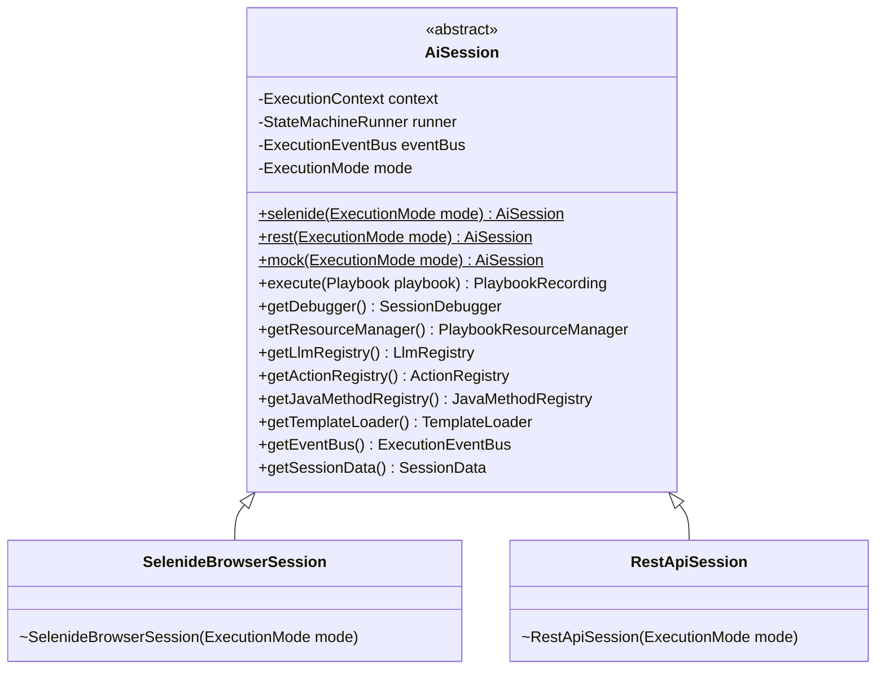

### The `ExecutionMode` Options
The session is configured at startup with one of the following execution modes:
1. **`LLM_ONLY`**: Executes steps live using the LLM. Bypasses recordings completely (does not read baselines and does not compile a recording object).
2. **`REPLAY_ONLY`**: Strict replay mode. Replays cached recording actions. If the page diverges or an action fails, it halts immediately (no LLM, no self-healing, no fallback).
3. **`RECORD`**: Generates actions live using the LLM and compiles/returns a new `PlaybookRecording`.
4. **`REPLAY_AND_FIX`**: Replays the cached recording; if divergence or failure occurs, it flips to LLM self-healing on the fly, writing/merging the corrected actions into an updated `PlaybookRecording`.

---

### End-User Usage Examples

#### 1. Standard Replay & Fix Execution
Loads the playbook instructions (and its baseline recording) and executes in `REPLAY_AND_FIX` mode. The session itself does not save to disk; it returns the final `PlaybookRecording` or relies on a registered `PlaybookRecorder` listener:

```java
@Test
public void testPurchaseFlow()
{
    // 1. Initialize session in REPLAY_AND_FIX mode
    final AiSession session = AiSession.selenide(ExecutionMode.REPLAY_AND_FIX);

    // 2. Load the playbook (resolves guest-purchase.yaml and its recording)
    final Playbook playbook = Playbook.from("guest-purchase.yaml");

    // 3. Execute and receive the updated recording
    final PlaybookRecording updatedRecording = session.execute(playbook);
}
```

#### 2. In-Memory Testing (No Disk I/O)
For fast local testing, developers can execute a playbook in `RECORD` mode, hold the compiled `PlaybookRecording` in-memory, and immediately verify it against a strict `REPLAY_ONLY` session on a clean browser page:

```java
@Test
public void testInMemoryReplay()
{
    // 1. Run live recording using LLM to generate actions
    final Playbook playbook = Playbook.builder()
        .step("Navigate to homepage")
        .step("Click login button")
        .build();

    final PlaybookRecording recording = AiSession.selenide(ExecutionMode.RECORD)
        .execute(playbook);

    // 2. Attach recording in-memory to the playbook object
    playbook.attachRecording(recording);

    // 3. Replay strictly (will fail if selectors or page layout is inconsistent)
    final AiSession replaySession = AiSession.selenide(ExecutionMode.REPLAY_ONLY);
    replaySession.execute(playbook);
}
```

---

### A. Layered Data Holder: `SessionData`
To support dynamic runtime variables (like extracted order numbers or HUD edits) while preserving original inputs, the session maintains two distinct data layers:
1. **Static Data Layer (Immutable)**: Contains the initial dataset parameters, system properties, and configurations injected at startup.
2. **Dynamic Data Layer (Mutable)**: Contains variables mutated, added, or extracted during the run.

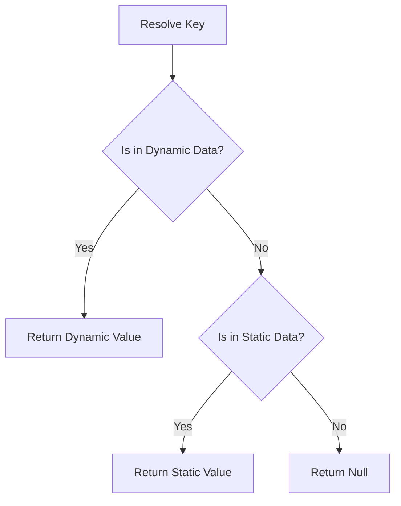

#### Step Snapshots & Debug Rollback
During interactive debugging or replays, when a user rewinds execution (e.g. going back from Step 5 to Step 2), we must restore the SUT state *and* rollback the variables to their state at Step 2. 

To support this, `SessionData` captures snapshots of the Dynamic Data Layer:

```java
public final class SessionData
{
    public static record DataEntry(Object value, boolean sensitive) {}

    private final Map<String, DataEntry> staticData;
    private final Map<String, DataEntry> dynamicData = new ConcurrentHashMap<>();
    
    // Keyed by step index, stores a snapshot of dynamicData at the start of that step
    private final Map<Integer, Map<String, DataEntry>> dynamicHistory = new ConcurrentHashMap<>();

    public SessionData(final Map<String, DataEntry> staticData)
    {
        this.staticData = Collections.unmodifiableMap(new HashMap<>(staticData));
    }

    public void putDynamic(final String key, final Object value, final boolean sensitive)
    {
        this.dynamicData.put(key, new DataEntry(value, sensitive));
    }

    public DataEntry getEntry(final String key)
    {
        // 1. Resolve from dynamic data first
        if (this.dynamicData.containsKey(key))
        {
            return this.dynamicData.get(key);
        }
        // 2. Fallback to static data
        return this.staticData.get(key);
    }

    public Object get(final String key)
    {
        final DataEntry entry = getEntry(key);
        return entry != null ? entry.value() : null;
    }

    /**
     * Captures a snapshot of the dynamic data at the start of a step.
     */
    public void captureSnapshot(final int stepIndex)
    {
        this.dynamicHistory.put(stepIndex, new HashMap<>(this.dynamicData));
    }

    /**
     * Rolls back the dynamic data state to a previous step,
     * discarding any dynamic changes made after that step started.
     */
    public void rollbackToStep(final int stepIndex)
    {
        final Map<String, DataEntry> snapshot = this.dynamicHistory.get(stepIndex);
        if (snapshot != null)
        {
            this.dynamicData.clear();
            this.dynamicData.putAll(snapshot);
        }
        
        // Remove history for steps after the rollback target
        this.dynamicHistory.keySet().removeIf(idx -> idx > stepIndex);
    }

    /**
     * Returns a copy of the merged data, masking any values marked as sensitive
     * before they are sent to the LLM.
     */
    public Map<String, Object> getGuardedDataMap()
    {
        final Map<String, Object> merged = new HashMap<>();
        
        // Merge static and dynamic data maps
        final Map<String, DataEntry> allData = new HashMap<>(this.staticData);
        allData.putAll(this.dynamicData);
        
        for (final Map.Entry<String, DataEntry> entry : allData.entrySet())
        {
            if (entry.getValue().sensitive())
            {
                merged.put(entry.getKey(), "[SENSITIVE_VALUE]");
            }
            else
            {
                merged.put(entry.getKey(), entry.getValue().value());
            }
        }
        return merged;
    }
}
```

This data holder is accessible to both the `TargetExecutor` (to compile prompt data) and the action implementations (to inject actual values at execution time).


---

## 8. Unified Event-Driven Logging & Metrics

Logging in Neo Aura AI serves multiple consumers with different requirements:
1. **Developer Console Logging**: Human-readable, real-time textual output in terminal logs.
2. **Diagnostic Trace Logging**: Structured, rich payload logs (screenshots, DOM snapshots, network details) for post-mortem analysis (e.g. Aura Trace Viewer).
3. **Usage & Cost Metrics**: Structured telemetry tracking token consumption, API execution times, and self-healing success rates.
4. **Third-Party Integrations**: Real-time alerts, test management updates, or Slack notifications.

In v2, all logging and metrics aggregation are completely decoupled from the execution loop. The core engine only fires events; specialized event listeners handle the logging.

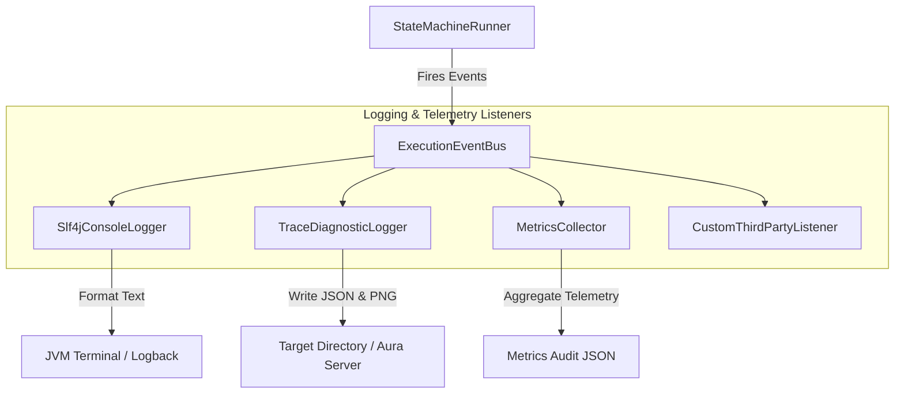

### A. The Console Logger
The `Slf4jConsoleLogger` subscribes to the event bus to produce clean, user-friendly logs in the terminal, hiding diagnostic noise unless debug levels are active.

```java
public final class Slf4jConsoleLogger implements ExecutionEventListener
{
    private static final Logger LOG = LoggerFactory.getLogger("com.xceptance.neodymium.ai.console");

    @Override
    public void onEvent(final ExecutionEvent event)
    {
        if (event instanceof StepStartedEvent e)
        {
            LOG.info("➡️ Step {}: {}", e.stepIndex() + 1, e.promptLine());
        }
        else if (event instanceof ActionExecutedEvent e)
        {
            LOG.info("   ↳ Executed: {} -> {}", e.action().getType(), e.action().getTarget());
        }
        else if (event instanceof StepFinishedEvent e)
        {
            if (e.success())
            {
                LOG.info("✅ Step completed successfully.");
            }
            else
            {
                LOG.error("❌ Step failed: {}", e.reasoning());
            }
        }
    }
}
```

---

### B. The Trace Diagnostic Logger (Aura Trace Viewer)
For rich diagnostics, the `TraceDiagnosticLogger` collects detailed states and writes them to a standardized filesystem structure for the Aura Trace Viewer, or streams them directly to Aura Server over WebSockets:

* It captures the raw HTML DOM string and screenshot PNG from `StateCapturedEvent`.
* It logs the raw prompt template and LLM prompt payloads from `LlmRequestSentEvent`.
* It captures the exact JSON response returned by the model from `LlmResponseReceivedEvent`.
* It records the exception trace if self-healing is triggered.

* **Benefit**: Because this listener operates asynchronously, the high I/O overhead of writing DOM strings and screenshots to disk does not slow down the test runner's thread execution.

---

### C. Session Telemetry and Cost Audits
The `MetricsCollector` listens to LLM response events to accumulate usage tokens and calculate real-time execution statistics:

```java
public record SessionTelemetry(
    int totalSteps,
    int healedSteps,
    int tokenUsageInput,
    int tokenUsageOutput,
    long totalDurationMs,
    double estimatedCostUsd
) {}
```
This telemetry is dumped as an audit JSON at the end of the session, allowing teams to track token budgets and AI execution efficiency directly inside CI/CD pipelines.

### D. Custom Diagnostic & Hook Events

To support soft reporting, warning logs, and custom setup/validation feedback, any execution step, pre-execution hook, or post-execution hook can publish custom diagnostic events to the `ExecutionEventBus` at any time.

#### 1. Standard Diagnostic Events
* **`DiagnosticInfoEvent`**: Carries informational logs (e.g. *"Setup hook populated test user credentials"*).
* **`DiagnosticWarningEvent`**: Carries warning logs (e.g. *"Slow page load time detected during setup"*).
* **`DiagnosticErrorEvent`**: Carries non-blocking, soft errors (e.g. *"Potential visual overlap detected on the checkout button"*).

```java
public record DiagnosticWarningEvent(
    String message,
    String sourceComponent,
    Instant timestamp
) implements ExecutionEvent {}
```

#### 2. Event Dispatching & Handling
Subscribers listen to these events and process them in a decoupled manner:
* **`Slf4jConsoleLogger`**: Subscribes to `DiagnosticWarningEvent` to log colorized warnings to the terminal, and `DiagnosticErrorEvent` to log soft errors.
* **`PlaybookRecorder`**: Subscribes to all diagnostic events and attaches them directly to the `PlaybookRecording` metadata.
* **Allure & HTML Reporters**: Subscribes to gather warnings and errors, formatting them as non-blocking annotations or warnings inside the test execution reports.

---

## 9. Playbook Parsing & Data Mutability

To keep playbooks flexible and support runtime modifications (like HUD data changes or dynamic values extracted from the page), we abstract the ingestion process and define clear mutability rules.

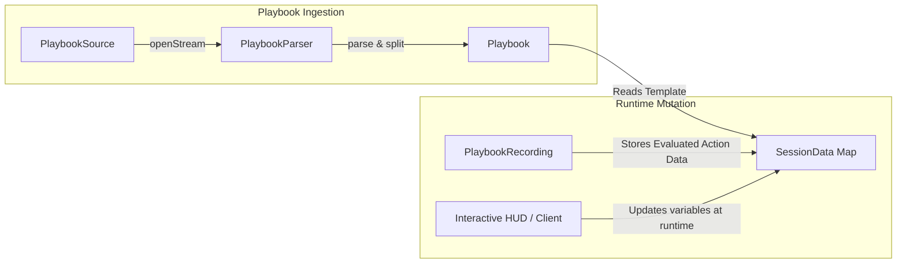

### A. Abstract Playbook Parsing & Recursive Step Structure
A `Playbook` is a tree of step instructions. Rather than a flat list, steps are modeled using a recursive **Composite Pattern** to correctly represent dynamic includes, splits, and nested splits (splits of splits).

```java
public class PlaybookStep
{
    private String instruction;
    private final List<PlaybookStep> subSteps = new ArrayList<>();
    private final List<Action> actions = new ArrayList<>(); // Concrete executed actions (leaves only)
    private boolean failed;
    private String failureReason;

    public PlaybookStep(final String instruction)
    {
        this.instruction = instruction;
    }

    public String getInstruction() { return instruction; }
    public void setInstruction(final String instruction) { this.instruction = instruction; }

    public List<PlaybookStep> getSubSteps() { return subSteps; }
    public List<Action> getActions() { return actions; }

    public boolean isComposite() { return !subSteps.isEmpty(); }
    public boolean isFailed() { return failed; }
    public void setFailed(final boolean failed) { this.failed = failed; }
}

public interface PlaybookSource
{
    InputStream openStream() throws IOException;
    String getSourceIdentifier(); // e.g. file path, database key, or test method name
}

public interface PlaybookParser
{
    /**
     * Parses the raw source into a list of steps.
     * Handles splitting compound steps into discrete steps, stripping annotations, 
     * and validating syntax before execution begins.
     */
    List<PlaybookStep> parse(PlaybookSource source);
}
```

* **`YamlPlaybookParser`**: Standard parser for human-written YAML files.
* **`InlinePlaybookParser`**: Compiles playbooks from raw strings passed directly inside code or test annotations.

---

### B. Runtime Data Mutability
Execution variables are not static. During a run:
1. **The `Playbook`** holds unresolved step templates (e.g. `"Type '${userEmail}' into input"`).
2. **The `SessionData` map** holds the current values (e.g. `userEmail` -> `bob@test.com`).
3. **The `PlaybookRecording`** stores the evaluated action parameters (e.g. `TypeAction(target="#email", value="bob@test.com")`).

#### Updating Data on the Fly:
* **Dynamic Value Extraction**: If a step extracts a value (e.g. `"Store order number into variable ${orderId}"`), the execution updates the `SessionData` map at runtime.
* **HUD Modification**: If a debugger pause occurs and the developer edits a variable, the `SessionDebugger` updates the `SessionData` map. 
* **Causal Propagation**: Since subsequent steps evaluate their placeholders dynamically against the `SessionData` map right before execution, they automatically consume the mutated values.

---

### C. Dynamic Playbook Includes & Splicing
To correctly represent dynamic step splits, inclusions, and splits of splits recursively, the playbook execution sequence is modeled as a **hierarchical tree of steps**. A `PlaybookStep` can host a child list of nested `subSteps` (Composite Pattern).

When a running session encounters a dynamic include instruction (e.g. `"include: login-flow.yaml"`) or a split instruction (e.g. a `SPLIT` action returned by the LLM containing remaining instruction text):

1. **Step Splicing via Children**:
   * The parsed sub-steps or splits are added directly into the **`subSteps`** collection of the currently executing step.
   * This naturally represents splits of splits recursively as branches of a tree (e.g. `Step 2` -> `Sub-step 2.2` -> `Sub-sub-step 2.2.1`).
2. **Active Runner Stack**:
   * The runner maintains an active execution stack (`Deque<PlaybookStep>`) holding the active leaf node being executed.
   * When a parent step has children, the runner pushes its children onto the execution stack. This prevents index shifting in the root playbook list, keeping step cursor navigation clean and robust.

```java
public void executeDynamicInclude(final String relativePath, final ExecutionContext context) throws Exception
{
    // 1. Fetch the currently executing active step from context
    final PlaybookStep currentStep = context.getActiveStep();

    // 2. Resolve relative path against parent ID
    final String resolvedId = context.getSession().getResourceManager()
        .resolveInclude(context.getCurrentPlaybookId(), relativePath);

    // 3. Read and parse sub-steps dynamically
    try (final InputStream stream = context.getSession().getResourceManager().read(resolvedId))
    {
        final PlaybookSource source = new StreamPlaybookSource(resolvedId, stream);
        final List<PlaybookStep> subSteps = context.getSession().getPlaybookParser().parse(source);

        // 4. Add parsed steps as children of the current step
        currentStep.getSubSteps().addAll(subSteps);

        // 5. Push the sub-steps onto the execution runner stack to run next
        context.pushSteps(subSteps);
    }
}
```

This permits using nested playbooks as modular, reusable macros during runtime.

---

## 10. Data Guarding & Sanitization

To enforce strict security and prevent dynamic run garbage or sensitive credentials from leaking, the architecture separates raw runtime values from external communications and persisted recordings.

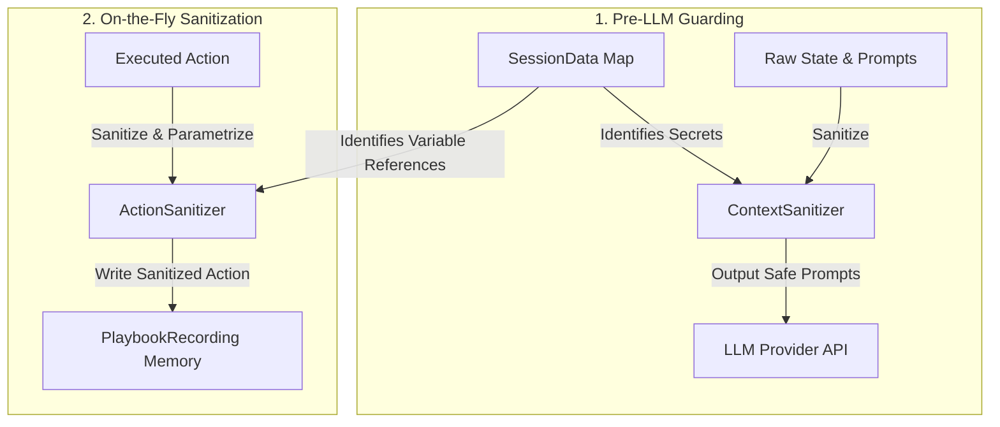

### A. Pre-LLM Context Sanitization (`ContextSanitizer`)
Before any prompt or SUT state text (like DOM HTML source containing input values) is sent to the LLM, the execution runner passes the payload through a **`ContextSanitizer`**:

```java
public interface ContextSanitizer
{
    /**
     * Sanitizes the prompt and SUT state, replacing actual sensitive values 
     * with safe, anonymous placeholders.
     */
    SanitizedPayload sanitize(String rawPrompt, SutState rawState, SessionData data);
}
```

* **Secret Masking**: Any value in `SessionData` flagged as sensitive or mapped under keys like `password`, `apiKey`, or `token` is scanned for and replaced in the HTML/prompt. Replacing is done using either a format-preserving mock pattern (matching the length and structure of the original data) or a user-supplied stand-in value, preventing the LLM from seeing the actual secret while maintaining semantic validity.
* **Reverse Mapping**: The `SanitizedPayload` holds a temporary map linking the masked value or stand-in back to its variable reference. If the LLM generates a response action containing the stand-in value, the session maps it back to the real variable reference (e.g. `${userPassword}`) before execution.

---

### B. On-the-Fly Recording Sanitization & Parameterization
To ensure credentials and transient data are correctly identified, sanitization and parameterization happen **on the fly as actions are executed and recorded**, rather than in a post-execution pass. The `PlaybookRecorder` intercepts executed actions and sanitizes them before adding them to the `PlaybookRecording` memory object:

```java
public interface ActionSanitizer
{
    /**
     * Sanitizes an executed action on the fly, replacing hardcoded credentials 
     * and dynamic run values with variable references or wildcards.
     */
    Action sanitize(Action rawAction, SessionData data);
}
```

* **Action Value Parameterization**:
  If the runner executes an action that types `admin_pass_9921` into a password field, the sanitizer immediately matches it against the active `SessionData` references. Knowing it corresponds to the variable `userPassword`, it rewrites the action's value to `${userPassword}` before it is written to the recording.
* **Transient Data Exclusion**:
  Dynamic runtime values (like CSRF tokens or ephemeral session identifiers) are intercepted using registered patterns and replaced with wildcards on the fly, preventing dynamic run garbage from entering the stored recording.

---

## 11. Composite Execution Pipelines

To model complex step execution logic (including JIT linting, state captures, LLM queries, action runs, self-healing, and events) without building a rigid procedural loop, we implement a **Composite Execution Pipeline** pattern. 

Every execution phase is modeled as a composable node. Pipelines can be nested, branched, and repeated, allowing us to define distinct, static execution pipelines for **Live Execution** and **Replay Execution** while sharing the same atomic steps.

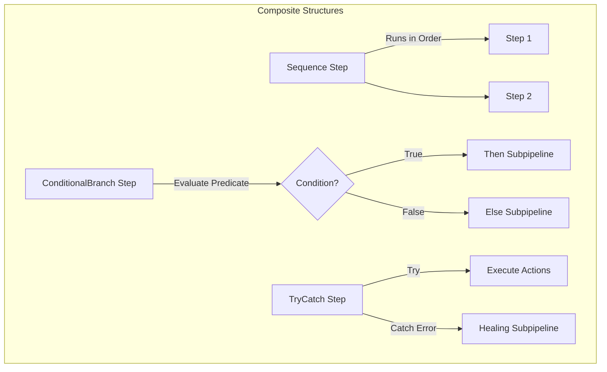

### A. The Core Contract: `PipelineStep` & Exception-Based Flow Control
Every phase in the execution chain implements a simple functional interface. Instead of returning custom flow control enums, steps execute normally (implying standard continuation) or throw typed exceptions that extend `PipelineException` to trigger custom flow routing:

```java
@FunctionalInterface
public interface PipelineStep
{
    /**
     * Executes this phase.
     * 
     * @param context the thread-isolated execution context
     * @throws PipelineException if a flow redirection or execution error occurs
     */
    void execute(ExecutionContext context) throws PipelineException;
}

public abstract class PipelineException extends Exception
{
    protected PipelineException(String message) { super(message); }
    protected PipelineException(String message, Throwable cause) { super(message, cause); }
}

/**
 * Thrown when SUT execution fails (e.g. element not found or validation fails).
 * Triggers the context escalation and healing pipeline.
 */
public class HealingRequiredException extends PipelineException
{
    private final Action failedAction;
    public HealingRequiredException(String message, Action failedAction, Throwable cause)
    {
        super(message, cause);
        this.failedAction = failedAction;
    }
    public Action getFailedAction() { return failedAction; }
}

/**
 * Thrown when execution fails and requires context detail escalation.
 * By default, this signals escalation to the next logical context level
 * in the sequence (e.g. LEAN -> SEMANTIC -> FULL).
 */
public class EscalationException extends PipelineException
{
    public EscalationException(String message, Throwable cause) { super(message, cause); }
}

/**
 * Thrown to explicitly jump directly to a specific target ContextLevel,
 * bypassing the sequential relative escalation order.
 */
public class ToLevelEscalationException extends EscalationException
{
    private final ContextLevel targetLevel;

    public ToLevelEscalationException(String message, ContextLevel targetLevel, Throwable cause)
    {
        super(message, cause);
        this.targetLevel = targetLevel;
    }

    public ContextLevel getTargetLevel() { return targetLevel; }
}

/**
 * Thrown when a compound step is dynamically split into sub-steps.
 * Aborts current step execution and triggers stack splicing.
 */
public class StepSplitException extends PipelineException
{
    private final List<PlaybookStep> subSteps;
    public StepSplitException(String message, List<PlaybookStep> subSteps)
    {
        super(message);
        this.subSteps = subSteps;
    }
    public List<PlaybookStep> getSubSteps() { return subSteps; }
}

/**
 * Thrown during replay when the SUT state does not match the baseline recording.
 * Triggers the fallback to Live LLM mode.
 */
public class DivergenceException extends PipelineException
{
    public DivergenceException(String message) { super(message); }
}

/**
 * Thrown when execution fails conclusively (e.g. retry budget exhausted).
 * Halts pipeline execution and fails the test.
 */
public class ConclusiveFailureException extends PipelineException
{
    public ConclusiveFailureException(String message, Throwable cause) { super(message, cause); }
}
```

---

### B. Composite Pipeline Structural Nodes

We define reusable structural composite steps in code to manage flow control:

1. **`SequenceStep`**: Runs a list of steps sequentially. Halts and propagates if any step throws a `PipelineException`.
2. **`ConditionalBranchStep`**: Evaluates a predicate against the context to route execution into either a `then` or `else` subpipeline.
3. **`TryCatchStep`**: Wraps a `tryStep` and maps exceptions to specific catch subpipelines (analogous to a Java `try-catch` block). If an exception occurs, the catch map is scanned for the nearest matching class handler to execute.
4. **`LoopStep`**: Repeats a subpipeline under specific retry budget ceilings.

#### Stack Mutation for Step Splitting
To cleanly split a compound instruction without executing actions on the parent step, a step (such as `PesapStep` or `CallLlmStep` returning a split action) throws a `StepSplitException` containing the sub-steps. The pipeline catches this exception, marks the current parent step status as `SPLITTED` (leaving a clear execution trail), and pushes the sub-steps onto the stack using `context.pushSteps(subSteps)`. This aborts the current execution path immediately and restarts the runner on the first sub-step.

---

### C. Static Pipeline Configurations

The execution engine configures the pipelines statically in code. This makes the execution flow highly readable, easy to branch, and simple to adjust by reordering composite nodes.

#### 1. The Live Execution Pipeline (LLM Healing Loop)
Used when generating or healing actions.

```java
public static PipelineStep createLiveExecutionPipeline()
{
    return new TryCatchStep(
        new SequenceStep(
            new CaptureStateStep(),           // Computes DOM and screenshot dHash
            new TryCatchStep(
                // Try Block: Resolve actions and run
                new SequenceStep(
                    new CallLlmStep(),        // Calls registered LLM provider
                    new ExecuteActionsStep(), // Executes actions on TargetExecutor
                    new VerifyOutcomeStep()   // Verifies post-assertions
                ),
                // Catch Block Map: Map specific exceptions to healing/recovery steps
                Map.of(
                    HealingRequiredException.class, new LoopStep(
                        ctx -> ctx.getRetryBudget().hasBudget(),
                        new SequenceStep(
                            new EscalateContextStep(), // Context level upgrade, clears cached state
                            new PrepareRetryStep(),    // In-page state reset (clear input, close overlays)
                            new CaptureStateStep(),    // Capture SUT state at new ContextLevel
                            new CallLlmStep(),
                            new ExecuteActionsStep(),
                            new VerifyOutcomeStep()
                        )
                    ),
                    ConclusiveFailureException.class, new SequenceStep(
                        new ReportFailureStep(),
                        new FailSessionStep()
                    )
                )
            ),
            new PublishEventsStep()           // Clean event teardown
        ),
        // Outer Catch: Handle step splitting
        Map.of(
            StepSplitException.class, new SequenceStep(
                new MarkStepSplittedStep(),   // Marks current parent step status as SPLITTED
                new PushSubStepsStep()        // Pushes split sub-steps onto runner stack
            )
        )
    );
}
```

#### 2. The Playbook Replay Pipeline
Used when a `PlaybookRecording` baseline is available. It verifies SUT state consistency and seamlessly drops into the live pipeline if a divergence is detected.

```java
public static PipelineStep createReplayPipeline()
{
    return new SequenceStep(
        new CaptureStateStep(),
        new ConditionalBranchStep(
            // Condition: Does the current page dHash match the baseline recording preStateHash?
            ctx -> ctx.isReplayStateConsistent(),
            
            // Then: Try Safe Replay
            new TryCatchStep(
                new SequenceStep(
                    new ReplayActionsStep(),
                    new VerifyOutcomeStep()
                ),
                // Catch any replay failure: Mark diverged and fallback to live LLM healing
                Map.of(
                    PipelineException.class, new SequenceStep(
                        new MarkDivergedStep(),   // Truncates future recording steps
                        createLiveExecutionPipeline()
                    )
                )
            ),
            
            // Else: Divergence! Switch to Live Healing
            new SequenceStep(
                new MarkDivergedStep(),
                createLiveExecutionPipeline()
            )
        )
    );
}
```

---

### D. Transient State Dictionary (`ExecutionContext`)
To pass data between pipeline steps (e.g. sharing captured DOM state or generated actions) without cluttering the `StepResult` flow control token, the **`ExecutionContext`** hosts a scoped, transient data dictionary.

```java
public final class ExecutionContext
{
    private final AiSession session;
    private final List<PlaybookStep> rootSteps;
    private final String currentPlaybookId;
    private final Deque<PlaybookStep> runnerStack = new ArrayDeque<>();
    private PlaybookStep activeStep;

    // Transient data map acting as a scratchpad for the current step execution
    private final Map<String, Object> transientData = new ConcurrentHashMap<>();

    public ExecutionContext(final AiSession session, final List<PlaybookStep> rootSteps, final String currentPlaybookId)
    {
        this.session = session;
        this.rootSteps = Collections.unmodifiableList(new ArrayList<>(rootSteps));
        this.currentPlaybookId = currentPlaybookId;
        
        // Initialize stack with root steps in order
        for (int i = rootSteps.size() - 1; i >= 0; i--)
        {
            this.runnerStack.push(rootSteps.get(i));
        }
    }

    public AiSession getSession()
    {
        return this.session;
    }

    public List<PlaybookStep> getRootSteps()
    {
        return this.rootSteps;
    }

    public Deque<PlaybookStep> getRunnerStack()
    {
        return this.runnerStack;
    }

    public PlaybookStep getActiveStep()
    {
        return this.activeStep;
    }

    public void setActiveStep(final PlaybookStep activeStep)
    {
        this.activeStep = activeStep;
    }

    public void pushSteps(final List<PlaybookStep> steps)
    {
        // Push sub-steps to the head of the LIFO execution stack in correct order
        for (int i = steps.size() - 1; i >= 0; i--)
        {
            this.runnerStack.push(steps.get(i));
        }
    }

    public String getCurrentPlaybookId()
    {
        return this.currentPlaybookId;
    }

    public SessionData getSessionData()
    {
        return this.session.getSessionData();
    }

    public void putTransient(final String key, final Object value)
    {
        this.transientData.put(key, value);
    }

    @SuppressWarnings("unchecked")
    public <T> T getTransient(final String key, final Class<T> type)
    {
        final Object val = this.transientData.get(key);
        return val != null ? type.cast(val) : null;
    }

    /**
     * Clears all transient step-scoped data.
     * Invoked automatically by the runner at the start of each new playbook instruction.
     */
    public void resetTransientData()
    {
        this.transientData.clear();
    }
}
```

#### Example Usage:
1. **`CaptureStateStep`**:
   * Extracts HTML & screenshots via `TargetExecutor`.
   * Saves payload: `context.putTransient("sutState", state);`
2. **`CallLlmStep`**:
   * Reads state: `SutState state = context.getTransient("sutState", SutState.class);`
   * Sends prompt, gets response, and saves actions: `context.putTransient("actionsList", llmResponse.actions());`
3. **`ExecuteActionsStep`**:
   * Reads actions: `List<Action> actions = context.getTransient("actionsList", List.class);`
   * Executes them. If an exception occurs, saves it: `context.putTransient("lastFailure", exception);`
4. **`VerifyOutcomeStep` / `HealStep`**:
   * Inspects outcome: `Exception failure = context.getTransient("lastFailure", Exception.class);`
   * Invokes recovery flow if present.

This ensures data passing is completely independent of the execution loop flow control.

---

### E. Execution Scenarios & Pipeline Flow Diagrams
To illustrate how these comopsable steps execute in practice, the diagrams below show the flow of state transitions under different SUT execution scenarios.

#### 1. Normal Execution Flow
When the initial context information sent to the LLM is correct, execution flows sequentially through PESAP, State Capture, LLM query, and Action execution.

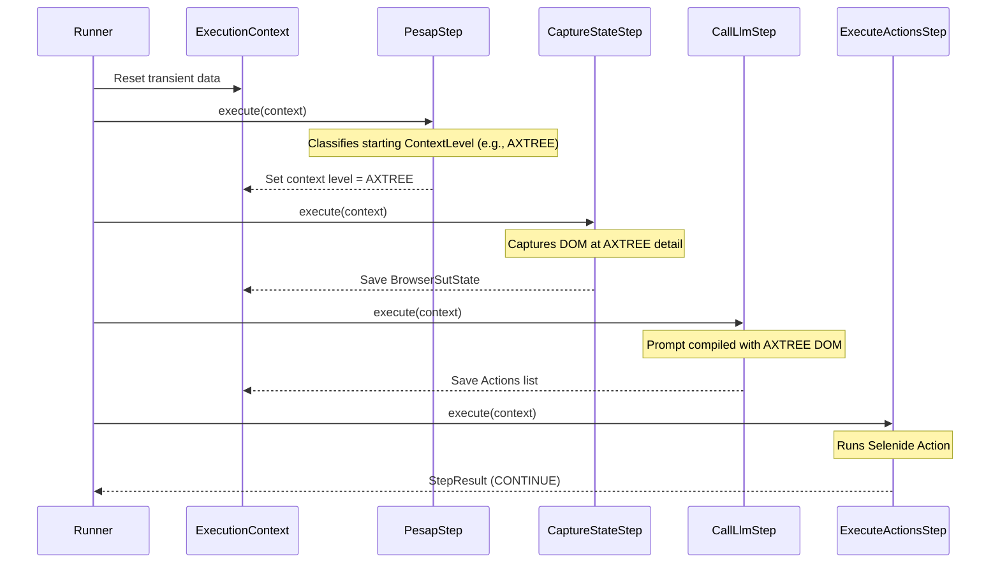

#### 2. Escalation Flow (DOM Details Missing / LLM Cannot Resolve)
If the LLM cannot resolve target elements due to lean state information, the runner escalates the context detail level, recaptures SUT state, and retries the LLM call.

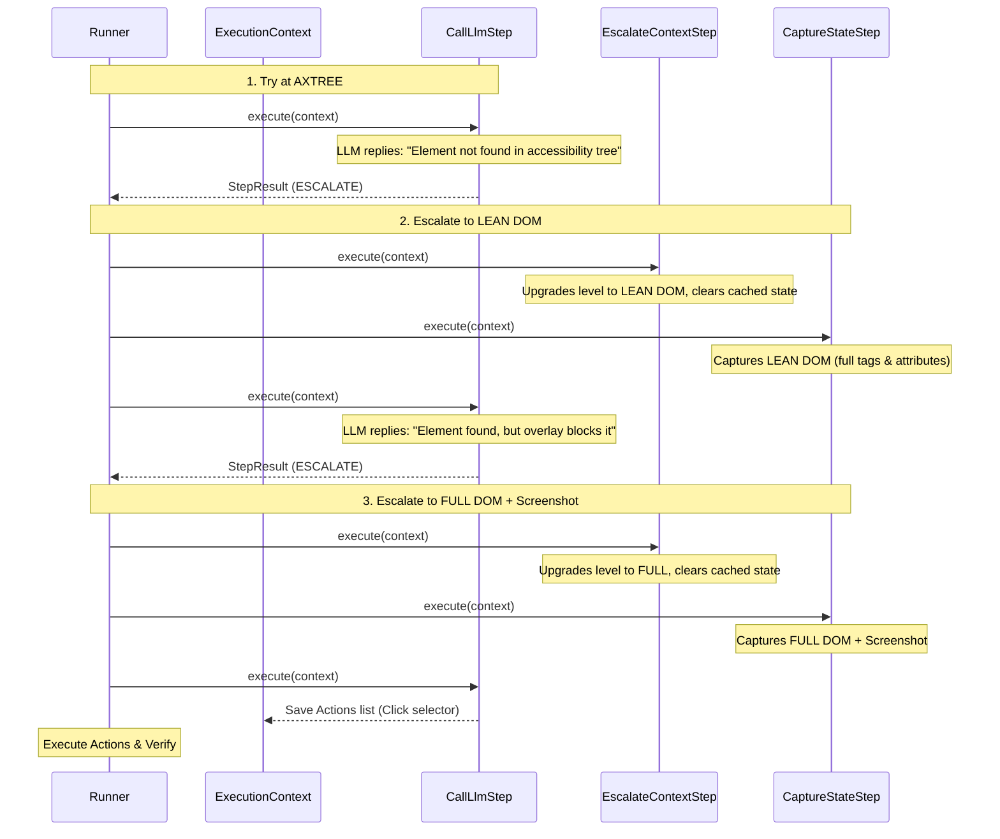

#### 3. Action Failure Flow (Execution / Validation Fails)
If the LLM generates an action but its execution on the SUT fails (or a validation fails), the pipeline catches the failure, escalates the context level, and prompts the LLM again with the failure trace.

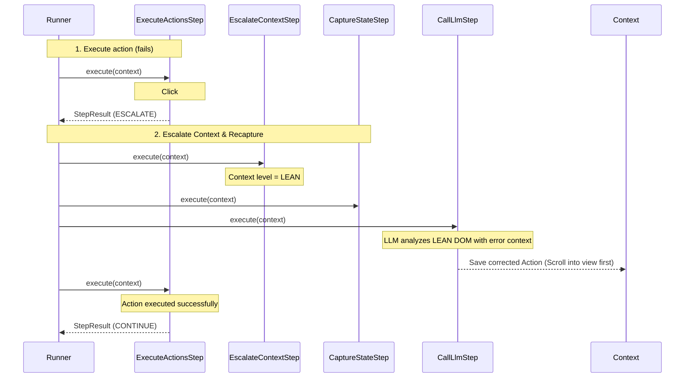

#### 4. Upfront Step Splitting (Compound Steps)
When static analysis (PESAP) detects a compound step instruction, it dynamically parses it into sub-steps, pushes them onto the execution stack, and repeats execution on the first sub-step.

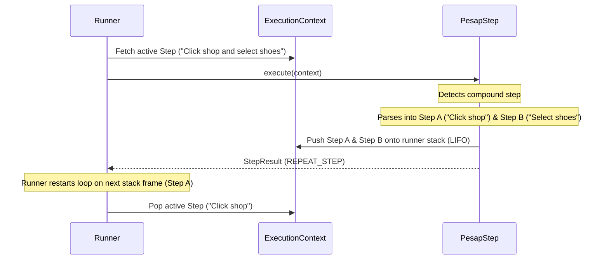

---

## 12. Concurrency Boundaries & Atomicity

To ensure SUT stability and prevent race conditions with external controllers (like the HUD or Aura Server dashboard), the framework establishes clear rules around execution threading, step boundaries, and data synchronization.

```
       [ External Thread (HUD / WebSockets) ]
                        │
                        ▼ (Synchronized Commands / Writes)
       ┌────────────────────────────────────┐
       │             AiSession              │
       │  ┌──────────────────────────────┐  │
       │  │          SessionData         │  │ (Thread-Safe Map)
       │  └──────────────────────────────┘  │
       │  ┌──────────────────────────────┐  │
       │  │        SessionDebugger       │  │ (Synchronized Locks)
       │  └──────────────────────────────┘  │
       └──────────────────┬─────────────────┘
                          │
                          ▼ (Exclusively owns)
       [ Internal Thread (Runner Loop) ]
       - Executes Pipeline Steps (Click, Type, LLM, Heal)
       - Evaluates debugger pause ONLY at Step Boundaries
```

### A. Atomic Step Boundaries (Halt-Free Zones)
The execution runner never interrupts a running step midway. 
* **Breakpoint & Pause Boundaries**: manual pauses or breakpoints are evaluated **only** before a step starts or after it completes.
* **Synchronous Self-Healing**: When a step encounters an execution or validation failure, the entire escalation and self-healing loop runs synchronously as a single, atomic "input-to-output" operation. The runner does not pause or halt until the step either heals successfully or fails conclusively.

This prevents leaving the SUT browser or API session in an unaligned, corrupt, or leaked state (such as hanging socket connections or half-interacted form fields).

---

### B. Single-Threaded Pipeline Execution ("Unsafe" Flow)
* Each `AiSession` is bound to a single execution thread at any given time.
* Because the internal state transitions and composite pipeline steps are executed sequentially by this single thread, the pipeline nodes themselves are **thread-unsafe by design**.
* Steps mutate the transient context map (`ExecutionContext`) directly without locks or synchronization blocks, keeping execution performance high and code simple.

---

### C. Synchronized External Integration
While the runner thread executes sequentially, external client threads (like Aura Server or HUD WebSockets) must read session telemetry or modify variables on the fly. 

To prevent race conditions, the boundary interfaces enforce synchronization:
1. **Thread-Safe Variables (`SessionData`)**: Internal static and dynamic variable maps use `ConcurrentHashMap` so that external threads can safely inspect active variable values while the runner is executing.
2. **Synchronized Debugger API (`SessionDebugger`)**: Control methods (`pause()`, `resume()`, `updatePlaybook()`) are synchronized using Java locks (such as `ReentrantLock` or `synchronized` blocks) to safely negotiate pauses and cursor rewinds with the running thread.

---

## 13. Pluggable LLM Providers & Capability-Based Routing

To allow modular scaling and cost optimization (e.g. running local text-only models alongside rich multimodal cloud APIs), the LLM client integration is abstracted behind pluggable provider interfaces.

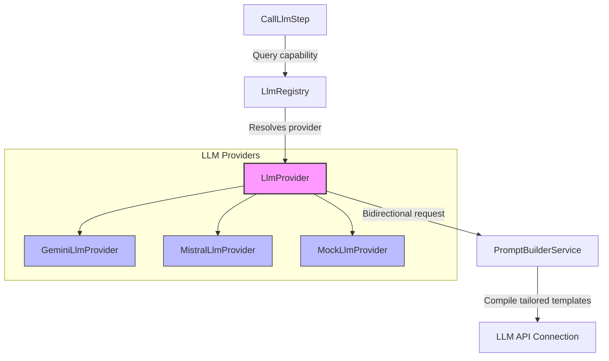

### A. The `LlmProvider` & `LlmCapability` Contracts
An LLM provider announces its specialized features and executes chat tasks:

```java
public interface LlmProvider
{
    /**
     * Executes the chat request.
     */
    LlmResponse chat(LlmRequest request);

    /**
     * @return the set of capabilities this provider is qualified to perform.
     */
    Set<LlmCapability> getCapabilities();
}

public enum LlmCapability
{
    TEXT_ONLY,       // Basic textual generation/reasoning
    VISION,          // Multimodal image/screenshot analysis
    STRUCTURED_JSON, // Structured tool calling / schema enforcement
    STEP_SPLITTING   // Complex compound instruction splitting
}
```

#### Initial Provider Implementations:
1. **`GeminiLlmProvider`**:
   * Production provider utilizing Google Gemini via LangChain4j.
   * Supported capabilities: `TEXT_ONLY`, `VISION`, `STRUCTURED_JSON`, `STEP_SPLITTING`.
2. **`MistralLlmProvider`**:
   * Production provider utilizing Mistral AI models via LangChain4j.
   * Supported capabilities: `TEXT_ONLY`, `STRUCTURED_JSON`.
3. **`MockLlmProvider`**:
   * Simulation provider used for hermetic, browserless unit testing.
   * Configured by test fixtures with a queued sequence of canned responses:
     ```java
     public final class MockLlmProvider implements LlmProvider
     {
         private final Queue<LlmResponse> responseQueue = new LinkedList<>();

         public void addResponse(final LlmResponse response)
         {
             this.responseQueue.add(response);
         }

         @Override
         public LlmResponse chat(final LlmRequest request)
         {
             final LlmResponse next = this.responseQueue.poll();
             if (next == null)
             {
                 throw new IllegalStateException("MockLlmProvider has no queued responses left.");
             }
             return next;
         }

         @Override
         public Set<LlmCapability> getCapabilities()
         {
             return Set.of(LlmCapability.TEXT_ONLY, LlmCapability.VISION, LlmCapability.STRUCTURED_JSON);
         }
     }
     ```
   * Bypasses the network entirely to test pipeline state transitions, parsing, and healing.


* **`LlmRequest`** holds the prompts, SUT state texts, visual attachments (screenshots), response schemas, and hyperparameters:
  ```java
  public enum ResponseSchema
  {
      ACTIONS,        // Concrete list of target execution actions
      ASSERTION,      // Pass/fail verification outcomes
      STEP_SPLITS,    // Instruction pre-processing sub-steps
      TEXT            // Free-form raw text response
  }

  public record LlmRequest(
      String systemMessage,
      String userMessage,
      List<SutAttachment> attachments,
      ResponseSchema responseSchema, // Enforced fixed schemas
      double temperature,
      int timeoutSeconds
  ) {}
  ```
* **`LlmResponse`** returns the raw text content, token metrics, and connection details:
  ```java
  public record LlmResponse(
      String content,          // Raw text/JSON string returned by the model
      TokenUsage tokenUsage,
      String modelName
  ) {}
  ```

#### Typed Prompts & Parsing Boundary (`AiPrompt<T>`)
Rather than forcing pipeline steps to manually coordinate GSON deserialization and repair filters, we encapsulate both the prompt construction and the response parsing/repairing logic inside a typed **`AiPrompt<T>`** interface.

```java
public interface AiPrompt<T>
{
    /**
     * @return the expected response schema type (ACTIONS, ASSERTION, STEP_SPLITS, TEXT)
     */
    ResponseSchema getResponseSchema();

    /**
     * Compiles the system instructions tailored for the provider context.
     */
    String compileSystemMessage(ExecutionContext context);

    /**
     * Compiles the user query context.
     */
    String compileUserMessage(ExecutionContext context);

    /**
     * Parses the raw string response from the LLM, executes 
     * custom response repair chains, and deserializes to target object type T.
     */
    T parseResponse(String rawContent, ExecutionContext context) throws Exception;
}
```

* **Pipeline Step Simplicity**: The calling step (e.g. `CallLlmStep`) simply runs:
  `ActionsResponse actions = context.executePrompt(new ActionsPrompt(stepText));`
  The step does not need to know *how* the response is parsed or repaired.
* **Dependency Resolution via `ExecutionContext`**: Because the compilation methods receive the `ExecutionContext`, they can query the session's registries and helper services dynamically to assemble the full prompt payload:
  ```java
  @Override
  public String compileSystemMessage(final ExecutionContext context)
  {
      // 1. Load the base prompt template using the session's TemplateLoader
      final String baseTemplate = context.getTemplateLoader().loadTemplate("system-prompt-actions");

      // 2. Fetch the usage guides for the session's active Actions (from ActionRegistry)
      final String actionsSnippet = context.getActionRegistry().compileActionPrompts();

      // 3. Fetch the usage guides for registered Java methods (from JavaMethodRegistry)
      final String methodsSnippet = context.getJavaMethodRegistry().compileMethodPrompts();

      // 4. Inject snippets into template
      return baseTemplate
          .replace("{{ACTIONS_REFERENCE}}", actionsSnippet)
          .replace("{{JAVA_METHODS_REFERENCE}}", methodsSnippet);
  }
  ```
* **Support for Non-JSON Text Prompts**: For simple conversational/summary prompts, the prompt class implements `AiPrompt<String>`, where `parseResponse()` simply returns the raw string directly (or applies basic string trimming), bypassing JSON deserialization entirely.

---

### B. Session-Scoped `LlmRegistry` & Multi-Key Role Mapping
Every `AiSession` contains its own isolated `LlmRegistry` instance. 

To optimize execution costs, response speeds, and token consumption, different roles in the framework (e.g. static linter checking, UI action generation, screenshot vision auditing, and session verification) can target different models and use separate API keys or endpoints.

#### 1. Configuration Property Hierarchy
The session reads configuration properties hierarchically (JVM arguments > `ai.properties` > `neodymium.properties` > defaults). Properties are divided into **Global Defaults** and **Role-Specific overrides**:

* **Global Defaults**:
  * `neodymium.ai.model`: The default model name (e.g. `gemini-2.5-flash`).
  * `neodymium.ai.apiKey`: The default API key (masked at runtime).
* **Role-Specific Overrides** (Roles: `pesap`, `execution`, `vision`, `audit`):
  * `neodymium.ai.pesap.model` / `neodymium.ai.pesap.apiKey`: Used by the instruction semantic classifier and step splitter.
  * `neodymium.ai.execution.model` / `neodymium.ai.execution.apiKey`: Used by the runner to call the LLM for action generation.
  * `neodymium.ai.vision.model` / `neodymium.ai.vision.apiKey`: Used for multimodal image and screenshot analysis.
  * `neodymium.ai.audit.model` / `neodymium.ai.audit.apiKey`: Used by post-run verification auditors.

#### 2. Provider Instantiation & Registry Registration
During session initialization, the `AiSession` parses these overrides. For each role, if an override `model` or `apiKey` is provided, it instantiates a separate `LlmProvider` configured with those specific parameters. If no role-specific overrides exist, it falls back to the global defaults.

The registry selects the active provider dynamically based on the required capability (e.g. routing visual checks to the provider registered for `LlmCapability.VISION`, and syntax parsing to `LlmCapability.STEP_SPLITTING`). If no specialized provider is registered for a capability, the registry falls back to the designated default provider. If no default is set, it throws an `IllegalStateException`.

---

### C. Bidirectional Prompt Customization
LLM models respond differently to prompt structures (e.g., Gemini prefers system instructions in a separate config field; Mistral expects it inline in a custom chat history role). 

To solve this:
* Rather than the pipeline compiling a single, static prompt string, the `LlmProvider` receives the `ExecutionContext`.
* The provider queries back into a registered **`PromptBuilderService`**, requesting prompts formatted and optimized specifically for its model family.
* If no model-specific prompt template is registered, the service falls back to standard default prompt templates.

---

### D. Multi-Stage Response Repairing & Deserialization
When `AiPrompt.parseResponse(rawText)` is invoked, it routes the raw model output through a customized **Multi-Stage Response Repairer** before returning the final object `T`:

1. **Raw String Stage**: Fixes raw response text (e.g. stripping markdown code ticks ` ```json ... ``` `, repairing unescaped newlines).
2. **JSON Element Stage**: Modifies the parsed `JsonElement` tree representation (e.g., adding missing array nodes or patching bad keys) prior to Gson/Jackson deserialization.
3. **Model Object Stage**: Validates and overrides fields on the compiled Java object `T` (e.g. normalizing browser target selectors) before returning it to the caller.
---

## 14. Pre/Post-Execution Lifecycle Hooks

To ensure the test environment is correctly prepared before execution starts, and dynamically validated after execution completes, the framework introduces pluggable **Pre-Execution Hooks** and **Post-Execution Hooks**. These hooks are registered on the `AiSession` and execute at the boundaries of the execution cycle.

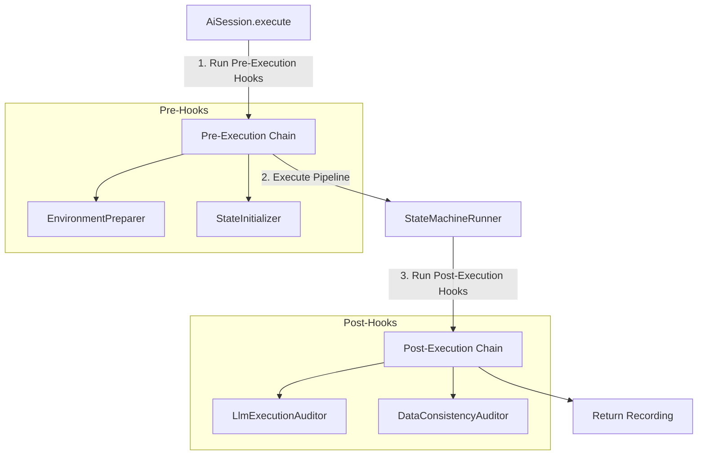

---

### A. The Hook Interfaces & Event-Driven Diagnostics

Both pre- and post-execution hooks receive the active `AiSession` instance, giving them direct access to `session.getEventBus()`, `session.getSessionData()`, and configuration settings.

* **Hard Failures**: A hook throws an exception (e.g. `VerificationException`) to immediately fail the session execution.
* **Soft Warnings & Soft Errors**: Instead of throwing, a hook publishes standard diagnostic events (e.g. `DiagnosticWarningEvent` or `DiagnosticErrorEvent`) to the event bus. Decoupled listeners collect these warnings and attach them to the final `PlaybookRecording` metadata or Allure reports.

#### 1. Pre-Execution Hook (`PreExecutionHook`)
Executes sequentially *prior* to SUT state capture or pipeline execution. If any setup hook throws an exception, the session terminates immediately and propagates the error, preventing unnecessary SUT/LLM interaction costs:

```java
public interface PreExecutionHook
{
    /**
     * Executes custom preparation or validation logic before executing steps.
     * 
     * @param session the active execution session context
     * @throws Exception if validation or setup fails, triggering a hard failure
     */
    void before(AiSession session) throws Exception;
}
```

#### 2. Post-Execution Hook (`PostExecutionHook`)
Executes sequentially at the conclusion of the execution session (right before the session returns the final recording) to validate data consistency, layout regression, or AI reasoning correctness:

```java
public interface PostExecutionHook
{
    /**
     * Executes custom audits or verifications on the finished run.
     * 
     * @param session the active execution session context
     * @param recording the completed execution recording
     * @throws Exception if auditing detects a critical failure, failing the test run
     */
    void after(AiSession session, PlaybookRecording recording) throws Exception;
}
```

---

### B. Execution Lifecycle Integration
* The hooks are registered on the `AiSession` (e.g. `session.registerPostExecutionHook(new LlmExecutionAuditor())`).
* When the runner finishes the entire playbook, the session executes the registered post-execution hooks sequentially.
* Any warnings published by hooks to the event bus during the `before()` or `after()` phases are captured by the `PlaybookRecorder` listener and saved under the final `PlaybookRecording` metadata log.
* *Note: This hook layer is designed for high extensibility, but remains **low priority** for the initial MVP implementation.*

---

### C. Standard Audit Use Cases

#### 1. LLM Execution Auditor (`LlmExecutionAuditor`)
* **Goal**: Double-checks if the AI did the right thing based on the initial instructions.
* **Mechanism**: Sends the full `Playbook` steps, the sequence of executed concrete actions, and the final SUT state (DOM & screenshot) to a secondary LLM.
* **Analysis**: Asks the model: *"Analyze the initial goal and the executed action trace. Did the agent execute the right steps, or did it hallucinate/skip instructions? Explain any deviations."*

#### 2. Data Consistency Auditor (`DataConsistencyAuditor`)
* **Goal**: Validates the consistency of dynamic variable values extracted during execution.
* **Checks**: Verifies that extracted values (like order numbers, checkouts, or user IDs) match expected format structures (e.g. regexes) and contain no raw credentials or system error tags.

#### 3. Visual Integrity Auditor (`AuraVisualAuditor`)
* **Goal**: Audits the entire run's visual timeline.
* **Checks**: Automatically reviews the full screenshot sequence for visual abnormalities, layout regressions, or overlapping elements that occurred during the test run.

---

## 15. Session-Level Authentication Setup & Interception

To interact with authenticated websites (e.g. Basic Auth) or secure REST APIs without exposing credentials in prompt contexts or requiring the LLM to execute UI login actions, the framework supports native **Session-Level Authentication Configuration**.

### A. Playbook Authentication Schema
Playbooks can declare protocol-level authentication requirements directly in their YAML metadata. This keeps the execution steps clean of credential management:

```yaml
name: "Secure Shopping Flow"
auth:
  type: "BASIC"                             # Options: BASIC, BEARER, CUSTOM_HEADER
  targetDomain: "https://secure-store.com"
  username: "${storeUser}"                  # Resolved dynamically from SessionData
  password: "${storePassword}"              # Resolved dynamically from SessionData
```

Or for APIs requiring token authorization:
```yaml
auth:
  type: "BEARER"
  token: "${apiToken}"
```

---

### B. Driver & Client Interception

When the `AiSession` starts, it parses the `auth` block, resolves dynamic credentials from `SessionData`, and delegates authentication setup to the active `TargetExecutor` *before* any SUT state capture or execution begins:

#### 1. Browser Authentication (`SelenideTargetExecutor`)
Because OS-native Basic Auth dialogs block DOM rendering and cannot be selected or clicked by the LLM, the `SelenideTargetExecutor` intercepts them at the driver level using Selenium 4's native **`HasAuthentication`** interface:

```java
public void configureAuth(AuthenticationConfig auth)
{
    if ("BASIC".equalsIgnoreCase(auth.type()))
    {
        final WebDriver driver = getSelenideDriver().getWebDriver();
        if (driver instanceof HasAuthentication authDriver)
        {
            // Selenium 4 automatically registers credentials and intercepts the OS dialog
            authDriver.register(
                UriTemplate.of(auth.targetDomain()),
                UsernameAndPassword.of(auth.username(), auth.password())
            );
        }
    }
}
```

#### 2. API Authentication (`RestTargetExecutor`)
For REST APIs, the `RestTargetExecutor` registers request interceptors directly on the underlying HTTP Client to automatically inject the required headers for every outgoing request:

```java
public void configureAuth(AuthenticationConfig auth)
{
    if ("BEARER".equalsIgnoreCase(auth.type()))
    {
        // Registers a global request interceptor that adds the header automatically
        this.httpClient.registerInterceptor(request -> {
            request.setHeader("Authorization", "Bearer " + auth.token());
        });
    }
    else if ("BASIC".equalsIgnoreCase(auth.type()))
    {
        this.httpClient.registerInterceptor(request -> {
            String credentials = auth.username() + ":" + auth.password();
            String base64 = Base64.getEncoder().encodeToString(credentials.getBytes());
            request.setHeader("Authorization", "Basic " + base64);
        });
    }
}
```

---

## 16. Implementation Roadmap & TDD Plan

This section provides the step-by-step implementation order of the Neo Aura AI v2 decoupled architecture, prioritizing bottom-level leaf components first. Each phase requires accompanying test suites and mock providers to verify logic in a browserless environment.

### A. TDD & Mocking Strategy
* **Mocks First**: We create mock implementations for the SUT (`MockTargetExecutor`), the LLM (`MockLlmProvider`), and the resource manager (`InMemoryResourceManager`).
* **Isolated Verification**: This allows us to unit test YAML parsing, variable sanitization, event dispatching, and pipeline loops in local JUnit 5 tests without browser dependencies or active API keys.

---

### B. Phased Rollout Plan

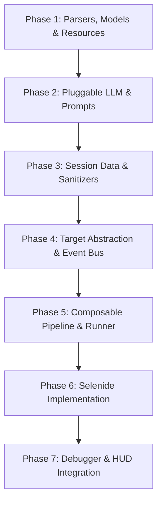

#### Phase 1: Parsers, Models & Resources
* **Target Components**: 
  * `PlaybookStep` (Composite pattern tree for steps, nested steps, actions).
  * `Playbook` (Main container holding steps).
  * `PlaybookResourceManager` interface.
  * `InMemoryResourceManager` (Holds playbooks/recordings in memory for direct next replay).
  * `LocalFileResourceManager` (Local NIO file manager).
  * `PlaybookParser` / `YamlPlaybookParser`.
* **Testing Strategy**: Unit test playbook parsing from files, classpath resources, and raw strings. Verify include path resolution under both in-memory and local disk file managers.

#### Phase 2: Pluggable LLM Provider & Registry
* **Target Components**:
  * `LlmCapability` enum, `LlmRequest`, `LlmResponse`, `LlmProvider` interface.
  * `MockLlmProvider` (Accepts queued canned responses).
  * `LlmRegistry` (Capability-based routing registry).
  * `AiPrompt<T>` (compilation, response parsing & repair interface).
* **Testing Strategy**: Mock LLM calls using `MockLlmProvider`. Assert correct prompt generation, prompt schema settings, model capabilities routing, and multi-stage response repairing/deserialization.

#### Phase 3: Session Data & Sanitization
* **Target Components**:
  * `SessionData` (Dual static/dynamic variables map, snapshots, and rollback logic).
  * `ContextSanitizer` (Pre-LLM masking using format-preserving mock patterns or user stand-ins).
  * `ActionSanitizer` (On-the-fly action parameterization from raw values to variable references).
* **Testing Strategy**: Test sensitive key scanning and value replacement. Verify reverse-mapping of stand-ins and assert that recorded action values are correctly parameterised on the fly during simulated mock executions.

#### Phase 4: Target Abstraction & Event Bus
* **Target Components**:
  * `TargetExecutor` interface, `SutState`, `ActionDefinition`.
  * `MockTargetExecutor` / `MockSutState` (Mock browser/API states).
  * `ExecutionEventBus` (Publish/subscribe bus for lifecycle events).
* **Testing Strategy**: Verify event dispatching and handler listener registration. Verify that state capturing and action execution routing trigger the correct listeners in isolation.

#### Phase 5: Composable Pipeline & State Machine Runner
* **Target Components**:
  * `PipelineStep`, `StepResult`, `FlowControl` (CONTINUE, ABORT, REPEAT_STEP, ESCALATE).
  * Composite steps: `SequenceStep`, `ConditionalBranchStep`, `TryCatchStep`, `LoopStep`.
  * Concrete steps: `CaptureStateStep`, `CallLlmStep`, `ExecuteActionsStep`, `VerifyOutcomeStep`, `PrepareRetryStep`.
  * `ExecutionContext` (Transient data map, stack runner).
  * `StateMachineRunner` (Compiles pipeline structure and runs state loop).
* **Testing Strategy**: Run end-to-end simulated test scenarios in JUnit using `MockTargetExecutor` and `MockLlmProvider`. Assert pipeline success, failure, self-healing loop execution, and breakpoint pauses.

#### Phase 6: Concrete Domain Implementation (Selenide)
* **Target Components**:
  * `SelenideTargetExecutor`, `BrowserSutState`, `SelenideBrowserSession`.
  * Browser action plugins (`ClickAction`, `TypeAction`, etc.).
  * `PlaybookRecorder` (Event listener compiling the output recording).
* **Testing Strategy**: Run browser verification tests in `Aura Glance Sandbox` (`AuraGlanceTest.java`) with real/mock LLM endpoints.

#### Phase 7: Debugger & HUD Integration
* **Target Components**:
  * `SessionDebugger` interface.
  * Integration with HUD client websockets, execution stack rewinding, and dynamic playbook/data updates.
* **Testing Strategy**: Verify HUD interactive break pausing, resume, step-over, and variables updates using debugger test cases.
