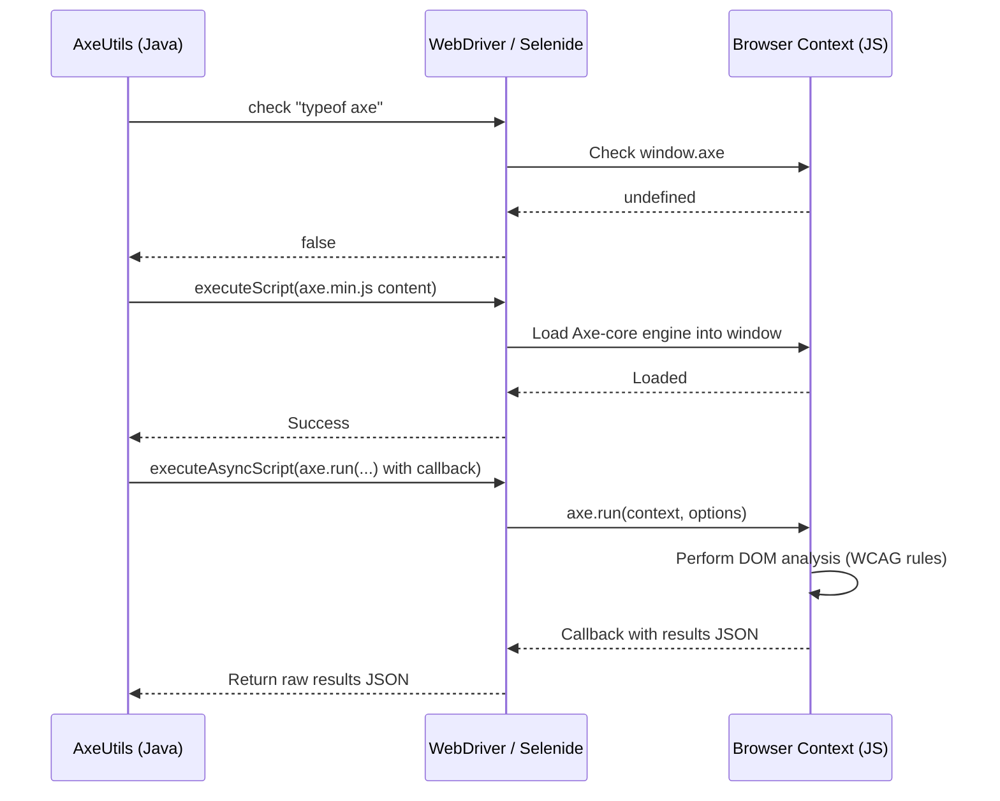

## Context

Neodymium currently lacks a lightweight, session-preserving accessibility testing solution. While Google Lighthouse is available, it requires external CLI setups, only supports Chrome, and reloads the page (destroying session and UI state). Integrating Axe-core directly into Neodymium's runtime via dynamic JavaScript injection resolves these problems. Additionally, mapping natural language accessibility assertions in AI Playbooks (test scripts) to a pluggable action allows testers to declaratively verify full-page or component accessibility directly within visual test scripts.

## Goals / Non-Goals

**Goals:**
- **Zero Heavyweight Dependencies**: Do not introduce external Maven dependencies or binary dependencies (like Node.js or axe-selenium-java). Package `axe.min.js` directly within the JAR's resources.
- **Session & State Preservation**: Audit the active page state exactly as it exists in the browser, without reloading the page.
- **Cross-Browser Compatibility**: Support accessibility testing on Chrome, Firefox, Edge, Safari, and other WebDriver-supported browsers.
- **AI Playbook Natural Language Scripts**: Allow QA engineers to type statements like `Verify accessibility of #main-content` and have them executed natively.
- **Flexible Outcomes**: Support failing tests immediately (with full violation details) or logging the results in "record-only" mode to documents/Allure, or failing based on violation counts.

**Non-Goals:**
- Replacing Lighthouse completely (Lighthouse is still useful for performance/SEO/Best Practice audits).
- Running accessibility audits on non-HTML/native mobile elements.

## Decisions

### 1. Zero-Maven-Dependency Script Injection Architecture
We will bundle the minified Axe-core JavaScript engine (`axe.min.js`) directly in the library under `src/main/resources/js/axe.min.js`.
- **Why**: Traditional library integrations like `com.deque.html.axe-core:selenium` pull in heavy and often outdated transitive Selenium dependencies, causing version conflicts for Neodymium users. Bundling `axe.min.js` and injecting it via standard WebDriver `JavascriptExecutor` is extremely lightweight and completely decoupled from specific Selenium versions.

### 2. Dual-Phase Execution Protocol
The execution of Axe-core will occur in two clean phases:
1. **Injection Phase**: Check if `window.axe` is defined. If not, inject `axe.min.js` by executing the cached JS string via `executeScript()`.
2. **Analysis Phase**: Execute the audit asynchronously using `executeAsyncScript()`, invoking `axe.run()` and resolving the results via a callback.

### 3. Asynchronous Execution and JSON Serialization
We will execute `axe.run()` asynchronously and serialize the result to a JSON string in the browser before returning it to Java.
- **Why**: Axe-core audits can be heavy on complex pages. Running it asynchronously (`axe.run(...)`) prevents browser freezes and complies with Axe's promise/callback API. Returning a serialized JSON string avoids complex type mapping issues in Selenide/WebDriver's standard script engine (which often drops or incorrectly casts nested JS maps and arrays).

### 4. Pluggable AI Playbook Script Action (`AccessibilityAction`)
We will create a core AI Action plugin `AccessibilityAction` that registers the action type `"ACCESSIBILITY"` and maps natural language script statements directly to execution:
- **Direct Instruction Parsing**: Use regular expressions in `parseDirectInstruction(String instruction)` to capture focus selectors and options:
  - Focus Area Selector: Detects `focusing on ([#a-zA-Z0-9_.-]+)`, `of selector ([#a-zA-Z0-9_.-]+)`, `of element ([#a-zA-Z0-9_.-]+)`, `of ([#a-zA-Z0-9_.-]+)`. If found, it becomes the `target`.
  - Tags: Detects `tags? ([a-zA-Z0-9, ]+)` or `standard ([a-zA-Z0-9, ]+)`.
  - Failure/Record Mode: Detects `record only`, `just record`, `dont fail`, `don't fail` to enable `recordOnly=true`. Detects `fail if violations > (\d+)` or `limit (\d+)` to set `maxViolations`.
- **System Prompt Instructions**: Expose instructions to the LLM so it knows how to generate `"ACCESSIBILITY"` actions dynamically when processing unstructured goals.

### 5. Configurable Execution Modes (Fail vs. Record Only)
The execution logic will evaluate outcomes using three parameters:
- **`failOnViolations`** (Boolean): If true, and violations exist, throw `AssertionError`.
- **`recordOnly`** (Boolean): If true, bypass assertion failures entirely and write results strictly to Allure/outcome reports.
- **`maxViolations`** (Integer): Only fail the test if the total count of distinct violations exceeds this threshold.

## Risks / Trade-offs

- **[Risk] DOM Pollution**: Injecting `axe.min.js` adds a global `axe` object to the page's window context.
  - *Mitigation*: The `axe` object is highly scoped and does not interfere with standard web page properties or libraries (such as jQuery or React).
- **[Risk] Test Overhead**: Accessibility audits can add execution time (e.g., 200ms - 800ms per scan).
  - *Mitigation*: By caching the `axe.min.js` string in memory in Java and skipping injection when `window.axe` is already loaded, we minimize network/compilation overhead. Scans should only be invoked at key transition points in tests, not on every action.
