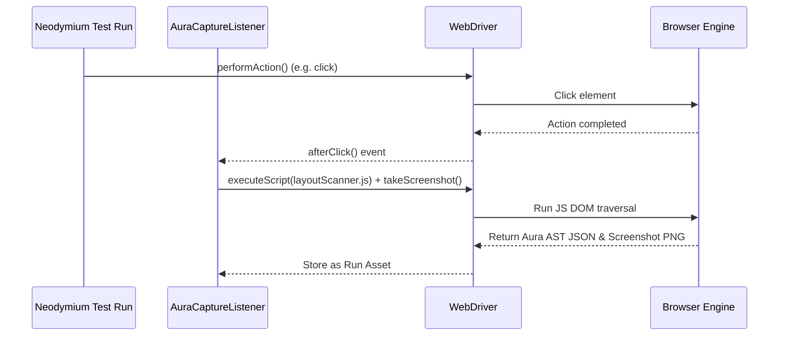
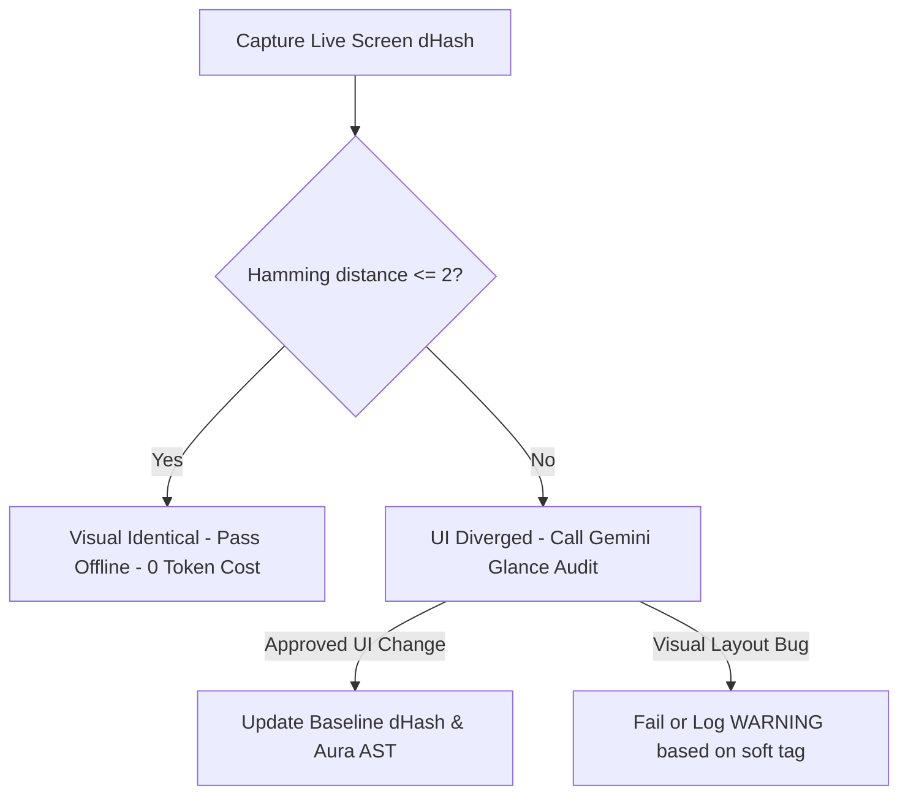

## Context

In modern web development, maintaining visual consistency across an application is crucial for branding, usability, and accessibility. Neodymium currently supports functional testing (Selenium WebDriver assertions) and standard screenshot-based visual comparisons. 

However:
- Standard visual regression (pixel/SSIM) requires strict baselines per page and fails due to minor dynamic data changes, rendering shifts, or operating system differences.
- Programmatic layout checks (e.g. `(layout)`) require developers to explicitly write layout assertions for every element, which is time-consuming and difficult to scale.

This design introduces **Aura Glance**, an observational visual linter running under **Neodymium Aura AI**. It collects page-state layout and screenshot metadata automatically, executes multimodal AI-assisted visual audits to identify visual anomalies, overlaps, contrast issues, or layout bugs, and streams them as standard warnings/failures to the **Aura Server** dashboard.

## Goals / Non-Goals

**Goals:**
- Provide a zero-configuration, background-running visual capture hook inside the `AuraCaptureListener`.
- Leverage Gemini's multimodal visual reasoning to audit screenshots like a human QA designer, eliminating rigid selectors and pixel boundaries.
- Support non-blocking visual gates via the case-insensitive `(soft)` tag, logging `WARNING` entries to the Aura report instead of failing builds.
- Implement a local dHash Visual Playbook caching mechanism to execute visual steps 100% offline when pages are unchanged.
- Present visual anomalies and bounding box highlights in the interactive Aura Server dashboard.

**Non-Goals:**
- Replacing pixel-perfect screenshot comparison where strict pixel identity is required.
- Building a real-time visual testing SaaS (all processing and reporting are executed locally and offline).
- Fixing UI bugs automatically (the tool only identifies and flags issues).

## Decisions

### 1. Zero-Config Capture & Aura AST Extraction
- **Decision**: Inject a single, highly optimized JavaScript extraction script that traverses the DOM, computes coordinates and key semantic tags (interactive controls and visible text-leaf elements) in a single pass, returning a compressed JSON "Aura AST" alongside a high-resolution screenshot.
- **Rationale**: Fetching styling information element-by-element from Java is extremely slow. Traversing only semantic leaf elements in JS compiles a compact layout profile in under 20ms, which is easily streamed to Aura Server.

### 2. High-Level Multimodal AI Glance Auditing
- **Decision**: Send page screenshots and the extracted Aura AST to Gemini. The model acts as an expert visual auditor, observing the page for overlapping elements, clipped layout text, accessibility contrast issues, or styling inconsistencies.
- **Rationale**: A multimodal model reads screenshots by observation, just like a human. It easily ignores dynamic data variations that would fail a traditional pixel-by-pixel SSIM check while instantly spotting broken layout overlaps.

### 3. Decoupling optional vs. soft Step Hooks
- **Decision**: Decouple the execution hooks for optional/non-critical playbook steps inside `AiAgent.java`:
  - **`(optional)`**: Used when a step is conditional. If execution fails, it is bypassed silently with `status: "SKIPPED"` (or `"PASSED"`). No warning is logged.
  - **`(soft)`**: Used when we must run the step but want its failures logged as non-blocking. If visual/layout anomalies are found, the step is logged with `status: "WARNING"` in the report and console, but execution continues.
- **Rationale**: This separates skipped conditional steps (expected by design) from layout/usability warnings (potential bugs that should be reviewed post-run but shouldn't halt the CI pipeline).

### 4. Low-Latency Visual Playbook (dHash Bypass)
- **Decision**: Implement a local, perceptual dHash visual caching engine. When a screen is first audited and approved, we store its dHash and Aura AST layout coordinates in a local `visual-baseline.json` file.
- **Rationale**: On subsequent runs, Neodymium compares the live viewport dHash against the cached baseline locally. If they match (within a Hamming distance threshold), the screen is visually identical. The step succeeds **instantly and offline** with zero LLM API latency or token cost! The LLM is only called if a visual divergence occurs.

## Risks / Trade-offs

- **[Risk] LLM API Costs & Latency** → Calling a multimodal LLM on every single test execution would slow down test runs and incur high API token costs.
  - *Mitigation*: The local dHash Visual Playbook caching engine completely eliminates LLM calls on subsequent runs, ensuring that 95%+ of stable test runs execute 100% offline.
- **[Risk] Canvas Overlay Interference** → Mutating dynamic SPA DOM structures to show visual anomalies can interfere with react client-side frameworks.
  - *Mitigation*: All bounding boxes for visual anomalies will be rendered dynamically in the Aura Server Trace Viewer using a temporary, absolute-positioned HTML5 `<canvas>` layer that is cleanly removed during cleanup.
