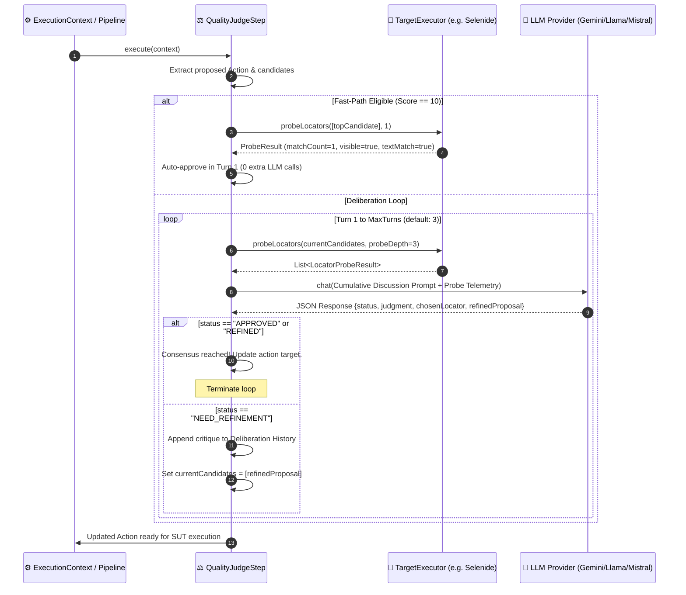

# Design: Interactive Quality Judge with Live SUT Probing

## 1. Architectural Overview & Layering

The system separates concerns into three distinct layers:
1. **Pipeline & Deliberation Layer (`QualityJudgeStep`, `QualityJudgePrompt`)**: Controls the multi-turn discussion loop, compiles cumulative prompts, queries the LLM, and evaluates consensus. Contains **zero** driver-specific code.
2. **Generic Probing Abstraction Layer (`TargetExecutor`, `LocatorProbeResult`)**: Standardizes read-only locator inspection across all execution engines.
3. **Driver Probing Implementation Layer (`SelenideLocatorProber`, `PlaywrightLocatorProber`, `MockTargetExecutor`)**: Queries the underlying browser/engine (WebDriver, CDP, Playwright API) and maps raw elements to standard DTOs.

```
┌─────────────────────────────────────────────────────────────┐
│                    QualityJudgeStep                         │
│  (Multi-Turn Discussion Loop, Fast-Path, Token Metrics)     │
└──────────────────────────────┬──────────────────────────────┘
                               │ Generic DTOs (LocatorProbeResult)
┌──────────────────────────────▼──────────────────────────────┐
│                     TargetExecutor                          │
│  - supportsLocatorProbing()                                 │
│  - probeLocators(candidateLocators, maxDepth)               │
└───────▲──────────────────────▲──────────────────────▲───────┘
        │                      │                      │
┌───────┴──────────────┐ ┌─────┴──────────────┐ ┌─────┴───────────────┐
│ SelenideTargetExec   │ │ PlaywrightTarget   │ │  MockTargetExecutor │
│ (SelenideLocatorProb)│ │ (PlaywrightLocProb)│ │  (Canned DTO lists) │
└──────────────────────┘ └────────────────────┘ └─────────────────────┘
```

---

## 2. Sequence Diagram



---

## 3. Pure W3C Telemetry (No Hardcoded HTML/CSS Magic Classes)

To guarantee that Neodymium remains completely domain-agnostic and universally applicable to any web framework, **zero magic class names (such as `.loading`, `.skeleton`, or `#spinner`) are hardcoded**. Probing extracts purely standard W3C DOM attributes and geometric properties:

### `LocatorProbeResult`
- `candidateLocator` (String): e.g. `button.btn-primary`
- `matchCount` (int): Total elements matching selector in DOM
- `matches` (List<ProbeElementSummary>): Summaries for up to `probeDepth` matches
- `errorMessage` (String): Null if valid, or error string (e.g. `Invalid selector syntax: ...`)
- `isSupported` (boolean): True if executor supports live probing

### `ProbeElementSummary`
- `index` (int): 0, 1, 2...
- `tagName` (String): e.g. `button`, `a`, `input`, `div`
- `text` (String): Visible text content
- `attributes` (Map<String, String>): Raw attribute map (`id`, `class`, `name`, `type`, `role`, `aria-label`, `data-testid`, `placeholder`, `href`, `value`)
- `visible` (boolean): `isDisplayed() == true`
- `enabled` (boolean): `isEnabled() == true`
- `selected` (boolean): `isSelected() == true`
- `rect` (ProbeBoundingRect): `x`, `y`, `width`, `height`
- `outerHtmlSnippet` (String): Truncated element HTML snippet

---

## 4. Cumulative Structured Prompt Protocol

To ensure 100% provider independence, multi-turn history is formatted into a markdown prompt payload:

```markdown
## Step Instruction
Click "Proceed to Checkout"

## Deliberation History
### Turn 1:
- Proposed Candidate 1: `#checkout-btn` -> Probe Result: 0 matches (Element not found)
- Proposed Candidate 2: `.btn-primary` -> Probe Result: 3 matches found:
  * [0] <button class="btn-primary">Apply Coupon</button> (visible: true, rect: [120, 450])
  * [1] <a class="btn-primary" href="/checkout">Proceed to Checkout</a> (visible: true, rect: [650, 800])
  * [2] <button class="btn-primary">Cancel</button> (visible: false, rect: [0, 0])
- Judge Critique: "Candidate 1 was absent. Candidate 2 matched 3 buttons; match [1] is the target inside '.cart-summary'."
- Refined Proposal: ".cart-summary a.btn-primary"

### Turn 2 (Current Evaluation):
- Probed Candidate: ".cart-summary a.btn-primary" -> Probe Result: 1 match found:
  * [0] <a class="btn-primary" href="/checkout">Proceed to Checkout</a> (visible: true, text="Proceed to Checkout", rect: [650, 800])

## Evaluation Output
Return JSON response matching schema.
```

### Response Schema:
```json
{
  "status": "APPROVED|REFINED|NEED_REFINEMENT",
  "judgment": "APPROVED|REFINED|REJECTED",
  "chosenLocator": "selected locator string",
  "chosenValue": "selected text or regex value",
  "isRegex": false,
  "confidence": 0.95,
  "reasoning": "Candidate '.cart-summary a.btn-primary' matches exactly 1 visible button with matching text.",
  "refinedProposal": ""
}
```

---

## 5. Composite Probe Scoring & Fast-Path Heuristics

Each candidate receives a deterministic quality score:
$$\text{Probe Score} = \text{Stability} + \text{Uniqueness} + \text{Interactability} + \text{Text Alignment}$$

- **Stability**: $+3$ for static `id` or `data-testid`; $+2$ for `name` / `aria-label`; $+1$ for clean class; $0$ for volatile hash IDs (`#v-btn-123`).
- **Uniqueness**: $+4$ for exactly $1$ match; $-3$ for multiple matches; $-10$ for $0$ matches.
- **Interactability**: $+2$ if `visible == true` and width/height $> 0$.
- **Text Alignment**: $+1$ if element inner text contains instruction keywords.

**Fast-Path Rule**: If candidate 1 achieves a score of **$10/10$**, the deliberation concludes in **Turn 1 (0 extra LLM calls)**.

---

## 6. Configuration & Recommendation Design

The feature remains fully **optional and backward-compatible**, but is **recommended** in configuration templates:

```properties
# =========================================================================================
# AI Quality Judge & Pre-Flight Deliberation Round
# =========================================================================================
# (Recommended: true for high-accuracy recording/healing runs; bypassed on replay)
neodymium.ai.judge.enabled = false

# Mode of operation: DISCUSSION (default), ON_AMBIGUITY, ON_FAIL, ALWAYS
neodymium.ai.judge.mode = DISCUSSION

# Maximum interactive deliberation turns per action before fallback
neodymium.ai.judge.discussion.maxTurns = 3

# Maximum matching element summaries returned per candidate probe
neodymium.ai.judge.discussion.probeDepth = 3

# Fast-path auto-approval on unique gold-standard matches (0 extra LLM calls)
neodymium.ai.judge.discussion.fastPath = true
```
