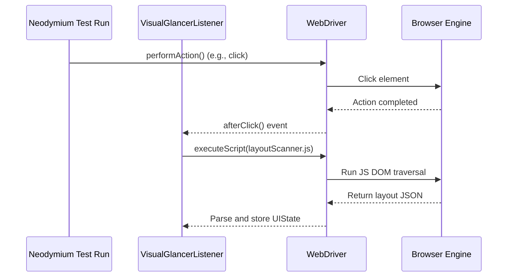
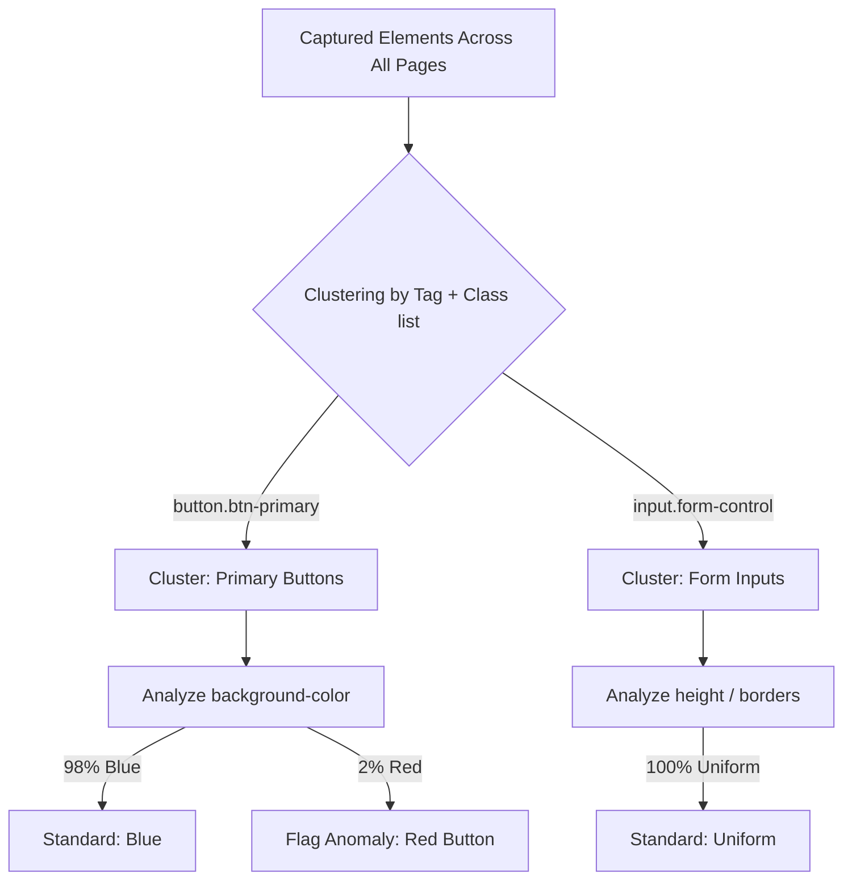

## Context

In modern web development, maintaining visual consistency across an application is crucial for branding, usability, and accessibility. Neodymium currently supports functional testing (Selenium WebDriver assertions) and standard screenshot-based visual comparisons. 

However:
- Standard visual regression (pixel/SSIM) requires strict baselines per page and fails due to minor dynamic data changes, rendering shifts, or operating system differences.
- Programmatic layout checks (e.g. `ui-layout-diagnostics`) require developers to explicitly write layout assertions for every element, which is time-consuming and difficult to scale.

This design introduces a **"glance-over" Visual Consistency Linter** that runs in the background of Neodymium tests. It collects page-state layout and styling metadata automatically, executes statistical and heuristic analysis to identify visual style drift, layout bugs, and visual collisions, and generates a visual diagnostic report.

## Goals / Non-Goals

**Goals:**
- Provide a zero-configuration, background-running visual consistency capture listener hooked into WebDriver events.
- Implement highly efficient, single-pass DOM layout and computed style extraction via optimized JavaScript.
- Enforce general layout heuristics (element overlaps, viewport overflow, tap target sizes, form label presence) automatically.
- Provide a statistical style analysis engine to detect styling drift/inconsistencies (e.g., mismatched button colors or typography) across the application.
- Output an interactive, self-contained visual diagnostics HTML report at the end of a test run.

**Non-Goals:**
- Replacing pixel-perfect screenshot comparison where strict pixel identity is required.
- Building a real-time visual testing SaaS (all processing and reporting are executed locally and offline).
- Fixing UI bugs automatically (the tool only identifies and flags issues).

## Decisions

### 1. High-Performance Style & Layout Extraction
- **Decision**: Inject a single, highly optimized JavaScript extraction script that traverses the DOM, computes coordinates and key styles in a single pass, and returns a compressed JSON string.
- **Rationale**: Fetching styling information for multiple elements using individual WebDriver calls (e.g. `WebElement.getCssValue()`) is extremely slow due to the network round-trip overhead. A single JS script leverages the browser's native JavaScript engine to compile and return this data instantly, keeping capture overhead under 30ms per page.
- **Alternative Considered**: Capturing standard screenshots and using computer vision (OCR / object detection) to reconstruct layout elements. This was rejected due to heavy CPU requirements, execution time, and high false-positive rates.

### 2. Statistical Clustering for Style Anomaly Detection
- **Decision**: Group captured elements across all pages into "visual component clusters" based on their HTML tag, CSS class list, and visual roles. Evaluate style properties (like `color`, `background-color`, `font-family`) within each cluster to flag outliers.
- **Rationale**: Instead of requiring developers to declare exact styling rules upfront (e.g. "Primary buttons must be blue"), the engine infers the design system dynamically. If 95% of elements matching `button.btn-primary` are blue, any matching button that is red or green is automatically flagged as a styling anomaly.
- **Alternative Considered**: Hardcoded configuration rules only. This was rejected because it places the burden of configuring the entire design system onto the test developer.

### 3. Background vs. On-Demand Capture
- **Decision**: Provide both a background WebDriver listener (`VisualGlancerListener` registering in `NeodymiumWebDriverListener`) and a manual API (`NeodymiumVisualGlancer.glance()`). Background capture is toggleable via `neodymium.properties`.
- **Rationale**: Background capture provides maximum coverage with zero test modifications, while manual capture allows developers to assert or snapshot layout state at precise moments (e.g., when a dynamic modal opens or after a complex AJAX sequence settles).

### 4. Natural Language Rule Compiler
- **Decision**: Implement a lightweight Regex-based text compiler in Java that translates declarative natural language statements (e.g. `[Selector] must have [Property] [Value]`, `[Selector-A] must be [Relation] [Selector-B]`) into standard layout and styling predicates.
- **Rationale**: Providing a simple text format for design system guidelines makes it trivial for designers and non-technical stakeholders to write visual invariants. Using standard regex patterns in Java enables robust parsing of these statements into exact CSS selector lookups and bounding-box math operators without the complexity or overhead of an external NLP parsing library.
- **Alternative Considered**: Defining rules in complex JSON or XML schemas. This was rejected because structured data files are significantly harder for non-technical stakeholders to write and review compared to plain natural language guidelines.

### 5. Synchronous On-Demand Assertion API
- **Decision**: Implement a synchronous validation API (`NeodymiumVisualGlancer.assertVisualConsistency()`) that immediately captures the active page layout, evaluates it against heuristics and compiled natural language rules, compiles any violations, and throws a standard Java `AssertionError` if critical violations are found.
- **Rationale**: While statistical anomaly detection operates over the entirety of captured run data (requiring post-run processing), heuristics and compiled natural language rules can be validated instantly on a single active state. Throwing an `AssertionError` synchronously enables seamless integration with existing test runners (JUnit 4/5) and fails the functional test step immediately inside the CI/CD pipeline when design requirements are broken.

## Risks / Trade-offs

- **[Risk] Performance Overhead**: Capturing DOM data after every single click or keypress could slow down test runs.
  - *Mitigation*: The DOM extraction JavaScript will target only visible, interactive elements and filter out deeply nested layout-only containers. Additionally, background capture can be configured to trigger only on page load or navigation events, and the parsing of the layout JSON will run asynchronously in a separate thread.
- **[Risk] False Positives in Anomaly Detection**: Intentional design variations (e.g., a "Delete" button being red while other primary buttons are blue) could trigger style anomalies.
  - *Mitigation*: The rules engine will support explicit exclusions/ignores (via selectors or classes) in `neodymium.properties` to mark intentional exceptions.

## Open Questions

- **Screenshot Integration**: Should we take a full viewport screenshot during each layout capture to display side-by-side with anomalies in the report, or rely entirely on a CSS/HTML vector reconstruction in the report?
  - *Decision*: Capturing raw screenshots adds storage and execution overhead. We will support capturing lightweight screenshots only when an anomaly is actually detected, or offer it as a configurable option (`neodymium.visual.glancer.captureScreenshots = true`).
